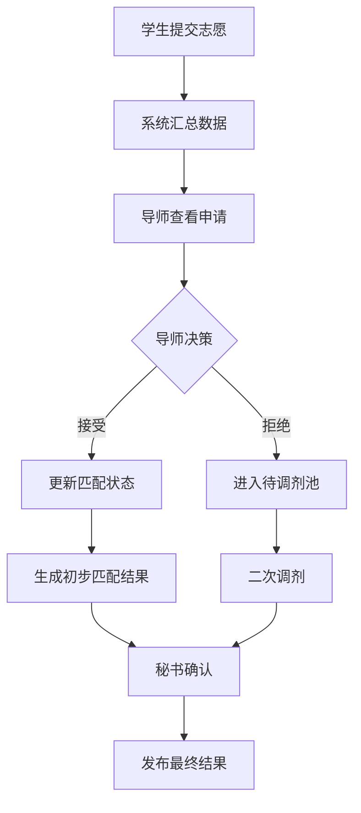
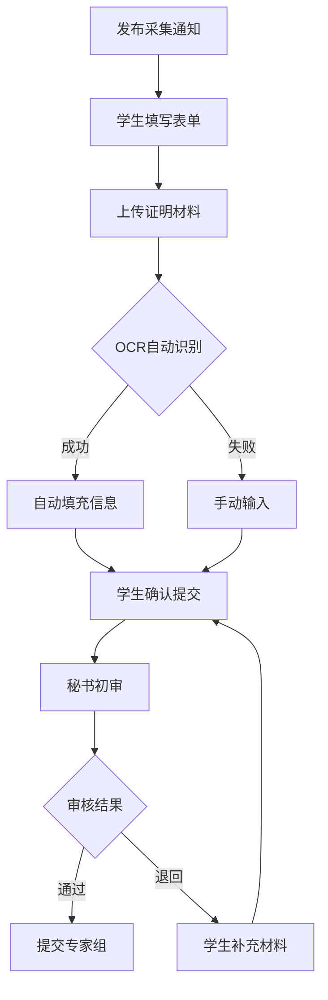
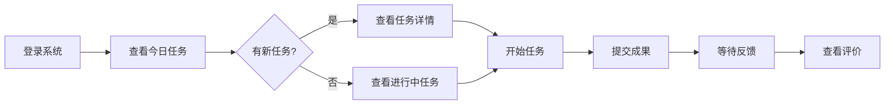

# 科研管理平台课程模块 UI/UX 工作流设计文档

## 一、项目概述

### 平台定位
- **核心目标**: 建立本科科研实验班的数字化课程管理系统
- **默认语言**: 中文

### 用户角色
1. **学生** - 选课、学习、提交作业、参与项目
2. **教授** - 发布课程、评估学生、指导项目
3. **秘书** - 系统管理、数据统计、流程协调
4. **领导** - 决策支持、成果查看、政策制定

## 二、课程模块详细功能设计

### 2.1 实验室轮转课程 - 详细流程设计

#### 角色特定视图说明

**学生视图重点**：
- 简化的导师信息浏览界面，包含研究方向匹配度提示
- 清晰的任务时间线和截止日期提醒
- 一键式作业提交和进度查看
- AI辅助的问题咨询模板

**教授视图重点**：
- 高效的学生筛选工具，包含背景匹配度分析
- 批量作业评分界面，带AI辅助检测
- 任务发布模板库，减少重复工作
- 学生表现数据可视化面板

**秘书视图重点**：
- 全流程监控仪表盘，实时数据更新
- 自动化的匹配算法配置界面
- 批量数据导入导出工具
- 异常情况预警系统（如匹配失败、进度延误）

**领导视图重点**：
- 宏观数据统计面板（参与率、满意度、成果产出）
- 导师资源利用率分析
- 学生成长轨迹追踪
- 决策支持报告自动生成

### 2.1 实验室轮转课程 - 详细流程设计

#### 2.1.1 前期筹备阶段

##### UI/UX 任务列表
| 任务名称 | 描述 | 优先级 | 复杂度 | 依赖 |
|---------|------|--------|--------|------|
| 课程信息发布界面 | 设计富文本编辑器，支持多渠道发布 | 高 | 中等 | - |
| 导师资源管理面板 | 创建导师信息卡片系统，支持批量导入 | 高 | 复杂 | - |
| 宣讲会管理系统 | 在线预约、PPT管理、签到功能 | 中 | 中等 | 导师资源管理 |
| 课程时间轴设计 | 可视化展示整个课程周期安排 | 高 | 简单 | - |

##### 核心界面设计

**课程信息发布界面**
```
┌─────────────────────────────────────────────────┐
│ 发布实验室轮转课程                    [预览] [保存草稿] │
├─────────────────────────────────────────────────┤
│ ┌─ 基础信息 ─────────────────────────────────┐ │
│ │ 课程名称: [_________________________]      │ │
│ │ 课程目标: [富文本编辑器                    ] │ │
│ │ 时长: [8]周  参与对象: [本科二年级 ▼]      │ │
│ │ 考核方式: ☑ 过程评价 ☑ 海报展示 ☑ 大报告  │ │
│ └─────────────────────────────────────────┘ │
│                                                 │
│ ┌─ 发布设置 ─────────────────────────────────┐ │
│ │ 发布时间: [2025-08-15 09:00]              │ │
│ │ 发布渠道: ☑ 系统通知 ☑ 邮件 ☐ 微信群     │ │
│ │ 目标受众: [全体实验班学生 ▼]              │ │
│ └─────────────────────────────────────────┘ │
│                                                 │
│ [取消] [保存为模板] [立即发布] [定时发布]      │
└─────────────────────────────────────────────────┘
```

**导师资源汇总界面**
```
┌──────────────────────────────────────────────────┐
│ 导师资源管理           [批量导入] [导出名单] [筛选] │
├──────────────────────────────────────────────────┤
│ 统计: 总导师数 25 | 可接收学生 87 | 已分配 0      │
├──────────────────────────────────────────────────┤
│ ┌─────────────────┐ ┌─────────────────┐         │
│ │ [导师照片]      │ │ [导师照片]      │         │
│ │                 │ │                 │         │
│ │ 张教授          │ │ 李教授          │         │
│ │ 人工智能实验室  │ │ 生物信息学实验室│         │
│ │ 研究方向:       │ │ 研究方向:       │         │
│ │ • 深度学习      │ │ • 基因组学      │         │
│ │ • 计算机视觉    │ │ • 蛋白质组学    │         │
│ │                 │ │                 │         │
│ │ 可带学生: 3-5人 │ │ 可带学生: 2-4人 │         │
│ │ 已确认: ✓       │ │ 待确认         │         │
│ │                 │ │                 │         │
│ │ [查看详情][编辑]│ │ [查看详情][编辑]│         │
│ └─────────────────┘ └─────────────────┘         │
└──────────────────────────────────────────────────┘
```

#### 2.1.2 双选匹配阶段

##### UI/UX 任务列表
| 任务名称 | 描述 | 优先级 | 复杂度 | 依赖 |
|---------|------|--------|--------|------|
| 学生志愿填报界面 | 支持拖拽排序，实时保存 | 高 | 中等 | - |
| 导师筛选工作台 | 批量查看申请，快速决策 | 高 | 复杂 | - |
| 匹配算法可视化 | 展示匹配过程和结果 | 中 | 复杂 | - |
| 调剂管理系统 | 二次分配和手动调整 | 高 | 中等 | 匹配算法 |

##### 核心界面设计

**学生志愿填报界面**
```
┌─────────────────────────────────────────────────┐
│ 填报导师志愿              步骤 2/3  [保存并继续] │
├─────────────────────────────────────────────────┤
│ 可选导师列表                    我的志愿序列     │
│ ┌─────────────────────┐      ┌────────────────┐│
│ │ 搜索: [_____] [筛选]│      │ 第一志愿       ││
│ │                     │      │ [张教授-AI]    ││
│ │ [李教授-生物]  [+] │      │                ││
│ │ 匹配度: 85%        │      │ 第二志愿       ││
│ │                     │ ───> │ [王教授-材料]  ││
│ │ [陈教授-化学]  [+] │      │                ││
│ │ 匹配度: 78%        │      │ 第三志愿       ││
│ │                     │      │ [空]           ││
│ │ [刘教授-物理]  [+] │      │                ││
│ │ 匹配度: 72%        │      └────────────────┘│
│ └─────────────────────┘      提示：拖拽调整顺序│
│                                                 │
│ ┌─ 申请理由（第一志愿）────────────────────┐ │
│ │ [请详细说明选择该导师的原因...         ] │ │
│ │ 字数: 0/500                              │ │
│ └─────────────────────────────────────────┘ │
└─────────────────────────────────────────────────┘
```

**导师筛选工作台**
```
┌──────────────────────────────────────────────────┐
│ 学生申请管理     收到申请: 12 | 已处理: 5 | 待定: 7 │
├──────────────────────────────────────────────────┤
│ [全部] [第一志愿] [待处理] [已接受] [已拒绝]     │
├──────────────────────────────────────────────────┤
│ ☐ 批量操作 ▼                                    │
│ ┌────────────────────────────────────────────┐ │
│ │ ☐ 王小明 | 第一志愿 | GPA: 3.8            │ │
│ │   申请理由: 对深度学习很感兴趣...          │ │
│ │   [查看详情] [接受] [待定] [拒绝]         │ │
│ ├────────────────────────────────────────────┤ │
│ │ ☐ 李小红 | 第二志愿 | GPA: 3.6            │ │
│ │   申请理由: 希望学习计算机视觉...          │ │
│ │   [查看详情] [接受] [待定] [拒绝]         │ │
│ └────────────────────────────────────────────┘ │
│ 名额使用: 2/5  [确认选择] [导出名单]            │
└──────────────────────────────────────────────────┘
```

##### 数据流程图


#### 2.1.3 过程管理阶段

##### UI/UX 任务列表
| 任务名称 | 描述 | 优先级 | 复杂度 | 依赖 |
|---------|------|--------|--------|------|
| 任务发布系统 | 支持任务书模板，明确周目标 | 高 | 中等 | - |
| 进度追踪看板 | 可视化任务状态，甘特图展示 | 高 | 复杂 | - |
| 周会管理界面 | 会议安排、记录、反馈一体化 | 中 | 中等 | - |
| 学习报告提交 | 结构化表单，支持多媒体附件 | 高 | 简单 | - |
| 即时通讯集成 | 师生实时沟通，消息归档 | 中 | 复杂 | - |

##### 核心界面设计

**导师任务发布界面**
```
┌─────────────────────────────────────────────────┐
│ 发布任务                          [使用模板 ▼] │
├─────────────────────────────────────────────────┤
│ 任务标题: [第3周：文献调研与综述撰写_______]   │
│                                                 │
│ ┌─ 任务详情 ─────────────────────────────────┐ │
│ │ 目标描述:                                  │ │
│ │ [阅读10篇核心文献，完成3000字综述    ]    │ │
│ │                                            │ │
│ │ 具体要求:                                  │ │
│ │ • 文献需包含近3年顶会论文                  │ │
│ │ • 综述需包含研究背景、现状、趋势           │ │
│ │ • 提交PPT汇报材料                         │ │
│ │                                            │ │
│ │ 截止时间: [2025-09-01 23:59]              │ │
│ │ 分配给: [全组成员 ▼] [+指定成员]          │ │
│ └─────────────────────────────────────────┘ │
│                                                 │
│ ┌─ 评分标准 ─────────────────────────────────┐ │
│ │ ☑ 文献质量 (30%)  ☑ 综述深度 (40%)       │ │
│ │ ☑ 汇报表现 (20%)  ☑ 按时提交 (10%)       │ │
│ └─────────────────────────────────────────┘ │
│                                                 │
│ [取消] [保存为模板] [发布任务]                  │
└─────────────────────────────────────────────────┘
```

**学生任务看板**
```
┌──────────────────────────────────────────────────┐
│ 我的任务看板        本周进度: 60%  [日历视图]    │
├──────────────────────────────────────────────────┤
│   待开始           进行中           已完成        │
│ ┌─────────┐    ┌─────────┐    ┌─────────┐     │
│ │文献调研 │    │实验设计 │    │开题报告 │     │
│ │截止:9/1│    │进度:40% │    │已评分   │     │
│ │ [开始] │    │ [继续] │    │ 85分    │     │
│ └─────────┘    └─────────┘    └─────────┘     │
│                                                  │
│ ┌─ 本周重点任务：实验设计 ──────────────────┐ │
│ │ 进度追踪: ████████░░░░░░ 40%              │ │
│ │ 已用时间: 12小时 | 预计剩余: 18小时        │ │
│ │                                            │ │
│ │ 子任务清单:                                │ │
│ │ ☑ 确定实验目标                            │ │
│ │ ☑ 选择实验方法                            │ │
│ │ ☐ 设计实验流程                            │ │
│ │ ☐ 准备实验材料                            │ │
│ │                                            │ │
│ │ [添加笔记] [上传文件] [请求指导]           │ │
│ └─────────────────────────────────────────┘ │
└──────────────────────────────────────────────────┘
```

**师生互动界面**
```
┌──────────────────────────────────────────────────┐
│ 与张教授的讨论         [视频通话] [查看历史]     │
├──────────────────────────────────────────────────┤
│ ┌──────────────────────────────────────────┐   │
│ │ 学生：关于实验设计，我有几个问题...       │   │
│ │ [附件：实验方案v1.pdf]                    │   │
│ │                                  10:30 AM │   │
│ ├──────────────────────────────────────────┤   │
│ │ 导师：方案整体不错，但需要注意以下几点:   │   │
│ │ 1. 样本量需要增加到30个                  │   │
│ │ 2. 对照组设置需要更严格                  │   │
│ │ [语音消息 2:30]                 11:15 AM │   │
│ └──────────────────────────────────────────┘   │
│                                                  │
│ [输入消息...                          ] [发送]   │
│ [📎] [🎤] [📷]                                  │
└──────────────────────────────────────────────────┘
```

##### 进度时间轴可视化
```
┌──────────────────────────────────────────────────┐
│ 轮转进度时间轴                    第4周/8周       │
├──────────────────────────────────────────────────┤
│  第1周    第2周    第3周    第4周    ...   第8周  │
│   ●───────●───────●───────◉───────○───────○     │
│   |       |       |       |                      │
│   |       |       |       └─ 当前位置            │
│   |       |       └─ 中期汇报(已完成)            │
│   |       └─ 实验开始                           │
│   └─ 项目启动会                                 │
│                                                  │
│ 里程碑事件:                                      │
│ • ✓ 项目启动会 (第1周)                          │
│ • ✓ 文献综述提交 (第2周)                        │
│ • ✓ 中期汇报 (第3周)                           │
│ • ⚡ 实验数据收集 (第4-6周) ← 进行中            │
│ • ○ 成果海报制作 (第7周)                        │
│ • ○ 终期答辩 (第8周)                           │
└──────────────────────────────────────────────────┘
```

#### 2.1.4 成果验收阶段

##### UI/UX 任务列表
| 任务名称 | 描述 | 优先级 | 复杂度 | 依赖 |
|---------|------|--------|--------|------|
| 海报制作工具 | 在线设计，模板支持 | 高 | 复杂 | - |
| 大报告提交系统 | 结构化模板，版本管理 | 高 | 中等 | - |
| 答辩安排系统 | 时间地点管理，评委分配 | 高 | 中等 | - |
| 在线答辩平台 | 视频答辩，实时互动 | 中 | 复杂 | - |
| 成果展示墙 | 公开展示优秀作品 | 低 | 简单 | - |

##### 核心界面设计

**海报制作界面**
```
┌──────────────────────────────────────────────────┐
│ 海报设计器                 [保存] [预览] [提交]  │
├──────────────────────────────────────────────────┤
│ 工具栏: [T文字] [□图形] [🖼图片] [📊图表] [↶撤销]│
├──────────────────────────────────────────────────┤
│ ┌────────────────────────┐ ┌─ 属性面板 ────┐  │
│ │                        │ │ 选中元素：标题 │  │
│ │    研究海报标题        │ │ 字体: [黑体 ▼] │  │
│ │    ━━━━━━━━━━        │ │ 大小: [36px]   │  │
│ │                        │ │ 颜色: [■]      │  │
│ │  ┌─────┐  ┌─────┐    │ │ 对齐: [居中]   │  │
│ │  │图表1│  │图表2│    │ └───────────────┘  │
│ │  └─────┘  └─────┘    │ ┌─ 模板库 ──────┐  │
│ │                        │ │ [学术海报1]   │  │
│ │  研究方法：            │ │ [学术海报2]   │  │
│ │  • 实验设计            │ │ [简约风格]    │  │
│ │  • 数据分析            │ │ [+自定义]     │  │
│ │                        │ └───────────────┘  │
│ └────────────────────────┘                    │
│ 协作者: 👤张同学(在线) 👤李同学(5分钟前)        │
└──────────────────────────────────────────────────┘
```

**大报告提交界面**
```
┌──────────────────────────────────────────────────┐
│ 提交研究报告                    截止: 3天12小时  │
├──────────────────────────────────────────────────┤
│ ┌─ 报告结构（必填项标*）─────────────────────┐ │
│ │ 1. 研究背景* [✓已完成]                     │ │
│ │ 2. 文献综述* [✓已完成]                     │ │
│ │ 3. 研究方法* [⚡编辑中...]                  │ │
│ │ 4. 实验过程* [○待填写]                     │ │
│ │ 5. 结果分析* [○待填写]                     │ │
│ │ 6. 结论与展望* [○待填写]                   │ │
│ │ 7. 参考文献* [15/10条]                     │ │
│ │ 8. 附录 [可选]                             │ │
│ └─────────────────────────────────────────┘ │
│                                                 │
│ 完成度: ████████░░░░░░░░ 45%                   │
│ 字数统计: 4,532 / 10,000字                     │
│                                                 │
│ [导入Word] [自动排版] [检查格式] [保存草稿] [提交]│
└──────────────────────────────────────────────────┘
```

**答辩安排界面**
```
┌──────────────────────────────────────────────────┐
│ 答辩安排                          [导出日程]     │
├──────────────────────────────────────────────────┤
│ 我的答辩信息                                     │
│ ┌────────────────────────────────────────────┐ │
│ │ 时间: 2025-10-15 14:30-15:00               │ │
│ │ 地点: 理学楼 A301 / 在线会议室             │ │
│ │ 形式: 线下 + 线上混合                      │ │
│ │ 评委: 张教授(主席)、李教授、王教授         │ │
│ │ 要求: 15分钟展示 + 10分钟问答              │ │
│ │                                            │ │
│ │ [加入在线会议] [下载答辩须知] [模拟答辩]   │ │
│ └────────────────────────────────────────────┘ │
│                                                 │
│ 答辩顺序                                        │
│ 13:30 王小明 - 深度学习在医学图像中的应用      │
│ 14:00 李小红 - 基因编辑技术研究                │
│ 14:30 我 - 新材料合成与表征 ←                  │
│ 15:00 陈小华 - 量子计算算法优化                │
└──────────────────────────────────────────────────┘
```

#### 2.1.5 成绩评定阶段

##### UI/UX 任务列表
| 任务名称 | 描述 | 优先级 | 复杂度 | 依赖 |
|---------|------|--------|--------|------|
| 多维度评分表 | 过程、海报、报告、答辩分项打分 | 高 | 中等 | - |
| 评分标准配置 | 灵活设置各项权重 | 高 | 简单 | - |
| 批量评分界面 | 提高导师评分效率 | 高 | 中等 | - |
| 成绩查询系统 | 学生查看详细反馈 | 高 | 简单 | - |
| 成绩分析报告 | 自动生成统计分析 | 中 | 中等 | - |

##### 核心界面设计

**导师评分工作台**
```
┌──────────────────────────────────────────────────┐
│ 成绩评定 - 实验室轮转        待评: 8 已评: 12   │
├──────────────────────────────────────────────────┤
│ 当前评分: 王小明                   [上一个][下一个]│
├──────────────────────────────────────────────────┤
│ ┌─ 评分项目 ────────────────────────────────┐ │
│ │ 过程表现 (30%)           [85] /100 分      │ │
│ │ • 出勤情况      [20/20]                    │ │
│ │ • 任务完成质量  [35/40]                    │ │
│ │ • 团队协作      [30/40]                    │ │
│ │                                            │ │
│ │ 海报质量 (20%)           [90] /100 分      │ │
│ │ • 设计美观      [25/30]                    │ │
│ │ • 内容完整      [35/40]                    │ │
│ │ • 创新性        [30/30]                    │ │
│ │                                            │ │
│ │ 大报告内容 (30%)         [88] /100 分      │ │
│ │ 答辩表现 (20%)           [92] /100 分      │ │
│ └─────────────────────────────────────────┘ │
│                                                 │
│ 总分: 87.4 分  等级: A-  [重新计算]            │
│                                                 │
│ 评语: [学生表现优秀，研究思路清晰...]          │
│                                                 │
│ [保存草稿] [提交成绩] [导出成绩单]             │
└──────────────────────────────────────────────────┘
```

#### 2.1.6 小功能模块设计

**Intro Session 管理**
```
┌──────────────────────────────────────────────────┐
│ Intro Session 管理              [新建宣讲会]    │
├──────────────────────────────────────────────────┤
│ 参与教授指定                                     │
│ ☑ 张教授 - AI实验室    PPT: ✓已上传            │
│ ☑ 李教授 - 生物实验室  PPT: ⚡上传中            │
│ ☐ 王教授 - 材料实验室  PPT: ✗未上传            │
│                                                 │
│ 学生预约查看 (25/30人已预约)                    │
│ 时间: 2025-08-20 14:00-16:00                   │
│ 地点: 教学楼A101 + 线上直播                     │
└──────────────────────────────────────────────────┘
```

**Milestone Report 提交**
```
┌──────────────────────────────────────────────────┐
│ 里程碑报告                     第2个里程碑/共4个 │
├──────────────────────────────────────────────────┤
│ M1: 项目启动 ✓已完成 (95分)                     │
│ M2: 中期进展 ⚡进行中 (截止: 5天后)             │
│ M3: 实验完成 ○未开始                            │
│ M4: 最终报告 ○未开始                            │
│                                                 │
│ 当前里程碑: 中期进展报告                        │
│ [在线填写表单] [上传文档] [查看要求]            │
└──────────────────────────────────────────────────┘
```

### 2.2 综合素质评价课程 - 详细流程设计

#### 角色特定视图说明

**学生视图重点**：
- 引导式的材料提交界面，清晰的评价维度说明
- 实时的提交进度追踪和完整度提示
- 个人成就展示面板，支持多媒体材料
- 评价结果查询和申诉入口

**教授视图重点**：
- 专业的评审工作台，支持快速浏览和评分
- 学生材料对比视图，便于公平评价
- 评分标准参考和历史数据对比
- 批量评审和评语模板

**秘书视图重点**：
- 材料收集进度监控，自动催收提醒
- OCR识别结果审核界面
- 评价数据统计和异常检测
- 报告生成和导出工具

**领导视图重点**：
- 评价结果分布分析（各维度、各年级）
- 历年数据对比和趋势分析
- 政策效果评估报告
- 优秀学生案例展示

#### 2.2.1 评价准备阶段

##### UI/UX 任务列表
| 任务名称 | 描述 | 优先级 | 复杂度 | 依赖 |
|---------|------|--------|--------|------|
| 评价方案发布 | 清晰展示评价维度和权重 | 高 | 简单 | - |
| 专家组管理 | 专家邀请、权限分配 | 高 | 中等 | - |
| 评价标准配置 | 可视化权重设置界面 | 高 | 中等 | - |
| 时间线规划 | 各阶段时间节点管理 | 中 | 简单 | - |

##### 核心界面设计

**评价方案配置界面**
```
┌──────────────────────────────────────────────────┐
│ 综合素质评价方案设置              [预览] [发布]  │
├──────────────────────────────────────────────────┤
│ 基本信息                                         │
│ 评价对象: [2023级实验班 ▼]  周期: [2025学年]   │
│                                                  │
│ ┌─ 评价维度权重配置 ─────────────────────────┐ │
│ │ 思想品德 ────────── [20]%                 │ │
│ │ 课程成绩 ────────── [40]%                 │ │
│ │ 科技创新 ────────── [25]%                 │ │
│ │ 科研推进 ────────── [15]%                 │ │
│ │                          总计: 100%       │ │
│ └─────────────────────────────────────────┘ │
│                                                  │
│ ┌─ 评价细则 ─────────────────────────────────┐ │
│ │ 思想品德:                                  │ │
│ │ • 社会实践参与度 (40%)                     │ │
│ │ • 集体活动贡献 (30%)                       │ │
│ │ • 导师评价 (30%)                          │ │
│ │ [+添加细则]                               │ │
│ └─────────────────────────────────────────┘ │
└──────────────────────────────────────────────────┘
```

**专家组管理界面**
```
┌──────────────────────────────────────────────────┐
│ 专家组成员管理                    [邀请专家]     │
├──────────────────────────────────────────────────┤
│ 当前专家组 (4/5人)                              │
│ ┌────────────────────────────────────────────┐ │
│ │ 👤 张教授 - 组长                           │ │
│ │    负责: 科技创新评审                      │ │
│ │    状态: ✓已确认                          │ │
│ ├────────────────────────────────────────────┤ │
│ │ 👤 李教授 - 成员                           │ │
│ │    负责: 科研推进评审                      │ │
│ │    状态: ✓已确认                          │ │
│ ├────────────────────────────────────────────┤ │
│ │ 👤 王教授 - 成员                           │ │
│ │    负责: 思想品德评审                      │ │
│ │    状态: ⚡待确认                         │ │
│ └────────────────────────────────────────────┘ │
│ [批量分配任务] [设置评审规则] [导出名单]        │
└──────────────────────────────────────────────────┘
```

#### 2.2.2 信息采集阶段

##### UI/UX 任务列表
| 任务名称 | 描述 | 优先级 | 复杂度 | 依赖 |
|---------|------|--------|--------|------|
| 信息采集表设计 | 动态表单，支持多类型材料 | 高 | 复杂 | - |
| 材料上传系统 | 批量上传，自动分类 | 高 | 中等 | - |
| OCR识别集成 | 自动提取证书信息 | 中 | 复杂 | - |
| 初审工作台 | 秘书快速审核界面 | 高 | 中等 | - |
| 进度追踪面板 | 实时显示提交状态 | 中 | 简单 | - |

##### 核心界面设计

**学生信息填报界面**
```
┌──────────────────────────────────────────────────┐
│ 综合素质信息采集          完成度: 75%  [暂存]    │
├──────────────────────────────────────────────────┤
│ ◉ 基本信息 ◉ 竞赛获奖 ◉ 科研项目 ○ 社会实践    │
├──────────────────────────────────────────────────┤
│ 竞赛获奖信息                      [+添加获奖]    │
│ ┌────────────────────────────────────────────┐ │
│ │ 1. 全国大学生数学建模竞赛                  │ │
│ │    级别: [国家级 ▼]  奖项: [一等奖 ▼]     │ │
│ │    时间: [2025-05]   角色: [队长 ▼]       │ │
│ │    证明材料: [certificate.pdf] ✓已识别     │ │
│ │    [编辑] [删除]                          │ │
│ ├────────────────────────────────────────────┤ │
│ │ 2. ACM程序设计竞赛                        │ │
│ │    [拖拽文件到此处或点击上传]              │ │
│ │    支持格式: PDF, JPG, PNG (最大5MB)       │ │
│ └────────────────────────────────────────────┘ │
│                                                  │
│ OCR智能识别结果:                                 │
│ ✓ 竞赛名称已识别  ✓ 获奖等级已识别  ⚡ 请确认日期│
│                                                  │
│ [上一步] [保存草稿] [下一步：科研项目]          │
└──────────────────────────────────────────────────┘
```

**秘书初审工作台**
```
┌──────────────────────────────────────────────────┐
│ 材料初审管理      待审: 45 | 已审: 120 | 退回: 8 │
├──────────────────────────────────────────────────┤
│ 快速筛选: [全部 ▼] [待审核] [有疑问] [已通过]   │
├──────────────────────────────────────────────────┤
│ ┌─ 批量审核模式 ─────────────────────────────┐ │
│ │ ☑ 王小明 - 竞赛获奖3项, 科研2项           │ │
│ │   ⚠ 证书日期模糊，需要确认                │ │
│ │   [快速通过] [标记问题] [查看详情]        │ │
│ ├───────────────────────────────────────────┤ │
│ │ ☑ 李小红 - 竞赛获奖5项, 社会实践4项       │ │
│ │   ✓ 材料完整，信息清晰                   │ │
│ │   [快速通过] [标记问题] [查看详情]        │ │
│ └─────────────────────────────────────────┘ │
│                                                  │
│ 批量操作: [全选] [通过选中] [退回选中]          │
│                                                  │
│ AI辅助提示: 发现3份材料可能存在重复提交         │
└──────────────────────────────────────────────────┘
```

##### 数据流程图


#### 2.2.3 多维度评价阶段

##### UI/UX 任务列表
| 任务名称 | 描述 | 优先级 | 复杂度 | 依赖 |
|---------|------|--------|--------|------|
| 分维度评分界面 | 思想品德、科技创新等分项评分 | 高 | 中等 | - |
| 成绩导入系统 | 自动同步校内成绩系统 | 高 | 复杂 | - |
| 专家评审平台 | 支持多人协同评审 | 高 | 复杂 | - |
| 评分校准工具 | 确保评分标准一致性 | 中 | 中等 | - |
| 实时统计面板 | 显示评审进度和分布 | 中 | 简单 | - |

##### 核心界面设计

**专家评审工作台**
```
┌──────────────────────────────────────────────────┐
│ 科技创新维度评审          已评: 23/50  [评分指南]│
├──────────────────────────────────────────────────┤
│ 当前学生: 王小明          [上一个] [下一个]      │
├──────────────────────────────────────────────────┤
│ ┌─ 竞赛获奖 (40%) ───────────────────────────┐ │
│ │ • 国家级一等奖 × 2  → 40分                 │ │
│ │ • 省级二等奖 × 1    → 15分                 │ │
│ │ 小计: [55/40] 分 (超出部分按40分计)        │ │
│ ├─────────────────────────────────────────────┤ │
│ │ ┌─ 科研项目 (30%) ─────────────────────┐   │ │
│ │ │ • 国家级大创项目(负责人) → 25分      │   │ │
│ │ │ • 发表论文1篇(第二作者) → 10分       │   │ │
│ │ │ 小计: [35/30] 分                     │   │ │
│ │ └─────────────────────────────────────┘   │ │
│ ├─────────────────────────────────────────────┤ │
│ │ ┌─ 创新能力 (30%) - 专家评分 ─────────┐   │ │
│ │ │ 创新思维: ●●●●● [25/30]              │   │ │
│ │ │ 实践能力: ●●●●○ [22/30]              │   │ │
│ │ │ 发展潜力: ●●●●● [28/30]              │   │ │
│ │ │ 专家评语: [思维活跃，实践能力...]    │   │ │
│ │ └─────────────────────────────────────┘   │ │
│ └─────────────────────────────────────────────┘ │
│ 本维度得分: 92.5/100  [确认评分] [暂存]         │
└──────────────────────────────────────────────────┘
```

**思想品德评价界面**
```
┌──────────────────────────────────────────────────┐
│ 思想品德评价表                    导师：张教授   │
├──────────────────────────────────────────────────┤
│ 学生：李小红                                     │
│ ┌────────────────────────────────────────────┐ │
│ │ 评价项目                    评分(满分10)    │ │
│ │ ─────────────────────────────────────────  │ │
│ │ 社会责任感                  [9] ●●●●●●●●●○ │ │
│ │ 团队协作精神                [8] ●●●●●●●●○○ │ │
│ │ 学术诚信                    [10]●●●●●●●●●● │ │
│ │ 公益活动参与                [7] ●●●●●●●○○○ │ │
│ │ 集体荣誉感                  [9] ●●●●●●●●●○ │ │
│ └────────────────────────────────────────────┘ │
│                                                  │
│ 综合评语:                                        │
│ [该生品德优良，积极参与集体活动，有较强的      ] │
│ [社会责任感。建议多参与志愿服务活动。          ] │
│                                                  │
│ 总分: 86/100  [提交评价] [保存草稿]            │
└──────────────────────────────────────────────────┘
```

#### 2.2.4 综合核算阶段

##### UI/UX 任务列表
| 任务名称 | 描述 | 优先级 | 复杂度 | 依赖 |
|---------|------|--------|--------|------|
| 自动计算引擎 | 按权重自动汇总各维度分数 | 高 | 中等 | 所有评分完成 |
| 成绩预览界面 | 实时查看计算结果 | 高 | 简单 | - |
| 异常检测系统 | 标记异常分数供复核 | 中 | 中等 | - |
| 审核确认流程 | 专家组最终审核界面 | 高 | 简单 | - |
| 成绩锁定机制 | 防止误操作修改 | 高 | 简单 | - |

##### 核心界面设计

**综合成绩计算界面**
```
┌──────────────────────────────────────────────────┐
│ 综合素质评价 - 成绩核算         [重新计算] [导出]│
├──────────────────────────────────────────────────┤
│ 计算规则预览                                     │
│ 思想品德(20%) + 课程成绩(40%) + 科技创新(25%)   │
│ + 科研推进(15%) = 总分(100%)                    │
├──────────────────────────────────────────────────┤
│ ┌─ 成绩分布统计 ────────────────────────────┐ │
│ │     A级      B级      C级      D级         │ │
│ │   (90-100) (80-89) (70-79)  (60-69)       │ │
│ │    ████     ████     ███      ██          │ │
│ │    15人     28人     12人     5人         │ │
│ │    25%      47%      20%      8%          │ │
│ └───────────────────────────────────────────┘ │
│                                                  │
│ ┌─ 异常提示 ────────────────────────────────┐ │
│ │ ⚠ 发现3名学生分数异常:                    │ │
│ │ • 王某某 - 科技创新维度异常高(>95)        │ │
│ │ • 李某某 - 各维度差异过大(>30分)          │ │
│ │ [查看详情] [标记已处理]                   │ │
│ └───────────────────────────────────────────┘ │
└──────────────────────────────────────────────────┘
```

#### 2.2.5 结果应用阶段

##### UI/UX 任务列表
| 任务名称 | 描述 | 优先级 | 复杂度 | 依赖 |
|---------|------|--------|--------|------|
| 成绩公示系统 | 分级展示，保护隐私 | 高 | 中等 | - |
| 申诉管理平台 | 在线提交和处理申诉 | 高 | 中等 | - |
| 实验班筛选工具 | 根据成绩自动筛选 | 高 | 简单 | - |
| 档案归档系统 | 永久保存评价材料 | 中 | 中等 | - |
| 报告生成器 | 自动生成各类报告 | 中 | 复杂 | - |

##### 核心界面设计

**成绩公示界面**
```
┌──────────────────────────────────────────────────┐
│ 2025年度综合素质评价结果公示    公示期: 7天      │
├──────────────────────────────────────────────────┤
│ 查询方式: [按姓名] [按学号] [按等级]            │
│ 查询: [___________] [查询]                      │
├──────────────────────────────────────────────────┤
│ 公示结果 (仅显示等级)                           │
│ ┌────────────────────────────────────────────┐ │
│ │ 学号      姓名    等级   是否入选实验班    │ │
│ │ ────────────────────────────────────────── │ │
│ │ 2023****  王*明    A      ✓ 已入选        │ │
│ │ 2023****  李*红    A-     ✓ 已入选        │ │
│ │ 2023****  张*华    B+     ○ 候补第3位     │ │
│ │ 2023****  陈*      B      ✗ 未入选        │ │
│ └────────────────────────────────────────────┘ │
│                                                  │
│ [我要申诉] [下载公示名单] [查看评价标准]        │
│                                                  │
│ 申诉截止时间: 2025-11-20 17:00                  │
└──────────────────────────────────────────────────┘
```

**申诉处理界面**
```
┌──────────────────────────────────────────────────┐
│ 申诉管理中心              待处理: 5 | 已处理: 12 │
├──────────────────────────────────────────────────┤
│ ┌────────────────────────────────────────────┐ │
│ │ 申诉编号: #20251115001                     │ │
│ │ 申诉人: 陈某某                             │ │
│ │ 申诉类型: 科技创新分数异议                 │ │
│ │ 申诉理由: 省级竞赛获奖未被正确计入...      │ │
│ │ 补充材料: [获奖证书.pdf] [项目证明.docx]   │ │
│ │                                            │ │
│ │ 处理状态: ⚡ 专家组复核中                  │ │
│ │ 处理人: 李教授                             │ │
│ │ 处理意见: [填写处理意见...]                │ │
│ │                                            │ │
│ │ [接受申诉] [驳回申诉] [需要补充材料]       │ │
│ └────────────────────────────────────────────┘ │
└──────────────────────────────────────────────────┘
```

## 三、核心用户流程设计

### 3.1 学生端核心流程

#### 日常学习流程


#### 师生互动流程
1. **提问流程**
   - AI 预检问题质量
   - 推荐相关资料
   - 智能路由到导师
   - 追踪回复状态

2. **预约流程**
   - 查看导师日程
   - 选择时间段
   - 填写预约说明
   - 获得确认通知

### 3.2 教授端核心流程

#### 高效评估流程
```
批量作业 → AI 预筛选 → 重点审核 → 快速批注 → 一键发布成绩
```

**智能辅助功能**:
- AI 作业检测
  - 识别 AI 生成内容
  - 相似度检测
  - 质量评分建议
- 评分助手
  - 历史评分参考
  - 评分分布分析
  - 异常分数提醒

### 3.3 秘书端核心流程

#### 数据收集与报告
1. **自动化数据收集**
   - 定时数据抓取
   - 多源数据整合
   - 数据质量检查

2. **智能报告生成**
   - 使用 LLM 生成报告
   - 自定义报告模板
   - 可视化图表嵌入
   - 一键导出多格式

### 3.4 领导端核心流程

#### 决策支持仪表盘
- 实时数据大屏
  - 关键指标展示
  - 趋势分析图表
  - 异常情况预警
- 预测分析
  - 学生表现预测
  - 资源需求预测
  - 风险评估报告

## 四、角色专属仪表盘设计

### 4.1 学生仪表盘

**主界面设计**
```
┌──────────────────────────────────────────────────┐
│ 我的学习中心         王小明 | 2023级 | [设置] [退出]│
├──────────────────────────────────────────────────┤
│ ┌─ 今日待办 ────┐ ┌─ 课程进度 ────────────┐ │
│ │ • 提交文献综述 │ │ 实验室轮转 ████░░ 75%  │ │
│ │   截止: 今晚   │ │ 综合评价   ██░░░░ 40%  │ │
│ │ • 参加组会     │ └──────────────────────┘ │
│ │   14:00-16:00  │ ┌─ 最新通知 ────────────┐ │
│ └───────────────┘ │ • 下周答辩安排已发布    │ │
│ ┌─ 快速入口 ────┐ │ • 综合素质材料提交开始  │ │
│ │ [提交作业]     │ └──────────────────────┘ │
│ │ [查看成绩]     │ ┌─ 成就统计 ────────────┐ │
│ │ [预约导师]     │ │ 🏆 竞赛获奖: 3项      │ │
│ │ [在线答疑]     │ │ 📚 完成任务: 12/15    │ │
│ └───────────────┘ │ ⭐ 当前评级: A-        │ │
│                   └──────────────────────┘ │
└──────────────────────────────────────────────────┘
```

### 4.2 教授仪表盘

**主界面设计**
```
┌──────────────────────────────────────────────────┐
│ 教学管理中心              张教授 | AI实验室 | [退出]│
├──────────────────────────────────────────────────┤
│ ┌─ 今日日程 ─────┐ ┌─ 待处理事项 ──────────┐ │
│ │ 10:00 组会     │ │ • 待评作业: 8份       │ │
│ │ 14:00 面试学生 │ │ • 申请审批: 3项       │ │
│ │ 16:00 答辩评审 │ │ • 报告评阅: 5份       │ │
│ └───────────────┘ └─────────────────────────┘ │
│                                                  │
│ ┌─ 学生管理概览 ────────────────────────────┐ │
│ │ 指导学生: 12人  |  本周提交: 85%          │ │
│ │ ┌─────────────────────────────────────┐   │ │
│ │ │ 学生    进度    最近提交    状态     │   │ │
│ │ │ 王小明  75%     2小时前     优秀     │   │ │
│ │ │ 李小红  82%     昨天        良好     │   │ │
│ │ │ 张小华  45%     3天前      ⚠需关注   │   │ │
│ │ └─────────────────────────────────────┘   │ │
│ │ [批量评分] [发送通知] [导出报告]          │ │
│ └───────────────────────────────────────────┘ │
└──────────────────────────────────────────────────┘
```

### 4.3 秘书仪表盘

**主界面设计**
```
┌──────────────────────────────────────────────────┐
│ 管理控制台                    李秘书 | 教务处 | [退出]│
├──────────────────────────────────────────────────┤
│ ┌─ 系统概览 ─────────────────────────────────┐ │
│ │ 📊 实时数据                                 │ │
│ │ • 在线用户: 156人  • 今日活跃: 89%         │ │
│ │ • 课程进行: 2门    • 待审核: 23项          │ │
│ └─────────────────────────────────────────────┘ │
│                                                  │
│ ┌─ 工作看板 ─────────────────────────────────┐ │
│ │ 待办 (12)    进行中 (5)    已完成 (28)     │ │
│ │ ┌─────┐     ┌─────┐      ┌─────┐         │ │
│ │ │双选  │     │成绩  │      │报告  │         │ │
│ │ │匹配  │     │录入  │      │生成  │         │ │
│ │ └─────┘     └─────┘      └─────┘         │ │
│ └─────────────────────────────────────────────┘ │
│                                                  │
│ [数据导出] [生成报告] [系统设置] [批量操作]      │
└──────────────────────────────────────────────────┘
```

### 4.4 领导仪表盘

**决策支持界面**
```
┌──────────────────────────────────────────────────┐
│ 决策支持系统                   王院长 | 管理层 | [退出]│
├──────────────────────────────────────────────────┤
│ ┌─ 关键指标 KPI ────────────────────────────┐ │
│ │ 学生满意度: 92% ↑3%   导师参与度: 87% ↑5% │ │
│ │ 课程完成率: 95% ↑2%   平均成绩: 82.5 ↑1.2 │ │
│ └─────────────────────────────────────────────┘ │
│                                                  │
│ ┌─ 趋势分析 ────────────────────────────────┐ │
│ │     成绩分布趋势 (近3年)                   │ │
│ │     ╱╲    ╱╲    ╱╲                        │ │
│ │   ╱    ╲╱    ╲╱    ╲                      │ │
│ │ ╱                    ╲                     │ │
│ │ 2023    2024    2025                       │ │
│ └─────────────────────────────────────────────┘ │
│                                                  │
│ [详细报告] [数据分析] [导出PPT] [预测模型]      │
└──────────────────────────────────────────────────┘
```

## 五、通知与提醒系统设计

### 5.1 多渠道通知架构

**通知类型与优先级**
```
┌──────────────────────────────────────────────────┐
│ 通知管理中心                      [通知设置]     │
├──────────────────────────────────────────────────┤
│ 通知类型          渠道            触发条件       │
│ ─────────────────────────────────────────────── │
│ 🔴 紧急通知      系统+短信+邮件   答辩/截止前1天 │
│ 🟡 重要提醒      系统+邮件        作业截止前3天  │
│ 🟢 一般通知      系统通知         新任务发布     │
│ 🔵 信息更新      系统通知         成绩更新       │
└──────────────────────────────────────────────────┘
```

### 5.2 智能提醒规则引擎

**提醒配置界面**
```
┌──────────────────────────────────────────────────┐
│ 智能提醒规则设置                    [新建规则]   │
├──────────────────────────────────────────────────┤
│ 规则名称: 作业截止提醒                          │
│ ┌─ 触发条件 ─────────────────────────────────┐ │
│ │ 当 [作业截止时间] [小于] [24小时]           │ │
│ │ 且 [提交状态] [等于] [未提交]               │ │
│ │ [+添加条件]                                 │ │
│ └─────────────────────────────────────────────┘ │
│ ┌─ 执行动作 ─────────────────────────────────┐ │
│ │ ☑ 发送系统通知                             │ │
│ │ ☑ 发送邮件提醒                             │ │
│ │ ☐ 发送短信通知                             │ │
│ │ 提醒文案: [您有作业即将截止，请及时提交]    │ │
│ └─────────────────────────────────────────────┘ │
│ [保存规则] [测试规则] [查看日志]                │
└──────────────────────────────────────────────────┘
```

## 六、批量操作界面设计

### 6.1 批量导入工具

**数据导入向导**
```
┌──────────────────────────────────────────────────┐
│ 批量数据导入向导              步骤 2/4           │
├──────────────────────────────────────────────────┤
│ 选择导入类型: [学生信息 ▼]                      │
│                                                  │
│ ┌─ 文件上传 ─────────────────────────────────┐ │
│ │ 拖拽Excel文件到此处                         │ │
│ │ 或 [选择文件]                               │ │
│ │                                             │ │
│ │ 已上传: student_list.xlsx (1.2MB)          │ │
│ │ 检测到: 150条记录                           │ │
│ └─────────────────────────────────────────────┘ │
│                                                  │
│ ┌─ 字段映射 ─────────────────────────────────┐ │
│ │ Excel列        →    系统字段               │ │
│ │ A列(姓名)      →    [学生姓名 ▼]          │ │
│ │ B列(学号)      →    [学生ID ▼]            │ │
│ │ C列(班级)      →    [所属班级 ▼]          │ │
│ │ [自动匹配]                                 │ │
│ └─────────────────────────────────────────────┘ │
│                                                  │
│ [上一步] [预览数据] [开始导入]                  │
└──────────────────────────────────────────────────┘
```

### 6.2 批量操作管理

**批量评分界面**
```
┌──────────────────────────────────────────────────┐
│ 批量评分操作                    已选: 25个作业   │
├──────────────────────────────────────────────────┤
│ ☑ 全选  筛选: [未评分] [本周提交] [按小组]      │
├──────────────────────────────────────────────────┤
│ ┌────────────────────────────────────────────┐ │
│ │ ☑ 王小明 - 实验报告3  提交: 10-15 08:30   │ │
│ │ ☑ 李小红 - 实验报告3  提交: 10-15 09:15   │ │
│ │ ☑ 张小华 - 实验报告3  提交: 10-15 10:20   │ │
│ └────────────────────────────────────────────┘ │
│                                                  │
│ ┌─ 批量评分设置 ────────────────────────────┐ │
│ │ 评分模式: ○ 统一分数 ● 区间分数           │ │
│ │ 分数范围: [85] - [95]                     │ │
│ │ 评语模板: [良好完成，继续努力 ▼]          │ │
│ │ ☑ 发送成绩通知                            │ │
│ └───────────────────────────────────────────┘ │
│                                                  │
│ [预览结果] [确认评分] [取消]                    │
└──────────────────────────────────────────────────┘
```

## 七、数据分析与报告系统

### 7.1 自动报告生成器

**报告配置界面**
```
┌──────────────────────────────────────────────────┐
│ 智能报告生成器                    [报告模板库]   │
├──────────────────────────────────────────────────┤
│ 报告类型: [月度教学质量报告 ▼]                  │
│ 时间范围: [2025年10月] - [2025年10月]           │
│                                                  │
│ ┌─ 包含内容 ─────────────────────────────────┐ │
│ │ ☑ 执行摘要 (AI自动生成)                    │ │
│ │ ☑ 课程完成情况统计                         │ │
│ │ ☑ 学生成绩分析                             │ │
│ │ ☑ 导师工作量统计                           │ │
│ │ ☑ 问题与建议 (AI分析)                      │ │
│ │ ☐ 详细数据附录                             │ │
│ └─────────────────────────────────────────────┘ │
│                                                  │
│ 输出格式: ☑ PDF ☑ Word ☐ Excel ☑ PPT          │
│                                                  │
│ [预览报告] [生成报告] [定时生成]                │
└──────────────────────────────────────────────────┘
```

## 八、创新功能模块

### 8.1 AI 教学助手增强版
- **功能特性**:
  - 24/7 智能答疑与个性化辅导
  - 基于学习数据的个性化建议
  - 知识图谱导航与学习路径优化
  - 作业智能批改与反馈
  - 学习行为分析与预警

### 8.2 社交学习网络
- **核心功能**:
  - 学习小组创建与管理
  - 经验分享社区
  - 导师-学生智能配对推荐
  - 同伴互评与协作系统

### 8.3 数据分析中心
- **分析维度**:
  - 学习行为深度分析
  - 成绩趋势精准预测
  - 课程质量多维评估
  - 导师效能量化分析

### 8.4 资源共享中心
- **资源类型**:
  - 智能课程资料库
  - 优秀项目案例库
  - 学术论文知识库
  - 开放实验数据集

## 九、界面设计规范

### 9.1 设计系统
- **色彩方案**:
  - 主色: #1890FF (科技蓝)
  - 辅色: #52C41A (成功绿)
  - 警告: #FAAD14 (警告橙)
  - 错误: #F5222D (错误红)

- **字体规范**:
  - 主标题: 24px/32px
  - 副标题: 18px/24px
  - 正文: 14px/20px
  - 辅助文字: 12px/16px

### 9.2 组件库设计
#### 基础组件
- 按钮（主要、次要、文字、图标）
- 输入框（文本、数字、日期、文件上传）
- 选择器（下拉、多选、级联）
- 表格（数据表、可编辑表）
- 卡片（信息卡、操作卡）

#### 业务组件
- 课程卡片
- 任务时间线
- 进度指示器
- 评分组件
- 导师信息卡

#### 复合组件
- 双选匹配器
- 任务看板
- 数据仪表盘
- 评价流程图

## 十、交互设计模式

### 10.1 反馈机制
- 实时保存提示
- 操作成功/失败反馈
- 加载状态显示
- 进度百分比展示

### 10.2 错误处理
- 友好的错误提示
- 错误恢复建议
- 自动保存草稿
- 操作回退功能

### 10.3 帮助系统
- 上下文帮助提示
- 新手引导教程
- 视频教程库
- 在线客服支持

## 十一、响应式设计要求

### 11.1 设备适配
- 桌面端 (1920x1080, 1440x900)
- 平板端 (iPad, Android Tablet)
- 移动端 (iOS, Android)

### 11.2 关键功能移动端优化
- 任务查看与提交
- 消息通知查看
- 快速签到打卡
- 简化的数据录入

## 十二、可访问性设计

### 12.1 无障碍支持
- 键盘导航支持
- 屏幕阅读器兼容
- 高对比度模式
- 字体大小调节

### 12.2 多语言支持
- 中文（默认）
- 英文（国际学生）
- 语言切换便捷

## 十三、性能优化建议

### 13.1 前端优化
- 懒加载实现
- 图片压缩策略
- 缓存机制设计
- 代码分割方案

### 13.2 用户体验优化
- 首屏加载 < 3秒
- 操作响应 < 300ms
- 平滑的动画过渡
- 离线功能支持

## 十四、实施计划建议

### 第一阶段：核心功能（1-2个月）
1. 基础课程管理
2. 用户认证系统
3. 简单的任务发布与提交

### 第二阶段：进阶功能（2-3个月）
1. 双选系统
2. 评价系统
3. 数据统计基础

### 第三阶段：智能化功能（3-4个月）
1. AI 辅助功能
2. 数据分析中心
3. 自动化报告生成

### 第四阶段：优化提升（持续）
1. 性能优化
2. 用户体验改进
3. 新功能迭代

## 十五、总结与展望

### 15.1 设计亮点
1. **流程化管理**: 将实验室轮转和综合素质评价的复杂流程系统化、数字化
2. **智能化辅助**: AI技术深度融入教学全过程，提升效率和质量
3. **数据驱动决策**: 全方位数据收集与分析，支持科学决策
4. **用户体验优先**: 针对不同角色设计专属界面，降低学习成本
5. **协作与互动**: 强化师生互动，促进知识共享与传承

### 15.2 预期效果
- **管理效率提升**: 自动化流程减少80%的重复性工作
- **教学质量保障**: 过程化管理确保教学质量可控可追溯
- **决策科学化**: 数据分析支持精准决策和持续改进
- **用户满意度**: 预期用户满意度达到90%以上

### 15.3 后续优化方向
1. **移动端深化**: 开发原生APP，提供更好的移动体验
2. **AI能力增强**: 引入更先进的AI模型，提供更智能的辅助
3. **数据挖掘**: 深度挖掘教学数据，发现潜在问题和机会
4. **生态系统构建**: 与其他教学系统打通，形成完整生态
5. **国际化扩展**: 支持更多语言，适应国际化教学需求

### 15.4 关键成功因素
- **领导支持**: 获得各级领导的认可和支持
- **用户参与**: 充分听取用户反馈，持续优化改进
- **技术保障**: 确保系统稳定、安全、高效运行
- **培训推广**: 做好用户培训，确保系统充分利用
- **持续迭代**: 保持敏捷开发，快速响应需求变化