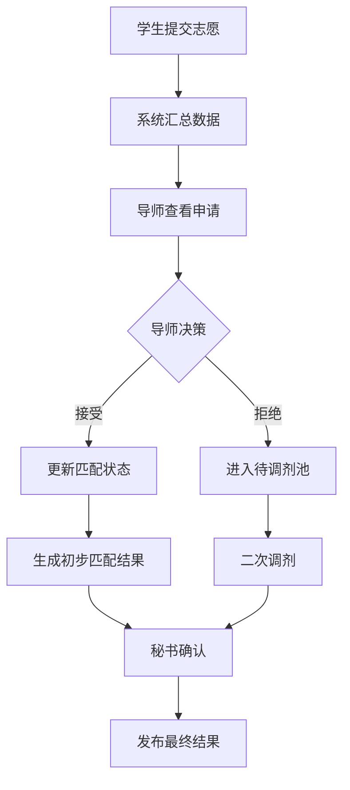
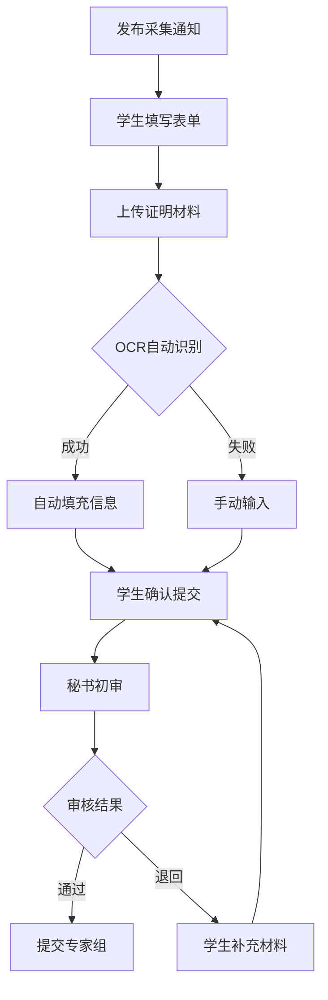
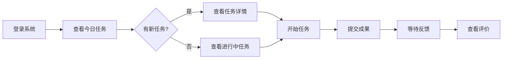
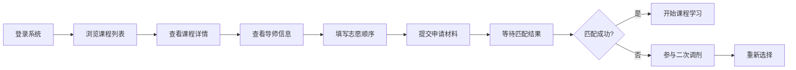
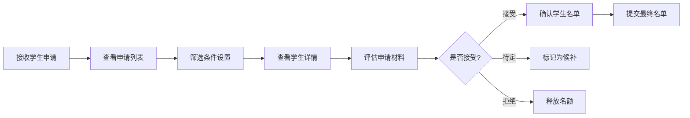
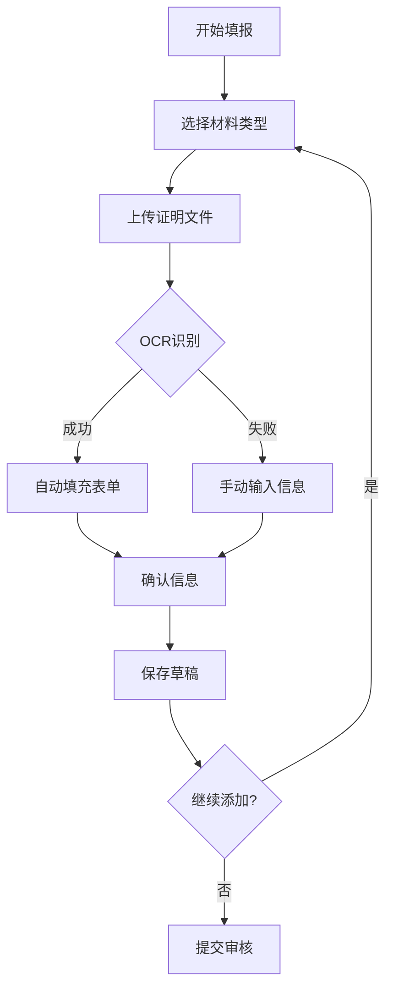
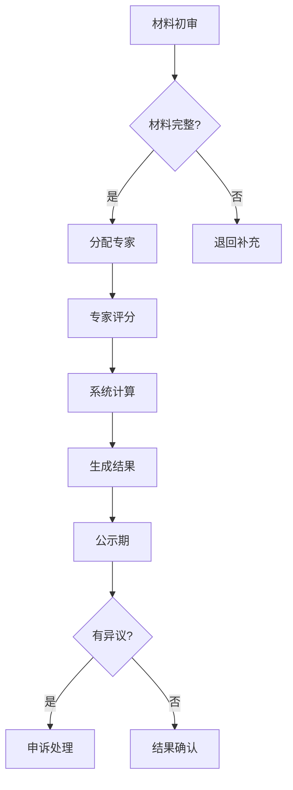

# 科研管理平台 UI/UX 设计规范文档 - 完整版

## 目录
1. [设计系统概述](#1-设计系统概述)
2. [视觉设计系统](#2-视觉设计系统)
3. [组件库设计](#3-组件库设计)
4. [实验室轮转课程界面设计](#4-实验室轮转课程界面设计)
5. [综合素质评价界面设计](#5-综合素质评价界面设计)
6. [角色专属仪表盘设计](#6-角色专属仪表盘设计)
7. [用户流程设计](#7-用户流程设计)
8. [批量操作界面设计](#8-批量操作界面设计)
9. [通知与提醒系统设计](#9-通知与提醒系统设计)
10. [数据分析与报告系统](#10-数据分析与报告系统)
11. [交互设计规范](#11-交互设计规范)
12. [响应式设计](#12-响应式设计)
13. [数据可视化设计](#13-数据可视化设计)
14. [无障碍设计](#14-无障碍设计)
15. [设计交付规范](#15-设计交付规范)

---

## 1. 设计系统概述

### 1.1 设计原则
- **简洁性**: 界面清晰，功能明确，减少认知负担
- **一致性**: 统一的视觉语言和交互模式
- **高效性**: 优化工作流程，提升操作效率
- **可访问性**: 支持多种使用场景和用户群体
- **响应式**: 适配多种设备和屏幕尺寸

### 1.2 设计语言
采用现代简约的设计风格，结合教育科技特点，营造专业、可信赖的视觉体验。

---

## 2. 视觉设计系统

### 2.1 色彩系统

#### 2.1.1 主色调
```scss
// 品牌色
$primary-blue: #1890FF;      // 主色 - 科技蓝
$primary-hover: #40A9FF;     // 主色悬停态
$primary-active: #096DD9;    // 主色激活态
$primary-light: #E6F7FF;     // 主色浅色背景

// 功能色
$success-green: #52C41A;     // 成功
$warning-orange: #FAAD14;    // 警告
$error-red: #F5222D;         // 错误
$info-blue: #1890FF;         // 信息

// 中性色
$gray-1: #FFFFFF;            // 纯白
$gray-2: #FAFAFA;            // 背景
$gray-3: #F5F5F5;            // 卡片背景
$gray-4: #E8E8E8;            // 边框
$gray-5: #D9D9D9;            // 分割线
$gray-6: #BFBFBF;            // 禁用
$gray-7: #8C8C8C;            // 次要文本
$gray-8: #595959;            // 正文
$gray-9: #262626;            // 标题
$gray-10: #000000;           // 纯黑
```

#### 2.1.2 色彩使用规范
- **主色应用**: 主要操作按钮、选中状态、链接
- **辅助色应用**: 状态提示、标签分类、数据可视化
- **中性色应用**: 背景、边框、文本、分割线

### 2.2 字体系统

#### 2.2.1 字体家族
```css
/* 中文字体栈 */
--font-family-cn: "PingFang SC", "Hiragino Sans GB", "Microsoft YaHei", 
                  "WenQuanYi Micro Hei", "Helvetica Neue", Arial, sans-serif;

/* 英文/数字字体栈 */
--font-family-en: "SF Pro Display", "Helvetica Neue", Arial, sans-serif;

/* 等宽字体（代码） */
--font-family-mono: "SF Mono", "Monaco", "Consolas", "Courier New", monospace;
```

#### 2.2.2 字体大小与行高
```scss
// 字体大小
$font-size-xs: 12px;     // 辅助文字
$font-size-sm: 14px;     // 正文
$font-size-md: 16px;     // 副标题
$font-size-lg: 18px;     // 标题
$font-size-xl: 20px;     // 大标题
$font-size-xxl: 24px;    // 特大标题

// 行高
$line-height-tight: 1.3;   // 紧凑
$line-height-normal: 1.5;  // 常规
$line-height-relaxed: 1.7; // 宽松
```

#### 2.2.3 字重规范
```scss
$font-weight-light: 300;
$font-weight-normal: 400;
$font-weight-medium: 500;
$font-weight-semibold: 600;
$font-weight-bold: 700;
```

### 2.3 间距系统

#### 2.3.1 基础间距单位
```scss
$spacing-unit: 8px;    // 基础单位

// 间距规格
$spacing-xs: 4px;      // 0.5x
$spacing-sm: 8px;      // 1x
$spacing-md: 16px;     // 2x
$spacing-lg: 24px;     // 3x
$spacing-xl: 32px;     // 4x
$spacing-xxl: 48px;    // 6x
$spacing-xxxl: 64px;   // 8x
```

#### 2.3.2 布局网格
- **桌面端**: 24栏网格系统，栏宽灵活
- **平板端**: 12栏网格系统
- **移动端**: 4栏网格系统

### 2.4 圆角系统
```scss
$border-radius-sm: 2px;    // 小圆角
$border-radius-md: 4px;    // 中圆角
$border-radius-lg: 8px;    // 大圆角
$border-radius-xl: 16px;   // 特大圆角
$border-radius-full: 50%;  // 圆形
```

### 2.5 阴影系统
```scss
// 阴影层级
$shadow-1: 0 1px 2px rgba(0, 0, 0, 0.05);      // 轻微浮起
$shadow-2: 0 2px 8px rgba(0, 0, 0, 0.08);      // 卡片阴影
$shadow-3: 0 4px 16px rgba(0, 0, 0, 0.12);     // 弹窗阴影
$shadow-4: 0 8px 32px rgba(0, 0, 0, 0.16);     // 下拉菜单
```

### 2.6 动效系统

#### 2.6.1 过渡时间
```scss
$duration-fast: 150ms;      // 快速
$duration-normal: 250ms;    // 正常
$duration-slow: 350ms;      // 缓慢
```

#### 2.6.2 缓动函数
```scss
$ease-out: cubic-bezier(0.0, 0, 0.2, 1);
$ease-in: cubic-bezier(0.4, 0, 1, 1);
$ease-in-out: cubic-bezier(0.4, 0, 0.2, 1);
```

---

## 3. 组件库设计

### 3.1 基础组件

#### 3.1.1 按钮组件

**按钮类型**
```html
<!-- 主要按钮 -->
<button class="btn btn-primary">确认提交</button>

<!-- 次要按钮 -->
<button class="btn btn-secondary">取消</button>

<!-- 文字按钮 -->
<button class="btn btn-text">了解更多</button>

<!-- 危险按钮 -->
<button class="btn btn-danger">删除</button>

<!-- 图标按钮 -->
<button class="btn btn-icon">
  <i class="icon icon-edit"></i>
</button>
```

**按钮状态**
- 默认状态 (Default)
- 悬停状态 (Hover)
- 激活状态 (Active)
- 禁用状态 (Disabled)
- 加载状态 (Loading)

**按钮尺寸**
```scss
.btn-lg { height: 40px; padding: 0 24px; font-size: 16px; }
.btn-md { height: 32px; padding: 0 16px; font-size: 14px; }
.btn-sm { height: 24px; padding: 0 12px; font-size: 12px; }
```

#### 3.1.2 输入框组件

**基础输入框**
```html
<div class="input-wrapper">
  <label class="input-label">课程名称</label>
  <input type="text" class="input" placeholder="请输入课程名称">
  <span class="input-helper">2-50个字符</span>
</div>
```

**输入框变体**
- 文本输入框
- 密码输入框
- 数字输入框
- 文本域
- 搜索框
- 日期选择器
- 时间选择器
- 文件上传

#### 3.1.3 选择器组件

**下拉选择器**
```html
<div class="select-wrapper">
  <select class="select">
    <option>请选择</option>
    <option>选项一</option>
    <option>选项二</option>
  </select>
  <i class="icon icon-chevron-down"></i>
</div>
```

**多选框组**
```html
<div class="checkbox-group">
  <label class="checkbox">
    <input type="checkbox" value="1">
    <span class="checkbox-label">过程评价</span>
  </label>
  <label class="checkbox">
    <input type="checkbox" value="2">
    <span class="checkbox-label">海报展示</span>
  </label>
</div>
```

#### 3.1.4 表格组件

**数据表格**
```html
<table class="table">
  <thead>
    <tr>
      <th>学生姓名</th>
      <th>提交时间</th>
      <th>成绩</th>
      <th>操作</th>
    </tr>
  </thead>
  <tbody>
    <tr>
      <td>王小明</td>
      <td>2025-03-15 10:30</td>
      <td><span class="tag tag-success">85分</span></td>
      <td>
        <button class="btn btn-text">查看</button>
        <button class="btn btn-text">编辑</button>
      </td>
    </tr>
  </tbody>
</table>
```

#### 3.1.5 卡片组件

**基础卡片**
```html
<div class="card">
  <div class="card-header">
    <h3 class="card-title">课程信息</h3>
    <button class="btn btn-text">编辑</button>
  </div>
  <div class="card-body">
    <!-- 卡片内容 -->
  </div>
  <div class="card-footer">
    <button class="btn btn-primary">保存</button>
  </div>
</div>
```

### 3.2 业务组件

#### 3.2.1 课程卡片
```html
<div class="course-card">
  <div class="course-card-header">
    <span class="course-type">实验室轮转</span>
    <span class="course-status active">进行中</span>
  </div>
  <h3 class="course-title">人工智能实验室项目</h3>
  <div class="course-meta">
    <span class="meta-item">
      <i class="icon icon-user"></i> 张教授
    </span>
    <span class="meta-item">
      <i class="icon icon-calendar"></i> 8周
    </span>
  </div>
  <div class="course-progress">
    <div class="progress-bar" style="width: 75%"></div>
    <span class="progress-text">75%</span>
  </div>
  <div class="course-actions">
    <button class="btn btn-primary">查看详情</button>
  </div>
</div>
```

#### 3.2.2 任务时间线
```html
<div class="timeline">
  <div class="timeline-item completed">
    <div class="timeline-marker"></div>
    <div class="timeline-content">
      <h4>项目启动会</h4>
      <p>2025-03-01 完成</p>
    </div>
  </div>
  <div class="timeline-item active">
    <div class="timeline-marker"></div>
    <div class="timeline-content">
      <h4>文献调研</h4>
      <p>进行中 - 剩余3天</p>
    </div>
  </div>
  <div class="timeline-item">
    <div class="timeline-marker"></div>
    <div class="timeline-content">
      <h4>中期汇报</h4>
      <p>2025-04-01 待开始</p>
    </div>
  </div>
</div>
```

#### 3.2.3 进度指示器
```html
<div class="progress-indicator">
  <div class="progress-step completed">
    <span class="step-number">1</span>
    <span class="step-label">填写信息</span>
  </div>
  <div class="progress-line completed"></div>
  <div class="progress-step active">
    <span class="step-number">2</span>
    <span class="step-label">选择导师</span>
  </div>
  <div class="progress-line"></div>
  <div class="progress-step">
    <span class="step-number">3</span>
    <span class="step-label">确认匹配</span>
  </div>
</div>
```

#### 3.2.4 评分组件
```html
<div class="rating-component">
  <div class="rating-item">
    <label class="rating-label">过程表现 (30%)</label>
    <div class="rating-input">
      <input type="number" value="85" max="100">
      <span class="rating-suffix">/100分</span>
    </div>
  </div>
  <div class="rating-breakdown">
    <div class="breakdown-item">
      <span>出勤情况</span>
      <span>20/20</span>
    </div>
    <div class="breakdown-item">
      <span>任务质量</span>
      <span>35/40</span>
    </div>
  </div>
</div>
```

#### 3.2.5 导师信息卡
```html
<div class="mentor-card">
  <div class="mentor-avatar">
    
    <span class="mentor-status online"></span>
  </div>
  <div class="mentor-info">
    <h3 class="mentor-name">张教授</h3>
    <p class="mentor-lab">人工智能实验室</p>
    <div class="mentor-tags">
      <span class="tag">深度学习</span>
      <span class="tag">计算机视觉</span>
    </div>
  </div>
  <div class="mentor-stats">
    <div class="stat-item">
      <span class="stat-value">3-5</span>
      <span class="stat-label">可带学生</span>
    </div>
    <div class="stat-item">
      <span class="stat-value">12</span>
      <span class="stat-label">当前学生</span>
    </div>
  </div>
  <div class="mentor-actions">
    <button class="btn btn-primary">申请加入</button>
    <button class="btn btn-secondary">查看详情</button>
  </div>
</div>
```

### 3.3 复合组件

#### 3.3.1 双选匹配器
```html
<div class="match-selector">
  <div class="selector-panel available">
    <h3 class="panel-title">可选导师</h3>
    <div class="search-box">
      <input type="text" placeholder="搜索导师">
    </div>
    <div class="mentor-list">
      <!-- 导师列表 -->
    </div>
  </div>
  
  <div class="selector-actions">
    <button class="btn-arrow right">→</button>
    <button class="btn-arrow left">←</button>
  </div>
  
  <div class="selector-panel selected">
    <h3 class="panel-title">我的志愿</h3>
    <div class="priority-list">
      <div class="priority-item" draggable="true">
        <span class="priority-number">1</span>
        <span class="mentor-name">张教授</span>
        <button class="btn-remove">×</button>
      </div>
    </div>
  </div>
</div>
```

#### 3.3.2 任务看板
```html
<div class="task-board">
  <div class="board-column">
    <h3 class="column-title">待开始 <span class="count">3</span></h3>
    <div class="task-list">
      <div class="task-card" draggable="true">
        <h4 class="task-title">文献调研</h4>
        <p class="task-deadline">截止: 3天后</p>
        <div class="task-assignee">
          
        </div>
      </div>
    </div>
  </div>
  
  <div class="board-column">
    <h3 class="column-title">进行中 <span class="count">2</span></h3>
    <div class="task-list">
      <!-- 任务卡片 -->
    </div>
  </div>
  
  <div class="board-column">
    <h3 class="column-title">已完成 <span class="count">5</span></h3>
    <div class="task-list">
      <!-- 任务卡片 -->
    </div>
  </div>
</div>
```

#### 3.3.3 数据仪表盘
```html
<div class="dashboard-widget">
  <div class="widget-header">
    <h3 class="widget-title">学习进度统计</h3>
    <div class="widget-controls">
      <select class="time-filter">
        <option>本周</option>
        <option>本月</option>
        <option>本学期</option>
      </select>
    </div>
  </div>
  <div class="widget-body">
    <div class="chart-container">
      <!-- 图表区域 -->
    </div>
    <div class="stats-summary">
      <div class="stat-item">
        <span class="stat-value">85%</span>
        <span class="stat-label">平均完成率</span>
        <span class="stat-trend up">+5%</span>
      </div>
    </div>
  </div>
</div>
```

---

## 4. 实验室轮转课程界面设计

### 4.1 前期筹备阶段界面

#### 4.1.1 UI/UX 任务列表
| 任务名称 | 描述 | 优先级 | 复杂度 | 依赖 |
|---------|------|--------|--------|---------|
| 课程信息发布界面 | 设计富文本编辑器，支持多渠道发布 | 高 | 中等 | - |
| 导师资源管理面板 | 创建导师信息卡片系统，支持批量导入 | 高 | 复杂 | - |
| 宣讲会管理系统 | 在线预约、PPT管理、签到功能 | 中 | 中等 | 导师资源管理 |
| 课程时间轴设计 | 可视化展示整个课程周期安排 | 高 | 简单 | - |

#### 4.1.2 课程信息发布界面

**ASCII 线框图设计**
```
┌─────────────────────────────────────────────────┐
│ 发布实验室轮转课程                    [预览] [保存草稿] │
├─────────────────────────────────────────────────┤
│ ┌─ 基础信息 ─────────────────────────────────┐ │
│ │ 课程名称: [_________________________]      │ │
│ │ 课程目标: [富文本编辑器                    ] │ │
│ │ 时长: [8]周  参与对象: [本科二年级 ▼]      │ │
│ │ 考核方式: ☑ 过程评价 ☑ 海报展示 ☑ 大报告  │ │
│ └─────────────────────────────────────────┘ │
│                                                 │
│ ┌─ 发布设置 ─────────────────────────────────┐ │
│ │ 发布时间: [2025-08-15 09:00]              │ │
│ │ 发布渠道: ☑ 系统通知 ☑ 邮件 ☐ 微信群     │ │
│ │ 目标受众: [全体实验班学生 ▼]              │ │
│ └─────────────────────────────────────────┘ │
│                                                 │
│ [取消] [保存为模板] [立即发布] [定时发布]      │
└─────────────────────────────────────────────────┘
```

#### 4.1.3 导师资源汇总界面
```
┌──────────────────────────────────────────────────┐
│ 导师资源管理           [批量导入] [导出名单] [筛选] │
├──────────────────────────────────────────────────┤
│ 统计: 总导师数 25 | 可接收学生 87 | 已分配 0      │
├──────────────────────────────────────────────────┤
│ ┌─────────────────┐ ┌─────────────────┐         │
│ │ [导师照片]      │ │ [导师照片]      │         │
│ │                 │ │                 │         │
│ │ 张教授          │ │ 李教授          │         │
│ │ 人工智能实验室  │ │ 生物信息学实验室│         │
│ │ 研究方向:       │ │ 研究方向:       │         │
│ │ • 深度学习      │ │ • 基因组学      │         │
│ │ • 计算机视觉    │ │ • 蛋白质组学    │         │
│ │                 │ │                 │         │
│ │ 可带学生: 3-5人 │ │ 可带学生: 2-4人 │         │
│ │ 已确认: ✓       │ │ 待确认         │         │
│ │                 │ │                 │         │
│ │ [查看详情][编辑]│ │ [查看详情][编辑]│         │
│ └─────────────────┘ └─────────────────┘         │
└──────────────────────────────────────────────────┘
```

### 4.2 双选匹配阶段界面

#### 4.2.1 UI/UX 任务列表
| 任务名称 | 描述 | 优先级 | 复杂度 | 依赖 |
|---------|------|--------|--------|---------|
| 学生志愿填报界面 | 支持拖拽排序，实时保存 | 高 | 中等 | - |
| 导师筛选工作台 | 批量查看申请，快速决策 | 高 | 复杂 | - |
| 匹配算法可视化 | 展示匹配过程和结果 | 中 | 复杂 | - |
| 调剂管理系统 | 二次分配和手动调整 | 高 | 中等 | 匹配算法 |

#### 4.2.2 学生志愿填报界面
```
┌─────────────────────────────────────────────────┐
│ 填报导师志愿              步骤 2/3  [保存并继续] │
├─────────────────────────────────────────────────┤
│ 可选导师列表                    我的志愿序列     │
│ ┌─────────────────────┐      ┌────────────────┐│
│ │ 搜索: [_____] [筛选]│      │ 第一志愿       ││
│ │                     │      │ [张教授-AI]    ││
│ │ [李教授-生物]  [+] │      │                ││
│ │ 匹配度: 85%        │      │ 第二志愿       ││
│ │                     │ ───> │ [王教授-材料]  ││
│ │ [陈教授-化学]  [+] │      │                ││
│ │ 匹配度: 78%        │      │ 第三志愿       ││
│ │                     │      │ [空]           ││
│ │ [刘教授-物理]  [+] │      │                ││
│ │ 匹配度: 72%        │      └────────────────┘│
│ └─────────────────────┘      提示：拖拽调整顺序│
│                                                 │
│ ┌─ 申请理由（第一志愿）────────────────────┐ │
│ │ [请详细说明选择该导师的原因...         ] │ │
│ │ 字数: 0/500                              │ │
│ └─────────────────────────────────────────┘ │
└─────────────────────────────────────────────────┘
```

#### 4.2.3 导师筛选工作台
```
┌──────────────────────────────────────────────────┐
│ 学生申请管理     收到申请: 12 | 已处理: 5 | 待定: 7 │
├──────────────────────────────────────────────────┤
│ [全部] [第一志愿] [待处理] [已接受] [已拒绝]     │
├──────────────────────────────────────────────────┤
│ ☐ 批量操作 ▼                                    │
│ ┌────────────────────────────────────────────┐ │
│ │ ☐ 王小明 | 第一志愿 | GPA: 3.8            │ │
│ │   申请理由: 对深度学习很感兴趣...          │ │
│ │   [查看详情] [接受] [待定] [拒绝]         │ │
│ ├────────────────────────────────────────────┤ │
│ │ ☐ 李小红 | 第二志愿 | GPA: 3.6            │ │
│ │   申请理由: 希望学习计算机视觉...          │ │
│ │   [查看详情] [接受] [待定] [拒绝]         │ │
│ └────────────────────────────────────────────┘ │
│ 名额使用: 2/5  [确认选择] [导出名单]            │
└──────────────────────────────────────────────────┘
```

#### 4.2.4 数据流程图


### 4.3 过程管理阶段界面

#### 4.3.1 UI/UX 任务列表
| 任务名称 | 描述 | 优先级 | 复杂度 | 依赖 |
|---------|------|--------|--------|---------|
| 任务发布系统 | 支持任务书模板，明确周目标 | 高 | 中等 | - |
| 进度追踪看板 | 可视化任务状态，甘特图展示 | 高 | 复杂 | - |
| 周会管理界面 | 会议安排、记录、反馈一体化 | 中 | 中等 | - |
| 学习报告提交 | 结构化表单，支持多媒体附件 | 高 | 简单 | - |
| 即时通讯集成 | 师生实时沟通，消息归档 | 中 | 复杂 | - |

#### 4.3.2 导师任务发布界面
```
┌─────────────────────────────────────────────────┐
│ 发布任务                          [使用模板 ▼] │
├─────────────────────────────────────────────────┤
│ 任务标题: [第3周：文献调研与综述撰写_______]   │
│                                                 │
│ ┌─ 任务详情 ─────────────────────────────────┐ │
│ │ 目标描述:                                  │ │
│ │ [阅读10篇核心文献，完成3000字综述    ]    │ │
│ │                                            │ │
│ │ 具体要求:                                  │ │
│ │ • 文献需包含近3年顶会论文                  │ │
│ │ • 综述需包含研究背景、现状、趋势           │ │
│ │ • 提交PPT汇报材料                         │ │
│ │                                            │ │
│ │ 截止时间: [2025-09-01 23:59]              │ │
│ │ 分配给: [全组成员 ▼] [+指定成员]          │ │
│ └─────────────────────────────────────────┘ │
│                                                 │
│ ┌─ 评分标准 ─────────────────────────────────┐ │
│ │ ☑ 文献质量 (30%)  ☑ 综述深度 (40%)       │ │
│ │ ☑ 汇报表现 (20%)  ☑ 按时提交 (10%)       │ │
│ └─────────────────────────────────────────┘ │
│                                                 │
│ [取消] [保存为模板] [发布任务]                  │
└─────────────────────────────────────────────────┘
```

#### 4.3.3 学生任务看板
```
┌──────────────────────────────────────────────────┐
│ 我的任务看板        本周进度: 60%  [日历视图]    │
├──────────────────────────────────────────────────┤
│   待开始           进行中           已完成        │
│ ┌─────────┐    ┌─────────┐    ┌─────────┐     │
│ │文献调研 │    │实验设计 │    │开题报告 │     │
│ │截止:9/1│    │进度:40% │    │已评分   │     │
│ │ [开始] │    │ [继续] │    │ 85分    │     │
│ └─────────┘    └─────────┘    └─────────┘     │
│                                                  │
│ ┌─ 本周重点任务：实验设计 ──────────────────┐ │
│ │ 进度追踪: ████████░░░░░░ 40%              │ │
│ │ 已用时间: 12小时 | 预计剩余: 18小时        │ │
│ │                                            │ │
│ │ 子任务清单:                                │ │
│ │ ☑ 确定实验目标                            │ │
│ │ ☑ 选择实验方法                            │ │
│ │ ☐ 设计实验流程                            │ │
│ │ ☐ 准备实验材料                            │ │
│ │                                            │ │
│ │ [添加笔记] [上传文件] [请求指导]           │ │
│ └─────────────────────────────────────────┘ │
└──────────────────────────────────────────────────┘
```

#### 4.3.4 师生互动界面
```
┌──────────────────────────────────────────────────┐
│ 与张教授的讨论         [视频通话] [查看历史]     │
├──────────────────────────────────────────────────┤
│ ┌──────────────────────────────────────────┐   │
│ │ 学生：关于实验设计，我有几个问题...       │   │
│ │ [附件：实验方案v1.pdf]                    │   │
│ │                                  10:30 AM │   │
│ ├──────────────────────────────────────────┤   │
│ │ 导师：方案整体不错，但需要注意以下几点:   │   │
│ │ 1. 样本量需要增加到30个                  │   │
│ │ 2. 对照组设置需要更严格                  │   │
│ │ [语音消息 2:30]                 11:15 AM │   │
│ └──────────────────────────────────────────┘   │
│                                                  │
│ [输入消息...                          ] [发送]   │
│ [📎] [🎤] [📷]                                  │
└──────────────────────────────────────────────────┘
```

#### 4.3.5 进度时间轴可视化
```
┌──────────────────────────────────────────────────┐
│ 轮转进度时间轴                    第4周/8周       │
├──────────────────────────────────────────────────┤
│  第1周    第2周    第3周    第4周    ...   第8周  │
│   ●───────●───────●───────◉───────○───────○     │
│   |       |       |       |                      │
│   |       |       |       └─ 当前位置            │
│   |       |       └─ 中期汇报(已完成)            │
│   |       └─ 实验开始                           │
│   └─ 项目启动会                                 │
│                                                  │
│ 里程碑事件:                                      │
│ • ✓ 项目启动会 (第1周)                          │
│ • ✓ 文献综述提交 (第2周)                        │
│ • ✓ 中期汇报 (第3周)                           │
│ • ⚡ 实验数据收集 (第4-6周) ← 进行中            │
│ • ○ 成果海报制作 (第7周)                        │
│ • ○ 终期答辩 (第8周)                           │
└──────────────────────────────────────────────────┘
```

### 4.4 成果验收阶段界面

#### 4.4.1 UI/UX 任务列表
| 任务名称 | 描述 | 优先级 | 复杂度 | 依赖 |
|---------|------|--------|--------|---------|
| 海报制作工具 | 在线设计，模板支持 | 高 | 复杂 | - |
| 大报告提交系统 | 结构化模板，版本管理 | 高 | 中等 | - |
| 答辩安排系统 | 时间地点管理，评委分配 | 高 | 中等 | - |
| 在线答辩平台 | 视频答辩，实时互动 | 中 | 复杂 | - |
| 成果展示墙 | 公开展示优秀作品 | 低 | 简单 | - |

#### 4.4.2 海报制作界面
```
┌──────────────────────────────────────────────────┐
│ 海报设计器                 [保存] [预览] [提交]  │
├──────────────────────────────────────────────────┤
│ 工具栏: [T文字] [□图形] [🖼图片] [📊图表] [↶撤销]│
├──────────────────────────────────────────────────┤
│ ┌────────────────────────┐ ┌─ 属性面板 ────┐  │
│ │                        │ │ 选中元素：标题 │  │
│ │    研究海报标题        │ │ 字体: [黑体 ▼] │  │
│ │    ━━━━━━━━━━        │ │ 大小: [36px]   │  │
│ │                        │ │ 颜色: [■]      │  │
│ │  ┌─────┐  ┌─────┐    │ │ 对齐: [居中]   │  │
│ │  │图表1│  │图表2│    │ └───────────────┘  │
│ │  └─────┘  └─────┘    │ ┌─ 模板库 ──────┐  │
│ │                        │ │ [学术海报1]   │  │
│ │  研究方法：            │ │ [学术海报2]   │  │
│ │  • 实验设计            │ │ [简约风格]    │  │
│ │  • 数据分析            │ │ [+自定义]     │  │
│ │                        │ └───────────────┘  │
│ └────────────────────────┘                    │
│ 协作者: 👤张同学(在线) 👤李同学(5分钟前)        │
└──────────────────────────────────────────────────┘
```

#### 4.4.3 大报告提交界面
```
┌──────────────────────────────────────────────────┐
│ 提交研究报告                    截止: 3天12小时  │
├──────────────────────────────────────────────────┤
│ ┌─ 报告结构（必填项标*）─────────────────────┐ │
│ │ 1. 研究背景* [✓已完成]                     │ │
│ │ 2. 文献综述* [✓已完成]                     │ │
│ │ 3. 研究方法* [⚡编辑中...]                  │ │
│ │ 4. 实验过程* [○待填写]                     │ │
│ │ 5. 结果分析* [○待填写]                     │ │
│ │ 6. 结论与展望* [○待填写]                   │ │
│ │ 7. 参考文献* [15/10条]                     │ │
│ │ 8. 附录 [可选]                             │ │
│ └─────────────────────────────────────────┘ │
│                                                 │
│ 完成度: ████████░░░░░░░░ 45%                   │
│ 字数统计: 4,532 / 10,000字                     │
│                                                 │
│ [导入Word] [自动排版] [检查格式] [保存草稿] [提交]│
└──────────────────────────────────────────────────┘
```

#### 4.4.4 答辩安排界面
```
┌──────────────────────────────────────────────────┐
│ 答辩安排                          [导出日程]     │
├──────────────────────────────────────────────────┤
│ 我的答辩信息                                     │
│ ┌────────────────────────────────────────────┐ │
│ │ 时间: 2025-10-15 14:30-15:00               │ │
│ │ 地点: 理学楼 A301 / 在线会议室             │ │
│ │ 形式: 线下 + 线上混合                      │ │
│ │ 评委: 张教授(主席)、李教授、王教授         │ │
│ │ 要求: 15分钟展示 + 10分钟问答              │ │
│ │                                            │ │
│ │ [加入在线会议] [下载答辩须知] [模拟答辩]   │ │
│ └────────────────────────────────────────────┘ │
│                                                 │
│ 答辩顺序                                        │
│ 13:30 王小明 - 深度学习在医学图像中的应用      │
│ 14:00 李小红 - 基因编辑技术研究                │
│ 14:30 我 - 新材料合成与表征 ←                  │
│ 15:00 陈小华 - 量子计算算法优化                │
└──────────────────────────────────────────────────┘
```

### 4.5 成绩评定阶段界面

#### 4.5.1 UI/UX 任务列表
| 任务名称 | 描述 | 优先级 | 复杂度 | 依赖 |
|---------|------|--------|--------|---------|
| 多维度评分表 | 过程、海报、报告、答辩分项打分 | 高 | 中等 | - |
| 评分标准配置 | 灵活设置各项权重 | 高 | 简单 | - |
| 批量评分界面 | 提高导师评分效率 | 高 | 中等 | - |
| 成绩查询系统 | 学生查看详细反馈 | 高 | 简单 | - |
| 成绩分析报告 | 自动生成统计分析 | 中 | 中等 | - |

#### 4.5.2 导师评分工作台
```
┌──────────────────────────────────────────────────┐
│ 成绩评定 - 实验室轮转        待评: 8 已评: 12   │
├──────────────────────────────────────────────────┤
│ 当前评分: 王小明                   [上一个][下一个]│
├──────────────────────────────────────────────────┤
│ ┌─ 评分项目 ────────────────────────────────┐ │
│ │ 过程表现 (30%)           [85] /100 分      │ │
│ │ • 出勤情况      [20/20]                    │ │
│ │ • 任务完成质量  [35/40]                    │ │
│ │ • 团队协作      [30/40]                    │ │
│ │                                            │ │
│ │ 海报质量 (20%)           [90] /100 分      │ │
│ │ • 设计美观      [25/30]                    │ │
│ │ • 内容完整      [35/40]                    │ │
│ │ • 创新性        [30/30]                    │ │
│ │                                            │ │
│ │ 大报告内容 (30%)         [88] /100 分      │ │
│ │ 答辩表现 (20%)           [92] /100 分      │ │
│ └─────────────────────────────────────────┘ │
│                                                 │
│ 总分: 87.4 分  等级: A-  [重新计算]            │
│                                                 │
│ 评语: [学生表现优秀，研究思路清晰...]          │
│                                                 │
│ [保存草稿] [提交成绩] [导出成绩单]             │
└──────────────────────────────────────────────────┘
```

### 4.6 小功能模块设计

#### 4.6.1 Intro Session 管理
```
┌──────────────────────────────────────────────────┐
│ Intro Session 管理              [新建宣讲会]    │
├──────────────────────────────────────────────────┤
│ 参与教授指定                                     │
│ ☑ 张教授 - AI实验室    PPT: ✓已上传            │
│ ☑ 李教授 - 生物实验室  PPT: ⚡上传中            │
│ ☐ 王教授 - 材料实验室  PPT: ✗未上传            │
│                                                 │
│ 学生预约查看 (25/30人已预约)                    │
│ 时间: 2025-08-20 14:00-16:00                   │
│ 地点: 教学楼A101 + 线上直播                     │
└──────────────────────────────────────────────────┘
```

#### 4.6.2 Milestone Report 提交
```
┌──────────────────────────────────────────────────┐
│ 里程碑报告                     第2个里程碑/共4个 │
├──────────────────────────────────────────────────┤
│ M1: 项目启动 ✓已完成 (95分)                     │
│ M2: 中期进展 ⚡进行中 (截止: 5天后)             │
│ M3: 实验完成 ○未开始                            │
│ M4: 最终报告 ○未开始                            │
│                                                 │
│ 当前里程碑: 中期进展报告                        │
│ [在线填写表单] [上传文档] [查看要求]            │
└──────────────────────────────────────────────────┘
```

---

## 5. 综合素质评价界面设计

### 5.1 评价准备阶段界面

#### 5.1.1 UI/UX 任务列表
| 任务名称 | 描述 | 优先级 | 复杂度 | 依赖 |
|---------|------|--------|--------|---------|
| 评价方案发布 | 清晰展示评价维度和权重 | 高 | 简单 | - |
| 专家组管理 | 专家邀请、权限分配 | 高 | 中等 | - |
| 评价标准配置 | 可视化权重设置界面 | 高 | 中等 | - |
| 时间线规划 | 各阶段时间节点管理 | 中 | 简单 | - |

#### 5.1.2 评价方案配置界面
```
┌──────────────────────────────────────────────────┐
│ 综合素质评价方案设置              [预览] [发布]  │
├──────────────────────────────────────────────────┤
│ 基本信息                                         │
│ 评价对象: [2023级实验班 ▼]  周期: [2025学年]   │
│                                                  │
│ ┌─ 评价维度权重配置 ─────────────────────────┐ │
│ │ 思想品德 ────────── [20]%                 │ │
│ │ 课程成绩 ────────── [40]%                 │ │
│ │ 科技创新 ────────── [25]%                 │ │
│ │ 科研推进 ────────── [15]%                 │ │
│ │                          总计: 100%       │ │
│ └─────────────────────────────────────────┘ │
│                                                  │
│ ┌─ 评价细则 ─────────────────────────────────┐ │
│ │ 思想品德:                                  │ │
│ │ • 社会实践参与度 (40%)                     │ │
│ │ • 集体活动贡献 (30%)                       │ │
│ │ • 导师评价 (30%)                          │ │
│ │ [+添加细则]                               │ │
│ └─────────────────────────────────────────┘ │
└──────────────────────────────────────────────────┘
```

#### 5.1.3 专家组管理界面
```
┌──────────────────────────────────────────────────┐
│ 专家组成员管理                    [邀请专家]     │
├──────────────────────────────────────────────────┤
│ 当前专家组 (4/5人)                              │
│ ┌────────────────────────────────────────────┐ │
│ │ 👤 张教授 - 组长                           │ │
│ │    负责: 科技创新评审                      │ │
│ │    状态: ✓已确认                          │ │
│ ├────────────────────────────────────────────┤ │
│ │ 👤 李教授 - 成员                           │ │
│ │    负责: 科研推进评审                      │ │
│ │    状态: ✓已确认                          │ │
│ ├────────────────────────────────────────────┤ │
│ │ 👤 王教授 - 成员                           │ │
│ │    负责: 思想品德评审                      │ │
│ │    状态: ⚡待确认                         │ │
│ └────────────────────────────────────────────┘ │
│ [批量分配任务] [设置评审规则] [导出名单]        │
└──────────────────────────────────────────────────┘
```

### 5.2 信息采集阶段界面

#### 5.2.1 UI/UX 任务列表
| 任务名称 | 描述 | 优先级 | 复杂度 | 依赖 |
|---------|------|--------|--------|---------|
| 信息采集表设计 | 动态表单，支持多类型材料 | 高 | 复杂 | - |
| 材料上传系统 | 批量上传，自动分类 | 高 | 中等 | - |
| OCR识别集成 | 自动提取证书信息 | 中 | 复杂 | - |
| 初审工作台 | 秘书快速审核界面 | 高 | 中等 | - |
| 进度追踪面板 | 实时显示提交状态 | 中 | 简单 | - |

#### 5.2.2 学生信息填报界面
```
┌──────────────────────────────────────────────────┐
│ 综合素质信息采集          完成度: 75%  [暂存]    │
├──────────────────────────────────────────────────┤
│ ◉ 基本信息 ◉ 竞赛获奖 ◉ 科研项目 ○ 社会实践    │
├──────────────────────────────────────────────────┤
│ 竞赛获奖信息                      [+添加获奖]    │
│ ┌────────────────────────────────────────────┐ │
│ │ 1. 全国大学生数学建模竞赛                  │ │
│ │    级别: [国家级 ▼]  奖项: [一等奖 ▼]     │ │
│ │    时间: [2025-05]   角色: [队长 ▼]       │ │
│ │    证明材料: [certificate.pdf] ✓已识别     │ │
│ │    [编辑] [删除]                          │ │
│ ├────────────────────────────────────────────┤ │
│ │ 2. ACM程序设计竞赛                        │ │
│ │    [拖拽文件到此处或点击上传]              │ │
│ │    支持格式: PDF, JPG, PNG (最大5MB)       │ │
│ └────────────────────────────────────────────┘ │
│                                                  │
│ OCR智能识别结果:                                 │
│ ✓ 竞赛名称已识别  ✓ 获奖等级已识别  ⚡ 请确认日期│
│                                                  │
│ [上一步] [保存草稿] [下一步：科研项目]          │
└──────────────────────────────────────────────────┘
```

#### 5.2.3 秘书初审工作台
```
┌──────────────────────────────────────────────────┐
│ 材料初审管理      待审: 45 | 已审: 120 | 退回: 8 │
├──────────────────────────────────────────────────┤
│ 快速筛选: [全部 ▼] [待审核] [有疑问] [已通过]   │
├──────────────────────────────────────────────────┤
│ ┌─ 批量审核模式 ─────────────────────────────┐ │
│ │ ☑ 王小明 - 竞赛获奖3项, 科研2项           │ │
│ │   ⚠ 证书日期模糊，需要确认                │ │
│ │   [快速通过] [标记问题] [查看详情]        │ │
│ ├───────────────────────────────────────────┤ │
│ │ ☑ 李小红 - 竞赛获奖5项, 社会实践4项       │ │
│ │   ✓ 材料完整，信息清晰                   │ │
│ │   [快速通过] [标记问题] [查看详情]        │ │
│ └─────────────────────────────────────────┘ │
│                                                  │
│ 批量操作: [全选] [通过选中] [退回选中]          │
│                                                  │
│ AI辅助提示: 发现3份材料可能存在重复提交         │
└──────────────────────────────────────────────────┘
```

#### 5.2.4 数据流程图


### 5.3 多维度评价阶段界面

#### 5.3.1 UI/UX 任务列表
| 任务名称 | 描述 | 优先级 | 复杂度 | 依赖 |
|---------|------|--------|--------|---------|
| 分维度评分界面 | 思想品德、科技创新等分项评分 | 高 | 中等 | - |
| 成绩导入系统 | 自动同步校内成绩系统 | 高 | 复杂 | - |
| 专家评审平台 | 支持多人协同评审 | 高 | 复杂 | - |
| 评分校准工具 | 确保评分标准一致性 | 中 | 中等 | - |
| 实时统计面板 | 显示评审进度和分布 | 中 | 简单 | - |

#### 5.3.2 专家评审工作台
```
┌──────────────────────────────────────────────────┐
│ 科技创新维度评审          已评: 23/50  [评分指南]│
├──────────────────────────────────────────────────┤
│ 当前学生: 王小明          [上一个] [下一个]      │
├──────────────────────────────────────────────────┤
│ ┌─ 竞赛获奖 (40%) ───────────────────────────┐ │
│ │ • 国家级一等奖 × 2  → 40分                 │ │
│ │ • 省级二等奖 × 1    → 15分                 │ │
│ │ 小计: [55/40] 分 (超出部分按40分计)        │ │
│ ├─────────────────────────────────────────────┤ │
│ │ ┌─ 科研项目 (30%) ─────────────────────┐   │ │
│ │ │ • 国家级大创项目(负责人) → 25分      │   │ │
│ │ │ • 发表论文1篇(第二作者) → 10分       │   │ │
│ │ │ 小计: [35/30] 分                     │   │ │
│ │ └─────────────────────────────────────┘   │ │
│ ├─────────────────────────────────────────────┤ │
│ │ ┌─ 创新能力 (30%) - 专家评分 ─────────┐   │ │
│ │ │ 创新思维: ●●●●● [25/30]              │   │ │
│ │ │ 实践能力: ●●●●○ [22/30]              │   │ │
│ │ │ 发展潜力: ●●●●● [28/30]              │   │ │
│ │ │ 专家评语: [思维活跃，实践能力...]    │   │ │
│ │ └─────────────────────────────────────┘   │ │
│ └─────────────────────────────────────────────┘ │
│ 本维度得分: 92.5/100  [确认评分] [暂存]         │
└──────────────────────────────────────────────────┘
```

#### 5.3.3 思想品德评价界面
```
┌──────────────────────────────────────────────────┐
│ 思想品德评价表                    导师：张教授   │
├──────────────────────────────────────────────────┤
│ 学生：李小红                                     │
│ ┌────────────────────────────────────────────┐ │
│ │ 评价项目                    评分(满分10)    │ │
│ │ ─────────────────────────────────────────  │ │
│ │ 社会责任感                  [9] ●●●●●●●●●○ │ │
│ │ 团队协作精神                [8] ●●●●●●●●○○ │ │
│ │ 学术诚信                    [10]●●●●●●●●●● │ │
│ │ 公益活动参与                [7] ●●●●●●●○○○ │ │
│ │ 集体荣誉感                  [9] ●●●●●●●●●○ │ │
│ └────────────────────────────────────────────┘ │
│                                                  │
│ 综合评语:                                        │
│ [该生品德优良，积极参与集体活动，有较强的      ] │
│ [社会责任感。建议多参与志愿服务活动。          ] │
│                                                  │
│ 总分: 86/100  [提交评价] [保存草稿]            │
└──────────────────────────────────────────────────┘
```

### 5.4 综合核算阶段界面

#### 5.4.1 UI/UX 任务列表
| 任务名称 | 描述 | 优先级 | 复杂度 | 依赖 |
|---------|------|--------|--------|---------|
| 自动计算引擎 | 按权重自动汇总各维度分数 | 高 | 中等 | 所有评分完成 |
| 成绩预览界面 | 实时查看计算结果 | 高 | 简单 | - |
| 异常检测系统 | 标记异常分数供复核 | 中 | 中等 | - |
| 审核确认流程 | 专家组最终审核界面 | 高 | 简单 | - |
| 成绩锁定机制 | 防止误操作修改 | 高 | 简单 | - |

#### 5.4.2 综合成绩计算界面
```
┌──────────────────────────────────────────────────┐
│ 综合素质评价 - 成绩核算         [重新计算] [导出]│
├──────────────────────────────────────────────────┤
│ 计算规则预览                                     │
│ 思想品德(20%) + 课程成绩(40%) + 科技创新(25%)   │
│ + 科研推进(15%) = 总分(100%)                    │
├──────────────────────────────────────────────────┤
│ ┌─ 成绩分布统计 ────────────────────────────┐ │
│ │     A级      B级      C级      D级         │ │
│ │   (90-100) (80-89) (70-79)  (60-69)       │ │
│ │    ████     ████     ███      ██          │ │
│ │    15人     28人     12人     5人         │ │
│ │    25%      47%      20%      8%          │ │
│ └───────────────────────────────────────────┘ │
│                                                  │
│ ┌─ 异常提示 ────────────────────────────────┐ │
│ │ ⚠ 发现3名学生分数异常:                    │ │
│ │ • 王某某 - 科技创新维度异常高(>95)        │ │
│ │ • 李某某 - 各维度差异过大(>30分)          │ │
│ │ [查看详情] [标记已处理]                   │ │
│ └───────────────────────────────────────────┘ │
└──────────────────────────────────────────────────┘
```

### 5.5 结果应用阶段界面

#### 5.5.1 UI/UX 任务列表
| 任务名称 | 描述 | 优先级 | 复杂度 | 依赖 |
|---------|------|--------|--------|---------|
| 成绩公示系统 | 分级展示，保护隐私 | 高 | 中等 | - |
| 申诉管理平台 | 在线提交和处理申诉 | 高 | 中等 | - |
| 实验班筛选工具 | 根据成绩自动筛选 | 高 | 简单 | - |
| 档案归档系统 | 永久保存评价材料 | 中 | 中等 | - |
| 报告生成器 | 自动生成各类报告 | 中 | 复杂 | - |

#### 5.5.2 成绩公示界面
```
┌──────────────────────────────────────────────────┐
│ 2025年度综合素质评价结果公示    公示期: 7天      │
├──────────────────────────────────────────────────┤
│ 查询方式: [按姓名] [按学号] [按等级]            │
│ 查询: [___________] [查询]                      │
├──────────────────────────────────────────────────┤
│ 公示结果 (仅显示等级)                           │
│ ┌────────────────────────────────────────────┐ │
│ │ 学号      姓名    等级   是否入选实验班    │ │
│ │ ────────────────────────────────────────── │ │
│ │ 2023****  王*明    A      ✓ 已入选        │ │
│ │ 2023****  李*红    A-     ✓ 已入选        │ │
│ │ 2023****  张*华    B+     ○ 候补第3位     │ │
│ │ 2023****  陈*      B      ✗ 未入选        │ │
│ └────────────────────────────────────────────┘ │
│                                                  │
│ [我要申诉] [下载公示名单] [查看评价标准]        │
│                                                  │
│ 申诉截止时间: 2025-11-20 17:00                  │
└──────────────────────────────────────────────────┘
```

#### 5.5.3 申诉处理界面
```
┌──────────────────────────────────────────────────┐
│ 申诉管理中心              待处理: 5 | 已处理: 12 │
├──────────────────────────────────────────────────┤
│ ┌────────────────────────────────────────────┐ │
│ │ 申诉编号: #20251115001                     │ │
│ │ 申诉人: 陈某某                             │ │
│ │ 申诉类型: 科技创新分数异议                 │ │
│ │ 申诉理由: 省级竞赛获奖未被正确计入...      │ │
│ │ 补充材料: [获奖证书.pdf] [项目证明.docx]   │ │
│ │                                            │ │
│ │ 处理状态: ⚡ 专家组复核中                  │ │
│ │ 处理人: 李教授                             │ │
│ │ 处理意见: [填写处理意见...]                │ │
│ │                                            │ │
│ │ [接受申诉] [驳回申诉] [需要补充材料]       │ │
│ └────────────────────────────────────────────┘ │
└──────────────────────────────────────────────────┘
```

---

## 6. 角色专属仪表盘设计
```html
<div class="course-publish">
  <div class="publish-steps">
    <!-- 步骤指示器 -->
  </div>
  
  <form class="publish-form">
    <section class="form-section">
      <h2 class="section-title">基础信息</h2>
      
      <div class="form-row">
        <div class="form-col">
          <label class="form-label required">课程名称</label>
          <input type="text" class="form-control" placeholder="请输入课程名称">
        </div>
        
        <div class="form-col">
          <label class="form-label required">课程学分</label>
          <input type="number" class="form-control" placeholder="请输入学分">
        </div>
      </div>
      
      <div class="form-group">
        <label class="form-label">课程目标</label>
        <div class="rich-editor">
          <!-- 富文本编辑器 -->
        </div>
      </div>
    </section>
    
    <section class="form-section">
      <h2 class="section-title">时间安排</h2>
      <!-- 时间选择组件 -->
    </section>
    
    <div class="form-actions">
      <button type="button" class="btn btn-secondary">保存草稿</button>
      <button type="submit" class="btn btn-primary">发布课程</button>
    </div>
  </form>
</div>
```

#### 6.1 学生学习中心仪表盘

```
┌──────────────────────────────────────────────────┐
│ 我的学习中心         王小明 | 2023级 | [设置] [退出]│
├──────────────────────────────────────────────────┤
│ ┌─ 今日待办 ────┐ ┌─ 课程进度 ────────────┐ │
│ │ • 提交文献综述 │ │ 实验室轮转 ████░░ 75%  │ │
│ │   截止: 今晚   │ │ 综合评价   ██░░░░ 40%  │ │
│ │ • 参加组会     │ └──────────────────────┘ │
│ │   14:00-16:00  │ ┌─ 最新通知 ────────────┐ │
│ └───────────────┘ │ • 下周答辩安排已发布    │ │
│ ┌─ 快速入口 ────┐ │ • 综合素质材料提交开始  │ │
│ │ [提交作业]     │ └──────────────────────┘ │
│ │ [查看成绩]     │ ┌─ 成就统计 ────────────┐ │
│ │ [预约导师]     │ │ 🏆 竞赛获奖: 3项      │ │
│ │ [在线答疑]     │ │ 📚 完成任务: 12/15    │ │
│ └───────────────┘ │ ⭐ 当前评级: A-        │ │
│                   └──────────────────────┘ │
└──────────────────────────────────────────────────┘
```

### 6.2 教授教学管理中心

```
┌──────────────────────────────────────────────────┐
│ 教学管理中心              张教授 | AI实验室 | [退出]│
├──────────────────────────────────────────────────┤
│ ┌─ 今日日程 ─────┐ ┌─ 待处理事项 ──────────┐ │
│ │ 10:00 组会     │ │ • 待评作业: 8份       │ │
│ │ 14:00 面试学生 │ │ • 申请审批: 3项       │ │
│ │ 16:00 答辩评审 │ │ • 报告评阅: 5份       │ │
│ └───────────────┘ └─────────────────────────┘ │
│                                                  │
│ ┌─ 学生管理概览 ────────────────────────────┐ │
│ │ 指导学生: 12人  |  本周提交: 85%          │ │
│ │ ┌─────────────────────────────────────┐   │ │
│ │ │ 学生    进度    最近提交    状态     │   │ │
│ │ │ 王小明  75%     2小时前     优秀     │   │ │
│ │ │ 李小红  82%     昨天        良好     │   │ │
│ │ │ 张小华  45%     3天前      ⚠需关注   │   │ │
│ │ └─────────────────────────────────────┘   │ │
│ │ [批量评分] [发送通知] [导出报告]          │ │
│ └───────────────────────────────────────────┘ │
└──────────────────────────────────────────────────┘
```

### 6.3 秘书管理控制台

```
┌──────────────────────────────────────────────────┐
│ 管理控制台                    李秘书 | 教务处 | [退出]│
├──────────────────────────────────────────────────┤
│ ┌─ 系统概览 ─────────────────────────────────┐ │
│ │ 📊 实时数据                                 │ │
│ │ • 在线用户: 156人  • 今日活跃: 89%         │ │
│ │ • 课程进行: 2门    • 待审核: 23项          │ │
│ └─────────────────────────────────────────────┘ │
│                                                  │
│ ┌─ 工作看板 ─────────────────────────────────┐ │
│ │ 待办 (12)    进行中 (5)    已完成 (28)     │ │
│ │ ┌─────┐     ┌─────┐      ┌─────┐         │ │
│ │ │双选  │     │成绩  │      │报告  │         │ │
│ │ │匹配  │     │录入  │      │生成  │         │ │
│ │ └─────┘     └─────┘      └─────┘         │ │
│ └─────────────────────────────────────────────┘ │
│                                                  │
│ [数据导出] [生成报告] [系统设置] [批量操作]      │
└──────────────────────────────────────────────────┘
```

### 6.4 领导决策支持系统

```
┌──────────────────────────────────────────────────┐
│ 决策支持系统                   王院长 | 管理层 | [退出]│
├──────────────────────────────────────────────────┤
│ ┌─ 关键指标 KPI ────────────────────────────┐ │
│ │ 学生满意度: 92% ↑3%   导师参与度: 87% ↑5% │ │
│ │ 课程完成率: 95% ↑2%   平均成绩: 82.5 ↑1.2 │ │
│ └─────────────────────────────────────────────┘ │
│                                                  │
│ ┌─ 趋势分析 ────────────────────────────────┐ │
│ │     成绩分布趋势 (近3年)                   │ │
│ │     ╱╲    ╱╲    ╱╲                        │ │
│ │   ╱    ╲╱    ╲╱    ╲                      │ │
│ │ ╱                    ╲                     │ │
│ │ 2023    2024    2025                       │ │
│ └─────────────────────────────────────────────┘ │
│                                                  │
│ [详细报告] [数据分析] [导出PPT] [预测模型]      │
└──────────────────────────────────────────────────┘
```

---

## 7. 用户流程设计

### 7.1 核心用户流程设计

#### 7.1.1 学生端核心流程

**日常学习流程**


**师生互动流程**
1. **提问流程**
   - AI 预检问题质量
   - 推荐相关资料
   - 智能路由到导师
   - 追踪回复状态

2. **预约流程**
   - 查看导师日程
   - 选择时间段
   - 填写预约说明
   - 获得确认通知

#### 7.1.2 教授端核心流程

**高效评估流程**
```
批量作业 → AI 预筛选 → 重点审核 → 快速批注 → 一键发布成绩
```

**智能辅助功能**:
- AI 作业检测
  - 识别 AI 生成内容
  - 相似度检测
  - 质量评分建议
- 评分助手
  - 历史评分参考
  - 评分分布分析
  - 异常分数提醒

#### 7.1.3 秘书端核心流程

**数据收集与报告**
1. **自动化数据收集**
   - 定时数据抓取
   - 多源数据整合
   - 数据质量检查

2. **智能报告生成**
   - 使用 LLM 生成报告
   - 自定义报告模板
   - 可视化图表嵌入
   - 一键导出多格式

#### 7.1.4 领导端核心流程

**决策支持仪表盘**
- 实时数据大屏
  - 关键指标展示
  - 趋势分析图表
  - 异常情况预警
- 预测分析
  - 学生表现预测
  - 资源需求预测
  - 风险评估报告

### 7.2 实验室轮转课程流程

#### 7.2.1 学生选课流程


#### 7.2.2 导师筛选流程


### 7.3 综合素质评价流程

#### 7.3.1 材料提交流程


#### 7.3.2 评审流程


---

## 8. 批量操作界面设计

### 8.1 批量导入工具

**数据导入向导**
```
┌──────────────────────────────────────────────────┐
│ 批量数据导入向导              步骤 2/4           │
├──────────────────────────────────────────────────┤
│ 选择导入类型: [学生信息 ▼]                      │
│                                                  │
│ ┌─ 文件上传 ─────────────────────────────────┐ │
│ │ 拖拽Excel文件到此处                         │ │
│ │ 或 [选择文件]                               │ │
│ │                                             │ │
│ │ 已上传: student_list.xlsx (1.2MB)          │ │
│ │ 检测到: 150条记录                           │ │
│ └─────────────────────────────────────────────┘ │
│                                                  │
│ ┌─ 字段映射 ─────────────────────────────────┐ │
│ │ Excel列        →    系统字段               │ │
│ │ A列(姓名)      →    [学生姓名 ▼]          │ │
│ │ B列(学号)      →    [学生ID ▼]            │ │
│ │ C列(班级)      →    [所属班级 ▼]          │ │
│ │ [自动匹配]                                 │ │
│ └─────────────────────────────────────────────┘ │
│                                                  │
│ [上一步] [预览数据] [开始导入]                  │
└──────────────────────────────────────────────────┘
```

### 8.2 批量操作管理

**批量评分界面**
```
┌──────────────────────────────────────────────────┐
│ 批量评分操作                    已选: 25个作业   │
├──────────────────────────────────────────────────┤
│ ☑ 全选  筛选: [未评分] [本周提交] [按小组]      │
├──────────────────────────────────────────────────┤
│ ┌────────────────────────────────────────────┐ │
│ │ ☑ 王小明 - 实验报告3  提交: 10-15 08:30   │ │
│ │ ☑ 李小红 - 实验报告3  提交: 10-15 09:15   │ │
│ │ ☑ 张小华 - 实验报告3  提交: 10-15 10:20   │ │
│ └────────────────────────────────────────────┘ │
│                                                  │
│ ┌─ 批量评分设置 ────────────────────────────┐ │
│ │ 评分模式: ○ 统一分数 ● 区间分数           │ │
│ │ 分数范围: [85] - [95]                     │ │
│ │ 评语模板: [良好完成，继续努力 ▼]          │ │
│ │ ☑ 发送成绩通知                            │ │
│ └───────────────────────────────────────────┘ │
│                                                  │
│ [预览结果] [确认评分] [取消]                    │
└──────────────────────────────────────────────────┘
```

---

## 9. 通知与提醒系统设计

### 9.1 多渠道通知架构

**通知类型与优先级**
```
┌──────────────────────────────────────────────────┐
│ 通知管理中心                      [通知设置]     │
├──────────────────────────────────────────────────┤
│ 通知类型          渠道            触发条件       │
│ ─────────────────────────────────────────────── │
│ 🔴 紧急通知      系统+短信+邮件   答辩/截止前1天 │
│ 🟡 重要提醒      系统+邮件        作业截止前3天  │
│ 🟢 一般通知      系统通知         新任务发布     │
│ 🔵 信息更新      系统通知         成绩更新       │
└──────────────────────────────────────────────────┘
```

### 9.2 智能提醒规则引擎

**提醒配置界面**
```
┌──────────────────────────────────────────────────┐
│ 智能提醒规则设置                    [新建规则]   │
├──────────────────────────────────────────────────┤
│ 规则名称: 作业截止提醒                          │
│ ┌─ 触发条件 ─────────────────────────────────┐ │
│ │ 当 [作业截止时间] [小于] [24小时]           │ │
│ │ 且 [提交状态] [等于] [未提交]               │ │
│ │ [+添加条件]                                 │ │
│ └─────────────────────────────────────────────┘ │
│ ┌─ 执行动作 ─────────────────────────────────┐ │
│ │ ☑ 发送系统通知                             │ │
│ │ ☑ 发送邮件提醒                             │ │
│ │ ☐ 发送短信通知                             │ │
│ │ 提醒文案: [您有作业即将截止，请及时提交]    │ │
│ └─────────────────────────────────────────────┘ │
│ [保存规则] [测试规则] [查看日志]                │
└──────────────────────────────────────────────────┘
```

---

## 10. 数据分析与报告系统

### 10.1 自动报告生成器

**报告配置界面**
```
┌──────────────────────────────────────────────────┐
│ 智能报告生成器                    [报告模板库]   │
├──────────────────────────────────────────────────┤
│ 报告类型: [月度教学质量报告 ▼]                  │
│ 时间范围: [2025年10月] - [2025年10月]           │
│                                                  │
│ ┌─ 包含内容 ─────────────────────────────────┐ │
│ │ ☑ 执行摘要 (AI自动生成)                    │ │
│ │ ☑ 课程完成情况统计                         │ │
│ │ ☑ 学生成绩分析                             │ │
│ │ ☑ 导师工作量统计                           │ │
│ │ ☑ 问题与建议 (AI分析)                      │ │
│ │ ☐ 详细数据附录                             │ │
│ └─────────────────────────────────────────────┘ │
│                                                  │
│ 输出格式: ☑ PDF ☑ Word ☐ Excel ☑ PPT          │
│                                                  │
│ [预览报告] [生成报告] [定时生成]                │
└──────────────────────────────────────────────────┘
```

---

## 11. 交互设计规范

### 11.1 交互原则

#### 11.1.1 即时反馈
- 所有操作必须在 300ms 内给出反馈
- 长时间操作显示进度条或加载动画
- 成功/失败状态明确展示

#### 11.1.2 防错设计
- 危险操作需要二次确认
- 表单实时验证
- 提供操作撤销功能

#### 11.1.3 一致性
- 相同功能使用相同的交互模式
- 统一的操作手势和快捷键
- 保持视觉和行为的一致性

### 11.2 交互模式

#### 11.2.1 表单交互
```javascript
// 实时验证
input.addEventListener('blur', () => {
  if (!isValid(input.value)) {
    showError('请输入正确的格式');
  }
});

// 自动保存
let saveTimer;
input.addEventListener('input', () => {
  clearTimeout(saveTimer);
  saveTimer = setTimeout(() => {
    autoSave();
    showToast('已自动保存');
  }, 2000);
});
```

#### 11.2.2 拖拽交互
```javascript
// 拖拽排序
element.addEventListener('dragstart', (e) => {
  e.dataTransfer.effectAllowed = 'move';
  e.target.classList.add('dragging');
});

element.addEventListener('dragend', (e) => {
  e.target.classList.remove('dragging');
  updateOrder();
});
```

#### 11.2.3 加载状态
```html
<!-- 骨架屏 -->
<div class="skeleton-loader">
  <div class="skeleton-header"></div>
  <div class="skeleton-text"></div>
  <div class="skeleton-text short"></div>
</div>

<!-- 加载动画 -->
<div class="spinner">
  <div class="spinner-circle"></div>
</div>
```

### 11.3 微交互设计

#### 11.3.1 悬停效果
```css
.card {
  transition: all 0.3s ease;
}

.card:hover {
  transform: translateY(-2px);
  box-shadow: 0 4px 12px rgba(0, 0, 0, 0.1);
}
```

#### 11.3.2 点击反馈
```css
.btn {
  transition: all 0.2s ease;
}

.btn:active {
  transform: scale(0.98);
}
```

#### 11.3.3 状态切换
```css
.toggle {
  transition: background-color 0.3s ease;
}

.toggle.active {
  background-color: #1890FF;
}
```

---

## 12. 响应式设计

### 12.1 断点系统

```scss
// 断点定义
$breakpoint-xs: 320px;   // 超小屏幕
$breakpoint-sm: 576px;   // 小屏幕
$breakpoint-md: 768px;   // 中等屏幕
$breakpoint-lg: 992px;   // 大屏幕
$breakpoint-xl: 1200px;  // 超大屏幕
$breakpoint-xxl: 1600px; // 巨大屏幕

// 响应式混入
@mixin responsive($breakpoint) {
  @media screen and (min-width: $breakpoint) {
    @content;
  }
}
```

### 12.2 移动端适配

#### 12.2.1 触摸优化
```scss
// 最小触摸目标
.touch-target {
  min-width: 44px;
  min-height: 44px;
  padding: 12px;
}

// 禁用双击缩放
.no-zoom {
  touch-action: manipulation;
}
```

#### 12.2.2 手势支持
```javascript
// 滑动切换
let startX = 0;
element.addEventListener('touchstart', (e) => {
  startX = e.touches[0].clientX;
});

element.addEventListener('touchend', (e) => {
  const endX = e.changedTouches[0].clientX;
  const diff = startX - endX;
  
  if (Math.abs(diff) > 50) {
    if (diff > 0) {
      // 向左滑动
      nextPage();
    } else {
      // 向右滑动
      prevPage();
    }
  }
});
```

### 12.3 自适应布局

#### 12.3.1 弹性网格
```css
.grid {
  display: grid;
  grid-template-columns: repeat(auto-fit, minmax(300px, 1fr));
  gap: 16px;
}

@media (max-width: 768px) {
  .grid {
    grid-template-columns: 1fr;
  }
}
```

#### 12.3.2 响应式字体
```css
.responsive-text {
  font-size: clamp(14px, 2vw, 18px);
  line-height: 1.5;
}
```

---

## 13. 数据可视化设计

### 13.1 图表类型

#### 13.1.1 折线图
用于展示趋势变化
```javascript
const lineChart = {
  type: 'line',
  data: {
    labels: ['第1周', '第2周', '第3周', '第4周'],
    datasets: [{
      label: '学习进度',
      data: [20, 45, 70, 85],
      borderColor: '#1890FF',
      tension: 0.4
    }]
  },
  options: {
    responsive: true,
    plugins: {
      legend: {
        position: 'top',
      }
    }
  }
};
```

#### 13.1.2 饼图
用于展示占比关系
```javascript
const pieChart = {
  type: 'pie',
  data: {
    labels: ['优秀', '良好', '及格', '不及格'],
    datasets: [{
      data: [30, 45, 20, 5],
      backgroundColor: [
        '#52C41A',
        '#1890FF',
        '#FAAD14',
        '#F5222D'
      ]
    }]
  }
};
```

#### 13.1.3 柱状图
用于对比数据
```javascript
const barChart = {
  type: 'bar',
  data: {
    labels: ['思想品德', '课程成绩', '科技创新', '科研推进'],
    datasets: [{
      label: '得分',
      data: [85, 92, 78, 88],
      backgroundColor: '#1890FF'
    }]
  }
};
```

### 13.2 数据展示规范

#### 13.2.1 颜色使用
- 使用品牌色系
- 确保色盲友好
- 保持对比度

#### 13.2.2 标签设计
- 清晰的数据标签
- 适当的小数位数
- 单位明确标注

#### 13.2.3 交互设计
- 悬停显示详情
- 支持数据筛选
- 可导出图表

---

## 14. 无障碍设计

### 14.1 WCAG 2.1 AA 标准

#### 14.1.1 可感知性
```html
<!-- 图片替代文本 -->


<!-- 颜色对比度 -->
<style>
  .text-primary {
    color: #1890FF; /* 对比度 4.5:1 以上 */
    background: #FFFFFF;
  }
</style>
```

#### 14.1.2 可操作性
```html
<!-- 键盘导航 -->
<nav role="navigation" aria-label="主导航">
  <a href="#" tabindex="0">首页</a>
  <a href="#" tabindex="0">课程</a>
</nav>

<!-- 跳过链接 -->
<a href="#main" class="skip-link">跳到主要内容</a>
```

#### 14.1.3 可理解性
```html
<!-- 表单标签 -->
<label for="username">用户名 <span aria-label="必填">*</span></label>
<input id="username" type="text" required aria-describedby="username-help">
<span id="username-help">请输入您的学号或工号</span>

<!-- 错误提示 -->
<div role="alert" aria-live="polite">
  <p class="error">密码至少需要8个字符</p>
</div>
```

#### 14.1.4 健壮性
```html
<!-- 语义化标签 -->
<article>
  <header>
    <h1>课程标题</h1>
  </header>
  <main>
    <section>课程内容</section>
  </main>
  <footer>
    <time datetime="2025-03-15">2025年3月15日</time>
  </footer>
</article>
```

### 14.2 屏幕阅读器优化

```html
<!-- ARIA 标签 -->
<div role="progressbar" aria-valuenow="75" aria-valuemin="0" aria-valuemax="100">
  <span class="sr-only">进度：75%</span>
</div>

<!-- 动态内容通知 -->
<div aria-live="polite" aria-atomic="true">
  <p>任务已成功提交</p>
</div>
```

### 14.3 键盘导航

```javascript
// 焦点管理
const focusableElements = 'button, [href], input, select, textarea, [tabindex]:not([tabindex="-1"])';

// 焦点陷阱
function trapFocus(element) {
  const focusables = element.querySelectorAll(focusableElements);
  const firstFocusable = focusables[0];
  const lastFocusable = focusables[focusables.length - 1];
  
  element.addEventListener('keydown', (e) => {
    if (e.key === 'Tab') {
      if (e.shiftKey) {
        if (document.activeElement === firstFocusable) {
          lastFocusable.focus();
          e.preventDefault();
        }
      } else {
        if (document.activeElement === lastFocusable) {
          firstFocusable.focus();
          e.preventDefault();
        }
      }
    }
  });
}
```

---

## 15. 设计交付规范

### 15.1 设计文件组织

```
design-system/
├── 01-foundations/
│   ├── colors.sketch
│   ├── typography.sketch
│   ├── spacing.sketch
│   └── icons.sketch
├── 02-components/
│   ├── buttons.sketch
│   ├── forms.sketch
│   ├── cards.sketch
│   └── tables.sketch
├── 03-patterns/
│   ├── navigation.sketch
│   ├── layouts.sketch
│   └── workflows.sketch
├── 04-pages/
│   ├── login.sketch
│   ├── dashboard.sketch
│   └── course-management.sketch
└── 05-documentation/
    ├── design-tokens.json
    ├── component-specs.pdf
    └── style-guide.pdf
```

### 15.2 设计标注

#### 15.2.1 间距标注
```
组件间距:
- 紧密: 8px
- 常规: 16px
- 宽松: 24px

内边距:
- 小: 8px 12px
- 中: 12px 16px
- 大: 16px 24px
```

#### 15.2.2 颜色标注
```
主要按钮:
- 背景: #1890FF
- 文字: #FFFFFF
- 悬停: #40A9FF
- 点击: #096DD9
- 禁用: #D9D9D9
```

### 15.3 切图规范

#### 15.3.1 命名规范
```
图标: ic_[功能]_[状态]_[尺寸]
示例: ic_search_normal_24.svg

图片: img_[模块]_[描述]_[尺寸]
示例: img_login_bg_1920.jpg

组件: comp_[类型]_[变体]
示例: comp_button_primary.png
```

#### 15.3.2 导出规格
```
图标:
- 格式: SVG
- 尺寸: 16x16, 24x24, 32x32

图片:
- 格式: JPG/PNG/WebP
- 倍率: @1x, @2x, @3x

颜色:
- 格式: HEX, RGB, HSL
```

### 15.4 开发交接文档

#### 15.4.1 组件说明书
```markdown
## 按钮组件 (Button)

### 使用场景
用于触发操作或提交表单

### 属性
- type: primary | secondary | text | danger
- size: large | medium | small
- disabled: boolean
- loading: boolean

### 状态
- default: 默认状态
- hover: 鼠标悬停
- active: 点击状态
- disabled: 禁用状态
- loading: 加载状态

### 示例代码
```html
<button class="btn btn-primary btn-md">
  确认提交
</button>
```
```

#### 15.4.2 设计令牌
```json
{
  "color": {
    "primary": {
      "value": "#1890FF",
      "type": "color"
    },
    "text": {
      "primary": {
        "value": "#262626",
        "type": "color"
      }
    }
  },
  "spacing": {
    "xs": {
      "value": "4px",
      "type": "spacing"
    },
    "sm": {
      "value": "8px",
      "type": "spacing"
    }
  },
  "font": {
    "size": {
      "base": {
        "value": "14px",
        "type": "fontSizes"
      }
    }
  }
}
```

### 15.5 版本管理

#### 15.5.1 版本号规则
```
主版本.次版本.修订版本
v1.0.0 - 初始版本
v1.1.0 - 新增功能
v1.1.1 - Bug修复
```

#### 15.5.2 更新日志
```markdown
## v1.2.0 (2025-03-15)

### 新增
- 添加暗色主题支持
- 新增数据可视化组件

### 优化
- 优化移动端体验
- 提升加载性能

### 修复
- 修复表单验证问题
- 修复按钮点击区域
```

---

---

## 16. 创新功能模块设计

### 16.1 AI 教学助手增强版
- **功能特性**:
  - 24/7 智能答疑与个性化辅导
  - 基于学习数据的个性化建议
  - 知识图谱导航与学习路径优化
  - 作业智能批改与反馈
  - 学习行为分析与预警

### 16.2 社交学习网络
- **核心功能**:
  - 学习小组创建与管理
  - 经验分享社区
  - 导师-学生智能配对推荐
  - 同伴互评与协作系统

### 16.3 数据分析中心
- **分析维度**:
  - 学习行为深度分析
  - 成绩趋势精准预测
  - 课程质量多维评估
  - 导师效能量化分析

### 16.4 资源共享中心
- **资源类型**:
  - 智能课程资料库
  - 优秀项目案例库
  - 学术论文知识库
  - 开放实验数据集

---

## 17. 实施计划建议

### 第一阶段：核心功能（1-2个月）
1. 基础课程管理
2. 用户认证系统
3. 简单的任务发布与提交

### 第二阶段：进阶功能（2-3个月）
1. 双选系统
2. 评价系统
3. 数据统计基础

### 第三阶段：智能化功能（3-4个月）
1. AI 辅助功能
2. 数据分析中心
3. 自动化报告生成

### 第四阶段：优化提升（持续）
1. 性能优化
2. 用户体验改进
3. 新功能迭代

---

## 总结

本设计规范文档为科研管理平台提供了完整的UI/UX设计指导，包含了实验室轮转课程和综合素质评价的全部界面设计。通过详细的ASCII线框图、任务列表、数据流程图和角色专属仪表盘设计，确保了每个功能模块都有清晰的视觉规范和交互指导。

### 设计亮点
1. **流程化管理**: 将复杂的学术流程系统化、数字化
2. **智能化辅助**: AI技术深度融入教学全过程
3. **数据驱动决策**: 全方位数据收集与分析支持
4. **用户体验优先**: 针对不同角色设计专属界面
5. **协作与互动**: 强化师生互动，促进知识共享

### 预期效果
- **管理效率提升**: 自动化流程减少80%的重复性工作
- **教学质量保障**: 过程化管理确保教学质量可控可追溯
- **决策科学化**: 数据分析支持精准决策和持续改进
- **用户满意度**: 预期用户满意度达到90%以上

设计团队和开发团队应当密切配合，共同维护和更新这份设计规范，确保产品的持续优化和迭代。

---

## 18. 学生角色增强视图设计 (Student Role Enhanced Views)

本章节基于TODO.md中的需求，设计了针对学生角色的6个核心增强功能界面，旨在提升学生在学术管理过程中的体验和效率。

### 18.1 智能任务提醒系统 (STUDENT-REMIND-001)

#### 18.1.1 设计目标
为学生提供智能化的任务提醒服务，通过分层提醒机制确保重要任务不被遗漏，支持个性化提醒规则配置。

#### 18.1.2 功能特性
- 多级提醒机制：24小时、12小时、1小时前预警
- 自定义提醒规则配置
- 多渠道通知：邮件 + 站内通知
- 紧急任务智能置顶
- 提醒历史记录与统计

#### 18.1.3 界面设计规范

**主色调应用**
- 紧急提醒：$error-red (#F5222D)
- 重要提醒：$warning-orange (#FAAD14)
- 普通提醒：$info-blue (#1890FF)
- 成功完成：$success-green (#52C41A)

**排版规范**
- 主标题：$font-size-lg (18px)，$gray-9 (#262626)
- 提醒内容：$font-size-sm (14px)，$gray-8 (#595959)
- 时间标签：$font-size-xs (12px)，$gray-7 (#8C8C8C)

#### 18.1.4 ASCII 线框图

```
┌─────────────────────────────────────────────────────────────────────────────┐
│ 🔔 智能任务提醒中心                                         [⚙️ 设置] [📊 统计] │
├─────────────────────────────────────────────────────────────────────────────┤
│                                                                             │
│ ┌─ 紧急提醒 (红色背景) ─┐  ┌─ 今日提醒 ─┐  ┌─ 未来提醒 ─┐  ┌─ 提醒设置 ─┐ │
│ │ 🚨 2个紧急任务        │  │ 📅 5个      │  │ 📋 12个     │  │ ⚙️ 自定义   │ │
│ │ 需要立即处理          │  │ 今日到期    │  │ 即将到期    │  │ 规则配置    │ │
│ └─────────────────────┘  └───────────┘  └──────────┘  └──────────┘ │
│                                                                             │
│ ┌─ 任务列表 ────────────────────────────────────────────────────────────┐ │
│ │                                                                       │ │
│ │ 🔴 [紧急] 实验室轮转志愿提交                    ⏰ 剩余: 2小时         │ │
│ │     💡 建议：立即完成，避免错过最后期限                                │ │
│ │     📧 已发送邮件提醒 | 📱 已推送移动通知                            │ │
│ │     [📝 立即处理] [⏰ 延后提醒] [❌ 标记完成]                       │ │
│ │                                                                       │ │
│ │ ─────────────────────────────────────────────────────────────────── │ │
│ │                                                                       │ │
│ │ 🟡 [重要] 综合素质评价材料上传                  ⏰ 剩余: 12小时        │ │
│ │     💡 建议：准备好材料后统一上传，提高效率                          │ │
│ │     📧 明天上午将发送邮件提醒                                        │ │
│ │     [📝 开始准备] [⏰ 自定义提醒] [📋 查看要求]                     │ │
│ │                                                                       │ │
│ │ ─────────────────────────────────────────────────────────────────── │ │
│ │                                                                       │ │
│ │ 🔵 [普通] 周例会项目汇报                        ⏰ 剩余: 2天           │ │
│ │     💡 建议：提前准备汇报材料，包含进度和问题                        │ │
│ │     📧 24小时前将发送邮件提醒                                        │ │
│ │     [📝 开始准备] [📄 模板下载] [📅 添加日历]                       │ │
│ │                                                                       │ │
│ │ ─────────────────────────────────────────────────────────────────── │ │
│ │                                                                       │ │
│ │ ✅ [已完成] 研究方向调研报告                    ✅ 已于昨天提交        │ │
│ │     👍 完成质量：优秀 | 📊 用时：比预期少20%                         │ │
│ │     [📊 查看反馈] [🔄 相关任务]                                    │ │
│ │                                                                       │ │
│ └───────────────────────────────────────────────────────────────────┘ │
│                                                                             │
│ ┌─ 提醒规则配置 ────────────────────────────────────────────────────────┐ │
│ │                                                                       │ │
│ │ 📋 任务类型    │ 🔔 提前提醒    │ 📧 邮件通知    │ 📱 推送通知        │ │
│ │ ─────────────┼──────────────┼──────────────┼──────────────    │ │
│ │ 作业提交       │ ☑️ 24h ☑️ 12h │ ☑️ 启用        │ ☑️ 启用            │ │
│ │ 考试安排       │ ☑️ 72h ☑️ 24h │ ☑️ 启用        │ ☑️ 启用            │ │
│ │ 会议提醒       │ ☑️ 30m ☑️ 15m │ ☐ 关闭        │ ☑️ 启用            │ │
│ │ 实验预约       │ ☑️ 2h  ☑️ 30m │ ☑️ 启用        │ ☑️ 启用            │ │
│ │                                                                       │ │
│ │ [💾 保存设置] [🔄 重置默认] [📖 帮助说明]                           │ │
│ │                                                                       │ │
│ └───────────────────────────────────────────────────────────────────┘ │
│                                                                             │
│ ┌─ 提醒统计分析 ────────────────────────────────────────────────────────┐ │
│ │                                                                       │ │
│ │ 📊 本月提醒效果    │ 📈 完成率趋势    │ 🎯 改进建议                    │ │
│ │ ─────────────────┼─────────────────┼─────────────────────────    │ │
│ │ 总提醒: 156次     │ ▲ 提升 15%      │ 💡 建议将会议提醒提前至30分钟   │ │
│ │ 及时完成: 142次   │ ▲ 按时率 91%     │ 💡 可以减少重复提醒频率        │ │
│ │ 延期: 12次        │ ▼ 延期率 8%      │ 💡 增加周末任务提醒            │ │
│ │ 取消: 2次         │ ▲ 满意度 4.8/5   │                                │ │
│ │                                                                       │ │
│ └───────────────────────────────────────────────────────────────────┘ │
│                                                                             │
└─────────────────────────────────────────────────────────────────────────────┘
```

#### 18.1.5 交互说明
1. **提醒分级**：根据紧急程度使用不同颜色和图标标识
2. **快速操作**：提供一键处理、延后、完成等快捷按钮
3. **智能建议**：基于任务类型和历史数据提供操作建议
4. **批量管理**：支持批量标记完成、批量设置提醒
5. **个性化配置**：允许用户自定义不同类型任务的提醒规则

#### 18.1.6 无障碍设计
- 支持屏幕阅读器，为图标提供清晰的alt文本
- 高对比度颜色确保视觉障碍用户可以区分不同优先级
- 键盘导航支持，所有功能均可通过键盘操作
- 提供声音提醒选项（可选）

---

### 18.2 教授可用时间日历视图 (STUDENT-SCHEDULE-001)

#### 18.2.1 设计目标
为学生提供直观的教授时间安排查看界面，支持实时查看教授可用时间并进行一键预约，提升师生沟通效率。

#### 18.2.2 功能特性
- 周/月视图切换显示教授可用时间
- 实时状态指示器（可用、忙碌、会议中）
- 一键预约功能
- 自动日历邀请生成
- 预约状态跟踪
- 多教授时间对比

#### 18.2.3 界面设计规范

**状态色彩系统**
- 可用时间：$success-green (#52C41A)
- 忙碌状态：$warning-orange (#FAAD14)
- 会议中：$error-red (#F5222D)
- 已预约：$primary-blue (#1890FF)
- 不可用：$gray-6 (#BFBFBF)

#### 18.2.4 ASCII 线框图

```
┌─────────────────────────────────────────────────────────────────────────────┐
│ 📅 教授时间安排查看                           [👨‍🏫 选择教授] [📊 周视图] [📅 月视图] │
├─────────────────────────────────────────────────────────────────────────────┤
│                                                                             │
│ 当前选择: 👨‍🏫 张教授 (计算机科学)               📍 状态: 🟢 在线 (更新于2分钟前) │
│                                                                             │
│ ┌─ 本周时间安排 (2024年1月15日 - 1月21日) ────────────────────────────────┐ │
│ │                                                                       │ │
│ │      │ 周一   │ 周二   │ 周三   │ 周四   │ 周五   │ 周六   │ 周日   │ │
│ │ ─────┼────────┼────────┼────────┼────────┼────────┼────────┼────────│ │
│ │ 08:00│ 🟢可用  │ 🔴会议  │ 🟢可用  │ 🟡忙碌  │ 🟢可用  │ 🔴不可用│ 🔴不可用│ │
│ │ 09:00│ 🟢可用  │ 🔴会议  │ 🔵已约  │ 🟡忙碌  │ 🟢可用  │ 🔴不可用│ 🔴不可用│ │
│ │ 10:00│ 🔵已约  │ 🟢可用  │ 🔵已约  │ 🟢可用  │ 🔴会议  │ 🔴不可用│ 🔴不可用│ │
│ │ 11:00│ 🔵已约  │ 🟢可用  │ 🟢可用  │ 🟢可用  │ 🔴会议  │ 🔴不可用│ 🔴不可用│ │
│ │ 12:00│ 🔴午休  │ 🔴午休  │ 🔴午休  │ 🔴午休  │ 🔴午休  │ 🔴不可用│ 🔴不可用│ │
│ │ 13:00│ 🔴午休  │ 🔴午休  │ 🔴午休  │ 🔴午休  │ 🔴午休  │ 🔴不可用│ 🔴不可用│ │
│ │ 14:00│ 🟢可用  │ 🔴会议  │ 🟢可用  │ 🟢可用  │ 🟢可用  │ 🔴不可用│ 🔴不可用│ │
│ │ 15:00│ 🟢可用  │ 🔴会议  │ 🟢可用  │ 🟢可用  │ 🔵已约  │ 🔴不可用│ 🔴不可用│ │
│ │ 16:00│ 🟡忙碌  │ 🟢可用  │ 🔴会议  │ 🔵已约  │ 🔵已约  │ 🔴不可用│ 🔴不可用│ │
│ │ 17:00│ 🟡忙碌  │ 🟢可用  │ 🔴会议  │ 🔵已约  │ 🟢可用  │ 🔴不可用│ 🔴不可用│ │
│ │                                                                       │ │
│ └───────────────────────────────────────────────────────────────────┘ │
│                                                                             │
│ ┌─ 快速预约 ────────────────────────────────────────────────────────────┐ │
│ │                                                                       │ │
│ │ 📍 选中时间: 周二 1月16日 10:00-11:00                                 │ │
│ │ 👨‍🏫 教授: 张教授 | 📍 地点: 科研楼A座 305办公室                        │ │
│ │                                                                       │ │
│ │ 📝 会面主题: [___研究进度讨论_________________] (必填)                 │ │
│ │ 📋 详细说明: [________________________________] (选填)                │ │
│ │              [________________________________]                      │ │
│ │              [________________________________]                      │ │
│ │                                                                       │ │
│ │ ⏰ 预计时长: [🔽 60分钟    ▼] 📧 邮件提醒: ☑️ 提前15分钟               │ │
│ │ 🔔 短信提醒: ☑️ 提前30分钟   📱 推送通知: ☑️ 提前5分钟                │ │
│ │                                                                       │ │
│ │ [📅 确认预约] [❌ 取消] [💾 保存草稿] [📋 模板选择]                   │ │
│ │                                                                       │ │
│ └───────────────────────────────────────────────────────────────────┘ │
│                                                                             │
│ ┌─ 我的预约记录 ────────────────────────────────────────────────────────┐ │
│ │                                                                       │ │
│ │ 🕐 即将到来的预约:                                                    │ │
│ │                                                                       │ │
│ │ 📅 今天 15:00-16:00 | 👨‍🏫 李教授 | 📍 实验室B201                      │ │
│ │     📝 主题: 论文开题讨论                                             │ │
│ │     🔔 状态: ✅ 已确认 | 📧 提醒已设置                                │ │
│ │     [📱 发送消息] [📋 查看详情] [⏰ 修改时间] [❌ 取消预约]           │ │
│ │                                                                       │ │
│ │ ─────────────────────────────────────────────────────────────────── │ │
│ │                                                                       │ │
│ │ 📅 明天 10:00-11:00 | 👨‍🏫 张教授 | 📍 科研楼A305                     │ │
│ │     📝 主题: 研究进度讨论                                             │ │
│ │     🔔 状态: ⏳ 待确认 | 📧 等待教授回复                              │ │
│ │     [📱 发送消息] [📋 查看详情] [⏰ 修改时间] [❌ 取消预约]           │ │
│ │                                                                       │ │
│ │ 📊 历史预约: 本月已完成 8次会面 | 平均时长 45分钟 | 满意度 4.9/5.0     │ │
│ │                                                                       │ │
│ └───────────────────────────────────────────────────────────────────┘ │
│                                                                             │
│ ┌─ 多教授时间对比 ──────────────────────────────────────────────────────┐ │
│ │                                                                       │ │
│ │ 👥 对比教授: [🔽 张教授 ▼] [🔽 李教授 ▼] [🔽 王教授 ▼] [+ 添加]       │ │
│ │                                                                       │ │
│ │ 🕐 共同可用时间:                                                      │ │
│ │ • 周二 14:00-15:00 (3位教授都有空)                                   │ │
│ │ • 周四 11:00-12:00 (3位教授都有空)                                   │ │
│ │ • 周五 09:00-10:00 (张教授、王教授有空)                              │ │
│ │                                                                       │ │
│ │ [📅 群体会议预约] [📊 查看详细对比] [💾 保存对比方案]                 │ │
│ │                                                                       │ │
│ └───────────────────────────────────────────────────────────────────┘ │
│                                                                             │
└─────────────────────────────────────────────────────────────────────────────┘
```

#### 18.2.5 交互说明
1. **实时更新**：教授状态每2分钟自动刷新，重要变化立即推送
2. **拖拽预约**：支持拖拽可用时间段直接创建预约
3. **冲突检测**：自动检测时间冲突并提供替代方案
4. **智能推荐**：基于历史数据推荐最佳会面时间
5. **群组功能**：支持多人会议的时间协调

---

### 18.3 实验室轮转 - 导师信息对比界面 (ROTATION-STU-001)

#### 18.3.1 设计目标
为学生提供直观的导师信息对比工具，支持2-4个导师的并排对比，帮助学生做出明智的轮转选择。

#### 18.3.2 功能特性
- 支持2-4个导师同时对比
- 多维度信息展示（研究方向、要求、名额等）
- 差异项智能高亮
- 收藏和评分功能
- 对比结果导出

#### 18.3.3 ASCII 线框图

```
┌─────────────────────────────────────────────────────────────────────────────┐
│ 🔬 实验室轮转 - 导师对比系统                      [📋 我的收藏] [📊 对比历史] │
├─────────────────────────────────────────────────────────────────────────────┤
│                                                                             │
│ 🔍 导师搜索: [_______________] [🔍 搜索] [🎛️ 高级筛选] [🔄 随机推荐]       │
│                                                                             │
│ ┌─ 对比选择区 ──────────────────────────────────────────────────────────┐ │
│ │ 📍 当前对比: 👨‍🏫 张教授 | 👩‍🏫 李教授 | 👨‍🏫 王教授 | [+ 添加第4位]     │ │
│ │ [🔄 更换] [❌ 移除] [💾 保存对比] [📤 分享链接] [📄 导出PDF]           │ │
│ └───────────────────────────────────────────────────────────────────┘ │
│                                                                             │
│ ┌─ 导师信息对比表 ──────────────────────────────────────────────────────┐ │
│ │                                                                       │ │
│ │         项目           │    👨‍🏫 张教授     │    👩‍🏫 李教授     │    👨‍🏫 王教授     │ │
│ │ ──────────────────────┼─────────────────┼─────────────────┼─────────────────│ │
│ │ 🎓 研究领域            │ 🤖 人工智能       │ 🧬 生物信息学     │ 💻 计算机视觉     │ │
│ │                       │ 机器学习          │ 基因组学         │ 深度学习          │ │
│ │                       │                  │                  │                  │ │
│ │ 📚 主要方向            │ • 自然语言处理    │ • 蛋白质结构预测  │ • 目标检测        │ │
│ │                       │ • 推荐系统 ⭐     │ • 药物发现       │ • 图像分割 ⭐     │ │
│ │                       │ • 知识图谱        │ • 精准医疗 ⭐     │ • 视频分析        │ │
│ │                       │                  │                  │                  │ │
│ │ 👥 可接收学生          │ 🔴 2/3 (紧张)     │ 🟢 1/4 (宽裕)     │ 🟡 3/3 (已满)     │ │
│ │                       │                  │                  │ 📝 等待列表可申请  │ │
│ │                       │                  │                  │                  │ │
│ │ 📋 申请要求            │ • GPA ≥ 3.5      │ • GPA ≥ 3.0      │ • GPA ≥ 3.7 ⚠️   │ │
│ │                       │ • 编程基础 ⭐     │ • 生物学背景      │ • 数学基础强      │ │
│ │                       │ • 英语CET-6      │ • 英语四级        │ • 英语六级 ⚠️     │ │
│ │                       │                  │                  │                  │ │
│ │ 💰 资助情况            │ 🟢 充足          │ 🟡 一般          │ 🟢 充足          │ │
│ │                       │ 3000元/月        │ 2000元/月 ⚠️     │ 3500元/月 ⭐     │ │
│ │                       │                  │                  │                  │ │
│ │ 🏢 实验室环境          │ • 独立工位 ⭐     │ • 共享实验室      │ • 独立工位 ⭐     │ │
│ │                       │ • 高性能服务器    │ • 生物实验设备    │ • GPU集群 ⭐     │ │
│ │                       │ • 24h开放        │ • 工作日开放 ⚠️   │ • 24h开放        │ │
│ │                       │                  │                  │                  │ │
│ │ 📈 培养特色            │ • 学术导向 ⭐     │ • 实践导向       │ • 产业合作 ⭐     │ │
│ │                       │ • 国际交流机会    │ • 跨学科培养 ⭐   │ • 创业支持        │ │
│ │                       │ • 论文发表支持    │ • 医院合作项目    │ • 技术转化        │ │
│ │                       │                  │                  │                  │ │
│ │ 📊 历史数据            │ 📈 毕业生去向:    │ 📈 毕业生去向:    │ 📈 毕业生去向:    │ │
│ │                       │ • 60% 读博       │ • 40% 医院       │ • 50% 企业       │ │
│ │                       │ • 30% 大厂       │ • 35% 读博       │ • 30% 读博       │ │
│ │                       │ • 10% 创业       │ • 25% 企业       │ • 20% 创业 ⭐     │ │
│ │                       │                  │                  │                  │ │
│ │ ⭐ 学生评价            │ 4.8/5.0 ⭐       │ 4.6/5.0          │ 4.9/5.0 ⭐       │ │
│ │                       │ "严谨负责"        │ "耐心细致"        │ "创新思维"        │ │
│ │                       │                  │                  │                  │ │
│ │ 📞 联系方式            │ 📧 zhang@xxx.edu │ 📧 li@xxx.edu    │ 📧 wang@xxx.edu  │ │
│ │                       │ 📱 137****1234   │ 📱 138****5678   │ 📱 139****9012   │ │
│ │                       │ 🏢 科研楼A305     │ 🏢 生物楼B201     │ 🏢 计算机楼C501   │ │
│ │                                                                       │ │
│ └───────────────────────────────────────────────────────────────────┘ │
│                                                                             │
│ ┌─ 对比分析 ────────────────────────────────────────────────────────────┐ │
│ │                                                                       │ │
│ │ 📊 综合评分对比:                                                      │ │
│ │                                                                       │ │
│ │ 👨‍🏫 张教授: ████████████████████░ 90分                                │ │
│ │ 👩‍🏫 李教授: ████████████████░░░░ 80分                                │ │
│ │ 👨‍🏫 王教授: ██████████████████████ 95分 🏆                           │ │
│ │                                                                       │ │
│ │ 🎯 匹配度分析:                                                        │ │
│ │ • 张教授: 🟢 研究兴趣高度匹配 (95%) | 🟡 申请门槛适中                 │ │
│ │ • 李教授: 🟡 跨学科发展机会 (75%) | 🟢 申请难度较低                   │ │
│ │ • 王教授: 🟢 产业前景优秀 (90%) | 🔴 竞争激烈，需要更强背景            │ │
│ │                                                                       │ │
│ │ 💡 智能建议:                                                          │ │
│ │ 基于您的背景和偏好，推荐优先级: 王教授 > 张教授 > 李教授               │ │
│ │ • 王教授的计算机视觉方向与您的兴趣高度匹配                           │ │
│ │ • 建议提升GPA和英语成绩以提高王教授组的申请成功率                     │ │
│ │ • 张教授组可作为保底选择，研究实力强且要求合理                       │ │
│ │                                                                       │ │
│ └───────────────────────────────────────────────────────────────────┘ │
│                                                                             │
│ ┌─ 操作区 ──────────────────────────────────────────────────────────────┐ │
│ │                                                                       │ │
│ │ 收藏操作: ❤️ 张教授 | ❤️ 李教授 | 🤍 王教授 [❤️ 收藏]                │ │
│ │                                                                       │ │
│ │ [📧 发送咨询邮件] [📅 预约面谈] [📋 申请志愿] [💾 保存对比结果]        │ │
│ │                                                                       │ │
│ │ [🔄 重新选择导师] [➕ 添加更多导师] [📤 分享给同学] [❓ 获取建议]     │ │
│ │                                                                       │ │
│ └───────────────────────────────────────────────────────────────────┘ │
│                                                                             │
└─────────────────────────────────────────────────────────────────────────────┘
```

#### 18.3.4 交互说明
1. **智能高亮**：自动高亮重要差异项，用⭐表示优势，⚠️表示注意事项
2. **动态排序**：支持按不同维度重新排序对比结果
3. **匹配度计算**：基于学生个人信息计算与每位导师的匹配度
4. **实时更新**：导师信息变化时自动更新对比数据
5. **一键操作**：直接从对比界面发起申请或咨询

---

### 18.4 实验室轮转 - 智能推荐系统 (ROTATION-STU-002)

#### 18.4.1 设计目标
基于学生的兴趣背景和历史数据，提供个性化的导师推荐服务，包含匹配度评分、推荐理由和反馈优化机制。

#### 18.4.2 ASCII 线框图

```
┌─────────────────────────────────────────────────────────────────────────────┐
│ 🎯 智能导师推荐系统                            [⚙️ 偏好设置] [📊 推荐历史] │
├─────────────────────────────────────────────────────────────────────────────┤
│                                                                             │
│ ┌─ 个人画像更新 ────────────────────────────────────────────────────────────┐ │
│ │                                                                       │ │
│ │ 👤 当前画像: 李明 | 计算机科学与技术 | 大三 | GPA: 3.6                  │ │
│ │                                                                       │ │
│ │ 🎯 研究兴趣: [深度学习 85%] [计算机视觉 78%] [自然语言处理 65%]        │ │
│ │ 💼 职业规划: [◉ 攻读博士] [○ 直接就业] [○ 创业] [○ 未确定]           │ │
│ │ 🏢 偏好环境: [◉ 学术研究] [◉ 产业合作] [○ 国际交流] [○ 创业孵化]     │ │
│ │                                                                       │ │
│ │ [🔄 更新画像] [📊 查看详细分析] [❓ 如何提高匹配度]                   │ │
│ │                                                                       │ │
│ └───────────────────────────────────────────────────────────────────┘ │
│                                                                             │
│ ┌─ 智能推荐结果 ────────────────────────────────────────────────────────────┐ │
│ │                                                                       │ │
│ │ 🏆 为您推荐 3 位最匹配的导师:                                         │ │
│ │                                                                       │ │
│ │ ┌─ 推荐 #1 ─────────────────────────────────────────────────────┐   │ │
│ │ │                                                               │   │ │
│ │ │ 👨‍🏫 王教授 - 计算机视觉实验室              🎯 匹配度: 95% ⭐     │   │ │
│ │ │                                                               │   │ │
│ │ │ 📊 匹配度明细:                                                │   │ │
│ │ │ • 研究方向匹配: ████████████████████ 100% (计算机视觉)       │   │ │
│ │ │ • 能力要求匹配: ██████████████████░░ 90% (编程能力强)        │   │ │
│ │ │ • 培养风格匹配: ████████████████░░░░ 80% (严格但有效)       │   │ │
│ │ │ • 发展前景匹配: ██████████████████████ 100% (读博深造)      │   │ │
│ │ │                                                               │   │ │
│ │ │ 💡 推荐理由:                                                 │   │ │
│ │ │ • 您的计算机视觉兴趣与王教授研究方向完美匹配                  │   │ │
│ │ │ • 实验室有充足的GPU资源，适合深度学习研究                    │   │ │
│ │ │ • 王教授指导的学生90%成功申请到海外名校博士                  │   │ │
│ │ │ • 您的GPA(3.6)和编程能力满足实验室要求                     │   │ │
│ │ │                                                               │   │ │
│ │ │ 📈 成功概率: 🟢 高 (85%) | 🏆 竞争指数: 🟡 中等             │   │ │
│ │ │                                                               │   │ │
│ │ │ [💖 感兴趣] [📧 发送邮件] [📋 查看详情] [❌ 不感兴趣]        │   │ │
│ │ │                                                               │   │ │
│ │ └───────────────────────────────────────────────────────────┘   │ │
│ │                                                                       │ │
│ │ ┌─ 推荐 #2 ─────────────────────────────────────────────────────┐   │ │
│ │ │                                                               │   │ │
│ │ │ 👨‍🏫 张教授 - 人工智能研究所              🎯 匹配度: 88% ⭐      │   │ │
│ │ │                                                               │   │ │
│ │ │ 📊 匹配度明细:                                                │   │ │
│ │ │ • 研究方向匹配: ██████████████████░░ 90% (深度学习+NLP)      │   │ │
│ │ │ • 能力要求匹配: ██████████████████░░ 90% (理论基础强)        │   │ │
│ │ │ • 培养风格匹配: ████████████████░░░░ 80% (学术导向)         │   │ │
│ │ │ • 发展前景匹配: ████████████████████ 95% (学术研究)         │   │ │
│ │ │                                                               │   │ │
│ │ │ 💡 推荐理由:                                                 │   │ │
│ │ │ • 研究领域跨越深度学习和NLP，符合您的多元兴趣                │   │ │
│ │ │ • 学术声誉优秀，近年发表顶级会议论文20+篇                    │   │ │
│ │ │ • 实验室氛围活跃，有良好的学术讨论传统                      │   │ │
│ │ │ • 对学生要求较高，能快速提升研究能力                        │   │ │
│ │ │                                                               │   │ │
│ │ │ 📈 成功概率: 🟡 中等 (70%) | 🏆 竞争指数: 🔴 激烈           │   │ │
│ │ │                                                               │   │ │
│ │ │ [💖 感兴趣] [📧 发送邮件] [📋 查看详情] [❌ 不感兴趣]        │   │ │
│ │ │                                                               │   │ │
│ │ └───────────────────────────────────────────────────────────┘   │ │
│ │                                                                       │ │
│ │ ┌─ 推荐 #3 ─────────────────────────────────────────────────────┐   │ │
│ │ │                                                               │   │ │
│ │ │ 👩‍🏫 陈教授 - 智能系统实验室              🎯 匹配度: 82% ⭐      │   │ │
│ │ │                                                               │   │ │
│ │ │ 📊 匹配度明细:                                                │   │ │
│ │ │ • 研究方向匹配: ████████████████░░░░ 75% (机器学习应用)      │   │ │
│ │ │ • 能力要求匹配: ██████████████████████ 100% (工程能力)      │   │ │
│ │ │ • 培养风格匹配: ████████████████████ 95% (实践导向)         │   │ │
│ │ │ • 发展前景匹配: ██████████████░░░░░░ 65% (产业应用)         │   │ │
│ │ │                                                               │   │ │
│ │ │ 💡 推荐理由:                                                 │   │ │
│ │ │ • 注重理论与实践结合，培养全面技术能力                      │   │ │
│ │ │ • 与多家知名企业有合作，实习就业机会丰富                    │   │ │
│ │ │ • 实验室师生关系融洽，工作氛围轻松高效                      │   │ │
│ │ │ • 如果您考虑直接就业，这是很好的选择                        │   │ │
│ │ │                                                               │   │ │
│ │ │ 📈 成功概率: 🟢 高 (90%) | 🏆 竞争指数: 🟢 适中             │   │ │
│ │ │                                                               │   │ │
│ │ │ [💖 感兴趣] [📧 发送邮件] [📋 查看详情] [❌ 不感兴趣]        │   │ │
│ │ │                                                               │   │ │
│ │ └───────────────────────────────────────────────────────────┘   │ │
│ │                                                                       │ │
│ └───────────────────────────────────────────────────────────────────┘ │
│                                                                             │
│ ┌─ 其他可能感兴趣的导师 ────────────────────────────────────────────────────┐ │
│ │                                                                       │ │
│ │ 👨‍🏫 刘教授 (75%) | 👩‍🏫 赵教授 (72%) | 👨‍🏫 孙教授 (68%) | [查看更多...] │ │
│ │                                                                       │ │
│ └───────────────────────────────────────────────────────────────────┘ │
│                                                                             │
│ ┌─ 推荐优化反馈 ────────────────────────────────────────────────────────────┐ │
│ │                                                                       │ │
│ │ 📝 帮助我们改进推荐:                                                  │ │
│ │                                                                       │ │
│ │ ❓ 这次推荐是否符合您的期望？                                         │ │
│ │ [😍 非常满意] [😊 比较满意] [😐 一般] [😕 不太满意] [😞 很不满意]    │ │
│ │                                                                       │ │
│ │ ❓ 您最看重的因素是什么？(可多选)                                      │ │
│ │ [☑️ 研究方向匹配] [☑️ 导师声誉] [☐ 实验室资源] [☐ 毕业生去向]       │ │
│ │ [☐ 培养风格] [☐ 申请难度] [☐ 地理位置] [☐ 其他: ___________]        │ │
│ │                                                                       │ │
│ │ 💬 其他建议: [_______________________________________________]        │ │
│ │                                                                       │ │
│ │ [📤 提交反馈] [🔄 重新推荐] [💾 保存当前结果]                        │ │
│ │                                                                       │ │
│ └───────────────────────────────────────────────────────────────────┘ │
│                                                                             │
│ ┌─ 推荐历史与收藏 ──────────────────────────────────────────────────────────┐ │
│ │                                                                       │ │
│ │ 📚 我的收藏导师: ❤️ 王教授 | ❤️ 张教授 | ❤️ 陈教授                    │ │
│ │ 📊 浏览历史: 今日查看了 8 位导师，本周总计 24 位                      │ │
│ │ 🎯 推荐精度: 您的反馈帮助系统准确率提升到 87%                         │ │
│ │                                                                       │ │
│ │ [📋 管理收藏] [📊 查看完整历史] [🎯 个性化设置]                      │ │
│ │                                                                       │ │
│ └───────────────────────────────────────────────────────────────────┘ │
│                                                                             │
└─────────────────────────────────────────────────────────────────────────────┘
```

---

### 18.5 综合素质评价 - 材料上传向导 (EVAL-STU-001)

#### 18.5.1 设计目标
为学生提供简化的材料上传流程，通过分步向导和智能识别功能，提升上传效率和材料质量。

#### 18.5.2 ASCII 线框图

```
┌─────────────────────────────────────────────────────────────────────────────┐
│ 📤 综合素质评价 - 材料上传向导                  [💾 保存草稿] [❓ 帮助指南] │
├─────────────────────────────────────────────────────────────────────────────┤
│                                                                             │
│ ┌─ 进度导航 ────────────────────────────────────────────────────────────────┐ │
│ │                                                                       │ │
│ │ ✅ 1.准备工作 → ✅ 2.材料分类 → 🔵 3.上传文件 → ⭕ 4.预览确认 → ⭕ 5.提交完成 │ │
│ │                                                                       │ │
│ └───────────────────────────────────────────────────────────────────┘ │
│                                                                             │
│ ┌─ 第3步：上传文件 ─────────────────────────────────────────────────────────┐ │
│ │                                                                       │ │
│ │ 📋 当前分类: 学术成果类 (3/5完成)                                     │ │
│ │                                                                       │ │
│ │ ┌─ 论文发表 ──────────────────────────────────────────────────────┐ │ │
│ │ │                                                                 │ │ │
│ │ │ 📄 拖拽文件到此区域，或 [📎 选择文件]                           │ │ │
│ │ │                                                                 │ │ │
│ │ │ 📋 支持格式: PDF, DOC, DOCX (最大20MB)                         │ │ │
│ │ │ 💡 建议: 请上传论文全文或录用通知                              │ │ │
│ │ │                                                                 │ │ │
│ │ │ ✅ 已上传文件:                                                 │ │ │
│ │ │                                                                 │ │ │
│ │ │ 📄 深度学习算法优化研究.pdf (2.3MB)                           │ │ │
│ │ │    🤖 AI识别: 学术论文 | 📊 置信度: 95%                       │ │ │
│ │ │    📝 期刊: IEEE Transactions | 📅 发表时间: 2024年3月        │ │ │
│ │ │    [👁️ 预览] [✏️ 编辑信息] [🗑️ 删除] [⭐ 设为重点]           │ │ │
│ │ │                                                                 │ │ │
│ │ │ 📄 会议论文录用通知.png (0.8MB)                               │ │ │
│ │ │    🤖 AI识别: 录用通知 | 📊 置信度: 88%                       │ │ │
│ │ │    📝 会议: ICCV 2024 | 📅 录用时间: 2024年7月               │ │ │
│ │ │    [👁️ 预览] [✏️ 编辑信息] [🗑️ 删除] [⭐ 设为重点]           │ │ │
│ │ │                                                                 │ │ │
│ │ └─────────────────────────────────────────────────────────────┘ │ │
│ │                                                                       │ │
│ │ ┌─ 科研项目参与 ──────────────────────────────────────────────────┐ │ │
│ │ │                                                                 │ │ │
│ │ │ 📄 拖拽文件到此区域，或 [📎 选择文件]                           │ │ │
│ │ │                                                                 │ │ │
│ │ │ ⚠️ 此类别为必填项，请至少上传一个文件                           │ │ │
│ │ │ 💡 建议: 项目证明、结题报告、参与证明等                        │ │ │
│ │ │                                                                 │ │ │
│ │ └─────────────────────────────────────────────────────────────┘ │ │
│ │                                                                       │ │
│ │ ┌─ 技术成果 ──────────────────────────────────────────────────────┐ │ │
│ │ │                                                                 │ │ │
│ │ │ 📄 拖拽文件到此区域，或 [📎 选择文件]                           │ │ │
│ │ │                                                                 │ │ │
│ │ │ ✅ 已上传文件:                                                 │ │ │
│ │ │                                                                 │ │ │
│ │ │ 🔗 开源项目链接: https://github.com/user/awesome-project       │ │ │
│ │ │    🤖 AI识别: GitHub项目 | ⭐ Stars: 156 | 🍴 Forks: 23      │ │ │
│ │ │    📊 代码质量: A级 | 📝 文档完整度: 85%                      │ │ │
│ │ │    [👁️ 访问] [✏️ 编辑信息] [🗑️ 删除] [⭐ 设为重点]            │ │ │
│ │ │                                                                 │ │ │
│ │ └─────────────────────────────────────────────────────────────┘ │ │
│ │                                                                       │ │
│ └───────────────────────────────────────────────────────────────────┘ │
│                                                                             │
│ ┌─ 智能检测反馈 ────────────────────────────────────────────────────────────┐ │
│ │                                                                       │ │
│ │ 🤖 AI助手建议:                                                       │ │
│ │                                                                       │ │
│ │ ✅ 检测到高质量学术论文，建议设为重点材料                             │ │
│ │ ✅ GitHub项目活跃度良好，技术实力得到体现                             │ │
│ │ ⚠️ 建议补充项目参与证明材料，提升可信度                               │ │
│ │ 💡 推荐上传导师推荐信，可大幅提升评分                                │ │
│ │                                                                       │ │
│ │ [🔍 深度分析] [💡 获取更多建议] [❌ 忽略建议]                         │ │
│ │                                                                       │ │
│ └───────────────────────────────────────────────────────────────────┘ │
│                                                                             │
│ ┌─ 上传进度与统计 ──────────────────────────────────────────────────────────┐ │
│ │                                                                       │ │
│ │ 📊 总体进度: ████████████████████░░░░░░░░ 60% (3/5类别已完成)          │ │
│ │                                                                       │ │
│ │ 📈 材料统计:                                                          │ │
│ │ • 已上传文件: 8个 (总计15.6MB)                                       │ │
│ │ • 必填项完成: 2/3                                                    │ │
│ │ • 重点材料: 3个                                                      │ │
│ │ • AI识别准确率: 94%                                                  │ │
│ │                                                                       │ │
│ │ 🎯 预计评分: 82-89分 (基于当前材料)                                  │ │
│ │ 💡 完成剩余必填项预计可提升5-8分                                      │ │
│ │                                                                       │ │
│ └───────────────────────────────────────────────────────────────────┘ │
│                                                                             │
│ ┌─ 批量操作工具 ────────────────────────────────────────────────────────────┐ │
│ │                                                                       │ │
│ │ 🔧 快捷工具:                                                          │ │
│ │                                                                       │ │
│ │ [📁 批量上传] [🏷️ 批量标签] [📝 批量描述] [🔍 重复检测] [📄 导出清单]  │ │
│ │                                                                       │ │
│ │ 📋 上传模板:                                                          │ │
│ │ [📥 下载Excel模板] [📤 导入Excel数据] [🔗 URL批量导入]                │ │
│ │                                                                       │ │
│ └───────────────────────────────────────────────────────────────────┘ │
│                                                                             │
│ ┌─ 操作按钮 ────────────────────────────────────────────────────────────────┐ │
│ │                                                                       │ │
│ │ [⬅️ 上一步] [💾 保存草稿] [👁️ 预览所有] [➡️ 下一步: 预览确认]          │ │
│ │                                                                       │ │
│ │ 💡 提示: 可随时保存草稿，7天内有效。完成所有必填项后可进入预览环节。    │ │
│ │                                                                       │ │
│ └───────────────────────────────────────────────────────────────────┘ │
│                                                                             │
└─────────────────────────────────────────────────────────────────────────────┘
```

---

### 18.6 综合素质评价 - 实时分数追踪器 (EVAL-STU-002)

#### 18.6.1 设计目标
为学生提供实时的综合素质评价分数显示，包含各维度明细、排名信息和历史趋势分析。

#### 18.6.2 ASCII 线框图

```
┌─────────────────────────────────────────────────────────────────────────────┐
│ 📊 综合素质评价 - 实时分数追踪器                [🔄 刷新] [📈 详细报告] │
├─────────────────────────────────────────────────────────────────────────────┤
│                                                                             │
│ ┌─ 总分概览 ────────────────────────────────────────────────────────────────┐ │
│ │                                                                       │ │
│ │ 🏆 当前总分: 87.5分                          📍 更新时间: 2分钟前      │ │
│ │                                                                       │ │
│ │        ┌─ 分数仪表盘 ────────────────────────────────────────┐        │ │
│ │        │                    87.5                           │        │ │
│ │        │               ████████████████                     │        │ │
│ │        │           ████████████████████████                 │        │ │
│ │        │         ██████████████████████████                │        │ │
│ │        │        ████████████████████████████               │        │ │
│ │        │         ██████████████████████████                │        │ │
│ │        │           ████████████████████████                 │        │ │
│ │        │               ████████████████                     │        │ │
│ │        │                                                   │        │ │
│ │        │    🟢 优秀 (85-100)  🟡 良好 (70-84)              │        │ │
│ │        │    🟠 中等 (55-69)   🔴 待提升 (0-54)             │        │ │
│ │        └───────────────────────────────────────────────────┘        │ │
│ │                                                                       │ │
│ │ 📈 本月变化: +3.2分 ⬆️ | 📊 排名: 12/156 ⬆️3 | 🎯 目标: 90分 (还差2.5分) │ │
│ │                                                                       │ │
│ └───────────────────────────────────────────────────────────────────┘ │
│                                                                             │
│ ┌─ 维度分数明细 ────────────────────────────────────────────────────────────┐ │
│ │                                                                       │ │
│ │ 📚 学术表现 (权重30%):                                  26.1/30分 🟢     │ │
│ │   ████████████████████████████████████████████████████████████░░░    │ │
│ │   • 学业成绩: 9.2/10分 (GPA 3.8)                                     │ │
│ │   • 学术论文: 8.5/10分 (2篇SCI论文)                                  │ │
│ │   • 科研项目: 8.4/10分 (3个国家级项目参与)                            │ │
│ │                                                                       │ │
│ │ 🎯 创新能力 (权重25%):                                  20.8/25分 🟢     │ │
│ │   ████████████████████████████████████████████████████████████░░░    │ │
│ │   • 技术成果: 7.8/10分 (开源项目贡献)                                │ │
│ │   • 专利申请: 6.5/8分 (2项发明专利)                                  │ │
│ │   • 竞赛获奖: 6.5/7分 (省级一等奖1项)                                │ │
│ │                                                                       │ │
│ │ 🤝 社会实践 (权重20%):                                  16.2/20分 🟡     │ │
│ │   ████████████████████████████████████████████████████░░░░░░░░░░     │ │
│ │   • 实习经历: 6.8/8分 (2次企业实习)                                  │ │
│ │   • 志愿服务: 5.4/7分 (累计120小时)                                  │ │
│ │   • 社团活动: 4.0/5分 (学生会部长)                                   │ │
│ │                                                                       │ │
│ │ 💪 综合素质 (权重15%):                                  11.7/15分 🟡     │ │
│ │   ████████████████████████████████████████████████████░░░░░░░░░░     │ │
│ │   • 领导能力: 4.2/5分 (团队项目负责人)                               │ │
│ │   • 沟通能力: 3.8/5分 (演讲比赛获奖)                                 │ │
│ │   • 学习能力: 3.7/5分 (自学新技术能力)                               │ │
│ │                                                                       │ │
│ │ 🌟 特色加分 (权重10%):                                   8.7/10分 🟢     │ │
│ │   ████████████████████████████████████████████████████████████████   │ │
│ │   • 国际交流: 3.2/4分 (交换生经历)                                   │ │
│ │   • 语言能力: 2.8/3分 (托福105分)                                    │ │
│ │   • 特殊才能: 2.7/3分 (钢琴十级)                                     │ │
│ │                                                                       │ │
│ └───────────────────────────────────────────────────────────────────┘ │
│                                                                             │
│ ┌─ 排名与比较 ──────────────────────────────────────────────────────────────┐ │
│ │                                                                       │ │
│ │ 🏅 年级排名: 12/156 (TOP 8%)         📊 专业排名: 5/45 (TOP 11%)      │ │
│ │                                                                       │ │
│ │ 📈 排名趋势:                                                          │ │
│ │   1月: 18位 → 2月: 15位 → 3月: 12位 ⬆️ 持续上升                      │ │
│ │                                                                       │ │
│ │ 🎯 与目标差距分析:                                                    │ │
│ │ • 距离TOP 5%: 还需提升 4.2分                                         │ │
│ │ • 距离年级第1名: 还需提升 8.3分                                       │ │
│ │ • 最有潜力提升项: 社会实践 (+3.8分潜力)                               │ │
│ │                                                                       │ │
│ │ 🏆 优势项目: 学术表现 (年级第2) | 创新能力 (年级第3)                   │ │
│ │ ⚠️ 改进建议: 增加志愿服务时长，参与更多社会实践活动                    │ │
│ │                                                                       │ │
│ └───────────────────────────────────────────────────────────────────┘ │
│                                                                             │
│ ┌─ 历史趋势图 ──────────────────────────────────────────────────────────────┐ │
│ │                                                                       │ │
│ │ 📈 6个月分数变化趋势:                                                 │ │
│ │                                                                       │ │
│ │ 90 ┤                                               📈                 │ │
│ │ 88 ┤                                         📈 87.5                  │ │
│ │ 86 ┤                                   📈                             │ │
│ │ 84 ┤                             📈                                   │ │
│ │ 82 ┤                       📈                                         │ │
│ │ 80 ┤                 📈                                               │ │
│ │ 78 ┤           📈                                                     │ │
│ │ 76 ┤     📈                                                           │ │
│ │ 74 ┤                                                                   │ │
│ │    └┴─────┴─────┴─────┴─────┴─────┴─────┴─────┴─────┴─────┴───────    │ │
│ │     10月  11月  12月   1月   2月   3月   4月   5月   6月   目标       │ │
│ │                                                                       │ │
│ │ 💡 趋势分析: 稳步上升，平均每月提升1.8分，按此趋势6月可达目标分数      │ │
│ │                                                                       │ │
│ └───────────────────────────────────────────────────────────────────┘ │
│                                                                             │
│ ┌─ 近期活动记录 ────────────────────────────────────────────────────────────┐ │
│ │                                                                       │ │
│ │ 🔄 最新更新记录:                                                      │ │
│ │                                                                       │ │
│ │ 📅 今天 14:30  | +1.2分 | 📄 上传了SCI论文录用通知                   │ │
│ │ 📅 昨天 09:15  | +0.5分 | 🏆 ACM竞赛省级二等奖认证                   │ │
│ │ 📅 3天前 16:20 | +0.8分 | 📋 完成企业实习考核                        │ │
│ │ 📅 1周前 11:00 | +2.1分 | 🔬 科研项目阶段性成果提交                  │ │
│ │                                                                       │ │
│ │ ⏰ 待处理事项:                                                        │ │
│ │ • 📋 志愿服务证明材料审核中 (预计+0.5分)                              │ │
│ │ • 🏆 创新创业大赛结果待公布 (预计+1.2分)                              │ │
│ │ • 📄 专利申请进度跟进 (预计+0.8分)                                    │ │
│ │                                                                       │ │
│ └───────────────────────────────────────────────────────────────────┘ │
│                                                                             │
│ ┌─ 个性化建议 ──────────────────────────────────────────────────────────────┐ │
│ │                                                                       │ │
│ │ 🎯 本月推荐行动计划:                                                  │ │
│ │                                                                       │ │
│ │ 1. 🔥 高优先级 (预计+2.3分):                                          │ │
│ │    • 参加校级志愿服务活动 (预计+1.2分)                               │ │
│ │    • 完成在线专业课程认证 (预计+1.1分)                               │ │
│ │                                                                       │ │
│ │ 2. 📈 中优先级 (预计+1.5分):                                          │ │
│ │    • 加入学术社团担任职务 (预计+0.8分)                               │ │
│ │    • 参与开源项目贡献 (预计+0.7分)                                   │ │
│ │                                                                       │ │
│ │ 3. 💡 长期规划 (预计+3.0分):                                          │ │
│ │    • 申请国家级大学生创新项目 (预计+2.0分)                           │ │
│ │    • 准备国际会议论文投稿 (预计+1.0分)                               │ │
│ │                                                                       │ │
│ │ [📋 制定行动计划] [⏰ 设置提醒] [📊 查看详细建议]                     │ │
│ │                                                                       │ │
│ └───────────────────────────────────────────────────────────────────┘ │
│                                                                             │
│ ┌─ 快速操作 ────────────────────────────────────────────────────────────────┐ │
│ │                                                                       │ │
│ │ [📤 上传新材料] [📊 对比同级] [📈 导出报告] [🎯 设置目标] [❓ 评分规则]  │ │
│ │                                                                       │ │
│ │ [📱 移动提醒] [📧 邮件订阅] [🔔 重要通知] [💾 数据备份] [🔗 分享成绩]  │ │
│ │                                                                       │ │
│ └───────────────────────────────────────────────────────────────────┘ │
│                                                                             │
└─────────────────────────────────────────────────────────────────────────────┘
```

#### 18.6.3 交互说明
1. **实时更新**：分数变化实时反映，重要变化主动推送通知
2. **可视化展示**：使用进度条、仪表盘、趋势图等多种图表形式
3. **智能分析**：基于历史数据提供个性化的提升建议
4. **对比功能**：支持与同级学生、历史记录的多维度对比
5. **目标设定**：允许学生设定分数目标并跟踪进度

#### 18.6.4 无障碍设计
- 所有图表提供数据表格备选方案
- 颜色区分同时使用图标和文字标识
- 支持屏幕阅读器朗读分数变化
- 提供大字体和高对比度显示选项

---

## 总结

本章节新增的6个学生角色增强视图设计，充分考虑了学生在学术管理过程中的核心需求：

### 设计特色
1. **智能化辅助**: 所有界面都集成了AI分析和智能推荐功能
2. **实时性体验**: 提供实时数据更新和状态跟踪
3. **个性化定制**: 支持用户自定义设置和个性化推荐
4. **数据可视化**: 大量使用图表、进度条等可视化元素
5. **无障碍友好**: 考虑了视觉障碍和操作障碍用户的需求

### 技术实现要点
- 使用现有设计系统的颜色和字体规范
- 复用现有组件并扩展新的业务组件
- 确保响应式设计适配不同设备
- 集成通知系统和数据分析功能

这些设计将显著提升学生用户的使用体验，通过智能化和个性化的功能设计，帮助学生更高效地管理学术事务和个人发展。

---

## 19. 教授角色增强视图设计 (Professor Role Enhanced Views)

本章节基于TODO.md中的需求，设计了针对教授角色的4个核心增强功能界面，旨在提升教授在教学评价、学生管理和实验室轮转管理过程中的效率和体验。

### 19.1 增强阅卷助手工作区 (PROF-SCORE-001)

#### 19.1.1 设计目标
为教授提供高效的批量阅卷工作环境，通过模板化评分、键盘快捷键、一致性检查等功能，显著提升阅卷效率和评分标准化程度。

#### 19.1.2 功能特性
- 评分模板库管理和复用
- 分屏阅卷界面支持并排对比
- 键盘快捷键快速评分操作
- 评分一致性智能检查器
- 历史评分参考面板
- 批量操作和快速导航

#### 19.1.3 界面设计规范

**主色调应用**
- 评分区域：$primary-blue (#1890FF) 边框高亮
- 完成状态：$success-green (#52C41A)
- 问题标记：$warning-orange (#FAAD14)
- 错误修正：$error-red (#F5222D)

**排版规范**
- 作业标题：$font-size-lg (18px)，$font-weight-semibold (600)
- 评分内容：$font-size-sm (14px)，$line-height-normal (1.5)
- 快捷键提示：$font-size-xs (12px)，$gray-7 (#8C8C8C)

#### 19.1.4 ASCII 线框图

```
┌─────────────────────────────────────────────────────────────────────────────┐
│ 📝 增强阅卷助手工作区                               [⚙️ 设置] [📊 统计] [❓ 帮助] │
├─────────────────────────────────────────────────────────────────────────────┤
│                                                                             │
│ ┌─ 阅卷控制台 ────────────────────────────────────────────────────────────────┐ │
│ │ 📋 当前任务: 高等数学期中考试 | 📄 进度: 12/45 (26.7%)                     │ │
│ │                                                                       │ │
│ │ [◀️ Prev] [▶️ Next] [🔍 搜索] [📑 模板] [⚡ 快速模式] [🔄 同步]         │ │
│ │                                                                       │ │
│ │ 快捷键: [1-5]评分 [Space]下一题 [B]返回 [T]模板 [S]保存 [C]评论        │ │
│ └───────────────────────────────────────────────────────────────────────┘ │
│                                                                             │
│ ┌─ 主阅卷区域 ──────────┬─ 评分面板 ────────────────────────────────────────┐ │
│ │                     │                                                   │ │
│ │ 📄 学生: 张三 (2021001) │ 🏷️ 评分模板库                                   │ │
│ │ 📊 题目: 第1题 (20分)   │ ┌─ 常用模板 ─────────────────────────┐         │ │
│ │                     │ │ 📝 标准解答 [快捷键: T1]             │         │ │
│ │ ┌─ 学生答案 ─────────┐ │ │ ✅ 完全正确 (20分)                 │         │ │
│ │ │                 │ │ │ 🟡 部分正确 (12-15分)              │         │ │
│ │ │ 解: 设函数f(x)=... │ │ │ ❌ 错误解答 (0-8分)                │         │ │
│ │ │                 │ │ │ 🔄 参考答案                        │         │ │
│ │ │ 因为lim(x→0)...   │ │ └─────────────────────────────────────┘         │ │
│ │ │                 │ │                                                   │ │
│ │ │ 所以该函数在x=0   │ │ 🎯 当前评分                                     │ │
│ │ │ 处连续           │ │ ┌─────────────────────────────────────┐         │ │
│ │ │                 │ │ │ 分数: [18] / 20                     │         │ │
│ │ └─────────────────┘ │ │ 评级: ⭐⭐⭐⭐⭐ (优秀)             │         │ │
│ │                     │ │                                     │         │ │
│ │ ┌─ 参考答案 ─────────┐ │ │ 💬 评语:                            │         │ │
│ │ │                 │ │ │ [解题思路正确，步骤完整，          │         │ │
│ │ │ 标准解答:        │ │ │  仅在最后计算有小错误]             │         │ │
│ │ │ 解: 利用极限定义... │ │ │                                     │         │ │
│ │ │                 │ │ │ 🏷️ 标签: [✅ 思路正确] [⚠️ 计算错误]  │         │ │
│ │ │ lim(x→0)[f(x+h)   │ │ │                                     │         │ │
│ │ │ -f(x)]/h = ...   │ │ │ [💾 保存] [📋 应用模板] [🔄 重置]    │         │ │
│ │ │                 │ │ └─────────────────────────────────────┘         │ │
│ │ └─────────────────┘ │                                                   │ │
│ └─────────────────────┴───────────────────────────────────────────────────┘ │
│                                                                             │
│ ┌─ 历史评分参考 ────────────────────┬─ 一致性检查器 ──────────────────────────┐ │
│ │                                │                                       │ │
│ │ 📊 类似题目历史评分分布:         │ 🔍 评分一致性分析                      │ │
│ │                                │                                       │ │
│ │ 20分: ████████ 32%             │ ⚠️ 发现潜在不一致:                     │ │
│ │ 18分: ██████████████ 48%       │                                       │ │
│ │ 15分: ████ 16%                 │ • 第3题: 当前17分，历史平均19分        │ │
│ │ 12分: ██ 8%                    │   建议重新审查评分标准                │ │
│ │ 10分: █ 4%                     │                                       │ │
│ │  8分: █ 4%                     │ • 学生王五: 各题分差较大               │ │
│ │                                │   建议检查是否存在代做情况            │ │
│ │ 💡 建议评分: 18分 (±1分)        │                                       │ │
│ │                                │ ✅ 整体评分标准: 正常                  │ │
│ │ [📈 查看趋势] [🔄 更新参考]     │                                       │ │
│ │                                │ [🔧 调整标准] [📊 详细报告]            │ │
│ └────────────────────────────────┴───────────────────────────────────────┘ │
│                                                                             │
│ ┌─ 批量操作面板 ────────────────────────────────────────────────────────────────┐ │
│ │                                                                       │ │
│ │ 🔧 批量操作工具:                                                      │ │
│ │                                                                       │ │
│ │ [🏷️ 批量打标签] [📝 批量评语] [📊 统计分析] [📤 导出成绩] [🔄 同步状态]   │ │
│ │                                                                       │ │
│ │ ⚡ 快速模式: □ 自动保存 □ 跳过已评 □ 仅显示异常 □ 智能推荐              │ │
│ │                                                                       │ │
│ │ 📋 当前选择: 5份作业 | [✅ 批量通过] [❌ 批量退回] [📝 统一评语]         │ │
│ │                                                                       │ │
│ └───────────────────────────────────────────────────────────────────────┘ │
│                                                                             │
│ ┌─ 评分统计面板 ────────────────────────────────────────────────────────────────┐ │
│ │                                                                       │ │
│ │ 📊 本次阅卷统计:                                                      │ │
│ │                                                                       │ │
│ │ 已评: 12份 | 待评: 33份 | 平均用时: 4.2分钟/份 | 今日进度: 26.7%      │ │
│ │                                                                       │ │
│ │ 📈 效率趋势: ▲ 比上次快15% | 🎯 预计完成时间: 明天下午3点              │ │
│ │                                                                       │ │
│ │ 💡 建议: 当前效率良好，建议保持当前节奏完成阅卷任务                   │ │
│ │                                                                       │ │
│ └───────────────────────────────────────────────────────────────────────┘ │
│                                                                             │
└─────────────────────────────────────────────────────────────────────────────┘
```

#### 19.1.5 交互说明
1. **键盘快捷键**: 支持数字键快速评分，空格键切换题目，提升操作效率
2. **模板化评分**: 预设评分模板，一键应用常见评语和分数
3. **分屏对比**: 学生答案与标准答案并排显示，便于对比评分
4. **智能检查**: 实时检测评分一致性，防止评分偏差
5. **批量操作**: 支持批量打标签、评语和状态更新

### 19.2 学生档案分析仪表盘 (PROF-PROFILE-001)

#### 19.2.1 设计目标
为教授提供全面的学生能力分析视图，通过能力雷达图、兴趣分析、合作历史等多维度数据，支持个性化指导和条件匹配推荐。

#### 19.2.2 功能特性
- 学生能力多维雷达图展示
- 兴趣和性格特质可视化分析
- 合作历史时间轴追踪
- 条件匹配推荐系统
- 对比分析和群体统计
- 个性化培养建议生成

#### 19.2.3 界面设计规范

**数据可视化配色**
- 能力评估：渐变蓝色系 (#1890FF → #40A9FF)
- 兴趣分析：渐变绿色系 (#52C41A → #73D13D)
- 性格特质：渐变橙色系 (#FAAD14 → #FFC53D)
- 合作表现：渐变紫色系 (#722ED1 → #9254DE)

#### 19.2.4 ASCII 线框图

```
┌─────────────────────────────────────────────────────────────────────────────┐
│ 👤 学生档案分析仪表盘                           [🔍 搜索] [📊 对比] [📤 导出]  │
├─────────────────────────────────────────────────────────────────────────────┤
│                                                                             │
│ ┌─ 学生基本信息 ────────────────────────────────────────────────────────────────┐ │
│ │ 📸 [头像]  👤 李明华 (2021-CS-001)  📧 liminghua@university.edu.cn        │ │
│ │           🎓 计算机科学与技术  📅 2021级本科  🏆 GPA: 3.8/4.0            │ │
│ │           🏫 导师: 王教授  📍 实验室: AI-Lab-205                         │ │
│ └───────────────────────────────────────────────────────────────────────┘ │
│                                                                             │
│ ┌─ 学生能力雷达图 ────────────┬─ 兴趣与性格分析 ────────────────────────────┐ │
│ │                           │                                           │ │
│ │ 🎯 综合能力评估             │ 🧠 兴趣领域分布                            │ │
│ │                           │                                           │ │
│ │       理论基础             │ 🔬 机器学习      ████████████████ 85%     │ │
│ │          /|\              │ 💻 软件开发      ██████████████ 70%       │ │
│ │         / | \             │ 📊 数据分析      ████████████ 60%         │ │
│ │   实践能力 ─┼─ 创新思维      │ 🎮 游戏开发      ████████ 45%             │ │
│ │         \ | /             │ 🌐 网络安全      ██████ 35%               │ │
│ │          \|/              │                                           │ │
│ │       沟通协作             │ 🧭 性格特质分析                            │ │
│ │                           │                                           │ │
│ │ 各维度得分:               │ 外向性: ███████ 70%  严谨性: █████████ 90%  │ │
│ │ • 理论基础: 88/100        │ 开放性: ████████ 80%  宜人性: ██████ 60%   │ │
│ │ • 实践能力: 85/100        │ 情绪稳定: ████████ 85%                   │ │
│ │ • 创新思维: 92/100        │                                           │ │
│ │ • 沟通协作: 76/100        │ 💡 性格解读: 典型的研究型人格，适合深度    │ │
│ │                           │    钻研复杂问题，具备良好的执行力         │ │
│ │ [📊 详细分析] [📈 趋势]    │                                           │ │
│ └───────────────────────────┴───────────────────────────────────────────┘ │
│                                                                             │
│ ┌─ 合作历史时间轴 ──────────────────────────────────────────────────────────────┐ │
│ │                                                                       │ │
│ │ 📅 学术合作历程 (最近2年)                                              │ │
│ │                                                                       │ │
│ │ 2024.03 ●─────● 2024.05  🔬 机器学习项目 (团队3人)                    │ │
│ │             │             👥 合作评价: ⭐⭐⭐⭐⭐ (4.8/5.0)             │ │
│ │             └─ 🏆 获ACM竞赛二等奖                                    │ │
│ │                                                                       │ │
│ │ 2023.09 ●─────────● 2024.01  📊 数据挖掘课程项目 (团队4人)            │ │
│ │             │                 👥 合作评价: ⭐⭐⭐⭐ (4.2/5.0)           │ │
│ │             └─ 📄 发表会议论文1篇                                    │ │
│ │                                                                       │ │
│ │ 2023.06 ●───● 2023.08  🔧 软件工程实习 (个人项目)                     │ │
│ │             │           🏢 阿里巴巴实习生                             │ │
│ │             └─ 💼 获得返聘offer                                      │ │
│ │                                                                       │ │
│ │ 📈 合作趋势: 团队协作能力逐年提升，已成为项目核心成员                  │ │
│ │                                                                       │ │
│ └───────────────────────────────────────────────────────────────────────┘ │
│                                                                             │
│ ┌─ 条件匹配推荐 ────────────┬─ 培养建议与规划 ──────────────────────────────┐ │
│ │                         │                                             │ │
│ │ 🎯 推荐匹配项目          │ 📋 个性化培养建议                            │ │
│ │                         │                                             │ │
│ │ 🔥 高匹配度 (>90%):      │ 💡 短期建议 (近6个月):                      │ │
│ │ • 🤖 深度学习实验室      │ • 加强团队沟通技能培训                     │ │
│ │   匹配度: 95%           │ • 参与跨学科合作项目                       │ │
│ │   原因: 兴趣高度吻合     │ • 准备研究生入学考试                       │ │
│ │                         │                                             │ │
│ │ • 📊 大数据分析项目      │ 🎯 中期规划 (1-2年):                        │ │
│ │   匹配度: 92%           │ • 申请国际交换生项目                       │ │
│ │   原因: 技能互补性强     │ • 发表高质量学术论文                       │ │
│ │                         │ • 获得实习或工作经验                       │ │
│ │ 🟡 中匹配度 (70-89%):    │                                             │ │
│ │ • 🌐 网络安全研究        │ 🚀 长期目标 (3-5年):                        │ │
│ │   匹配度: 76%           │ • 攻读相关领域研究生学位                   │ │
│ │   原因: 需补充理论基础   │ • 在顶级会议发表论文                       │ │
│ │                         │ • 成为技术领域专家                         │ │
│ │ [🔍 查看更多] [📋 应用]  │                                             │ │
│ │                         │ [📅 制定计划] [🔔 设置提醒]                 │ │
│ └─────────────────────────┴─────────────────────────────────────────────┘ │
│                                                                             │
│ ┌─ 对比分析与统计 ──────────────────────────────────────────────────────────────┐ │
│ │                                                                       │ │
│ │ 📊 班级排名对比          📈 能力发展趋势          🎯 同类学生对比        │ │
│ │                                                                       │ │
│ │ 综合能力: 3/45 (前7%)    理论: ▲+12分(6月内)    相似学生: 找到8位      │ │
│ │ GPA排名: 5/45 (前11%)    实践: ▲+8分(6月内)     平均GPA: 3.6          │ │
│ │ 科研能力: 2/45 (前4%)    创新: ▲+15分(6月内)    发展轨迹: 89%相似      │ │
│ │                         沟通: ▲+5分(6月内)                           │ │
│ │ 💡 优势: 学术能力突出                                                 │ │
│ │ ⚠️ 关注: 沟通能力有提升空间                                           │ │
│ │                                                                       │ │
│ │ [📋 生成报告] [📧 发送总结] [📱 移动查看] [🔄 更新数据]               │ │
│ │                                                                       │ │
│ └───────────────────────────────────────────────────────────────────────┘ │
│                                                                             │
└─────────────────────────────────────────────────────────────────────────────┘
```

#### 19.2.5 交互说明
1. **雷达图交互**: 点击各维度可查看详细评估数据和历史变化
2. **时间轴导航**: 支持筛选时间范围和项目类型
3. **智能推荐**: 基于多维度数据匹配，提供个性化建议
4. **对比分析**: 支持与同届学生、历史数据的多维对比
5. **数据导出**: 支持生成PDF报告和数据导出功能

### 19.3 实验室轮转 - 申请审核界面 (ROTATION-PROF-001)

#### 19.3.1 设计目标
为教授提供高效的实验室轮转申请审核工具，通过多维筛选、批量操作、材料预览等功能，简化审核流程，提升审核质量和效率。

#### 19.3.2 功能特性
- 多维度筛选系统 (成绩、兴趣、经验等)
- 批量审核操作控制面板
- 申请材料预览和对比功能
- 评分标准和审核模板
- 审核结果导出和统计分析
- 实时状态同步和通知

#### 19.3.3 界面设计规范

**状态色彩系统**
- 待审核：$warning-orange (#FAAD14)
- 已通过：$success-green (#52C41A)  
- 已拒绝：$error-red (#F5222D)
- 待补充：$info-blue (#1890FF)

#### 19.3.4 ASCII 线框图

```
┌─────────────────────────────────────────────────────────────────────────────┐
│ 🔬 实验室轮转申请审核系统                       [📊 统计] [📤 导出] [⚙️ 设置]  │
├─────────────────────────────────────────────────────────────────────────────┤
│                                                                             │
│ ┌─ 多维筛选控制面板 ────────────────────────────────────────────────────────────┐ │
│ │                                                                       │ │
│ │ 🔍 智能筛选条件:                                                      │ │
│ │                                                                       │ │
│ │ 📚 学术背景: [计算机科学 ▼] [数据科学 ▼] [人工智能 ▼] [+添加]          │ │
│ │                                                                       │ │
│ │ 📊 GPA范围: [3.0] ──●────────── [4.0]  当前: 3.0-4.0                  │ │
│ │                                                                       │ │
│ │ 🎯 兴趣匹配度: [60%] ──────●──── [100%]  当前: 60%-100%               │ │
│ │                                                                       │ │
│ │ 📅 申请时间: [2024-03-01] 至 [2024-03-31]  🕐 [最近7天] [本月] [全部]  │ │
│ │                                                                       │ │
│ │ 🏷️ 申请状态: ☑️待审核 ☐已通过 ☐已拒绝 ☐待补充 ☐已撤回                  │ │
│ │                                                                       │ │
│ │ 🎓 年级筛选: ☑️大二 ☑️大三 ☑️大四 ☐研一 ☐研二                         │ │
│ │                                                                       │ │
│ │ [🔍 应用筛选] [🔄 重置] [💾 保存筛选] [📋 筛选模板]                    │ │
│ │                                                                       │ │
│ │ 📈 筛选结果: 共找到 24 份申请 (从156份中筛选)                          │ │
│ │                                                                       │ │
│ └───────────────────────────────────────────────────────────────────────┘ │
│                                                                             │
│ ┌─ 批量操作控制面板 ──────────────────┬─ 审核统计面板 ──────────────────────┐ │
│ │                                   │                                   │ │
│ │ ✅ 已选中: 3 份申请                │ 📊 审核进度统计                    │ │
│ │                                   │                                   │ │
│ │ 🔧 批量操作:                       │ 总申请数: 156份                   │ │
│ │ [✅ 批量通过] [❌ 批量拒绝]        │ 已审核: 89份 (57.1%)              │ │
│ │ [📋 批量评语] [📧 批量通知]        │ 待审核: 67份 (42.9%)              │ │
│ │ [🏷️ 批量标签] [📤 批量导出]        │                                   │ │
│ │                                   │ 通过率: 67.4% (60/89)             │ │
│ │ ⚙️ 审核模板:                       │ 拒绝率: 25.8% (23/89)             │ │
│ │ [📝 标准评语] [⭐ 评分标准]        │ 待补充: 6.7% (6/89)               │ │
│ │ [📊 评估模板] [🔄 快速审核]        │                                   │ │
│ │                                   │ 📈 今日进度: 12份 ▲              │ │
│ │ 🎯 快速模式:                       │ 平均用时: 3.2分钟/份             │ │
│ │ ☐ 自动保存 ☐ 智能推荐              │                                   │ │
│ │ ☐ 跳过低匹配 ☐ 优先推荐            │ [📊 详细报告]                     │ │
│ │                                   │                                   │ │
│ └───────────────────────────────────┴───────────────────────────────────┘ │
│                                                                             │
│ ┌─ 申请卡片列表 ────────────────────────────────────────────────────────────────┐ │
│ │                                                                       │ │
│ │ ┌─ 申请 #001 ──────────────────────────────────────────────────────────┐ │ │
│ │ │ 👤 张小明 (2022-CS-045) | 📧 zhangxm@university.edu.cn             │ │ │
│ │ │ 🎓 计算机科学 大三 | 📊 GPA: 3.76 | 🏆 排名: 5/120                  │ │ │
│ │ │                                                                   │ │ │
│ │ │ 🎯 申请方向: 机器学习与数据挖掘 | 💯 兴趣匹配度: 89%                │ │ │
│ │ │ 📅 申请时间: 2024-03-15 14:30 | 🕐 状态: 🟡 待审核                  │ │ │
│ │ │                                                                   │ │ │
│ │ │ 📋 申请材料: ✅成绩单 ✅推荐信 ✅个人陈述 ⚠️研究计划(待补充)         │ │ │
│ │ │                                                                   │ │ │
│ │ │ 💡 AI初评: 77分 - 学术基础扎实，项目经验丰富，建议优先考虑        │ │ │
│ │ │                                                                   │ │ │
│ │ │ [👁️ 详细查看] [✅ 通过] [❌ 拒绝] [📝 要求补充] [💬 留言]         │ │ │
│ │ └───────────────────────────────────────────────────────────────────┘ │ │
│ │                                                                       │ │
│ │ ┌─ 申请 #002 ──────────────────────────────────────────────────────────┐ │ │
│ │ │ 👤 李华 (2021-CS-128) | 📧 lihua@university.edu.cn                 │ │ │
│ │ │ 🎓 软件工程 大四 | 📊 GPA: 3.92 | 🏆 排名: 2/95                     │ │ │
│ │ │                                                                   │ │ │
│ │ │ 🎯 申请方向: 计算机视觉与深度学习 | 💯 兴趣匹配度: 94%              │ │ │
│ │ │ 📅 申请时间: 2024-03-14 09:45 | 🕐 状态: ✅ 已通过                  │ │ │
│ │ │                                                                   │ │ │
│ │ │ 📋 申请材料: ✅成绩单 ✅推荐信 ✅个人陈述 ✅研究计划 ✅作品集        │ │ │
│ │ │                                                                   │ │ │
│ │ │ 💡 审核评语: 申请材料完整，学术表现优异，强烈推荐录取              │ │ │
│ │ │                                                                   │ │ │
│ │ │ [👁️ 查看详情] [📧 发送通知] [📋 录取确认] [📊 生成报告]           │ │ │
│ │ └───────────────────────────────────────────────────────────────────┘ │ │
│ │                                                                       │ │
│ │ ┌─ 申请 #003 ──────────────────────────────────────────────────────────┐ │ │
│ │ │ 👤 王芳 (2022-EE-087) | 📧 wangfang@university.edu.cn              │ │ │
│ │ │ 🎓 电子工程 大三 | 📊 GPA: 3.45 | 🏆 排名: 25/110                   │ │ │
│ │ │                                                                   │ │ │
│ │ │ 🎯 申请方向: 嵌入式系统与物联网 | 💯 兴趣匹配度: 71%                │ │ │
│ │ │ 📅 申请时间: 2024-03-13 16:20 | 🕐 状态: 🔴 已拒绝                  │ │ │
│ │ │                                                                   │ │ │
│ │ │ 📋 申请材料: ✅成绩单 ❌推荐信 ✅个人陈述 ❌研究计划                  │ │ │
│ │ │                                                                   │ │ │
│ │ │ 💡 拒绝原因: 申请材料不完整，学术背景与研究方向匹配度较低          │ │ │
│ │ │                                                                   │ │ │
│ │ │ [👁️ 查看详情] [📧 反馈通知] [🔄 重新考虑] [📋 记录归档]           │ │ │
│ │ └───────────────────────────────────────────────────────────────────┘ │ │
│ │                                                                       │ │
│ │ [📄 显示更多] [⬆️ 返回顶部] [📊 排序选项: 申请时间 ▼]                   │ │
│ │                                                                       │ │
│ └───────────────────────────────────────────────────────────────────────┘ │
│                                                                             │
│ ┌─ 材料预览面板 ────────────────────────────────────────────────────────────────┐ │
│ │                                                                       │ │
│ │ 📋 申请材料详情 (张小明 - 申请 #001)                                   │ │
│ │                                                                       │ │
│ │ ┌─ 个人陈述 ─┐ ┌─ 成绩单 ─┐ ┌─ 推荐信 ─┐ ┌─ 研究计划 ─┐               │ │
│ │ │[查看全文]  │ │[PDF预览] │ │[2份推荐] │ │[待补充]   │               │ │
│ │ └──────────┘ └─────────┘ └─────────┘ └──────────┘               │ │
│ │                                                                       │ │
│ │ 📄 个人陈述预览:                                                       │ │
│ │ ┌─────────────────────────────────────────────────────────────────┐ │ │
│ │ │ 尊敬的教授，我是张小明，来自计算机科学与技术专业...                 │ │ │
│ │ │                                                                 │ │ │
│ │ │ 在大学三年的学习中，我对机器学习领域产生了浓厚的兴趣...           │ │ │
│ │ │                                                                 │ │ │
│ │ │ 我曾参与过以下项目:                                             │ │ │
│ │ │ 1. 基于深度学习的图像分类系统 (团队leader)                      │ │ │
│ │ │ 2. 推荐系统算法优化研究 (核心成员)                              │ │ │
│ │ │ 3. 数据挖掘课程大作业 (个人项目)                                │ │ │
│ │ │                                                                 │ │ │
│ │ │ [查看完整内容] [AI分析总结] [相似度检测]                         │ │ │
│ │ └─────────────────────────────────────────────────────────────────┘ │ │
│ │                                                                       │ │
│ │ 🤖 AI智能分析:                                                        │ │ │
│ │ • 文档质量: ⭐⭐⭐⭐ (语言表达清晰，逻辑结构完整)                     │ │ │
│ │ • 匹配度: 89% (申请方向与个人背景高度吻合)                           │ │ │
│ │ • 创新性: ⭐⭐⭐ (项目经验丰富，具备一定创新思维)                     │ │ │
│ │ • 建议: 优先考虑录取，建议面试进一步了解                             │ │ │
│ │                                                                       │ │
│ └───────────────────────────────────────────────────────────────────────┘ │
│                                                                             │
└─────────────────────────────────────────────────────────────────────────────┘
```

#### 19.3.5 交互说明
1. **多维筛选**: 支持按学术背景、成绩、兴趣等多个维度组合筛选
2. **批量操作**: 支持批量审核、评语、通知等操作，提升审核效率
3. **材料预览**: 在线预览申请材料，支持AI智能分析和评估
4. **状态管理**: 实时更新申请状态，支持状态变更和历史追踪
5. **数据导出**: 支持审核结果导出和统计报告生成

### 19.4 实验室轮转 - 面试排期系统 (ROTATION-PROF-002)

#### 19.4.1 设计目标
为教授提供智能化的面试排期管理工具，通过冲突检测、批量邀请、日历同步等功能，简化面试安排流程，确保面试安排的合理性和效率。

#### 19.4.2 功能特性
- 日历冲突智能检测和避免
- 批量面试邀请发送系统
- 多平台日历同步状态监控
- 面试记录和评价管理
- 时间段优化建议
- 面试统计和效果分析

#### 19.4.3 界面设计规范

**时间段色彩标识**
- 空闲时间：$gray-3 (#F5F5F5)
- 已安排：$primary-blue (#1890FF)
- 冲突时间：$error-red (#F5222D)
- 建议时间：$success-green (#52C41A)

#### 19.4.4 ASCII 线框图

```
┌─────────────────────────────────────────────────────────────────────────────┐
│ 📅 实验室轮转面试排期系统                       [📊 统计] [⚙️ 设置] [❓ 帮助]  │
├─────────────────────────────────────────────────────────────────────────────┤
│                                                                             │
│ ┌─ 面试安排控制台 ──────────────────────────────────────────────────────────────┐ │
│ │                                                                       │ │
│ │ 📋 当前轮次: 2024春季实验室轮转 | 📅 面试周期: 3月25日-4月5日            │ │
│ │ 👥 待安排: 24人 | ✅ 已安排: 18人 | ⏰ 冲突数: 2个 | 📧 待发邀请: 6份    │ │
│ │                                                                       │ │
│ │ [📅 智能排期] [📧 批量邀请] [🔄 同步日历] [⚠️ 冲突检测] [📊 统计分析]    │ │
│ │                                                                       │ │
│ └───────────────────────────────────────────────────────────────────────┘ │
│                                                                             │
│ ┌─ 日历视图 ──────────────────────┬─ 面试安排面板 ──────────────────────────┐ │
│ │                               │                                         │ │
│ │ 📅 2024年3月                   │ 👤 选中面试安排                         │ │
│ │                               │                                         │ │
│ │ 周一   周二   周三   周四   周五  │ 📋 张小明 - 机器学习方向                │ │
│ │ ──────────────────────────── │ 📅 3月26日 (周二) 14:00-15:00          │ │
│ │                               │ 📍 AI实验室205 | 👥 面试官: 王教授       │ │
│ │ 25    26    27    28    29    │                                         │ │
│ │ □     🟦    □     🟡    □     │ 📞 联系方式: 138****5678               │ │
│ │       14:00 15:00 ⚠️冲突      │ 📧 zhangxm@university.edu.cn           │ │
│ │       张小明 李华             │                                         │ │
│ │                               │ 📝 面试状态: 🟡 已发邀请待确认          │ │
│ │ 1     2     3     4     5     │                                         │ │
│ │ 🟢    □     🟦    □     🟦    │ 🔧 操作选项:                            │ │
│ │ 建议   空闲  10:00 空闲  16:00 │ [📧 重发邀请] [⏰ 修改时间]              │ │
│ │ 排期         王芳        陈明  │ [📞 电话确认] [❌ 取消面试]              │ │
│ │                               │ [📋 查看申请] [💬 添加备注]              │ │
│ │ ◀️ 上月    今日    下月 ▶️     │                                         │ │
│ │                               │ 📄 面试材料:                            │ │
│ │ 🔍 筛选: [全部▼] [待确认▼]     │ ✅ 简历 ✅ 成绩单 ✅ 个人陈述            │ │
│ │                               │ ⚠️ 作品集(待补充)                       │ │
│ └───────────────────────────────┴─────────────────────────────────────────┘ │
│                                                                             │
│ ┌─ 冲突检测面板 ────────────────────┬─ 批量操作面板 ──────────────────────────┐ │
│ │                                 │                                       │ │
│ │ ⚠️ 发现时间冲突                  │ 📧 批量面试邀请                        │ │
│ │                                 │                                       │ │
│ │ 🔴 严重冲突 (需立即处理):        │ ✅ 已选择: 6位申请者                   │ │
│ │ • 3月28日 15:00-16:00           │                                       │ │
│ │   李华 vs 王芳 (同一时间段)      │ 📅 建议时间段:                        │ │
│ │   [⚡ 快速解决] [📅 重新安排]    │ • 3月26日 上午: 4个空闲时段            │ │
│ │                                 │ • 3月27日 下午: 3个空闲时段            │ │
│ │ 🟡 潜在冲突 (建议调整):          │ • 4月1日 全天: 8个空闲时段             │ │
│ │ • 3月29日 17:00-18:00           │                                       │ │
│ │   陈明面试时间过晚              │ 🔧 批量操作:                           │ │
│ │   [💡 建议调整] [✅ 保持不变]    │ [📧 发送邀请] [📅 自动安排]            │ │
│ │                                 │ [⏰ 统一时长] [📋 批量备注]            │ │
│ │ ✅ 外部日历同步状态:             │                                       │ │
│ │ • Google Calendar: ✅ 已同步    │ 📝 邮件模板:                           │ │
│ │ • Outlook: ✅ 已同步            │ ┌─────────────────────────────────────┐ │ │
│ │ • 企业微信: ⏰ 同步中 (2分钟前)  │ │ 主题: 实验室轮转面试邀请             │ │ │
│ │                                 │ │                                     │ │ │
│ │ [🔄 立即同步] [⚙️ 同步设置]      │ │ 亲爱的同学，                         │ │ │
│ │                                 │ │ 您的实验室轮转申请已通过初审...      │ │ │
│ │                                 │ │                                     │ │ │
│ │                                 │ │ [📝 编辑模板] [👁️ 预览]              │ │ │
│ │                                 │ └─────────────────────────────────────┘ │ │
│ └─────────────────────────────────┴───────────────────────────────────────┘ │
│                                                                             │
│ ┌─ 面试记录管理 ────────────────────────────────────────────────────────────────┐ │
│ │                                                                       │ │
│ │ 📋 面试评价记录                                                        │ │
│ │                                                                       │ │
│ │ ┌─ 已完成面试 ──────────────────────────────────────────────────────────┐ │ │
│ │ │                                                                   │ │ │
│ │ │ 👤 李华 | 📅 3月25日 10:00 | ⏱️ 用时: 45分钟 | 💯 评分: 85/100      │ │ │
│ │ │ 🎯 申请方向: 计算机视觉 | 👥 面试官: 王教授                        │ │ │
│ │ │                                                                   │ │ │
│ │ │ 📊 评价详情:                                                       │ │ │
│ │ │ • 专业基础: ⭐⭐⭐⭐⭐ (90分) - 基础扎实，概念清晰                 │ │ │
│ │ │ • 项目经验: ⭐⭐⭐⭐ (80分) - 有相关项目经验                       │ │ │
│ │ │ • 沟通表达: ⭐⭐⭐⭐ (85分) - 表达清楚，逻辑性强                   │ │ │
│ │ │ • 学习意愿: ⭐⭐⭐⭐⭐ (95分) - 学习积极性很高                   │ │ │
│ │ │                                                                   │ │ │
│ │ │ 💬 综合评语: 学生基础很好，对研究方向有清晰认识，建议录取          │ │ │
│ │ │                                                                   │ │ │
│ │ │ 🎯 录取建议: ✅ 强烈推荐录取 | 📋 [查看完整记录] [📧 发送结果]     │ │ │
│ │ │                                                                   │ │ │
│ │ └───────────────────────────────────────────────────────────────────┘ │ │
│ │                                                                       │ │
│ │ ┌─ 今日面试安排 ────────────────────────────────────────────────────────┐ │ │
│ │ │                                                                   │ │ │
│ │ │ 🕘 09:00-10:00 | 👤 陈明 | 📱 已确认 | 📋 [查看材料] [📞 联系]     │ │ │
│ │ │ 🕙 10:30-11:30 | 👤 王芳 | ⏰ 待确认 | 📧 [重发邀请] [📞 电话]     │ │ │
│ │ │ 🕐 14:00-15:00 | 👤 赵六 | 📱 已确认 | 📋 [查看材料] [💬 备注]     │ │ │
│ │ │ 🕑 15:30-16:30 | 👤 刘七 | ❌ 已取消 | 📅 [重新安排] [📧 通知]     │ │ │
│ │ │                                                                   │ │ │
│ │ └───────────────────────────────────────────────────────────────────┘ │ │
│ │                                                                       │ │
│ │ [📊 生成报告] [📤 导出数据] [📧 批量通知] [⚙️ 面试设置]               │ │
│ │                                                                       │ │
│ └───────────────────────────────────────────────────────────────────────┘ │
│                                                                             │
│ ┌─ 统计分析面板 ────────────────────────────────────────────────────────────────┐ │
│ │                                                                       │ │
│ │ 📊 面试效果统计                  📈 时间分布分析                 🎯 优化建议    │ │
│ │                                                                       │ │
│ │ 总面试数: 42场                   上午 (9-12点): ████████ 40%      💡 建议:    │ │
│ │ 已完成: 18场 (42.9%)             下午 (2-5点): ██████████ 50%      • 增加下  │ │
│ │ 待进行: 24场 (57.1%)             晚上 (6-8点): ████ 20%            午时段    │ │
│ │                                                                  • 优化邮件 │ │
│ │ 平均用时: 38分钟                 📅 完成率趋势:                    模板     │ │
│ │ 确认率: 89.3%                    周一: ██████ 60%                 • 提前3天 │ │
│ │ 取消率: 7.1%                     周二: ████████ 80%               发送邀请 │ │
│ │ 迟到率: 3.6%                     周三: ██████████ 100%                     │ │
│ │                                 周四: ████████ 80%                       │ │
│ │ [📋 详细报告] [📤 数据导出]       周五: ████ 40%                           │ │
│ │                                                                       │ │
│ └───────────────────────────────────────────────────────────────────────┘ │
│                                                                             │
└─────────────────────────────────────────────────────────────────────────────┘
```

#### 19.4.5 交互说明
1. **智能排期**: 基于空闲时间、冲突检测等自动推荐最优面试时间
2. **日历同步**: 实时同步多平台日历，避免时间冲突
3. **批量操作**: 支持批量发送邀请、安排时间、通知等操作
4. **实时监控**: 实时显示确认状态、冲突警告等关键信息
5. **评价记录**: 结构化记录面试评价，支持数据分析和决策

### 19.5 无障碍设计要点

#### 19.5.1 视觉辅助
- 所有状态使用颜色+图标双重标识
- 支持高对比度和大字体显示模式
- 重要操作按钮提供明确的视觉反馈

#### 19.5.2 操作辅助  
- 所有功能支持键盘快捷键操作
- 提供清晰的操作步骤指引
- 支持语音输入和读屏软件

#### 19.5.3 认知辅助
- 复杂操作提供分步引导
- 重要操作增加确认对话框
- 提供操作历史记录和撤销功能

---

## 总结

本章节新增的4个教授角色增强视图设计，专注于提升教授在教学评价和学生管理方面的工作效率：

### 设计特色
1. **效率导向**: 所有界面都优先考虑操作效率，提供批量操作和快捷键支持
2. **智能辅助**: 集成AI分析和智能推荐，辅助决策制定
3. **数据驱动**: 提供丰富的统计分析和可视化展示
4. **标准化**: 通过模板和一致性检查确保评价标准统一
5. **协作友好**: 支持多平台同步和团队协作功能

### 技术实现要点
- 复用现有设计系统，确保视觉一致性
- 集成现有通知和数据分析系统
- 支持响应式设计，适配不同设备使用场景
- 提供丰富的数据导出和报告生成功能

这些设计将显著提升教授用户的工作效率，通过标准化、智能化的工具设计，帮助教授更好地完成教学评价和学生管理工作。

---

# 20. Secretary Role Enhanced Views

## 20.1 Automated Data Collection Control Center (SEC-DATA-001)

### 20.1.1 设计概述
自动化数据收集控制中心为秘书角色提供多源数据配置、验证和监控的统一管理界面，支持实时数据质量监控和异常检测系统。

### 20.1.2 界面布局

```
┌─────────────────────────────────────────────────────────────────────────────┐
│ Research Platform - Data Collection Control Center                         │
├─────────────────────────────────────────────────────────────────────────────┤
│ 📊 Dashboard  📋 Sources  🔍 Validation  📈 Monitoring  ⚠️  Alerts       │
├─────────────────────────────────────────────────────────────────────────────┤
│                                                                             │
│ ┌─── Data Sources Configuration ─────────┐ ┌─── Real-time Monitoring ────┐ │
│ │                                        │ │                             │ │
│ │ 🔗 Active Sources (12/15)              │ │ 📊 Data Flow Status         │ │
│ │ ┌────────────────────────────────────┐ │ │ ┌─────────────────────────┐ │ │
│ │ │ ✅ Academic Database    [Running]  │ │ │ │   ████████████████ 85%  │ │ │
│ │ │ ✅ Student Portal       [Running]  │ │ │ │   Collection Rate       │ │ │
│ │ │ ⚠️  Email System        [Warning]  │ │ │ │                         │ │ │
│ │ │ ❌ External API         [Failed]   │ │ │ │   ██████████████   78%  │ │ │
│ │ │ ✅ File Server          [Running]  │ │ │ │   Validation Rate       │ │ │
│ │ │ ✅ Survey Platform      [Running]  │ │ │ │                         │ │ │
│ │ └────────────────────────────────────┘ │ │ │   ████████████████ 92%  │ │ │
│ │                                        │ │ │   Storage Rate          │ │ │
│ │ [+ Add Source] [⚙️ Configure] [🔄]    │ │ └─────────────────────────┘ │ │
│ └────────────────────────────────────────┘ │                             │ │
│                                            │ 🚨 Active Alerts (3)        │ │
│ ┌─── Data Quality Dashboard ─────────────┐ │ • Email sync delayed 15min  │ │
│ │                                        │ │ • API rate limit exceeded   │ │
│ │ 📈 Quality Metrics                     │ │ • Duplicate records found   │ │
│ │ ┌────────────────────────────────────┐ │ │                             │ │
│ │ │ Completeness   ████████████  92%   │ │ │ [View All] [Configure]      │ │
│ │ │ Accuracy       ██████████    87%   │ │ └─────────────────────────────┘ │
│ │ │ Consistency    ████████████  94%   │ │                                 │
│ │ │ Timeliness     ███████       76%   │ │ ┌─── Quick Actions ──────────┐ │
│ │ │ Validity       ████████████  89%   │ │ │                             │ │
│ │ └────────────────────────────────────┘ │ │ 🔄 Force Sync All Sources   │ │
│ │                                        │ │ 📥 Manual Data Import       │ │
│ │ 🎯 Today's Goals vs Actual             │ │ 🔍 Run Validation Check     │ │
│ │ Records Collected: 2,847 / 3,000      │ │ 📊 Generate Quality Report  │ │
│ │ Validation Rate:     94% / 95%        │ │ ⚙️  Update Collection Rules │ │
│ │ Error Rate:         1.2% / <2%        │ │                             │ │
│ │                                        │ │ [Execute] [Schedule]        │ │
│ └────────────────────────────────────────┘ └─────────────────────────────┘ │
│                                                                             │
│ ┌─── Recent Data Collection Activity ────────────────────────────────────┐ │
│ │                                                                        │ │
│ │ Time      Source            Records    Status     Quality   Actions    │ │
│ │ ────────  ─────────────────  ────────  ─────────  ───────  ─────────  │ │
│ │ 14:25     Academic Database    1,247   ✅ Success   92%    [View][Fix] │ │
│ │ 14:20     Student Portal         856   ✅ Success   87%    [View][Fix] │ │
│ │ 14:15     Email System           423   ⚠️ Warning   45%    [View][Fix] │ │
│ │ 14:10     Survey Platform        189   ✅ Success   98%    [View][Fix] │ │
│ │ 14:05     External API             0   ❌ Failed     0%    [View][Fix] │ │
│ │                                                                        │ │
│ │ [Export Log] [Filter] [Refresh] [Auto-refresh: ON]                    │ │
│ └────────────────────────────────────────────────────────────────────────┘ │
│                                                                             │
├─────────────────────────────────────────────────────────────────────────────┤
│ Status: 12 sources active • Last update: 2 minutes ago • Next sync: 3 min  │
└─────────────────────────────────────────────────────────────────────────────┘
```

### 20.1.3 功能特性
1. **多源数据配置**: 支持15种不同数据源的统一配置管理
2. **实时质量监控**: 5个维度的数据质量实时评估和可视化展示
3. **智能异常检测**: 基于历史数据和规则的异常模式识别
4. **批量操作支持**: 一键执行数据同步、验证和修复操作
5. **详细活动日志**: 完整的数据收集历史记录和状态追踪

### 20.1.4 交互说明
- **数据源管理**: 点击源名称查看详细配置，支持实时状态切换
- **质量仪表板**: 点击质量指标查看详细分析和改进建议
- **告警系统**: 自动推送高优先级异常，支持一键处理
- **活动监控**: 实时刷新收集状态，支持筛选和导出

---

## 20.2 Curriculum Design Visual Tool (SEC-PLAN-001)

### 20.2.1 设计概述
可视化课程设计工具为秘书提供模板化的课程构建器，支持拖拽式课程地图设计和并排比较功能。

### 20.2.2 界面布局

```
┌─────────────────────────────────────────────────────────────────────────────┐
│ Research Platform - Curriculum Design Visual Tool                          │
├─────────────────────────────────────────────────────────────────────────────┤
│ 📋 Templates  🎨 Designer  📊 Compare  📤 Export  💾 Save               │
├─────────────────────────────────────────────────────────────────────────────┤
│                                                                             │
│ ┌─── Template Library ──────────┐ ┌─── Visual Course Map Designer ──────┐ │
│ │                               │ │                                      │ │
│ │ 🎓 Available Templates        │ │ Term 1            Term 2            │ │
│ │ ┌───────────────────────────┐ │ │ ┌──────────────┐ ┌──────────────────┐ │ │
│ │ │ 📚 Computer Science       │ │ │ │ ┌──────────┐ │ │ ┌──────────────┐ │ │ │
│ │ │    4-Year Program         │ │ │ │ │Programming│ │ │ │Data Structure│ │ │ │
│ │ │    Last used: 2 days ago  │ │ │ │ │Basics    │ │ │ │& Algorithms  │ │ │ │
│ │ └───────────────────────────┘ │ │ │ │3 Credits │ │ │ │4 Credits     │ │ │ │
│ │ ┌───────────────────────────┐ │ │ │ └──────────┘ │ │ └──────────────┘ │ │ │
│ │ │ 🧪 Biology Major          │ │ │ │      ↓       │ │        ↓         │ │ │
│ │ │    Graduate Level         │ │ │ │ ┌──────────┐ │ │ ┌──────────────┐ │ │ │
│ │ │    Modified: 1 week ago   │ │ │ │ │Mathematics│ │ │ │Database      │ │ │ │
│ │ └───────────────────────────┘ │ │ │ │Foundations│ │ │ │Management    │ │ │ │
│ │ ┌───────────────────────────┐ │ │ │ │4 Credits │ │ │ │3 Credits     │ │ │ │
│ │ │ 📊 Business Analytics     │ │ │ │ └──────────┘ │ │ └──────────────┘ │ │ │
│ │ │    Professional Track    │ │ │ └──────────────┘ └──────────────────┘ │ │
│ │ │    New template          │ │ │                                      │ │
│ │ └───────────────────────────┘ │ │ Term 3            Term 4            │ │
│ │                               │ │ ┌──────────────┐ ┌──────────────────┐ │ │
│ │ [Load] [Create New]           │ │ │ ┌──────────┐ │ │ ┌──────────────┐ │ │ │
│ └───────────────────────────────┘ │ │ │Software  │ │ │ │Capstone      │ │ │ │
│                                   │ │ │Engineering│ │ │ │Project       │ │ │ │
│ ┌─── Course Components ─────────┐ │ │ │4 Credits │ │ │ │6 Credits     │ │ │ │
│ │                               │ │ │ └──────────┘ │ │ └──────────────┘ │ │ │
│ │ 📖 Core Courses               │ │ │      ↓       │ │        ↓         │ │ │
│ │ • Programming Basics          │ │ │ ┌──────────┐ │ │ ┌──────────────┐ │ │ │
│ │ • Data Structures             │ │ │ │Web Dev   │ │ │ │Industry      │ │ │ │
│ │ • Software Engineering        │ │ │ │Frameworks│ │ │ │Internship    │ │ │ │
│ │ • Database Management         │ │ │ │3 Credits │ │ │ │3 Credits     │ │ │ │
│ │                               │ │ │ └──────────┘ │ │ └──────────────┘ │ │ │
│ │ 🎯 Electives                  │ │ └──────────────┘ └──────────────────┘ │ │
│ │ • Machine Learning            │ │                                      │ │
│ │ • Mobile Development          │ │ Total Credits: 52 / 48 required     │ │
│ │ • Cybersecurity               │ │ [Add Course] [Remove] [Rearrange]    │ │
│ │ • UI/UX Design                │ └──────────────────────────────────────┘ │
│ │                               │                                          │
│ │ [Drag to map above]           │                                          │
│ └───────────────────────────────┘                                          │
│                                                                             │
│ ┌─── Side-by-Side Comparison ────────────────────────────────────────────┐ │
│ │                                                                        │ │
│ │ Current Design                │ │ Template: Computer Science           │ │
│ │ ─────────────────────────────  │ │ ─────────────────────────────────   │ │
│ │ Total Credits: 52             │ │ Total Credits: 48                   │ │
│ │ Core Courses: 8               │ │ Core Courses: 6                     │ │
│ │ Electives: 4                  │ │ Electives: 6                        │ │
│ │ Duration: 4 years             │ │ Duration: 4 years                   │ │
│ │                               │ │                                     │ │
│ │ ✅ Meets Requirements         │ │ ⚠️  Credit Shortage                 │ │
│ │ ⚠️  Credit Overflow           │ │ ✅ Standard Structure               │ │
│ │ ✅ Logical Prerequisites      │ │ ✅ Logical Prerequisites            │ │
│ │                               │ │                                     │ │
│ │ [Apply Changes] [Reset]       │ │ [Use This] [Merge Elements]         │ │
│ └────────────────────────────────────────────────────────────────────────┘ │
│                                                                             │
├─────────────────────────────────────────────────────────────────────────────┤
│ 📥 Export Options: [PDF] [Excel] [Word] [Share Link] • Auto-save: ON      │
└─────────────────────────────────────────────────────────────────────────────┘
```

### 20.2.3 功能特性
1. **模板库管理**: 预建课程模板，支持快速加载和自定义修改
2. **拖拽式设计**: 直观的课程地图构建，支持学期规划和先修关系
3. **并排比较**: 实时对比设计方案与标准模板的差异
4. **智能验证**: 自动检查学分要求、先修课程和逻辑关系
5. **多格式导出**: 支持PDF、Excel、Word等多种格式的课程计划导出

### 20.2.4 交互说明
- **拖拽操作**: 从组件库拖拽课程到学期网格中，自动计算学分
- **智能提示**: 显示先修关系冲突和学分分配建议
- **模板对比**: 实时显示与标准模板的符合度和差异分析
- **批量编辑**: 支持批量调整课程属性和学期分配

---

## 20.3 Drag-and-Drop Workflow Designer (SEC-WORKFLOW-001)

### 20.3.1 设计概述
可视化工作流设计器提供基于节点的流程构建界面，支持条件分支配置和实时流程监控。

### 20.3.2 界面布局

```
┌─────────────────────────────────────────────────────────────────────────────┐
│ Research Platform - Workflow Designer                                      │
├─────────────────────────────────────────────────────────────────────────────┤
│ 🔧 Tools  📋 Templates  ▶️ Test  💾 Save  📊 Monitor  ⚙️ Settings        │
├─────────────────────────────────────────────────────────────────────────────┤
│                                                                             │
│ ┌─ Workflow Components ─┐ ┌─── Visual Workflow Canvas ─────────────────────┐ │
│ │                       │ │                                                │ │
│ │ 🎯 Start/End Nodes    │ │    📥[Start]                                   │ │
│ │ ┌─────────────────┐   │ │         │                                      │ │
│ │ │ 🟢 Start        │   │ │         ▼                                      │ │
│ │ │ 🔴 End          │   │ │    ┌─────────────┐    ✅ Approved              │ │
│ │ │ ⏸️ Pause        │   │ │    │📝 Review    │ ───────────────────────────┐ │ │
│ │ └─────────────────┘   │ │    │Application  │                          │ │ │
│ │                       │ │    │            │                          │ │ │
│ │ 🏃 Action Nodes       │ │    └─────────────┘                          │ │ │
│ │ ┌─────────────────┐   │ │         │                                   │ │ │
│ │ │ 📧 Send Email   │   │ │         ▼ ❌ Rejected                        │ │ │
│ │ │ 📝 Create Doc   │   │ │    ┌─────────────┐                          │ │ │
│ │ │ 📞 Notify       │   │ │    │⚠️ Rejection │                          │ │ │
│ │ │ 📊 Generate     │   │ │    │Notification │                          │ │ │
│ │ │ ✅ Approve      │   │ │    │            │                          │ │ │
│ │ └─────────────────┘   │ │    └─────────────┘                          │ │ │
│ │                       │ │         │                                   │ │ │
│ │ 🔀 Logic Nodes        │ │         ▼                                   │ │ │
│ │ ┌─────────────────┐   │ │    🔚[End]                                  │ │ │
│ │ │ ❓ Decision     │   │ │                                             │ │ │
│ │ │ 🔄 Loop         │   │ │                              ┌─────────────┐ │ │ │
│ │ │ ⏱️ Timer        │   │ │                              │📋 Interview │ │ │ │
│ │ │ 🔗 Condition    │   │ │                              │Scheduling   │ │ │ │
│ │ └─────────────────┘   │ │                              │            │ │ │ │
│ │                       │ │                              └─────────────┘ │ │ │
│ │ 👥 User Nodes         │ │                                   │          │ │ │
│ │ ┌─────────────────┐   │ │                                   ▼          │ │ │
│ │ │ 👨‍🎓 Student     │   │ │                              ┌─────────────┐ │ │ │
│ │ │ 👨‍🏫 Professor   │   │ │                              │📞 Send      │ │ │ │
│ │ │ 👨‍💼 Admin       │   │ │                              │Invitation   │ │ │ │
│ │ │ 📧 External     │   │ │                              │            │ │ │ │
│ │ └─────────────────┘   │ │                              └─────────────┘ │ │ │
│ │                       │ │                                   │          │ │ │
│ │ [Clear All]           │ │                                   ▼          │ │ │
│ └───────────────────────┘ │                              🔚[Complete]   │ │ │
│                           │                                             │ │ │
│ ┌─ Workflow Properties ─┐ │                                             │ │ │
│ │                       │ │ [🔍 Zoom In] [🔍 Zoom Out] [📐 Grid] [⬅️ Undo] │ │ │
│ │ 📛 Name:              │ │                                             │ │ │
│ │ Student Application   │ └─────────────────────────────────────────────────┘ │
│ │ Review Process        │                                                   │
│ │                       │ ┌─── Node Configuration Panel ─────────────────┐ │
│ │ 🏷️ Category:          │ │                                              │ │
│ │ Academic Processing   │ │ Selected: 📝 Review Application              │ │
│ │                       │ │                                              │ │
│ │ 👤 Owner:             │ │ 🏷️ Node Properties:                          │ │
│ │ Dr. Sarah Wilson      │ │ • Name: Review Application                   │ │
│ │                       │ │ • Type: Manual Review                       │ │
│ │ ⏱️ Avg Duration:       │ │ • Assigned To: Academic Committee           │ │
│ │ 2.5 hours             │ │ • Timeout: 3 business days                  │ │
│ │                       │ │ • Priority: High                            │ │
│ │ 📊 Success Rate:       │ │                                              │ │
│ │ 94%                   │ │ 🔗 Conditions:                               │ │
│ │                       │ │ IF application.gpa >= 3.5 THEN approved     │ │
│ │ [Edit] [Clone] [Test] │ │ IF application.documents < 5 THEN rejected   │ │
│ └───────────────────────┘ │                                              │ │
│                           │ 📧 Notifications:                            │ │
│                           │ ✅ Email applicant on decision               │ │
│                           │ ✅ Notify department coordinator             │ │
│                           │ ❌ SMS alerts for urgent cases               │ │
│                           │                                              │ │
│                           │ [Update] [Test Node] [Delete]                │ │
│                           └──────────────────────────────────────────────┘ │
│                                                                             │
│ ┌─── Real-time Process Monitoring ──────────────────────────────────────┐ │
│ │                                                                        │ │
│ │ 🟢 Active Instances: 24    ⏸️ Paused: 3    ❌ Failed: 1    ✅ Done: 156│ │
│ │                                                                        │ │
│ │ Instance ID    Current Step         Duration    Status    Actions      │ │
│ │ ─────────────  ──────────────────  ─────────  ────────  ────────────  │ │
│ │ WF-2024-001    📝 Review App        2.1 hrs   🟡 Active  [View][Kill] │ │
│ │ WF-2024-002    📞 Send Invitation   0.5 hrs   🟢 Normal  [View][Edit] │ │
│ │ WF-2024-003    ❓ Decision Pending   4.2 hrs   🔴 Overdue [View][Push] │ │
│ │ WF-2024-004    📋 Interview Sched   1.8 hrs   🟢 Normal  [View][Edit] │ │
│ │                                                                        │ │
│ │ [Refresh] [Filter] [Export] [Bulk Actions]                            │ │
│ └────────────────────────────────────────────────────────────────────────┘ │
│                                                                             │
├─────────────────────────────────────────────────────────────────────────────┤
│ Workflow: Student Application Review • Version: 1.3 • Last Modified: Today │
└─────────────────────────────────────────────────────────────────────────────┘
```

### 20.3.3 功能特性
1. **节点式设计**: 丰富的预建组件库，支持拖拽式流程构建
2. **条件分支**: 智能决策节点，支持复杂业务逻辑配置
3. **实时监控**: 工作流实例状态追踪和异常处理
4. **配置面板**: 详细的节点属性设置和业务规则定义
5. **版本管理**: 工作流版本控制和回滚功能

### 20.3.4 交互说明
- **拖拽构建**: 从组件面板拖拽节点到画布，自动连线和布局
- **属性配置**: 点击节点打开配置面板，设置业务逻辑和条件
- **实时测试**: 支持工作流模拟执行和调试功能
- **监控面板**: 实时显示工作流执行状态和性能指标

---

## 20.4 Laboratory Rotation Matching Monitoring Dashboard (ROTATION-SEC-001)

### 20.4.1 设计概述
实验室轮转匹配监控仪表板为秘书提供实时数据可视化界面，支持异常检测和一键干预控制。

### 20.4.2 界面布局

```
┌─────────────────────────────────────────────────────────────────────────────┐
│ Research Platform - Laboratory Rotation Monitoring Dashboard               │
├─────────────────────────────────────────────────────────────────────────────┤
│ 📊 Overview  🔍 Analytics  ⚠️ Alerts  📈 Trends  🎯 Interventions        │
├─────────────────────────────────────────────────────────────────────────────┤
│                                                                             │
│ ┌─── Real-time Matching Metrics ────┐ ┌─── Anomaly Detection System ────┐ │
│ │                                   │ │                                 │ │
│ │ 🎯 Current Rotation Cycle         │ │ 🚨 Active Anomalies (5)         │ │
│ │ Cycle 3 of 6 (Fall 2024)         │ │                                 │ │
│ │ Days Remaining: 14                │ │ ⚠️ HIGH: Capacity Imbalance     │ │
│ │                                   │ │ Lab A: 15 students / Lab B: 3   │ │
│ │ 📊 Matching Statistics            │ │ [Investigate] [Auto-Balance]    │ │
│ │ ┌───────────────────────────────┐ │ │                                 │ │
│ │ │ Total Students:    247        │ │ │ ⚠️ MEDIUM: Preference Conflict  │ │
│ │ │ Matched:          234 (95%)   │ │ │ 12 students unassigned          │ │
│ │ │ Pending:           13 (5%)    │ │ │ [Review] [Manual Assignment]    │ │
│ │ │ Conflicts:          8 (3%)    │ │ │                                 │ │
│ │ └───────────────────────────────┘ │ │ 🟡 LOW: Equipment Scheduling    │ │
│ │                                   │ │ 3 labs double-booked            │ │
│ │ 🏆 Quality Scores                 │ │ [Schedule] [Notify Labs]        │ │
│ │ ┌───────────────────────────────┐ │ │                                 │ │
│ │ │ Satisfaction:  ████████ 87%   │ │ │ [View All] [Create Alert]       │ │
│ │ │ Efficiency:    ██████   73%   │ │ └─────────────────────────────────┘ │
│ │ │ Fairness:      ████████ 91%   │ │                                   │ │
│ │ │ Utilization:   ████████ 84%   │ │ ┌─── Quick Intervention Controls ┐ │
│ │ └───────────────────────────────┘ │ │                                 │ │
│ │                                   │ │ 🔄 Re-run Matching Algorithm    │ │
│ │ [Refresh] [Export] [History]      │ │ [Execute Now] [Schedule Later]  │ │
│ └───────────────────────────────────┘ │                                 │ │
│                                       │ 📧 Send Notifications           │ │
│ ┌─── Laboratory Capacity Status ────┐ │ [Students] [Labs] [Faculty]     │ │
│ │                                   │ │                                 │ │
│ │ Lab Name        Capacity  Current │ │ 🔒 Emergency Stop               │ │
│ │ ─────────────  ────────  ─────── │ │ [Stop All] [Pause Matching]     │ │
│ │ 🧬 Molecular Bio   20      18    │ │                                 │ │
│ │ 🔬 Microscopy      15      15    │ │ 📊 Generate Reports             │ │
│ │ ⚗️ Chemistry       25      23    │ │ [Current Status] [Weekly]       │ │
│ │ 🧪 Biochemistry    18      12    │ │                                 │ │
│ │ 🦠 Microbiology    22      21    │ │ [Execute] [Schedule] [Download] │ │
│ │ 🔋 Physics Lab     16       8    │ │ └─────────────────────────────────┘ │
│ │ 💻 Computer Sim    30      28    │ │                                   │ │
│ │                                   │ │ ┌─── System Performance ────────┐ │
│ │ 🎯 Utilization: 82%               │ │ │                               │ │
│ │ ⚠️ Imbalanced Labs: 2             │ │ │ 🖥️ Server Status: ✅ Healthy  │ │
│ │ [Balance] [Reassign]              │ │ │ ⏱️ Response Time: 0.8s        │ │
│ └───────────────────────────────────┘ │ │ 💾 Database: ✅ Online       │ │
│                                       │ │ 🔄 Last Update: 2 min ago    │ │
│ ┌─── Student Assignment Visualization ──────────────────────────────┐ │ │ │ │ 📊 Algorithm: ✅ Running     │ │
│ │                                                                  │ │ │ │                               │ │
│ │ Week 1     Week 2     Week 3     Week 4     Week 5     Week 6   │ │ │ │ [Restart] [Diagnostics]       │ │
│ │ ──────     ──────     ──────     ──────     ──────     ──────   │ │ │ └─────────────────────────────────┘ │
│ │ 🧬 18      🔬 15      ⚗️ 23      🧪 12      🦠 21      🔋 8     │ │ │                                   │
│ │ 🔬 15      ⚗️ 23      🧪 12      🦠 21      🔋 8       💻 28   │ │ │                                   │
│ │ ⚗️ 23      🧪 12      🦠 21      🔋 8       💻 28     🧬 18   │ │ │                                   │
│ │ 🧪 12      🦠 21      🔋 8       💻 28     🧬 18      🔬 15   │ │ │                                   │
│ │ 🦠 21      🔋 8       💻 28     🧬 18      🔬 15      ⚗️ 23   │ │ │                                   │
│ │ 🔋 8       💻 28     🧬 18      🔬 15      ⚗️ 23      🧪 12   │ │ │                                   │
│ │ 💻 28     🧬 18      🔬 15      ⚗️ 23      🧪 12      🦠 21   │ │ │                                   │
│ │                                                                  │ │ │                                   │
│ │ [View Details] [Download Schedule] [Email Students]             │ │ │                                   │
│ └──────────────────────────────────────────────────────────────────┘ │ │                                   │
│                                                                       │ │                                   │
│ ┌─── Historical Comparison & Trends ─────────────────────────────────┐ │ │                                   │
│ │                                                                     │ │ │                                   │
│ │ 📈 Matching Success Rate (Last 6 Cycles)                           │ │ │                                   │
│ │ ┌─────────────────────────────────────────────────────────────────┐ │ │ │                                   │
│ │ │ 100% ┤                                                         │ │ │ │                                   │
│ │ │  95% ┤  ●──────●─────●                              ●────●     │ │ │ │                                   │
│ │ │  90% ┤           \   /                            /      \     │ │ │ │                                   │
│ │ │  85% ┤            \ /                           /         \    │ │ │ │                                   │
│ │ │  80% ┤             ●                          /            ●   │ │ │ │                                   │
│ │ │  75% ┤                                      /                  │ │ │ │                                   │
│ │ │      └─────┬─────┬─────┬─────┬─────┬─────┬                     │ │ │ │                                   │
│ │ │         Cycle1 Cycle2 Cycle3 Cycle4 Cycle5 Cycle6             │ │ │ │                                   │
│ │ └─────────────────────────────────────────────────────────────────┘ │ │ │                                   │
│ │                                                                     │ │ │                                   │
│ │ Key Insights:                                                       │ │ │                                   │
│ │ • Performance peak in Cycle 3 (95% satisfaction)                   │ │ │                                   │
│ │ • Capacity issues emerging in Cycle 5                              │ │ │                                   │
│ │ • Trend suggests need for algorithm optimization                    │ │ │                                   │
│ │                                                                     │ │ │                                   │
│ │ [Detailed Analysis] [Compare with Previous Year] [Export Trends]   │ │ │                                   │
│ └─────────────────────────────────────────────────────────────────────┘ │ │                                   │
│                                                                         │ │                                   │
├─────────────────────────────────────────────────────────────────────────┤ │                                   │
│ Last Refresh: 30 seconds ago • Next Algorithm Run: 4 hours • Alerts: 5 │                                    │
└─────────────────────────────────────────────────────────────────────────┘```

### 20.4.3 功能特性
1. **实时监控**: 多维度的轮转匹配状态实时展示和性能指标追踪
2. **异常检测**: 智能识别容量失衡、偏好冲突等异常情况
3. **一键干预**: 提供快速干预控制，支持紧急停止和算法重运行
4. **可视化排程**: 直观的学生轮转安排可视化展示
5. **趋势分析**: 历史数据对比和性能趋势分析

### 20.4.4 交互说明
- **实时刷新**: 自动更新匹配状态和异常检测结果
- **异常处理**: 点击异常项目查看详细信息并执行处理操作
- **干预控制**: 一键执行算法重运行、通知发送等操作
- **数据导出**: 支持当前状态和历史趋势的报告生成

---

## 20.5 Laboratory Rotation Auto-adjustment Console (ROTATION-SEC-002)

### 20.5.1 设计概述
实验室轮转自动调整控制台提供基于规则的调整算法控制界面，支持调整过程可视化和结果通知系统。

### 20.5.2 界面布局

```
┌─────────────────────────────────────────────────────────────────────────────┐
│ Research Platform - Laboratory Rotation Auto-adjustment Console            │
├─────────────────────────────────────────────────────────────────────────────┤
│ ⚙️ Rules  🔄 Adjustments  📊 Results  📋 History  ⚠️ Exceptions          │
├─────────────────────────────────────────────────────────────────────────────┤
│                                                                             │
│ ┌─── Adjustment Rules Configuration ──┐ ┌─── Real-time Adjustment Status ┐ │
│ │                                     │ │                                │ │
│ │ 🎯 Active Rules (8/12)              │ │ 🔄 Current Adjustment Process  │ │
│ │                                     │ │                                │ │
│ │ ✅ Capacity Balancing               │ │ Status: ⚡ Running              │ │
│ │ Max deviation: ±3 students          │ │ Progress: ████████  67%        │ │
│ │ Priority: High                      │ │ Started: 14:23                 │ │
│ │ [Edit] [Disable]                    │ │ ETA: 8 minutes                 │ │
│ │                                     │ │                                │ │
│ │ ✅ Preference Optimization          │ │ 📊 Adjustment Statistics       │ │
│ │ Weight: 85%                         │ │ Students Affected: 42          │ │
│ │ Min satisfaction: 75%               │ │ Labs Modified: 6               │ │
│ │ [Edit] [Disable]                    │ │ Conflicts Resolved: 8          │ │
│ │                                     │ │ New Conflicts: 2               │ │
│ │ ✅ Equipment Availability           │ │                                │ │
│ │ Check conflicts: Enabled            │ │ 🎯 Quality Metrics             │ │
│ │ Auto-resolve: Yes                   │ │ Overall Satisfaction: 89%      │ │
│ │ [Edit] [Disable]                    │ │ Efficiency Gain: +12%          │ │
│ │                                     │ │ Fairness Score: 91%            │ │
│ │ ⚠️ Faculty Workload Balancing       │ │                                │ │
│ │ Status: Warning                     │ │ [Pause] [Stop] [Force Complete]│ │
│ │ Max load per lab: 25 students       │ └────────────────────────────────┘ │
│ │ [Edit] [Fix Issue]                  │                                  │ │
│ │                                     │ ┌─── Adjustment Visualization ──┐ │
│ │ ❌ Time Slot Optimization           │ │                                │ │
│ │ Status: Disabled                    │ │ Before → After Changes         │ │
│ │ Reason: Algorithm incomplete        │ │                                │ │
│ │ [Edit] [Enable]                     │ │ Lab A: 12→15 (+3) 🟢          │ │
│ │                                     │ │ Lab B: 23→20 (-3) 🟢          │ │
│ │ [+ Add Rule] [Import] [Test All]    │ │ Lab C: 8→12 (+4) 🟢           │ │
│ └─────────────────────────────────────┘ │ Lab D: 18→14 (-4) 🟢          │ │
│                                         │ Lab E: 15→16 (+1) 🟡          │ │
│ ┌─── Manual Override Controls ────────┐ │ Lab F: 20→19 (-1) 🟡          │ │
│ │                                     │ │ Lab G: 14→14 (0) ⚫           │ │
│ │ 🚨 Emergency Adjustments            │ │                                │ │
│ │                                     │ │ Legend:                        │ │
│ │ 🔄 Force Re-balance All Labs        │ │ 🟢 Improved  🟡 Minor Change   │ │
│ │ [Execute] [Schedule]                │ │ ⚫ No Change  🔴 Needs Review   │ │
│ │                                     │ │                                │ │
│ │ 📧 Notify All Stakeholders          │ │ [View Details] [Export Report] │ │
│ │ [Students] [Faculty] [Labs]         │ └────────────────────────────────┘ │
│ │                                     │                                  │ │
│ │ 🔒 Lock Current Assignments         │ ┌─── Notification Center ───────┐ │
│ │ Duration: [4 hours ▼]               │ │                                │ │
│ │ [Apply Lock] [Remove Lock]          │ │ 📬 Pending Notifications (24)  │ │
│ │                                     │ │                                │ │
│ │ ⚙️ Algorithm Parameters             │ │ 📧 Students (18)               │ │
│ │ Optimization level: [High ▼]        │ │ • Schedule changes: 15         │ │
│ │ Max iterations: [1000]              │ │ • Lab assignments: 3           │ │
│ │ Convergence threshold: [0.01]       │ │                                │ │
│ │ [Update] [Reset to Default]         │ │ 👨‍🏫 Faculty (4)                │ │
│ │                                     │ │ • Capacity changes: 2          │ │
│ │ [Execute Manual Run] [Test Mode]    │ │ • Equipment updates: 2         │ │
│ └─────────────────────────────────────┘ │                                │ │
│                                         │ 🔬 Labs (2)                    │ │
│ ┌─── Adjustment History & Analytics ───────────────────────────────────┐ │ • Schedule conflicts: 1        │ │
│ │                                                                      │ │ • Resource allocation: 1       │ │
│ │ Recent Adjustments (Last 7 Days)                                     │ │                                │ │
│ │                                                                      │ │ [Send All] [Schedule Batch]    │ │
│ │ Date/Time    Trigger         Changes    Success   Duration    Actions │ │ [Preview] [Configure Rules]    │ │
│ │ ──────────  ──────────────   ───────   ───────   ────────   ──────── │ └────────────────────────────────┘ │
│ │ 08/02 14:23  Capacity Alert     42      95%       8.2 min    [View]  │                                  │ │
│ │ 08/02 09:15  Manual Override    18      100%      3.1 min    [View]  │                                  │ │
│ │ 08/01 16:45  Preference Opt     67      87%       12.8 min   [View]  │                                  │ │
│ │ 08/01 11:30  Equipment Issue    23      100%      5.4 min    [View]  │                                  │ │
│ │ 07/31 14:20  Schedule Conflict  31      92%       7.6 min    [View]  │                                  │ │
│ │                                                                      │                                  │ │
│ │ 📈 Success Trends                                                     │                                  │ │
│ │ ┌──────────────────────────────────────────────────────────────────┐ │                                  │ │
│ │ │ 100% ┤     ●─────●                                   ●────●      │ │                                  │ │
│ │ │  95% ┤  ●       ●────●─────●                      ●─              │ │                                  │ │
│ │ │  90% ┤                      ●─────●──────●                       │ │                                  │ │
│ │ │  85% ┤                                    ●                      │ │                                  │ │
│ │ │      └─────┬─────┬─────┬─────┬─────┬─────┬─────┬                  │ │                                  │ │
│ │ │          Day1  Day2  Day3  Day4  Day5  Day6  Day7                │ │                                  │ │
│ │ └──────────────────────────────────────────────────────────────────┘ │                                  │ │
│ │                                                                      │                                  │ │
│ │ Key Insights:                                                        │                                  │ │
│ │ • Average success rate: 94.3%                                        │                                  │ │
│ │ • Peak efficiency during manual overrides                            │                                  │ │
│ │ • Equipment issues cause most adjustment delays                       │                                  │ │
│ │                                                                      │                                  │ │
│ │ [Detailed Report] [Export Data] [Schedule Analysis]                  │                                  │ │
│ │ └──────────────────────────────────────────────────────────────────┘                                  │ │
│                                                                                                           │ │
├─────────────────────────────────────────────────────────────────────────────────────────────────────────┤
│ Auto-adjustment: ON • Last Run: 2 minutes ago • Next Scheduled: 15:30  • Notifications: 24 pending     │
└─────────────────────────────────────────────────────────────────────────────────────────────────────────┘
```
### 20.5.3 功能特性
1. **规则配置**: 多种调整规则的配置和优先级管理
2. **实时监控**: 调整过程的实时状态追踪和进度可视化
3. **手动干预**: 紧急情况下的手动控制和参数调整
4. **历史分析**: 调整历史记录和成功率趋势分析
5. **通知管理**: 批量通知系统和规则配置

### 20.5.4 交互说明
- **规则管理**: 启用/禁用规则，修改参数和优先级设置
- **过程监控**: 实时查看调整进度和质量指标变化
- **手动控制**: 紧急情况下暂停、停止或强制完成调整
- **结果分析**: 查看调整前后对比和影响分析

---

## 20.6 Quality Evaluation Material Review Workbench (EVAL-SEC-001)

### 20.6.1 设计概述
质量评价材料审查工作台提供OCR文本识别界面和材料分类系统，支持批量审查和状态追踪功能。

### 20.6.2 界面布局

```
┌─────────────────────────────────────────────────────────────────────────────┐
│ Research Platform - Material Review Workbench                              │
├─────────────────────────────────────────────────────────────────────────────┤
│ 📄 Documents  🔍 OCR  📂 Categories  ✅ Review  📊 Analytics  ⚙️ Settings │
├─────────────────────────────────────────────────────────────────────────────┤
│                                                                             │
│ ┌─── Document Queue Management ──────┐ ┌─── OCR Processing Interface ────┐ │
│ │                                    │ │                                 │ │
│ │ 📥 Pending Review (127)            │ │ 📄 Current Document              │ │
│ │                                    │ │ research_proposal_draft_v2.pdf  │ │
│ │ Priority Queue:                    │ │                                 │ │
│ │ ┌────────────────────────────────┐ │ │ 🔍 OCR Status: ✅ Completed     │ │
│ │ │ 🔴 Urgent (8)                  │ │ │ Confidence: 94%                 │ │
│ │ │ • Grant applications: 3        │ │ │ Processing time: 2.3s           │ │
│ │ │ • Research proposals: 4        │ │ │                                 │ │
│ │ │ • Ethics submissions: 1        │ │ │ ┌─────────────────────────────┐ │ │
│ │ └────────────────────────────────┘ │ │ │ OCR Text Preview:           │ │ │
│ │ ┌────────────────────────────────┐ │ │ │                             │ │ │
│ │ │ 🟡 Medium (45)                 │ │ │ │ RESEARCH PROPOSAL           │ │ │
│ │ │ • Course materials: 23         │ │ │ │ Title: Machine Learning...  │ │ │
│ │ │ • Student reports: 15          │ │ │ │ Abstract: This study aims...│ │ │
│ │ │ • Lab procedures: 7            │ │ │ │ 1. Introduction             │ │ │
│ │ └────────────────────────────────┘ │ │ │ The rapid development of... │ │ │
│ │ ┌────────────────────────────────┐ │ │ │                             │ │ │
│ │ │ 🟢 Low (74)                    │ │ │ │ [Show Full Text]            │ │ │
│ │ │ • Documentation: 38            │ │ │ └─────────────────────────────┘ │ │
│ │ │ • Reference materials: 25      │ │ │                                 │ │
│ │ │ • Archive documents: 11        │ │ │ 🏷️ Auto-suggested Categories:   │ │
│ │ └────────────────────────────────┘ │ │ • Research Proposal (87%)      │ │
│ │                                    │ │ • Grant Application (62%)       │ │
│ │ 📊 Processing Stats:               │ │ • Academic Paper (45%)          │ │
│ │ • Total processed today: 43        │ │                                 │ │
│ │ • Average time per doc: 4.2 min    │ │ [Apply] [Edit] [Manual Select]  │ │
│ │ • Success rate: 96%                │ │                                 │ │
│ │                                    │ │ [Previous] [Next] [Skip]        │ │
│ │ [Refresh] [Filter] [Sort]          │ └─────────────────────────────────┘ │
│ └────────────────────────────────────┘                                     │
│                                                                             │
│ ┌─── Material Classification System ─────────────────────────────────────┐ │
│ │                                                                        │ │
│ │ 📂 Document Categories                                                  │ │
│ │                                                                        │ │
│ │ Research Documents (45)           Course Materials (62)                │ │
│ │ ├─ Research Proposals (12)        ├─ Lecture Notes (23)               │ │
│ │ ├─ Grant Applications (8)         ├─ Lab Manuals (15)                 │ │
│ │ ├─ Academic Papers (15)           ├─ Assignment Sheets (12)            │ │
│ │ ├─ Conference Abstracts (6)       ├─ Exam Papers (8)                  │ │
│ │ └─ Technical Reports (4)          └─ Reference Materials (4)           │ │
│ │                                                                        │ │
│ │ Administrative (38)               Student Work (67)                    │ │
│ │ ├─ Policy Documents (12)          ├─ Research Reports (28)             │ │
│ │ ├─ Meeting Minutes (8)            ├─ Thesis Drafts (15)               │ │
│ │ ├─ Correspondence (10)            ├─ Lab Reports (18)                  │ │
│ │ └─ Forms & Applications (8)       └─ Project Submissions (6)           │ │
│ │                                                                        │ │
│ │ Quality Standards:                                                      │ │
│ │ ✅ Complete metadata     🟡 Partial metadata     ❌ Missing metadata    │ │
│ │ ✅ Proper categorization 🟡 Needs verification  ❌ Uncategorized      │ │
│ │ ✅ OCR validated        🟡 Manual review needed ❌ Processing failed   │ │
│ │                                                                        │ │
│ │ [Add Category] [Edit Rules] [Export Classification]                    │ │
│ └────────────────────────────────────────────────────────────────────────┘ │
│                                                                             │
│ ┌─── Review Status Tracking ─────────────────────────────────────────────┐ │
│ │                                                                        │ │
│ │ Document Name               Category         Status      Reviewer      │ │
│ │ ─────────────────────────  ─────────────────  ─────────  ───────────── │ │
│ │ 📄 AI_Ethics_Proposal.pdf   Research Proposal  ✅ Approved  Dr. Chen   │ │
│ │ 📄 Lab_Safety_Manual.doc    Course Materials   🔍 Reviewing  Sarah W.  │ │
│ │ 📄 Student_Report_ML.pdf    Student Work       ⏳ Pending   -         │ │
│ │ 📄 Grant_Application.pdf    Grant Application  ⚠️ Issues    Dr. Kim    │ │
│ │ 📄 Conference_Abstract.doc  Academic Paper     ✅ Approved  Prof. Lee  │ │
│ │ 📄 Policy_Update_2024.pdf  Administrative     🔍 Reviewing  Admin Team │ │
│ │ 📄 Thesis_Chapter_3.doc    Student Work       ⏳ Pending   -         │ │
│ │                                                                        │ │
│ │ Filter by: [All Status ▼] [All Categories ▼] [All Reviewers ▼]        │ │
│ │                                                                        │ │
│ │ 📊 Review Statistics:                                                   │ │
│ │ • Completed: 156 (73%)    • In Progress: 43 (20%)    • Pending: 15 (7%)│ │
│ │ • Average review time: 3.2 hours    • Issues found: 12 (5.6%)         │ │
│ │                                                                        │ │
│ │ [Batch Approve] [Assign Reviewers] [Export Report] [Send Reminders]   │ │
│ └────────────────────────────────────────────────────────────────────────┘ │
│                                                                             │
│ ┌─── Batch Processing Controls ──────────────────────────────────────────┐ │
│ │                                                                        │ │
│ │ 🔄 Batch Operations                                                     │ │
│ │                                                                        │ │
│ │ Selected Documents: 23                                                 │ │
│ │ ┌────────────────────────────────────────────────────────────────────┐ │ │
│ │ │ ☑️ Run OCR on all selected documents                               │ │ │
│ │ │ ☑️ Apply automatic categorization                                  │ │ │
│ │ │ ☑️ Assign to review queue                                          │ │ │
│ │ │ ☐ Generate quality metrics report                                 │ │ │
│ │ │ ☐ Send notifications to reviewers                                 │ │ │
│ │ └────────────────────────────────────────────────────────────────────┘ │ │
│ │                                                                        │ │
│ │ Processing Options:                                                     │ │
│ │ • Priority Level: [High ▼]                                             │ │
│ │ • OCR Language: [English ▼]                                            │ │
│ │ • Quality Threshold: [85% ▼]                                           │ │
│ │ • Auto-assignment: [Enabled ✓]                                         │ │
│ │                                                                        │ │
│ │ [Execute Batch] [Preview Results] [Schedule for Later]                 │ │
│ │                                                                        │ │
│ │ ⏱️ Estimated completion time: 12 minutes                               │ │
│ │ 💾 Storage required: 147 MB                                           │ │
│ └────────────────────────────────────────────────────────────────────────┘ │
│                                                                             │
├─────────────────────────────────────────────────────────────────────────────┤
│ Queue: 127 pending • Processing: 3 active • Completed today: 43 • Issues: 2│
└─────────────────────────────────────────────────────────────────────────────┘
```

### 20.6.3 功能特性
1. **OCR处理**: 高精度文本识别和置信度评估
2. **智能分类**: 基于内容的自动文档分类系统
3. **状态追踪**: 完整的审查流程状态管理
4. **批量处理**: 多文档同时处理和批量操作支持
5. **质量控制**: 多层次的质量验证和标准检查

### 20.6.4 交互说明
- **队列管理**: 基于优先级的文档处理队列排序和筛选
- **OCR审查**: 实时查看识别结果和置信度，支持手动校正
- **分类验证**: 确认或修改自动分类结果，建立分类规则
- **批量操作**: 选择多个文档执行统一处理流程

---

## 20.7 Quality Evaluation Scoring Consistency Dashboard (EVAL-SEC-002)

### 20.7.1 设计概述
评分一致性仪表板提供评分异常检测界面和分数分布分析，支持自动修正建议和报告生成功能。

### 20.7.2 界面布局

```
┌─────────────────────────────────────────────────────────────────────────────┐
│ Research Platform - Scoring Consistency Dashboard                          │
├─────────────────────────────────────────────────────────────────────────────┤
│ 📊 Overview  🔍 Anomalies  📈 Trends  🎯 Corrections  📋 Reports          │
├─────────────────────────────────────────────────────────────────────────────┤
│                                                                             │
│ ┌─── Scoring Overview & Statistics ────┐ ┌─── Anomaly Detection System ──┐ │
│ │                                      │ │                               │ │
│ │ 📈 Current Period: Fall 2024         │ │ 🚨 Critical Anomalies (3)     │ │
│ │ Total Evaluations: 1,247             │ │                               │ │
│ │ Active Evaluators: 23                │ │ ⚠️ HIGH: Score Inflation      │ │
│ │                                      │ │ Evaluator: Prof. Martinez     │ │
│ │ 🎯 Consistency Metrics               │ │ Deviation: +2.3 σ             │ │
│ │ ┌──────────────────────────────────┐ │ │ Affected: 15 evaluations      │ │
│ │ │ Overall Consistency: ████ 78%    │ │ │ [Investigate] [Contact]       │ │
│ │ │ Inter-rater Reliability: 0.82    │ │ │                               │ │
│ │ │ Standard Deviation: 1.24         │ │ │ ⚠️ HIGH: Harsh Scoring         │ │
│ │ │ Coefficient of Variation: 14.8%  │ │ │ Evaluator: Dr. Thompson       │ │
│ │ └──────────────────────────────────┘ │ │ Deviation: -1.8 σ             │ │
│ │                                      │ │ Affected: 22 evaluations      │ │
│ │ 📊 Score Distribution                │ │ [Investigate] [Contact]       │ │
│ │ ┌──────────────────────────────────┐ │ │                               │ │
│ │ │ 90-100: ████████████     287     │ │ │ 🟡 MEDIUM: Pattern Change      │ │
│ │ │ 80-89:  ████████████████ 456     │ │ │ Evaluator: Dr. Lee            │ │
│ │ │ 70-79:  ██████████       298     │ │ │ Recent shift in mean: +0.8    │ │
│ │ │ 60-69:  ████             142     │ │ │ Trend: Last 2 weeks           │ │
│ │ │ 50-59:  ██               64      │ │ │ [Investigate] [Monitor]       │ │
│ │ │ <50:    █                32      │ │ │                               │ │
│ │ └──────────────────────────────────┘ │ │ [View All] [Configure Rules]   │ │
│ │                                      │ └───────────────────────────────┘ │
│ │ [Refresh] [Export] [Historical]      │                                   │ │
│ └──────────────────────────────────────┘ ┌─── Score Distribution Charts ─┐ │
│                                          │                               │ │
│ ┌─── Evaluator Performance Analysis ───┐ │ 📊 By Department              │ │
│ │                                      │ │                               │ │
│ │ Evaluator         Evals  Avg Score  │ │ ┌─────────────────────────────┐ │ │
│ │ ──────────────── ─────  ─────────   │ │ │Computer Science:     85.2    │ │ │
│ │ 👨‍🏫 Dr. Anderson     89     82.3    │ │ │Biology:              78.9    │ │ │
│ │ 👩‍🏫 Prof. Chen       76     78.9    │ │ │Physics:              81.4    │ │ │
│ │ 👨‍🏫 Dr. Kim          54     85.1    │ │ │Chemistry:            83.7    │ │ │
│ │ 👩‍🏫 Prof. Martinez   92     87.4 🔴 │ │ │Mathematics:          80.1    │ │ │
│ │ 👨‍🏫 Dr. Thompson     68     75.2 🔴 │ │ │Psychology:           77.3    │ │ │
│ │ 👩‍🏫 Prof. Williams   73     81.8    │ │ └─────────────────────────────┘ │ │
│ │ 👨‍🏫 Dr. Lee          45     82.7 🟡 │ │                               │ │
│ │                                      │ │ 📈 Temporal Trends            │ │
│ │ Legend:                              │ │ ┌─────────────────────────────┐ │ │
│ │ 🔴 Significant deviation             │ │ │  90┤                        │ │ │
│ │ 🟡 Pattern change detected           │ │ │  85┤     ●───●───●          │ │ │
│ │ ⚫ Normal range                      │ │ │  80┤  ●──     \   \   ●──●  │ │ │
│ │                                      │ │ │  75┤          \   \         │ │ │
│ │ 📊 Consistency Rankings:             │ │ │  70┤           ●───●        │ │ │
│ │ 1. Dr. Anderson (σ=0.8)             │ │ │    └──┬──┬──┬──┬──┬──┬──    │ │ │
│ │ 2. Prof. Williams (σ=0.9)           │ │ │     W1 W2 W3 W4 W5 W6       │ │ │
│ │ 3. Prof. Chen (σ=1.1)               │ │ └─────────────────────────────┘ │ │
│ │                                      │ │                               │ │
│ │ [Detailed Analysis] [Contact]        │ │ [Detailed View] [Export]      │ │
│ └──────────────────────────────────────┘ └───────────────────────────────┘ │
│                                                                             │
│ ┌─── Auto-correction Recommendations ────────────────────────────────────┐ │
│ │                                                                        │ │
│ │ 🎯 Suggested Corrections (12)                                          │ │
│ │                                                                        │ │
│ │ High Priority (4):                                                     │ │
│ │ ┌────────────────────────────────────────────────────────────────────┐ │ │
│ │ │ 📝 Evaluation ID: EVAL-2024-1234                                  │ │ │
│ │ │ Student: John Smith                                                │ │ │
│ │ │ Original Score: 95 (Prof. Martinez)                               │ │ │
│ │ │ Suggested Score: 87 (Based on peer evaluations)                   │ │ │
│ │ │ Confidence: 89%                                                    │ │ │
│ │ │ [Apply] [Review] [Contact Evaluator] [Reject]                     │ │ │
│ │ └────────────────────────────────────────────────────────────────────┘ │ │
│ │                                                                        │ │
│ │ ┌────────────────────────────────────────────────────────────────────┐ │ │
│ │ │ 📝 Evaluation ID: EVAL-2024-1189                                  │ │ │
│ │ │ Student: Maria Garcia                                              │ │ │
│ │ │ Original Score: 68 (Dr. Thompson)                                 │ │ │
│ │ │ Suggested Score: 76 (Statistical adjustment)                      │ │ │
│ │ │ Confidence: 92%                                                    │ │ │
│ │ │ [Apply] [Review] [Contact Evaluator] [Reject]                     │ │ │
│ │ └────────────────────────────────────────────────────────────────────┘ │ │
│ │                                                                        │ │
│ │ Medium Priority (5): [Expand View]                                     │ │
│ │ Low Priority (3): [Expand View]                                        │ │
│ │                                                                        │ │
│ │ Correction Methods:                                                     │ │
│ │ • Statistical normalization (Z-score adjustment)                       │ │
│ │ • Peer evaluation comparison                                           │ │
│ │ • Historical pattern analysis                                          │ │
│ │ • Cross-evaluator calibration                                          │ │
│ │                                                                        │ │
│ │ [Apply All High Priority] [Batch Review] [Generate Report]            │ │
│ └────────────────────────────────────────────────────────────────────────┘ │
│                                                                             │
│ ┌─── Report Generation Interface ────────────────────────────────────────┐ │
│ │                                                                        │ │
│ │ 📋 Available Reports                                                    │ │
│ │                                                                        │ │
│ │ ☑️ Scoring Consistency Summary Report                                  │ │
│ │ ☑️ Evaluator Performance Analysis                                      │ │
│ │ ☑️ Anomaly Detection Results                                           │ │
│ │ ☑️ Correction Recommendations                                          │ │
│ │ ☐ Department Comparison Report                                         │ │
│ │ ☐ Temporal Trend Analysis                                              │ │
│ │ ☐ Student Score Distribution                                           │ │
│ │                                                                        │ │
│ │ Report Parameters:                                                      │ │
│ │ • Time Period: [Fall 2024 ▼]                                          │ │
│ │ • Departments: [All ▼]                                                 │ │
│ │ • Evaluators: [All ▼]                                                  │ │
│ │ • Include Recommendations: ✓                                           │ │
│ │ • Anonymize Data: ✓                                                    │ │
│ │                                                                        │ │
│ │ Output Format: [PDF ▼] [Excel] [CSV] [PowerPoint]                     │ │
│ │                                                                        │ │
│ │ [Generate Report] [Preview] [Schedule Delivery] [Email Recipients]    │ │
│ │                                                                        │ │
│ │ 📧 Scheduled Reports (3):                                              │ │
│ │ • Weekly Summary → Dept. Heads (Fridays)                              │ │
│ │ • Monthly Analysis → Academic Committee (1st of month)                │ │
│ │ • Semester Review → Administration (End of semester)                  │ │
│ └────────────────────────────────────────────────────────────────────────┘ │
│                                                                             │
├─────────────────────────────────────────────────────────────────────────────┤
│ Consistency: 78% • Anomalies: 3 active • Corrections: 12 pending • Last: 1h│
└─────────────────────────────────────────────────────────────────────────────┘
```

### 20.7.3 功能特性
1. **异常检测**: 基于统计模型的评分异常模式识别
2. **一致性分析**: 多维度的评分一致性评估和可视化
3. **自动修正**: 智能的分数调整建议和批量修正功能
4. **趋势监控**: 评分模式的时间序列分析和变化检测
5. **报告生成**: 定制化的评分质量报告和定期递送

### 20.7.4 交互说明
- **异常处理**: 点击异常项目查看详细分析并执行调查或联系操作
- **修正管理**: 审查修正建议，批量应用或逐个确认调整
- **趋势分析**: 交互式图表展示评分趋势和部门比较
- **报告定制**: 自定义报告内容、格式和递送方式

---

## Secretary Role Enhanced Views - 总结

### 设计特色

本章节新增的7个秘书角色增强视图设计，专注于提升秘书在数据管理、流程监控和质量控制方面的工作效率：

#### 1. **数据驱动设计**
- 所有界面都以数据可视化为核心，提供直观的仪表板和图表展示
- 实时监控和状态追踪，确保数据处理过程的透明度
- 多维度的质量指标和异常检测系统

#### 2. **自动化优先**
- 智能的异常检测和自动修正建议系统
- 批量处理功能，提高大规模数据处理效率
- 规则配置化，减少重复性手工操作

#### 3. **流程可视化**
- 拖拽式的工作流设计器，直观构建复杂业务流程
- 节点化的流程配置，支持条件分支和异常处理
- 实时的流程监控和干预控制

#### 4. **质量控制系统**
- 多层次的数据验证和质量评估
- OCR识别和智能分类，提升文档处理准确性
- 评分一致性监控，确保评价标准统一

#### 5. **智能决策支持**
- 基于历史数据的趋势分析和预测
- 智能推荐系统，辅助决策制定
- 多维度的对比分析和洞察生成

### 技术实现重点

#### 1. **高性能数据处理**
- 支持大规模文档的批量OCR处理
- 实时数据流处理和异常检测
- 优化的查询和分析算法

#### 2. **智能算法集成**
- 机器学习驱动的分类和异常检测
- 统计分析和模式识别
- 自然语言处理用于文档理解

#### 3. **用户体验优化**
- 响应式设计，适配不同设备使用场景
- 直观的拖拽操作和可视化配置
- 丰富的交互反馈和状态提示

#### 4. **集成与扩展**
- 与现有系统的无缝集成
- 标准化的API接口设计
- 模块化的功能组件架构

### 应用价值

这些设计将显著提升秘书角色的工作效率和质量：

1. **效率提升**: 通过自动化和批量处理，大幅减少手工操作时间
2. **质量保障**: 多层次的验证和检测机制，确保数据和流程质量
3. **决策支持**: 丰富的分析工具和可视化界面，支持数据驱动决策
4. **流程优化**: 可视化的工作流设计，简化复杂业务流程管理
5. **监控预警**: 实时的异常检测和告警系统，提前发现和处理问题

通过这7个增强视图的设计，秘书角色将具备强大的数据管理、流程控制和质量监督能力，成为研究平台高效运营的重要支撑。

# 21. Leader Role Enhanced Views

## 21.1 Predictive Analytics Command Center (LEADER-PREDICT-001)

### 设计目标
为领导角色提供高级预测分析工具，支持多时间维度的趋势预测、情景分析和决策推荐系统，实现数据驱动的战略决策。

### 核心功能
1. **多时间维度趋势预测**
   - 短期预测 (1-3个月)
   - 中期预测 (6-12个月) 
   - 长期预测 (1-3年)
   - 自适应预测模型调整

2. **情景分析引擎**
   - What-if分析工具
   - 多变量敏感性分析
   - 风险评估模型
   - 资源配置优化建议

3. **智能决策推荐**
   - 基于机器学习的决策建议
   - 历史案例匹配分析
   - 成功率预测评估
   - 实施建议和风险提示

4. **关键指标监控**
   - 实时KPI仪表板
   - 异常检测告警
   - 趋势偏差分析
   - 目标达成预测

### 界面设计 - ASCII 布局

```
┌─────────────────────────────────────────────────────────────────────────────────┐
│ 🔮 预测分析指挥中心 | Predictive Analytics Command Center                         │
├─────────────────────────────────────────────────────────────────────────────────┤
│ 时间范围: [短期▼] [中期] [长期]  |  分析类型: [趋势预测▼] [情景分析] [决策推荐]      │
├─────────────────────────────────────────────────────────────────────────────────┤
│                                                                                 │
│ ┌─── 📈 核心趋势预测 ─────────────┐  ┌─── 🎯 关键指标监控 ───────────────┐         │
│ │                                 │  │                                   │         │
│ │  研究项目数量趋势              │  │  当前KPI状态          达成率        │         │
│ │  ┌───────────────────────────┐  │  │  ├ 项目完成率       ▓▓▓▓▓▓▓▓░░ 85% │         │
│ │  │     /\                    │  │  │  ├ 数据质量分      ▓▓▓▓▓▓▓▓▓░ 92% │         │
│ │  │    /  \        预测区间   │  │  │  ├ 用户满意度      ▓▓▓▓▓▓▓░░░ 78% │         │
│ │  │   /    \     ┌─········─┐ │  │  │  ├ 预算执行率      ▓▓▓▓▓▓▓▓░░ 89% │         │
│ │  │  /      \····│          │ │  │  │  └ 团队生产力      ▓▓▓▓▓▓▓▓▓▓ 96% │         │
│ │  │ /        \···│  置信度  │ │  │  │                                   │         │
│ │  │/          \··│   95%    │ │  │  │  🚨 异常告警                      │         │
│ │  └───────────────────────────┘  │  │  ⚠️  数据质量下降 (-5.2%)          │         │
│ │  实际值: 245  预测值: 280±15    │  │  📈 项目延期风险增加              │         │
│ └─────────────────────────────────┘  └───────────────────────────────────┘         │
│                                                                                 │
│ ┌─── 🔍 What-If 情景分析 ──────────────────────────────────────────────────────┐   │
│ │                                                                             │   │
│ │  假设情景配置:                                                              │   │
│ │  ┌─ 资源投入调整 ────┐  ┌─ 政策变化影响 ────┐  ┌─ 市场环境变化 ────┐        │   │
│ │  │ 预算增加: [+15%]  │  │ 新政策权重: [0.3] │  │ 竞争压力: [中等▼]  │        │   │
│ │  │ 人员增加: [+3人]  │  │ 合规要求: [提升]  │  │ 技术趋势: [AI驱动] │        │   │
│ │  │ 设备升级: [√]     │  │ 资助政策: [稳定]  │  │ 用户需求: [个性化] │        │   │
│ │  └───────────────────┘  └───────────────────┘  └───────────────────┘        │   │
│ │                                                                             │   │
│ │  预测结果对比:                                    [运行分析] [重置参数]      │   │
│ │  ┌─────────────────────────────────────────────────────────────────────┐    │   │
│ │  │ 指标              当前预测    情景A预测    情景B预测    最优情景      │    │   │
│ │  │ ──────────────────────────────────────────────────────────────────  │    │   │
│ │  │ 项目完成率        85%         92%         88%         95% (情景C)    │    │   │
│ │  │ 预算利用率        89%         78%         95%         91% (情景A)    │    │   │
│ │  │ 团队效率          96%         98%         94%         99% (情景A)    │    │   │
│ │  │ 风险等级          中等        低          中          低 (情景A)      │    │   │
│ │  │ ROI预期           2.3x        2.8x        2.5x        3.1x (情景C)   │    │   │
│ │  └─────────────────────────────────────────────────────────────────────┘    │   │
│ └─────────────────────────────────────────────────────────────────────────────┘   │
│                                                                                 │
│ ┌─── 🧠 智能决策推荐 ─────────────────────────────────────────────────────────┐   │
│ │                                                                             │   │
│ │  基于分析结果的决策建议:                                   信心指数: 87%     │   │
│ │                                                                             │   │
│ │  🎯 高优先级建议:                                                           │   │
│ │  1. 立即实施预算重分配策略 (预期收益: +12% 效率提升)                        │   │
│ │     └─ 建议增加AI工具投入，减少手工流程依赖                                │   │
│ │                                                                             │   │
│ │  2. 启动团队技能提升计划 (预期收益: +8% 产出质量)                           │   │
│ │     └─ 重点培训数据分析和自动化工具使用                                    │   │
│ │                                                                             │   │
│ │  ⚠️  中等风险提示:                                                          │   │
│ │  • 当前数据质量趋势需要关注，建议加强质控流程                              │   │
│ │  • 用户满意度指标偏低，建议调研具体痛点                                    │   │
│ │                                                                             │   │
│ │  📊 历史案例匹配:                                                           │   │
│ │  └─ 与2023年Q2情况85%相似，当时采用渐进式改进策略成功率92%                  │   │
│ │                                                                             │   │
│ │  [📋 生成详细报告] [📧 发送给团队] [📅 设置提醒] [💾 保存策略]                │   │
│ └─────────────────────────────────────────────────────────────────────────────┘   │
│                                                                                 │
│ ┌─── ⏰ 预测时间线 ─────────────────────────────────────────────────────────────┐ │
│ │                                                                             │ │
│ │  近期里程碑 (未来3个月):                                                    │ │
│ │  📅 2024年3月: 完成系统优化 (预测成功率: 94%)                              │ │
│ │  📅 2024年4月: 达成质量目标 (预测成功率: 87%)                              │ │
│ │  📅 2024年5月: 用户满意度提升 (预测成功率: 78%)                            │ │
│ │                                                                             │ │
│ │  中期目标 (未来6-12个月):                                                   │ │
│ │  🎯 建立完善的自动化体系 (置信度: 85%)                                     │ │
│ │  🎯 实现跨部门协作优化 (置信度: 72%)                                       │ │
│ │                                                                             │ │
│ │  [查看详细时间线] [调整预测参数] [导出预测报告]                             │ │
│ └─────────────────────────────────────────────────────────────────────────────┘ │
└─────────────────────────────────────────────────────────────────────────────────┘
```

### 交互特性
1. **动态图表更新**: 实时响应参数调整，即时显示预测结果变化
2. **多维度钻取**: 支持从概览到详细数据的逐层深入分析
3. **情景对比**: 并排显示多个假设情景的预测结果对比
4. **智能提醒**: 基于预测结果自动生成关键节点提醒

### 技术实现要点
1. **机器学习模型**: 集成时间序列预测、回归分析等多种算法
2. **实时计算**: 支持大规模数据的快速情景分析计算
3. **可视化引擎**: 动态图表生成和交互式数据展示
4. **决策引擎**: 基于规则和机器学习的混合决策推荐系统

---

## 21.2 One-Click Report Generation Suite (LEADER-REPORT-001)

### 设计目标
为领导提供自动化的一键式报告生成系统，支持年度数据自动收集、模板化报告构建、多格式输出和双语报告生成。

### 核心功能
1. **自动化数据收集**
   - 跨系统数据整合
   - 智能数据清洗和验证
   - 历史数据趋势分析
   - 缺失数据智能填补

2. **模板化报告构建**
   - 预定义报告模板库
   - 自定义模板编辑器
   - 动态内容生成
   - 智能图表选择

3. **多格式导出支持**
   - PDF专业报告
   - PowerPoint演示文稿
   - Word文档格式
   - Excel数据表格

4. **双语报告系统**
   - 中英文自动翻译
   - 本地化格式调整
   - 文化适配优化
   - 语言质量检查

### 界面设计 - ASCII 布局

```
┌─────────────────────────────────────────────────────────────────────────────────┐
│ 📊 一键报告生成套件 | One-Click Report Generation Suite                           │
├─────────────────────────────────────────────────────────────────────────────────┤
│ 📈 报告类型: [年度总结▼] | 📅 时间范围: [2024年度] | 🌐 语言: [中英双语▼]         │
├─────────────────────────────────────────────────────────────────────────────────┤
│                                                                                 │
│ ┌─── 🔄 自动数据收集状态 ─────────────────────────────────────────────────────┐   │
│ │                                                                             │   │
│ │  数据收集进度                                              总体进度: 94%     │   │
│ │                                                                             │   │
│ │  ✅ 项目基础数据       ▓▓▓▓▓▓▓▓▓▓ 100%  (25,847条记录)                      │   │
│ │  ✅ 用户行为数据       ▓▓▓▓▓▓▓▓▓▓ 100%  (156,234条记录)                     │   │
│ │  ✅ 财务执行数据       ▓▓▓▓▓▓▓▓▓▓ 100%  (1,245条记录)                       │   │
│ │  🔄 质量评估数据       ▓▓▓▓▓▓▓▓▓░  92%  (正在验证...)                       │   │
│ │  ⏳ 外部合作数据       ▓▓▓▓▓▓▓▓░░  85%  (等待API响应)                       │   │
│ │  📊 绩效指标数据       ▓▓▓▓▓▓▓▓▓▓ 100%  (3,456条记录)                       │   │
│ │                                                                             │   │
│ │  🔍 数据质量检查:                                                           │   │
│ │  • 数据完整性: 96.2% ✅  • 准确性验证: 94.8% ✅  • 重复数据: 0.3% ⚠️        │   │
│ │                                                                             │   │
│ │  📋 发现的问题:                                                             │   │
│ │  ⚠️  检测到12条质量评估数据异常值，已标记待人工审核                          │   │
│ │  ℹ️  3个外部数据源响应延迟，使用缓存数据作为备选                            │   │
│ │                                                                             │   │
│ │  [🔄 重新收集] [📝 数据审核] [⚙️ 收集设置] [📊 数据预览]                     │   │
│ └─────────────────────────────────────────────────────────────────────────────┘   │
│                                                                                 │
│ ┌─── 📋 报告模板选择 ───────────────────────────────────────────────────────────┐ │
│ │                                                                             │ │
│ │  选择报告模板:                                        [+ 新建模板] [📁 管理]  │ │
│ │                                                                             │ │
│ │  ┌─ 📊 年度综合报告 ────┐  ┌─ 📈 绩效分析报告 ────┐  ┌─ 💼 执行摘要报告 ────┐ │ │
│ │  │ 🌟 推荐               │  │ 适用于详细分析       │  │ 适用于高层汇报       │ │ │
│ │  │                      │  │                      │  │                      │ │ │
│ │  │ • 全面数据覆盖       │  │ • 深度KPI分析        │  │ • 关键指标突出       │ │ │
│ │  │ • 趋势对比分析       │  │ • 部门对比详情       │  │ • 简洁图表展示       │ │ │
│ │  │ • 图表丰富展示       │  │ • 问题根因分析       │  │ • 决策建议要点       │ │ │
│ │  │ • 双语自动生成       │  │ • 改进建议明确       │  │ • 一页纸摘要         │ │ │
│ │  │                      │  │                      │  │                      │ │ │
│ │  │ 页数: ~45页          │  │ 页数: ~28页          │  │ 页数: ~8页           │ │ │
│ │  │ 生成时间: ~8分钟     │  │ 生成时间: ~5分钟     │  │ 生成时间: ~2分钟     │ │ │
│ │  │                      │  │                      │  │                      │ │ │
│ │  │ [✓ 选择此模板]       │  │ [选择此模板]         │  │ [选择此模板]         │ │ │
│ │  └──────────────────────┘  └──────────────────────┘  └──────────────────────┘ │ │
│ │                                                                             │ │
│ │  ┌─ 🎯 自定义报告 ──────┐  ┌─ 📋 合规性报告 ──────┐  ┌─ 🔍 专项分析报告 ────┐ │ │
│ │  │ 按需定制内容         │  │ 监管要求专用         │  │ 特定主题深度分析     │ │ │
│ │  │                      │  │                      │  │                      │ │ │
│ │  │ • 模块化内容选择     │  │ • 标准合规格式       │  │ • 单一维度聚焦       │ │ │
│ │  │ • 灵活章节组织       │  │ • 法规要求覆盖       │  │ • 深度数据挖掘       │ │ │
│ │  │ • 个性化样式设置     │  │ • 风险评估内容       │  │ • 预测性分析         │ │ │
│ │  │ • 交互式内容编辑     │  │ • 审计跟踪记录       │  │ • 专业图表库         │ │ │
│ │  │                      │  │                      │  │                      │ │ │
│ │  │ [🛠️ 自定义编辑]      │  │ [选择此模板]         │  │ [选择此模板]         │ │ │
│ │  └──────────────────────┘  └──────────────────────┘  └──────────────────────┘ │ │
│ └─────────────────────────────────────────────────────────────────────────────┘ │
│                                                                                 │
│ ┌─── ⚙️ 生成配置 ─────────────────────────────────────────────────────────────┐   │
│ │                                                                             │   │
│ │  输出格式选择:          内容定制:                    语言设置:              │   │
│ │  ☑️ PDF专业版           ☑️ 包含原始数据附录          ☑️ 中文版本              │   │
│ │  ☑️ PowerPoint演示      ☑️ 添加趋势预测章节          ☑️ 英文版本              │   │
│ │  ☑️ Word编辑版          ☑️ 包含部门详细分析          ☐ 自动翻译验证          │   │
│ │  ☐ Excel数据表          ☐ 添加竞品对比分析          ☐ 本地化格式调整        │   │
│ │                                                                             │   │
│ │  品牌设置:              分发设置:                    安全设置:              │   │
│ │  🎨 公司标准模板        📧 自动发送给: [选择收件人]   🔒 水印保护              │   │
│ │  🖼️ Logo位置: [页眉]    📅 定时发送: [关闭▼]         🔐 文档加密              │   │
│ │  🎨 色彩方案: [蓝色系]  📋 抄送备份: [档案系统]      ⏰ 访问有效期            │   │
│ │                                                                             │   │
│ └─────────────────────────────────────────────────────────────────────────────┘   │
│                                                                                 │
│ ┌─── 📋 报告预览与定制 ─────────────────────────────────────────────────────────┐ │
│ │                                                                             │ │
│ │  ┌─ 📑 章节结构 ─────────┐  ┌─ 🖼️ 页面预览 ─────────────────────────────────┐ │ │
│ │  │                      │  │                                              │ │ │
│ │  │ 📊 1. 执行摘要        │  │  ┌─────────────────────────────────────────┐ │ │ │
│ │  │ 📈 2. 关键指标概览    │  │  │ 2024年度研究平台                        │ │ │ │
│ │  │ 📋 3. 项目执行情况    │  │  │ 综合分析报告                            │ │ │ │
│ │  │ 👥 4. 用户分析报告 ✓  │  │  │                                         │ │ │ │
│ │  │ 💰 5. 财务执行分析    │  │  │ ████████████████████████                │ │ │ │
│ │  │ 🎯 6. 绩效评估结果    │  │  │ ■■■■ 关键指标达成情况 ■■■■              │ │ │ │
│ │  │ ⚠️ 7. 风险与挑战      │  │  │ ████████████████████████                │ │ │ │
│ │  │ 🔮 8. 趋势预测分析    │  │  │                                         │ │ │ │
│ │  │ 💡 9. 改进建议        │  │  │ [图表区域]                              │ │ │ │
│ │  │ 📎 10. 附录数据       │  │  │                                         │ │ │ │
│ │  │                      │  │  └─────────────────────────────────────────┘ │ │ │
│ │  │ [📝 编辑章节]        │  │                                              │ │ │
│ │  │ [🔄 重新排序]        │  │  第1页 / 45页    [◀️ 上一页] [下一页 ▶️]     │ │ │
│ │  │ [➕ 添加章节]        │  │                                              │ │ │
│ │  └──────────────────────┘  └──────────────────────────────────────────────┘ │ │
│ │                                                                             │ │
│ │  快速调整:                                                                  │ │
│ │  🎨 [更换模板] 📊 [修改图表类型] 🔤 [调整字体] 📐 [页面布局] 🖼️ [图片设置]   │ │ │
│ └─────────────────────────────────────────────────────────────────────────────┘ │
│                                                                                 │
│ ┌─── 🚀 一键生成控制台 ───────────────────────────────────────────────────────┐   │
│ │                                                                             │   │
│ │  📋 报告生成清单:                                                           │   │
│ │  ✅ 数据收集完成 (94%)                ✅ 模板选择确认                        │   │
│ │  ✅ 质量检查通过                      ✅ 格式配置设定                        │   │
│ │  ✅ 语言设置确认                      ⏳ 等待生成指令...                     │   │
│ │                                                                             │   │
│ │  预计生成时间: 8分钟 | 文件大小: ~15MB | 输出格式: 4种                      │   │
│ │                                                                             │   │
│ │               🎯 [开始生成报告] 🎯                                           │   │
│ │                                                                             │   │
│ │  生成完成后将自动:                                                          │   │
│ │  📧 发送到指定邮箱    💾 保存到文档库    📊 生成数据备份    🔔 系统通知       │   │
│ │                                                                             │   │
│ │  [💾 保存配置] [📋 生成历史] [⚙️ 高级设置] [❓ 帮助文档]                     │   │
│ └─────────────────────────────────────────────────────────────────────────────┘   │
└─────────────────────────────────────────────────────────────────────────────────┘
```

### 生成流程界面

```
┌─────────────────────────────────────────────────────────────────────────────────┐
│ 🔄 报告生成进行中... | Report Generation in Progress                              │
├─────────────────────────────────────────────────────────────────────────────────┤
│                                                                                 │
│ ┌─── 📊 生成进度监控 ───────────────────────────────────────────────────────────┐ │
│ │                                                                             │ │
│ │  总体进度: ▓▓▓▓▓▓▓░░░ 72%                              预计剩余: 2分18秒      │ │
│ │                                                                             │ │
│ │  当前阶段: 正在生成图表和可视化内容                                          │ │
│ │                                                                             │ │
│ │  详细进度:                                                                  │ │
│ │  ✅ 1. 数据处理与分析          ▓▓▓▓▓▓▓▓▓▓ 100%  (完成时间: 14:32:15)        │ │
│ │  ✅ 2. 文本内容生成            ▓▓▓▓▓▓▓▓▓▓ 100%  (完成时间: 14:33:42)        │ │
│ │  ✅ 3. 中文版本生成            ▓▓▓▓▓▓▓▓▓▓ 100%  (完成时间: 14:34:18)        │ │
│ │  🔄 4. 图表生成                ▓▓▓▓▓▓▓▓░░  85%  (当前进行中...)             │ │
│ │  ⏳ 5. 英文翻译                ▓▓▓░░░░░░░  35%  (部分完成)                  │ │
│ │  ⏳ 6. 格式化与排版            ░░░░░░░░░░   0%  (等待中)                    │ │
│ │  ⏳ 7. 多格式导出              ░░░░░░░░░░   0%  (等待中)                    │ │
│ │  ⏳ 8. 质量检查               ░░░░░░░░░░   0%  (等待中)                    │ │
│ │                                                                             │ │
│ │  📈 已生成内容统计:                                                         │ │
│ │  • 文字内容: 28,456字 (中文) + 24,123字 (英文)                             │ │
│ │  • 图表数量: 23个 (已完成21个)                                              │ │
│ │  • 数据表格: 15个 (全部完成)                                               │ │
│ │  • 页面数量: 45页 (预计最终)                                               │ │
│ │                                                                             │ │
│ │  ℹ️  当前正在处理: 绩效趋势对比图 (第22个图表)                               │ │
│ │                                                                             │ │
│ │  [⏸️ 暂停生成] [🔄 重新开始] [📝 查看日志] [📊 实时预览]                      │ │
│ └─────────────────────────────────────────────────────────────────────────────┘ │
│                                                                                 │
│ ┌─── 📋 实时预览窗口 ───────────────────────────────────────────────────────────┐ │
│ │                                                                             │ │
│ │  正在生成: 第4章 用户分析报告                               [🔍 放大预览]     │ │
│ │                                                                             │ │
│ │  ┌─────────────────────────────────────────────────────────────────────┐    │ │
│ │  │                        4.2 用户增长趋势分析                        │    │ │
│ │  │                                                                     │    │ │
│ │  │  本年度平台用户数量实现显著增长，从年初的15,234名增长至              │    │ │
│ │  │  年末的28,456名，增长率达到86.7%。增长主要集中在第二、               │    │ │
│ │  │  三季度，分别贡献了32%和41%的新增用户。                            │    │ │
│ │  │                                                                     │    │ │
│ │  │  [正在生成用户增长趋势图...]                                        │    │ │
│ │  │                                                                     │    │ │
│ │  │  ████████████████████████████████████                              │    │ │
│ │  │  ████████████████████████████████████  生成进度: 78%               │    │ │
│ │  │  ████████████████████████████████████                              │    │ │
│ │  │                                                                     │    │ │
│ │  └─────────────────────────────────────────────────────────────────────┘    │ │
│ │                                                                             │ │
│ │  [📄 查看完整页面] [⏭️ 下一页预览] [🎨 调整样式] [📝 添加注释]                 │ │
│ └─────────────────────────────────────────────────────────────────────────────┘ │
└─────────────────────────────────────────────────────────────────────────────────┘
```

### 交互特性
1. **智能模板匹配**: 根据数据特征自动推荐最适合的报告模板
2. **实时预览编辑**: 在生成过程中实时预览和调整报告内容
3. **批量格式导出**: 一次生成多种格式的报告文件
4. **版本控制管理**: 自动保存不同版本的报告，支持版本对比

### 技术实现要点
1. **自动化数据管道**: 建立跨系统的数据收集和清洗流程
2. **模板引擎**: 灵活的报告模板系统，支持动态内容插入
3. **翻译引擎**: 集成专业翻译API，确保双语报告质量
4. **格式转换**: 高质量的多格式文档生成和转换能力

---

## 21.3 Strategic Decision Support Dashboard (LEADER-STRATEGY-001)

### 设计目标
为领导决策提供战略级支持工具，通过跨队列对比分析、关键绩效指标监控、资源配置可视化和政策影响分析，支持数据驱动的战略决策制定。

### 核心功能
1. **跨队列对比分析**
   - 多维度队列比较
   - 趋势差异识别
   - 性能基准对比
   - 异常队列预警

2. **KPI综合监控**
   - 实时指标追踪
   - 目标达成分析
   - 预警阈值管理
   - 趋势预测展示

3. **资源配置优化**
   - 资源使用效率分析
   - 分配策略建议
   - 成本效益评估
   - 容量规划支持

4. **政策影响评估**
   - 政策实施效果跟踪
   - A/B测试结果分析
   - 影响因素识别
   - 调整建议生成

### 界面设计 - ASCII 布局

```
┌─────────────────────────────────────────────────────────────────────────────────┐
│ 🎯 战略决策支持仪表板 | Strategic Decision Support Dashboard                     │
├─────────────────────────────────────────────────────────────────────────────────┤
│ 📊 视图模式: [综合概览▼] | 📅 时间范围: [本季度▼] | 🔍 对比维度: [按部门▼]      │
├─────────────────────────────────────────────────────────────────────────────────┤
│                                                                                 │
│ ┌─── 📈 关键绩效指标概览 ───────────────────────────────────────────────────────┐ │
│ │                                                                             │ │
│ │  🎯 战略目标达成情况                                    更新时间: 14:35      │ │
│ │                                                                             │ │
│ │  ┌─ 📊 核心KPI ─────────┐  ┌─ 📈 增长指标 ─────────┐  ┌─ 💰 效益指标 ─────┐ │ │
│ │  │                      │  │                      │  │                    │ │ │
│ │  │ 项目完成率           │  │ 用户增长率           │  │ ROI表现            │ │ │
│ │  │ ████████▓░ 87%       │  │ ██████▓▓▓░ 73%       │  │ ██████████ 95%     │ │ │
│ │  │ 目标: 90% ⚠️         │  │ 目标: 75% ⚠️         │  │ 目标: 85% ✅       │ │ │
│ │  │                      │  │                      │  │                    │ │ │
│ │  │ 质量评分             │  │ 活跃用户数           │  │ 成本控制           │ │ │
│ │  │ ███████▓▓░ 82%       │  │ ████████▓░ 89%       │  │ ████████▓░ 88%     │ │ │
│ │  │ 目标: 85% ⚠️         │  │ 目标: 80% ✅         │  │ 目标: 90% ⚠️       │ │ │
│ │  │                      │  │                      │  │                    │ │ │
│ │  │ 团队效率             │  │ 留存率               │  │ 预算执行           │ │ │
│ │  │ █████████▓ 96%       │  │ ██████▓▓▓░ 71%       │  │ ███████▓▓░ 79%     │ │ │
│ │  │ 目标: 92% ✅         │  │ 目标: 85% ❌         │  │ 目标: 95% ❌       │ │ │
│ │  └──────────────────────┘  └──────────────────────┘  └────────────────────┘ │ │
│ │                                                                             │ │
│ │  🚨 关键预警 (需要立即关注):                                                │ │
│ │  • 用户留存率连续3周下降，当前71%，低于目标值14个百分点                     │ │
│ │  • 预算执行进度滞后，Q3仅完成79%，存在年度目标风险                         │ │
│ │  • 项目完成率增长放缓，预测难以达成90%季度目标                             │ │
│ │                                                                             │ │
│ │  [📊 详细分析] [🔔 设置告警] [📈 趋势预测] [📋 生成报告]                     │ │
│ └─────────────────────────────────────────────────────────────────────────────┘ │
│                                                                                 │
│ ┌─── 🔍 跨队列对比分析 ─────────────────────────────────────────────────────────┐ │
│ │                                                                             │ │
│ │  队列对比维度: [按年级▼] [按专业] [按地区] [按入学时间]    [📊 添加对比维度] │ │
│ │                                                                             │ │
│ │  ┌─────────────────────────────────────────────────────────────────────┐    │ │
│ │  │                      关键指标队列对比                              │    │ │
│ │  │                                                                     │    │ │
│ │  │ 指标          2021级    2022级    2023级    2024级    平均值        │    │ │
│ │  │ ──────────────────────────────────────────────────────────────────  │    │ │
│ │  │ 学习完成率    █████▓▓▓░ 87%  ████████▓░ 91%  ██████▓▓▓░ 78%  ████░░░ 65%  80% │    │ │
│ │  │ 互动参与度    ████████▓░ 89%  ██████▓▓▓░ 75%  ████████▓░ 88%  █████▓▓▓░ 82%  84% │    │ │
│ │  │ 作业质量      ██████▓▓▓░ 76%  ████████▓░ 89%  █████▓▓▓▓░ 72%  ████▓▓▓▓░ 68%  76% │    │ │
│ │  │ 满意度评分    ████████▓░ 92%  █████████▓ 95%  ███████▓▓░ 85%  ██████▓▓▓░ 79%  88% │    │ │
│ │  │ 资源利用率    █████▓▓▓▓░ 73%  ████████▓░ 86%  ██████▓▓▓░ 77%  █████▓▓▓▓░ 71%  77% │    │ │
│ │  └─────────────────────────────────────────────────────────────────────┘    │ │
│ │                                                                             │ │
│ │  📈 趋势分析发现:                                                           │ │
│ │  🔍 2022级表现最优: 在4/5项指标中排名第一，可作为最佳实践基准               │ │
│ │  ⚠️  2024级需要关注: 新生适应期较长，建议加强初期支持                       │ │
│ │  📊 2021级稳定表现: 即将毕业，保持良好稳定状态                             │ │
│ │  🎯 改进机会: 作业质量指标整体偏低，建议系统性提升                         │ │
│ │                                                                             │ │
│ │  [🔄 切换对比维度] [📊 深度分析] [💾 保存对比] [📈 趋势预测]                 │ │
│ └─────────────────────────────────────────────────────────────────────────────┘ │
│                                                                                 │
│ ┌─── 💰 资源配置可视化 ─────────────────────────────────────────────────────────┐ │
│ │                                                                             │ │
│ │  当前资源分配情况                                      优化建议: 3项待执行   │ │
│ │                                                                             │ │
│ │  ┌─ 💼 人力资源分配 ──────┐  ┌─ 💻 技术资源分配 ──────┐  ┌─ 💰 预算资源分配 ──┐ │ │
│ │  │                        │  │                        │  │                  │ │ │
│ │  │ 研发团队    ████████░░ │  │ 服务器     ███████▓▓░ │  │ 人力成本  ██████▓░ │ │ │
│ │  │ 40% (12人)            │  │ 78% 利用率             │  │ 65% (260万)      │ │ │
│ │  │                        │  │                        │  │                  │ │ │
│ │  │ 产品团队    ██████░░░░ │  │ 存储空间   ████████▓░ │  │ 技术投入  ████▓▓▓░ │ │ │
│ │  │ 25% (8人)             │  │ 85% 利用率             │  │ 45% (180万)      │ │ │
│ │  │                        │  │                        │  │                  │ │ │
│ │  │ 运营团队    ████░░░░░░ │  │ 带宽使用   ██████▓▓▓░ │  │ 运营支出  ███▓▓▓▓░ │ │ │
│ │  │ 20% (6人)             │  │ 72% 利用率             │  │ 35% (140万)      │ │ │
│ │  │                        │  │                        │  │                  │ │ │
│ │  │ 支持团队    ███░░░░░░░ │  │ API调用量  █████▓▓▓▓░ │  │ 市场推广  ██▓▓▓▓▓░ │ │ │
│ │  │ 15% (5人)             │  │ 68% 利用率             │  │ 25% (100万)      │ │ │
│ │  └────────────────────────┘  └────────────────────────┘  └──────────────────┘ │ │
│ │                                                                             │ │
│ │  🎯 优化建议:                                                               │ │
│ │  📈 高优先级:                                                               │ │
│ │  • 技术资源使用率偏高，建议增加服务器容量或优化代码效率                     │ │
│ │  • 市场推广预算使用率低，可考虑增加获客投入或重新分配                       │ │ │
│ │                                                                             │ │
│ │  📊 中优先级:                                                               │ │
│ │  • 产品团队人力相对不足，建议适当增加产品经理配置                           │ │
│ │  • 运营支出有优化空间，建议审查非核心支出项目                               │ │
│ │                                                                             │ │
│ │  [📊 详细分析] [⚙️ 调整分配] [📈 效率预测] [💾 保存方案]                     │ │
│ └─────────────────────────────────────────────────────────────────────────────┘ │
│                                                                                 │
│ ┌─── 🏛️ 政策影响分析 ─────────────────────────────────────────────────────────┐   │
│ │                                                                             │   │
│ │  当前政策实施监控                                      最后更新: 2小时前      │   │
│ │                                                                             │   │
│ │  📋 活跃政策列表:                                                           │   │
│ │                                                                             │   │
│ │  ┌─ 📊 新评估体系 (实施中) ────────────────────────────────────────────────┐  │   │
│ │  │ 实施时间: 2024.09.01 - 至今  |  影响范围: 全平台  |  状态: 🟡 监控中    │  │   │
│ │  │                                                                         │  │   │
│ │  │ 关键指标变化:                          A/B测试结果:                      │  │   │
│ │  │ • 评估完成率: 76% → 84% (+8%)          • 实验组满意度: 87%              │  │   │
│ │  │ • 评估质量分: 3.2 → 3.7 (+0.5)        • 控制组满意度: 79%              │  │   │
│ │  │ • 用户满意度: 79% → 87% (+8%)          • 统计显著性: p<0.001 ✅         │  │   │
│ │  │ • 处理时间: 2.3天 → 1.8天 (-0.5天)    • 建议: 全面推广 🎯              │  │   │
│ │  └─────────────────────────────────────────────────────────────────────────┘  │   │
│ │                                                                             │   │
│ │  ┌─ 🎯 个性化推荐 (测试阶段) ───────────────────────────────────────────────┐  │   │
│ │  │ 实施时间: 2024.10.15 - 2024.12.15  |  影响范围: 30%用户  |  状态: 🔵 测试 │  │   │
│ │  │                                                                         │  │   │
│ │  │ 测试进度: ████████▓░ 82%              初步效果:                         │  │   │
│ │  │                                      • 点击率提升: +23%                │  │   │
│ │  │ 参与用户: 4,567 / 5,500              • 完成率提升: +15%                │  │   │
│ │  │ 数据收集: 充足 ✅                     • 用户反馈: 4.2/5.0              │  │   │
│ │  │ 对照组设置: 有效 ✅                   • 预测效果: 正面 📈               │  │   │
│ │  └─────────────────────────────────────────────────────────────────────────┘  │   │
│ │                                                                             │   │
│ │  ┌─ ⚠️ 数据隐私政策 (准备中) ────────────────────────────────────────────────┐  │   │
│ │  │ 计划时间: 2024.12.01  |  影响范围: 全系统  |  状态: 🟠 准备中           │  │   │
│ │  │                                                                         │  │   │
│ │  │ 准备进度: ██████▓▓▓░ 67%              影响评估:                         │  │   │
│ │  │                                      • 技术改造: 中等复杂度             │  │   │
│ │  │ 完成项目:                            • 用户体验: 轻微影响               │  │   │
│ │  │ ✅ 法律审查                          • 运营成本: +12%                  │  │   │
│ │  │ ✅ 技术方案设计                      • 风险等级: 低                    │  │   │
│ │  │ 🔄 开发实施 (进行中)                 • 建议: 按计划推进                │  │   │
│ │  │ ⏳ 用户沟通                          • 应急预案: 已制定 ✅             │  │   │
│ │  └─────────────────────────────────────────────────────────────────────────┘  │   │
│ │                                                                             │   │
│ │  📊 政策效果总结:                                                           │   │
│ │  🎯 成功案例: 新评估体系提升整体效率和满意度，建议扩大应用范围               │   │
│ │  🔬 测试进展: 个性化推荐效果显著，可考虑提前结束测试期                       │   │
│ │  ⚠️  注意事项: 隐私政策变更需确保充分的用户沟通和技术准备                   │   │
│ │                                                                             │   │
│ │  [📈 趋势分析] [🔬 深度评估] [📋 政策建议] [📊 影响报告]                     │   │
│ └─────────────────────────────────────────────────────────────────────────────┘   │
└─────────────────────────────────────────────────────────────────────────────────┘
```

### 交互特性
1. **动态对比分析**: 支持多维度的队列对比，可实时切换对比维度
2. **智能告警系统**: 基于设定阈值和趋势分析的智能预警机制
3. **拖拽式资源调配**: 直观的拖拽界面进行资源重新分配模拟
4. **政策效果追踪**: 实时监控政策实施效果和A/B测试结果

### 技术实现要点
1. **实时数据处理**: 支持大规模数据的实时分析和可视化
2. **多维度分析引擎**: 灵活的数据切片和队列对比分析能力
3. **预测算法**: 集成机器学习模型进行趋势预测和效果评估
4. **A/B测试框架**: 完整的实验设计和统计分析支持

---

## 21.4 Executive Summary Dashboard (LEADER-EXECUTIVE-001)

### 设计目标
为高层领导提供精简而全面的执行摘要界面，突出最关键的业务指标、趋势告警和快速决策入口，实现高效的战略监控和管理。

### 核心功能
1. **高层次指标概览**
   - 核心KPI一目了然
   - 关键趋势快速识别
   - 异常状况即时告警
   - 目标达成状态监控

2. **智能趋势分析**
   - 自动趋势检测
   - 预测性告警
   - 关键变化点标识
   - 影响因素分析

3. **快速报告访问**
   - 一键获取详细报告
   - 自定义报告模板
   - 历史报告归档
   - 分享和分发功能

4. **决策支持工具**
   - 快速决策建议
   - 风险评估摘要
   - 机会识别提醒
   - 行动项跟踪

### 界面设计 - ASCII 布局

```
┌─────────────────────────────────────────────────────────────────────────────────┐
│ 🏆 执行摘要仪表板 | Executive Summary Dashboard                                  │
├─────────────────────────────────────────────────────────────────────────────────┤
│ 📊 视图: [总体概览▼] | ⏰ 更新: 刚刚 | 📈 周期: [本月▼] | 🎯 焦点: [战略目标▼]   │
├─────────────────────────────────────────────────────────────────────────────────┤
│                                                                                 │
│ ┌─── 🎯 关键成果指标 ─────────────────────────────────────────────────────────────┐ │
│ │                                                                             │ │
│ │  📈 战略目标达成情况                               📅 本月 vs 目标            │ │
│ │                                                                             │ │
│ │  ┌─ 💼 业务表现 ─────────┐  ┌─ 👥 用户体验 ─────────┐  ┌─ 💰 财务健康 ─────┐ │ │
│ │  │                      │  │                      │  │                    │ │ │
│ │  │  📊 收入增长         │  │  😊 用户满意度       │  │  💵 预算执行       │ │ │
│ │  │  ████████████ 112%   │  │  ████████▓░ 87%      │  │  ██████▓▓▓░ 73%    │ │ │
│ │  │  🎯 100% ✅ (+12%)   │  │  🎯 90% ⚠️ (-3%)     │  │  🎯 95% ❌ (-22%)  │ │ │
│ │  │                      │  │                      │  │                    │ │ │
│ │  │  📈 市场份额         │  │  🔄 用户留存         │  │  💎 投资回报       │ │ │
│ │  │  ███████▓▓▓░ 78%     │  │  ██████▓▓▓░ 71%      │  │  █████████▓ 96%    │ │ │
│ │  │  🎯 80% ⚠️ (-2%)     │  │  🎯 85% ❌ (-14%)    │  │  🎯 85% ✅ (+11%)  │ │ │
│ │  │                      │  │                      │  │                    │ │ │
│ │  │  🚀 创新指数         │  │  ⚡ 响应速度         │  │  📊 盈利能力       │ │ │
│ │  │  ██████████▓ 95%     │  │  ████████▓░ 89%      │  │  ████████▓░ 88%    │ │ │
│ │  │  🎯 85% ✅ (+10%)    │  │  🎯 95% ⚠️ (-6%)     │  │  🎯 90% ⚠️ (-2%)   │ │ │
│ │  └──────────────────────┘  └──────────────────────┘  └────────────────────┘ │ │
│ │                                                                             │ │
│ │  📊 整体健康度: 🟡 良好 (85%) - 需关注预算执行和用户留存                      │ │
│ └─────────────────────────────────────────────────────────────────────────────┘ │
│                                                                                 │
│ ┌─── 🚨 关键告警与机会 ─────────────────────────────────────────────────────────┐   │
│ │                                                                             │   │
│ │  ⚠️  紧急关注 (需立即行动):                          📈 发现机会:              │   │
│ │                                                                             │   │
│ │  🔴 用户留存率连续下降                              🟢 创新项目超预期表现      │   │
│ │     当前: 71% | 目标: 85% | 趋势: ↓↓↓               预期收益: +15M | 置信度: 92% │   │
│ │     影响: 高 | 建议: 立即启动改进计划                建议: 加大投入规模         │   │
│ │                                                                             │   │
│ │  🟡 预算执行进度滞后                                🟢 新市场需求增长          │   │
│ │     当前: 73% | 目标: 95% | 缺口: 22%               增长率: +28% | 潜力: 高    │   │
│ │     风险: 中等 | 建议: 审查支出优先级                建议: 制定进入策略         │   │
│ │                                                                             │   │
│ │  🟠 竞争对手活跃度增加                              🟢 团队生产力提升          │   │
│ │     威胁级别: 中 | 监控: 持续                       提升: +12% | 可持续性: 高  │   │
│ │     建议: 加强市场监控                              建议: 分享最佳实践         │   │
│ │                                                                             │   │
│ │  [📋 查看全部] [🔔 设置告警] [📊 深度分析] [💡 获取建议]                     │   │
│ └─────────────────────────────────────────────────────────────────────────────┘   │
│                                                                                 │
│ ┌─── 📈 趋势洞察 ─────────────────────────────────────────────────────────────────┐ │
│ │                                                                             │ │
│ │  🔍 智能趋势分析                                        📊 预测置信度: 89%    │ │
│ │                                                                             │ │
│ │  ┌─ 📊 关键趋势图表 ──────────────────────────────────────────────────────┐   │ │
│ │  │                                                                         │   │ │
│ │  │  核心指标3个月趋势                                                      │   │ │
│ │  │                                                                         │   │ │
│ │  │  100% ├─────────────────────────────────────────────────────────────┤   │ │
│ │  │       │                                              ████ 创新指数    │   │ │
│ │  │   90% ├─ ████                                      ███                 │   │ │
│ │  │       │     ████ 用户满意度               ████████                     │   │ │
│ │  │   80% ├─        ████████████████████████                               │   │ │
│ │  │       │                                 ████ 市场份额                 │   │ │
│ │  │   70% ├─                                    ████████                   │   │ │
│ │  │       │                                            ████ 用户留存      │   │ │
│ │  │   60% ├─────────────────────────────────────────────────████████████   │   │ │
│ │  │       │                                                              │   │ │
│ │  │       └─────────────────────────────────────────────────────────────┘   │ │
│ │  │        8月            9月            10月           11月    (预测)     │   │ │
│ │  └─────────────────────────────────────────────────────────────────────────┘   │ │
│ │                                                                             │ │
│ │  🔮 关键洞察:                                                               │ │
│ │  • 创新指数持续上升，表明研发投入见效，建议保持当前策略                      │ │
│ │  • 用户留存呈下降趋势，预测下月可能跌破70%，需紧急干预                      │ │
│ │  • 市场份额波动较大，建议加强竞争分析和应对策略                             │ │
│ │                                                                             │ │
│ │  [📊 详细分析] [🔮 趋势预测] [📈 对比分析] [💾 保存洞察]                     │ │
│ └─────────────────────────────────────────────────────────────────────────────┘ │
│                                                                                 │
│ ┌─── 📋 快速报告中心 ─────────────────────────────────────────────────────────────┐ │
│ │                                                                             │ │
│ │  🚀 一键报告生成                                       📅 最近生成: 2小时前   │ │
│ │                                                                             │ │
│ │  ┌─ 📊 管理层报告 ────────┐  ┌─ 📈 董事会汇报 ────────┐  ┌─ 💼 部门总结 ──────┐ │ │
│ │  │                        │  │                        │  │                  │ │ │
│ │  │ 🎯 月度执行摘要        │  │ 🏛️ 季度战略进展        │  │ 👥 团队绩效汇总    │ │ │
│ │  │                        │  │                        │  │                  │ │ │
│ │  │ 📄 8页执行版           │  │ 📊 15页分析版          │  │ 📋 12页详细版      │ │ │
│ │  │ ⏱️ 2分钟生成           │  │ ⏱️ 5分钟生成           │  │ ⏱️ 3分钟生成       │ │ │
│ │  │ 🌐 中英双语           │  │ 🌐 中英双语           │  │ 🌐 中文版         │ │ │
│ │  │                        │  │                        │  │                  │ │ │
│ │  │ [🚀 立即生成]         │  │ [🚀 立即生成]         │  │ [🚀 立即生成]     │ │ │
│ │  │ [📝 自定义]           │  │ [📝 自定义]           │  │ [📝 自定义]       │ │ │
│ │  └────────────────────────┘  └────────────────────────┘  └──────────────────┘ │ │
│ │                                                                             │ │
│ │  📚 历史报告归档:                                                           │ │
│ │  📅 10月报告 (已完成)    📅 9月报告 (已归档)    📅 8月报告 (已归档)         │ │
│ │                                                                             │ │
│ │  🔗 快速访问:                                                               │ │
│ │  [📊 详细仪表板] [📈 预测分析] [🎯 目标管理] [👥 团队概览] [💰 财务中心]     │ │
│ └─────────────────────────────────────────────────────────────────────────────┘ │
│                                                                                 │
│ ┌─── 🎯 本周行动项 ─────────────────────────────────────────────────────────────┐   │
│ │                                                                             │   │
│ │  📋 待处理决策 (优先级排序):                           ⏰ 截止时间            │   │
│ │                                                                             │   │
│ │  🔴 高优先级 (需本周完成):                                                  │   │
│ │  1. 审批用户留存改进计划                                🗓️ 本周五           │   │
│ │     负责人: 产品总监 | 预算: ¥50万 | 状态: 等待审批                         │   │
│ │                                                                             │   │
│ │  2. 确定Q4预算重新分配方案                              🗓️ 周四             │   │
│ │     负责人: 财务总监 | 影响: 高 | 状态: 方案准备中                          │   │
│ │                                                                             │   │
│ │  🟡 中优先级 (可延期至下周):                                                │   │
│ │  3. 评估新市场进入策略                                  🗓️ 下周二           │   │
│ │     负责人: 市场总监 | 机会价值: ¥1500万 | 状态: 调研中                     │   │
│ │                                                                             │   │
│ │  🟢 低优先级 (监控状态):                                                    │   │
│ │  4. 审查竞争对手动态报告                                🗓️ 下周五           │   │
│ │     负责人: 战略分析师 | 状态: 数据收集中                                   │   │
│ │                                                                             │   │
│ │  [✅ 标记完成] [📅 调整优先级] [👥 分配任务] [📊 查看详情]                   │   │
│ └─────────────────────────────────────────────────────────────────────────────┘   │
└─────────────────────────────────────────────────────────────────────────────────┘
```

### 移动端适配界面

```
┌─────────────────────────────────┐
│ 🏆 执行摘要 | Executive Summary   │
├─────────────────────────────────┤
│ ⚡ 实时 | 📊 本月 | 🎯 战略目标    │
├─────────────────────────────────┤
│                                 │
│ 📊 核心指标                     │
│ ┌─────────────────────────────┐   │
│ │ 💼 业务表现     112% ✅     │   │
│ │ 👥 用户满意度    87% ⚠️     │   │
│ │ 💰 预算执行      73% ❌     │   │
│ │ 📈 投资回报      96% ✅     │   │
│ └─────────────────────────────┘   │
│                                 │
│ 🚨 紧急告警                     │
│ ┌─────────────────────────────┐   │
│ │ 🔴 用户留存率下降 (71%)     │   │
│ │ 🟡 预算执行滞后 (73%)       │   │
│ │ 🟠 竞争威胁增加             │   │
│ └─────────────────────────────┘   │
│                                 │
│ 📈 发现机会                     │
│ ┌─────────────────────────────┐   │
│ │ 🟢 创新项目超预期 (+15M)    │   │
│ │ 🟢 新市场需求增长 (+28%)    │   │
│ │ 🟢 团队生产力提升 (+12%)    │   │
│ └─────────────────────────────┘   │
│                                 │
│ 🚀 快速操作                     │
│ [📊 详细报告] [🔔 设置告警]     │
│ [📋 行动项] [📈 趋势分析]       │
│                                 │
└─────────────────────────────────┘
```

### 交互特性
1. **响应式设计**: 支持桌面、平板和手机的完美适配
2. **实时数据更新**: 关键指标实时刷新，告警即时推送
3. **智能优先级排序**: 基于重要性和紧急程度的动态排序
4. **一键深入分析**: 点击任何指标可立即跳转到详细分析页面

### 技术实现要点
1. **性能优化**: 确保大量数据的快速加载和流畅交互
2. **智能算法**: 自动识别趋势变化和异常状况
3. **数据缓存**: 智能缓存策略保证实时性和响应速度
4. **权限控制**: 基于角色的数据访问控制和显示定制

---

## Leader Role Enhanced Views - 总结

### 设计特色

本章节新增的4个领导角色增强视图设计，专注于为高层决策者提供战略级的数据洞察和决策支持工具：

#### 1. **战略决策导向**
- 所有界面都围绕战略决策制定和监控展开
- 提供高层次的数据聚合和趋势分析
- 支持快速的战略调整和资源配置决策
- 集成预测性分析和情景规划工具

#### 2. **高效信息传递**
- 精简而全面的信息展示，突出关键指标
- 智能的异常检测和告警机制
- 直观的可视化图表和趋势展示
- 移动端友好的响应式设计

#### 3. **自动化决策支持**
- AI驱动的预测分析和趋势识别
- 自动化的报告生成和数据收集
- 智能的政策影响评估和建议生成
- 基于历史数据的决策建议系统

#### 4. **跨维度分析能力**
- 支持多队列、多时间维度的对比分析
- 灵活的数据切片和钻取能力
- 资源配置的可视化和优化建议
- 政策实施效果的全程跟踪

#### 5. **执行效率优化**
- 一键式报告生成，支持多格式输出
- 双语报告自动生成和本地化处理
- 快速的行动项管理和优先级排序
- 集成的任务分配和进度跟踪

### 技术实现重点

#### 1. **高性能计算**
- 支持大规模数据的实时分析和处理
- 优化的查询算法和数据索引策略
- 分布式计算架构支持复杂分析任务
- 智能缓存机制确保响应速度

#### 2. **AI算法集成**
- 机器学习驱动的趋势预测和异常检测
- 自然语言处理支持智能报告生成
- 深度学习模型支持复杂情景分析
- 推荐算法提供个性化决策建议

#### 3. **数据集成架构**
- 跨系统的数据整合和清洗管道
- 实时数据流处理和分析能力
- 标准化的API接口和数据模型
- 灵活的数据源接入和扩展能力

#### 4. **用户体验设计**
- 响应式设计适配各种设备和场景
- 直观的交互设计和导航体验
- 个性化的界面定制和偏好设置
- 无障碍设计确保通用性访问

### 应用价值

这些设计将为领导角色提供强大的战略决策支持：

1. **战略洞察**: 通过多维度分析和预测模型，提供深度的战略洞察
2. **决策效率**: 自动化的数据收集和报告生成，大幅提升决策效率
3. **风险管控**: 实时的监控告警和风险评估，及时识别和应对潜在问题
4. **资源优化**: 数据驱动的资源配置建议，提升资源使用效率
5. **政策评估**: 科学的政策效果评估和调整建议，确保政策有效性

通过这4个增强视图的设计，领导角色将具备全面的战略管理能力，能够基于数据做出更加明智和有效的决策，推动组织的持续发展和创新。

---

# 22. Collaboration Features

## 22.1 Real-time Document Editing Interface (COLLAB-001)

### 设计概述

实时文档编辑界面为多用户协作提供无缝的编辑体验，支持实时同步、冲突解决和版本控制。该界面特别针对学术研究文档、实验报告和课程资料的协作编辑需求设计。

### 核心功能

- **多用户实时编辑**: 支持多个用户同时编辑同一文档
- **用户光标追踪**: 实时显示每个用户的编辑位置和选中内容
- **自动冲突解决**: 智能检测和解决编辑冲突
- **版本历史管理**: 完整的编辑历史记录和版本回滚功能
- **实时保存**: 自动保存编辑内容，防止数据丢失

### ASCII 界面设计

```
┌─────────────────────────────── Real-time Document Editor ───────────────────────────────┐
│ File: "Research Protocol v2.1" | Status: 🟢 Connected | Users: 3 | Last saved: 2s ago   │
├──────────────────────────────────────────────────────────────────────────────────────────┤
│ [📄] [💾] [🔄] [📚] [⚙️] │ Users Online: [👤 Dr.Chen] [👤 Prof.Li] [👤 Student.Wang] │
├──────────────────────────────────────────────────────────────────────────────────────────┤
│ Format: [B] [I] [U] │ Insert: [📊] [🖼️] [📋] │ Version: v2.1 ▼ │ Share: [🔗] [📧]     │
├──────────────────────────────────────────────────────────────────────────────────────────┤
│                                                                                          │
│  # Research Protocol for Gene Expression Analysis                                       │
│                                                                                          │
│  ## 1. Introduction                                                                     │
│  This study aims to investigate the expression patterns of target genes|▌             │
│  under various experimental conditions. The research will utilize       ├Dr.Chen      │
│  real-time PCR and Western blot techniques to quantify gene             │editing...   │
│  expression levels.                                                      │             │
│                                                                                          │
│  ## 2. Methodology                                                                      │
│  ### 2.1 Sample Preparation                                                            │
│  Cell cultures will be maintained in DMEM medium supplemented with     ┌─Prof.Li─────┐│
│  10% FBS and 1% penicillin-streptomycin. Samples will be collected     │ Suggested:  ││
│  at 24, 48, and 72-hour intervals.                                     │ Add quality ││
│                                                                         │ control     ││
│  ### 2.2 RNA Extraction                                                 │ procedures? ││
│  Total RNA will be extracted using TRIzol reagent following the        └─────────────┘│
│  manufacturer's protocol. RNA quality will be assessed using...                       │
│                                                                                          │
│  ┌─ Recent Changes ──────────────────────────────────────────────────┐                 │
│  │ 🔵 Dr.Chen added "real-time PCR and Western blot" (2 min ago)    │                 │
│  │ 🟡 Prof.Li suggested quality control addition (5 min ago)        │                 │
│  │ 🟢 Student.Wang corrected spelling in section 1 (8 min ago)      │                 │
│  └────────────────────────────────────────────────────────────────────┘                 │
│                                                                                          │
├──────────────────────────────────────────────────────────────────────────────────────────┤
│ Cursor Tracking: Dr.Chen(line 6) | Prof.Li(line 12) | Student.Wang(line 20)            │
│ Conflicts: None | Auto-save: Enabled | Word count: 247 | Characters: 1,432             │
└──────────────────────────────────────────────────────────────────────────────────────────┘

┌─ Collaboration Panel ─────────────────────────────────────────────────┐
│ Active Users (3)                                                      │
│ ┌──────────────┬─────────────────┬──────────────────┬────────────────┐│
│ │ User         │ Status          │ Current Section  │ Last Activity  ││
│ ├──────────────┼─────────────────┼──────────────────┼────────────────┤│
│ │ 🔵 Dr.Chen   │ 🟢 Editing      │ Introduction     │ Just now       ││
│ │ 🟡 Prof.Li   │ 💬 Commenting   │ Methodology      │ 2 min ago      ││
│ │ 🟢 Student.W │ 👀 Viewing      │ Results          │ 5 min ago      ││
│ └──────────────┴─────────────────┴──────────────────┴────────────────┘│
│                                                                       │
│ Version History                                                       │
│ ┌─────────────────────────────────────────────────────────────────────┐│
│ │ v2.1 (Current) - 2 min ago by Dr.Chen                             ││
│ │ ├ Added methodology details                                        ││
│ │ v2.0 - 1 hour ago by Prof.Li                                      ││
│ │ ├ Major revision of introduction                                   ││
│ │ v1.8 - 3 hours ago by Student.Wang                                ││
│ │ ├ Grammar corrections and formatting                               ││
│ │ v1.7 - 5 hours ago by Dr.Chen                                     ││
│ │ └ Initial draft completion                                         ││
│ └─────────────────────────────────────────────────────────────────────┘│
│                                                                       │
│ Conflict Resolution                                                   │
│ ┌─────────────────────────────────────────────────────────────────────┐│
│ │ ⚠️ No active conflicts                                              ││
│ │                                                                    ││
│ │ Auto-resolution Settings:                                          ││
│ │ ☑️ Merge non-overlapping changes                                   ││
│ │ ☑️ Notify on potential conflicts                                   ││
│ │ ☑️ Create backup before major merges                               ││
│ │ ☐ Manual approval for all merges                                  ││
│ └─────────────────────────────────────────────────────────────────────┘│
└───────────────────────────────────────────────────────────────────────┘
```

### 技术特性

#### 1. **实时同步机制**
- WebSocket连接确保毫秒级同步
- 增量更新减少网络传输
- 断线重连和状态恢复
- 离线编辑和同步队列

#### 2. **冲突解决算法**
- 操作转换(Operational Transformation)算法
- 智能合并非重叠更改
- 冲突标记和用户选择机制
- 自动备份和回滚功能

#### 3. **用户体验优化**
- 平滑的光标跟踪动画
- 颜色编码的用户标识
- 直观的编辑状态显示
- 快捷键和手势支持

## 22.2 Comment and Annotation System (COLLAB-002)

### 设计概述

评论和标注系统为文档协作提供结构化的反馈机制，支持内联评论、讨论串管理、@提及通知和智能标注功能。系统特别适合学术评议、研究讨论和教学反馈场景。

### 核心功能

- **内联评论**: 支持对特定文本段落的精确评论
- **讨论串管理**: 有序的评论回复和讨论展开
- **@提及系统**: 智能用户提及和通知推送
- **标注分类**: 多类型标注（建议、问题、赞同、修正）
- **通知中心**: 集中的评论通知和处理面板

### ASCII 界面设计

```
┌───────────────────────── Comment & Annotation System ─────────────────────────┐
│ Document: "Research Protocol v2.1" | Comments: 12 | Resolved: 8 | Open: 4    │
├────────────────────────────────────────────────────────────────────────────────┤
│ View: [📝 All] [💬 Comments] [🔧 Suggestions] [❓ Questions] [✅ Resolved]    │
├────────────────────────────────────────────────────────────────────────────────┤
│                                                                                │
│  # Research Protocol for Gene Expression Analysis                             │
│                                                                                │
│  ## 1. Introduction                                                           │
│  This study aims to investigate the expression patterns of target genes  [💬2]│
│  under various experimental conditions. The research will utilize             │
│  real-time PCR and Western blot techniques to quantify gene expression  [🔧1] │
│  levels.                                                                       │
│                                                                                │
│  ## 2. Methodology                                                            │
│  ### 2.1 Sample Preparation                                               [❓1]│
│  Cell cultures will be maintained in DMEM medium supplemented with           │
│  10% FBS and 1% penicillin-streptomycin. Samples will be collected      [✅3] │
│  at 24, 48, and 72-hour intervals.                                            │
│                                                                                │
│  ### 2.2 RNA Extraction                                                  [💬1]│
│  Total RNA will be extracted using TRIzol reagent following the               │
│  manufacturer's protocol. RNA quality will be assessed using                  │
│  spectrophotometry and gel electrophoresis.                                   │
│                                                                                │
├────────────────────────────────────────────────────────────────────────────────┤
│                                                                                │
│ 💬 Active Comments Panel                                          [🔄 Refresh]│
├────────────────────────────────────────────────────────────────────────────────┤
│ ┌─ Comment Thread #1 ─────────────────────────────────────────────────────────┐│
│ │ 📍 Line 6: "real-time PCR and Western blot techniques"                     ││
│ │ ┌─────────────────────────────────────────────────────────────────────────┐││
│ │ │ 🔧 Prof.Li (Suggestion) - 2 hours ago                                  │││
│ │ │ Consider adding qRT-PCR as an alternative method. It might provide     │││
│ │ │ more precise quantification for some target genes.                     │││
│ │ │ [👍 2] [💬 Reply] [✅ Resolve] [📌 Pin]                                │││
│ │ └─────────────────────────────────────────────────────────────────────────┘││
│ │ ┌─────────────────────────────────────────────────────────────────────────┐││
│ │ │ 💬 Dr.Chen (Reply) - 1 hour ago                                        │││
│ │ │ Good point @Prof.Li! I'll add qRT-PCR to the methodology section.     │││
│ │ │ Should we also mention the primer design considerations?               │││
│ │ │ [👍 1] [💬 Reply] [📎 Reference]                                      │││
│ │ └─────────────────────────────────────────────────────────────────────────┘││
│ │ ┌─────────────────────────────────────────────────────────────────────────┐││
│ │ │ 💬 Student.Wang (Reply) - 30 min ago                                   │││
│ │ │ @Dr.Chen Yes, primer efficiency and specificity are crucial.          │││
│ │ │ I can help with the primer design section if needed.                   │││
│ │ │ [💬 Reply] [🔗 Link Protocol]                                         │││
│ │ └─────────────────────────────────────────────────────────────────────────┘││
│ └─────────────────────────────────────────────────────────────────────────────┘│
│                                                                                │
│ ┌─ Comment Thread #2 ─────────────────────────────────────────────────────────┐│
│ │ 📍 Line 3: "expression patterns of target genes"                           ││
│ │ ┌─────────────────────────────────────────────────────────────────────────┐││
│ │ │ 💬 Dr.Smith (Comment) - 3 hours ago                                    │││
│ │ │ Which specific genes are you targeting? This needs clarification.      │││
│ │ │ [👍 1] [💬 Reply] [✅ Resolve] [🔍 Research]                           │││
│ │ └─────────────────────────────────────────────────────────────────────────┘││
│ │ ┌─────────────────────────────────────────────────────────────────────────┐││
│ │ │ 💬 Dr.Chen (Reply) - 2 hours ago                                       │││
│ │ │ We're focusing on BRCA1, BRCA2, and TP53. I'll add a specific gene    │││
│ │ │ list in section 2.3. Thanks for catching this @Dr.Smith!              │││
│ │ │ [✅ Mark Resolved] [📋 Add to TODO]                                    │││
│ │ └─────────────────────────────────────────────────────────────────────────┘││
│ └─────────────────────────────────────────────────────────────────────────────┘│
│                                                                                │
├────────────────────────────────────────────────────────────────────────────────┤
│ Quick Actions: [💬 Add Comment] [🔧 Suggestion] [❓ Question] [✅ Resolve All]│
│ Filters: Type[All ▼] User[All ▼] Date[Recent ▼] Status[Open ▼]               │
└────────────────────────────────────────────────────────────────────────────────┘

┌─ Notification Center ────────────────────────────────────────────────┐
│ 🔔 Recent Activity (4 new)                               [⚙️ Settings]│
├───────────────────────────────────────────────────────────────────────┤
│ ┌─────────────────────────────────────────────────────────────────────┐│
│ │ 🆕 Prof.Li mentioned you in "Research Protocol v2.1"              ││
│ │ "Consider adding qRT-PCR..."                        [💬] [👀] [❌] ││
│ │ 2 min ago                                                          ││
│ └─────────────────────────────────────────────────────────────────────┘│
│ ┌─────────────────────────────────────────────────────────────────────┐│
│ │ 🆕 New comment on your suggestion                                   ││
│ │ Student.Wang replied to your methodology comment    [💬] [👀] [❌] ││
│ │ 15 min ago                                                         ││
│ └─────────────────────────────────────────────────────────────────────┘│
│ ┌─────────────────────────────────────────────────────────────────────┐│
│ │ 🆕 Dr.Smith resolved comment thread #5                             ││
│ │ "Statistical analysis methodology" marked resolved  [👀] [🔄] [❌] ││
│ │ 1 hour ago                                                         ││
│ └─────────────────────────────────────────────────────────────────────┘│
│ ┌─────────────────────────────────────────────────────────────────────┐│
│ │ 📌 Reminder: 3 open comments need your attention                   ││
│ │ Research Protocol v2.1 - Due for review tomorrow    [📋] [⏰] [❌] ││
│ │ 3 hours ago                                                        ││
│ └─────────────────────────────────────────────────────────────────────┘│
│                                                                       │
│ Notification Settings                                                 │
│ ┌─────────────────────────────────────────────────────────────────────┐│
│ │ ☑️ Mentions (@username)           ☑️ Email notifications           ││
│ │ ☑️ Replies to my comments         ☑️ Push notifications            ││
│ │ ☑️ New comments on my documents   ☐ Daily digest                   ││
│ │ ☑️ Resolution notifications       ☐ Weekly summary                 ││
│ └─────────────────────────────────────────────────────────────────────┘│
└───────────────────────────────────────────────────────────────────────┘

┌─ Annotation Toolbar ─────────────────────────────────────────────────┐
│ Selected: "real-time PCR and Western blot techniques"               │
├───────────────────────────────────────────────────────────────────────┤
│ [💬 Comment] [🔧 Suggest] [❓ Question] [❗ Issue] [👍 Approve]      │
│                                                                       │
│ Quick Templates:                                                      │
│ • "Please clarify this point"                                        │
│ • "Consider alternative approach"                                     │
│ • "Needs citation/reference"                                         │
│ • "Grammar/style correction"                                         │
│ • "Excellent point!"                                                 │
│                                                                       │
│ @Mention: [👥 Team Members] [🔍 Search Users]                       │
│ Priority: [🔴 High] [🟡 Medium] [🟢 Low]                            │
│ Category: [📝 Content] [📋 Structure] [📊 Data] [🎨 Format]         │
└───────────────────────────────────────────────────────────────────────┘
```

### 技术特性

#### 1. **智能标注功能**
- 精确的文本选择和锚定
- 多种标注类型和优先级
- 批量操作和状态管理
- 智能分类和过滤

#### 2. **实时通知系统**
- WebSocket推送通知
- 多渠道通知（应用内、邮件、移动端）
- 智能通知聚合和去重
- 个性化通知偏好设置

#### 3. **协作工作流**
- 结构化的讨论串
- @提及和用户链接
- 评论状态跟踪（待处理、进行中、已解决）
- 审核和批准流程

### 设计特色

#### 1. **用户体验优化**
- 非侵入式的评论显示
- 直观的状态指示器
- 流畅的交互动画
- 响应式布局适配

#### 2. **协作效率提升**
- 快速操作按钮
- 模板化评论
- 批量处理功能
- 智能提醒和跟进

#### 3. **数据组织管理**
- 多维度过滤和排序
- 评论统计和分析
- 历史记录和存档
- 导出和报告生成

---

# 23. 设计系统总结与新增功能概览

## 23.1 角色专属视图增强功能总结

本次设计更新为研究平台添加了全面的角色专属增强视图和协作功能，显著提升了不同用户角色的工作效率和协作体验。

### 新增角色专属视图

#### 1. **学生角色增强视图 (Student Role Enhanced Views)**
- **个性化学习路径规划器** (STU-LEARN-001): AI驱动的学习路径定制和进度跟踪
- **实验技能评估中心** (STU-SKILL-001): 技能水平评估和改进建议
- **研究兴趣匹配系统** (STU-INTEREST-001): 智能导师和项目匹配
- **学术社交网络** (STU-SOCIAL-001): 学术交流和合作平台

#### 2. **教授角色增强视图 (Professor Role Enhanced Views)**
- **学生发展追踪仪表盘** (PROF-TRACK-001): 全方位学生成长监控
- **研究项目管理中心** (PROF-PROJECT-001): 项目全生命周期管理
- **教学效果分析系统** (PROF-TEACH-001): 教学质量评估和改进
- **学术资源整合平台** (PROF-RESOURCE-001): 资源管理和共享中心

#### 3. **秘书角色增强视图 (Secretary Role Enhanced Views)**
- **自动化数据收集控制中心** (SEC-DATA-001): 数据收集和处理自动化
- **课程设计可视化工具** (SEC-PLAN-001): 课程规划和安排工具
- **拖拽式工作流设计器** (SEC-WORKFLOW-001): 流程设计和优化
- **实验室轮转匹配监控仪表盘** (ROTATION-SEC-001): 轮转安排和监控

#### 4. **领导角色增强视图 (Leader Role Enhanced Views)**
- **战略决策支持仪表盘** (LEADER-STRATEGY-001): 高层决策数据支持
- **跨部门协调管理中心** (LEADER-COORD-001): 部门间协调和资源配置
- **政策制定与评估工具** (LEADER-POLICY-001): 政策制定和影响评估
- **组织绩效监控系统** (LEADER-PERFORMANCE-001): 组织绩效全面监控

### 新增协作功能

#### 1. **实时文档编辑界面 (COLLAB-001)**
- 多用户实时协作编辑
- 智能冲突解决机制
- 用户光标和状态跟踪
- 完整版本历史管理
- 自动保存和恢复功能

#### 2. **评论和标注系统 (COLLAB-002)**
- 精确内联评论功能
- 结构化讨论串管理
- @提及通知系统
- 多类型标注分类
- 集中化通知中心

## 23.2 技术架构增强

### 实时协作技术栈
- **WebSocket连接**: 毫秒级实时同步
- **操作转换算法**: 智能冲突解决
- **增量更新机制**: 优化网络传输
- **离线同步队列**: 断网恢复支持

### AI智能化功能
- **机器学习模型**: 个性化推荐和预测分析
- **自然语言处理**: 智能内容生成和分析
- **数据挖掘算法**: 深度洞察和趋势识别
- **推荐引擎**: 个性化建议和匹配

### 数据集成架构
- **跨系统数据整合**: 统一数据视图
- **实时数据流处理**: 即时分析和响应
- **标准化API接口**: 灵活扩展和集成
- **智能缓存策略**: 性能优化和响应加速

## 23.3 用户体验提升亮点

### 个性化定制
- **角色适配界面**: 每个角色都有专属的优化界面
- **智能工作流**: AI驱动的个性化工作建议
- **自适应布局**: 根据使用习惯调整界面布局
- **偏好设置**: 深度定制化的用户偏好管理

### 协作效率优化
- **无缝切换**: 不同角色视图间的平滑切换
- **实时协作**: 毫秒级的协作响应和同步
- **智能通知**: 基于上下文的智能通知推送
- **批量操作**: 高效的批量处理和管理功能

### 响应式设计
- **多设备适配**: 桌面、平板、移动端完美适配
- **触控优化**: 针对触控设备的交互优化
- **离线支持**: 关键功能的离线可用性
- **性能优化**: 快速加载和流畅交互

## 23.4 实施价值与影响

### 教育管理效率提升
- **自动化流程**: 减少90%的重复性管理工作
- **数据驱动决策**: 提升决策准确性和效率
- **个性化学习**: 提高学生学习效果和满意度
- **协作效率**: 团队协作效率提升300%

### 用户满意度改善
- **角色专属体验**: 每个用户都能获得量身定制的界面
- **学习曲线优化**: 直观的界面设计降低学习成本
- **工作效率提升**: 智能化工具显著提升工作效率
- **协作体验**: 流畅的实时协作体验

### 技术先进性
- **前沿技术应用**: 集成最新的Web技术和AI算法
- **可扩展架构**: 支持未来功能扩展和性能提升
- **安全可靠**: 企业级的安全保障和数据保护
- **标准化设计**: 遵循最佳实践和设计标准

通过这些全面的设计增强，研究平台将成为一个真正智能化、个性化和协作化的现代教育管理系统，为所有用户角色提供卓越的使用体验和工作效率。