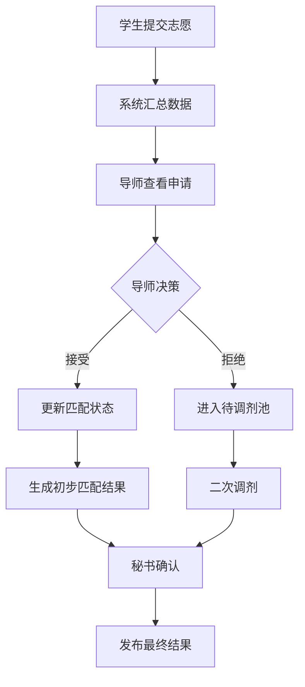
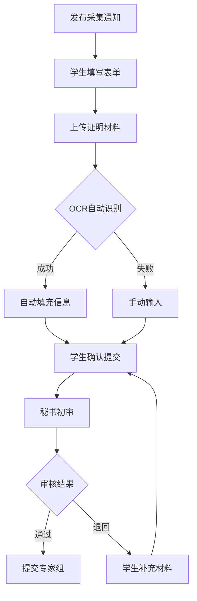
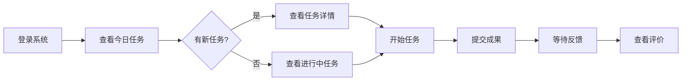
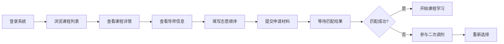
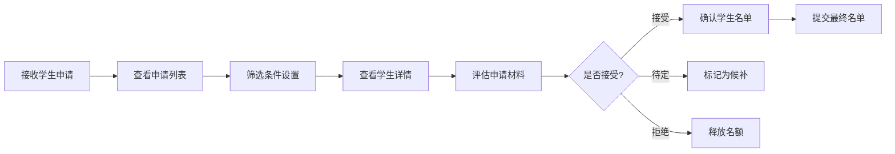
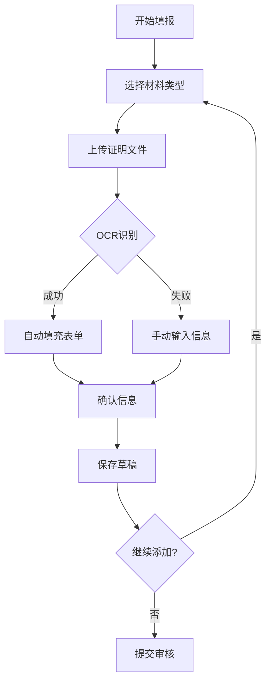
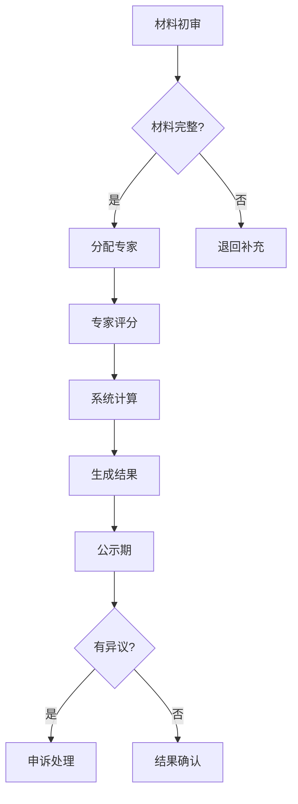

# 科研管理平台 UI/UX 设计规范文档 - 共享设计系统

## 目录
1. [设计系统概述](#1-设计系统概述)
2. [视觉设计系统](#2-视觉设计系统)
3. [组件库设计](#3-组件库设计)
4. [实验室轮转课程界面设计](#4-实验室轮转课程界面设计)
5. [综合素质评价界面设计](#5-综合素质评价界面设计)
6. [用户流程设计](#6-用户流程设计)
7. [批量操作界面设计](#7-批量操作界面设计)
8. [通知与提醒系统设计](#8-通知与提醒系统设计)
9. [数据分析与报告系统](#9-数据分析与报告系统)
10. [交互设计规范](#10-交互设计规范)
11. [响应式设计](#11-响应式设计)
12. [数据可视化设计](#12-数据可视化设计)
13. [无障碍设计](#13-无障碍设计)
14. [设计交付规范](#14-设计交付规范)
15. [创新功能模块设计](#15-创新功能模块设计)
16. [实施计划建议](#16-实施计划建议)
17. [协作功能](#17-协作功能)

---

## 1. 设计系统概述

### 1.1 设计原则
- **简洁性**: 界面清晰，功能明确，减少认知负担
- **一致性**: 统一的视觉语言和交互模式
- **高效性**: 优化工作流程，提升操作效率
- **可访问性**: 支持多种使用场景和用户群体
- **响应式**: 适配多种设备和屏幕尺寸

### 1.2 设计语言
采用现代简约的设计风格，结合教育科技特点，营造专业、可信赖的视觉体验。

---

## 2. 视觉设计系统

### 2.1 色彩系统

#### 2.1.1 主色调
```scss
// 品牌色
$primary-blue: #1890FF;      // 主色 - 科技蓝
$primary-hover: #40A9FF;     // 主色悬停态
$primary-active: #096DD9;    // 主色激活态
$primary-light: #E6F7FF;     // 主色浅色背景

// 功能色
$success-green: #52C41A;     // 成功
$warning-orange: #FAAD14;    // 警告
$error-red: #F5222D;         // 错误
$info-blue: #1890FF;         // 信息

// 中性色
$gray-1: #FFFFFF;            // 纯白
$gray-2: #FAFAFA;            // 背景
$gray-3: #F5F5F5;            // 卡片背景
$gray-4: #E8E8E8;            // 边框
$gray-5: #D9D9D9;            // 分割线
$gray-6: #BFBFBF;            // 禁用
$gray-7: #8C8C8C;            // 次要文本
$gray-8: #595959;            // 正文
$gray-9: #262626;            // 标题
$gray-10: #000000;           // 纯黑
```

#### 2.1.2 色彩使用规范
- **主色应用**: 主要操作按钮、选中状态、链接
- **辅助色应用**: 状态提示、标签分类、数据可视化
- **中性色应用**: 背景、边框、文本、分割线

### 2.2 字体系统

#### 2.2.1 字体家族
```css
/* 中文字体栈 */
--font-family-cn: "PingFang SC", "Hiragino Sans GB", "Microsoft YaHei", 
                  "WenQuanYi Micro Hei", "Helvetica Neue", Arial, sans-serif;

/* 英文/数字字体栈 */
--font-family-en: "SF Pro Display", "Helvetica Neue", Arial, sans-serif;

/* 等宽字体（代码） */
--font-family-mono: "SF Mono", "Monaco", "Consolas", "Courier New", monospace;
```

#### 2.2.2 字体大小与行高
```scss
// 字体大小
$font-size-xs: 12px;     // 辅助文字
$font-size-sm: 14px;     // 正文
$font-size-md: 16px;     // 副标题
$font-size-lg: 18px;     // 标题
$font-size-xl: 20px;     // 大标题
$font-size-xxl: 24px;    // 特大标题

// 行高
$line-height-tight: 1.3;   // 紧凑
$line-height-normal: 1.5;  // 常规
$line-height-relaxed: 1.7; // 宽松
```

#### 2.2.3 字重规范
```scss
$font-weight-light: 300;
$font-weight-normal: 400;
$font-weight-medium: 500;
$font-weight-semibold: 600;
$font-weight-bold: 700;
```

### 2.3 间距系统

#### 2.3.1 基础间距单位
```scss
$spacing-unit: 8px;    // 基础单位

// 间距规格
$spacing-xs: 4px;      // 0.5x
$spacing-sm: 8px;      // 1x
$spacing-md: 16px;     // 2x
$spacing-lg: 24px;     // 3x
$spacing-xl: 32px;     // 4x
$spacing-xxl: 48px;    // 6x
$spacing-xxxl: 64px;   // 8x
```

#### 2.3.2 布局网格
- **桌面端**: 24栏网格系统，栏宽灵活
- **平板端**: 12栏网格系统
- **移动端**: 4栏网格系统

### 2.4 圆角系统
```scss
$border-radius-sm: 2px;    // 小圆角
$border-radius-md: 4px;    // 中圆角
$border-radius-lg: 8px;    // 大圆角
$border-radius-xl: 16px;   // 特大圆角
$border-radius-full: 50%;  // 圆形
```

### 2.5 阴影系统
```scss
// 阴影层级
$shadow-1: 0 1px 2px rgba(0, 0, 0, 0.05);      // 轻微浮起
$shadow-2: 0 2px 8px rgba(0, 0, 0, 0.08);      // 卡片阴影
$shadow-3: 0 4px 16px rgba(0, 0, 0, 0.12);     // 弹窗阴影
$shadow-4: 0 8px 32px rgba(0, 0, 0, 0.16);     // 下拉菜单
```

### 2.6 动效系统

#### 2.6.1 过渡时间
```scss
$duration-fast: 150ms;      // 快速
$duration-normal: 250ms;    // 正常
$duration-slow: 350ms;      // 缓慢
```

#### 2.6.2 缓动函数
```scss
$ease-out: cubic-bezier(0.0, 0, 0.2, 1);
$ease-in: cubic-bezier(0.4, 0, 1, 1);
$ease-in-out: cubic-bezier(0.4, 0, 0.2, 1);
```

---

## 3. 组件库设计

### 3.1 基础组件

#### 3.1.1 按钮组件

**按钮类型**
```html
<!-- 主要按钮 -->
<button class="btn btn-primary">确认提交</button>

<!-- 次要按钮 -->
<button class="btn btn-secondary">取消</button>

<!-- 文字按钮 -->
<button class="btn btn-text">了解更多</button>

<!-- 危险按钮 -->
<button class="btn btn-danger">删除</button>

<!-- 图标按钮 -->
<button class="btn btn-icon">
  <i class="icon icon-edit"></i>
</button>
```

**按钮状态**
- 默认状态 (Default)
- 悬停状态 (Hover)
- 激活状态 (Active)
- 禁用状态 (Disabled)
- 加载状态 (Loading)

**按钮尺寸**
```scss
.btn-lg { height: 40px; padding: 0 24px; font-size: 16px; }
.btn-md { height: 32px; padding: 0 16px; font-size: 14px; }
.btn-sm { height: 24px; padding: 0 12px; font-size: 12px; }
```

#### 3.1.2 输入框组件

**基础输入框**
```html
<div class="input-wrapper">
  <label class="input-label">课程名称</label>
  <input type="text" class="input" placeholder="请输入课程名称">
  <span class="input-helper">2-50个字符</span>
</div>
```

**输入框变体**
- 文本输入框
- 密码输入框
- 数字输入框
- 文本域
- 搜索框
- 日期选择器
- 时间选择器
- 文件上传

#### 3.1.3 选择器组件

**下拉选择器**
```html
<div class="select-wrapper">
  <select class="select">
    <option>请选择</option>
    <option>选项一</option>
    <option>选项二</option>
  </select>
  <i class="icon icon-chevron-down"></i>
</div>
```

**多选框组**
```html
<div class="checkbox-group">
  <label class="checkbox">
    <input type="checkbox" value="1">
    <span class="checkbox-label">过程评价</span>
  </label>
  <label class="checkbox">
    <input type="checkbox" value="2">
    <span class="checkbox-label">海报展示</span>
  </label>
</div>
```

#### 3.1.4 表格组件

**数据表格**
```html
<table class="table">
  <thead>
    <tr>
      <th>学生姓名</th>
      <th>提交时间</th>
      <th>成绩</th>
      <th>操作</th>
    </tr>
  </thead>
  <tbody>
    <tr>
      <td>王小明</td>
      <td>2025-03-15 10:30</td>
      <td><span class="tag tag-success">85分</span></td>
      <td>
        <button class="btn btn-text">查看</button>
        <button class="btn btn-text">编辑</button>
      </td>
    </tr>
  </tbody>
</table>
```

#### 3.1.5 卡片组件

**基础卡片**
```html
<div class="card">
  <div class="card-header">
    <h3 class="card-title">课程信息</h3>
    <button class="btn btn-text">编辑</button>
  </div>
  <div class="card-body">
    <!-- 卡片内容 -->
  </div>
  <div class="card-footer">
    <button class="btn btn-primary">保存</button>
  </div>
</div>
```

### 3.2 业务组件

#### 3.2.1 课程卡片
```html
<div class="course-card">
  <div class="course-card-header">
    <span class="course-type">实验室轮转</span>
    <span class="course-status active">进行中</span>
  </div>
  <h3 class="course-title">人工智能实验室项目</h3>
  <div class="course-meta">
    <span class="meta-item">
      <i class="icon icon-user"></i> 张教授
    </span>
    <span class="meta-item">
      <i class="icon icon-calendar"></i> 8周
    </span>
  </div>
  <div class="course-progress">
    <div class="progress-bar" style="width: 75%"></div>
    <span class="progress-text">75%</span>
  </div>
  <div class="course-actions">
    <button class="btn btn-primary">查看详情</button>
  </div>
</div>
```

#### 3.2.2 任务时间线
```html
<div class="timeline">
  <div class="timeline-item completed">
    <div class="timeline-marker"></div>
    <div class="timeline-content">
      <h4>项目启动会</h4>
      <p>2025-03-01 完成</p>
    </div>
  </div>
  <div class="timeline-item active">
    <div class="timeline-marker"></div>
    <div class="timeline-content">
      <h4>文献调研</h4>
      <p>进行中 - 剩余3天</p>
    </div>
  </div>
  <div class="timeline-item">
    <div class="timeline-marker"></div>
    <div class="timeline-content">
      <h4>中期汇报</h4>
      <p>2025-04-01 待开始</p>
    </div>
  </div>
</div>
```

#### 3.2.3 进度指示器
```html
<div class="progress-indicator">
  <div class="progress-step completed">
    <span class="step-number">1</span>
    <span class="step-label">填写信息</span>
  </div>
  <div class="progress-line completed"></div>
  <div class="progress-step active">
    <span class="step-number">2</span>
    <span class="step-label">选择导师</span>
  </div>
  <div class="progress-line"></div>
  <div class="progress-step">
    <span class="step-number">3</span>
    <span class="step-label">确认匹配</span>
  </div>
</div>
```

#### 3.2.4 评分组件
```html
<div class="rating-component">
  <div class="rating-item">
    <label class="rating-label">过程表现 (30%)</label>
    <div class="rating-input">
      <input type="number" value="85" max="100">
      <span class="rating-suffix">/100分</span>
    </div>
  </div>
  <div class="rating-breakdown">
    <div class="breakdown-item">
      <span>出勤情况</span>
      <span>20/20</span>
    </div>
    <div class="breakdown-item">
      <span>任务质量</span>
      <span>35/40</span>
    </div>
  </div>
</div>
```

#### 3.2.5 导师信息卡
```html
<div class="mentor-card">
  <div class="mentor-avatar">
    
    <span class="mentor-status online"></span>
  </div>
  <div class="mentor-info">
    <h3 class="mentor-name">张教授</h3>
    <p class="mentor-lab">人工智能实验室</p>
    <div class="mentor-tags">
      <span class="tag">深度学习</span>
      <span class="tag">计算机视觉</span>
    </div>
  </div>
  <div class="mentor-stats">
    <div class="stat-item">
      <span class="stat-value">3-5</span>
      <span class="stat-label">可带学生</span>
    </div>
    <div class="stat-item">
      <span class="stat-value">12</span>
      <span class="stat-label">当前学生</span>
    </div>
  </div>
  <div class="mentor-actions">
    <button class="btn btn-primary">申请加入</button>
    <button class="btn btn-secondary">查看详情</button>
  </div>
</div>
```

### 3.3 复合组件

#### 3.3.1 双选匹配器
```html
<div class="match-selector">
  <div class="selector-panel available">
    <h3 class="panel-title">可选导师</h3>
    <div class="search-box">
      <input type="text" placeholder="搜索导师">
    </div>
    <div class="mentor-list">
      <!-- 导师列表 -->
    </div>
  </div>
  
  <div class="selector-actions">
    <button class="btn-arrow right">→</button>
    <button class="btn-arrow left">←</button>
  </div>
  
  <div class="selector-panel selected">
    <h3 class="panel-title">我的志愿</h3>
    <div class="priority-list">
      <div class="priority-item" draggable="true">
        <span class="priority-number">1</span>
        <span class="mentor-name">张教授</span>
        <button class="btn-remove">×</button>
      </div>
    </div>
  </div>
</div>
```

#### 3.3.2 任务看板
```html
<div class="task-board">
  <div class="board-column">
    <h3 class="column-title">待开始 <span class="count">3</span></h3>
    <div class="task-list">
      <div class="task-card" draggable="true">
        <h4 class="task-title">文献调研</h4>
        <p class="task-deadline">截止: 3天后</p>
        <div class="task-assignee">
          
        </div>
      </div>
    </div>
  </div>
  
  <div class="board-column">
    <h3 class="column-title">进行中 <span class="count">2</span></h3>
    <div class="task-list">
      <!-- 任务卡片 -->
    </div>
  </div>
  
  <div class="board-column">
    <h3 class="column-title">已完成 <span class="count">5</span></h3>
    <div class="task-list">
      <!-- 任务卡片 -->
    </div>
  </div>
</div>
```

#### 3.3.3 数据仪表盘
```html
<div class="dashboard-widget">
  <div class="widget-header">
    <h3 class="widget-title">学习进度统计</h3>
    <div class="widget-controls">
      <select class="time-filter">
        <option>本周</option>
        <option>本月</option>
        <option>本学期</option>
      </select>
    </div>
  </div>
  <div class="widget-body">
    <div class="chart-container">
      <!-- 图表区域 -->
    </div>
    <div class="stats-summary">
      <div class="stat-item">
        <span class="stat-value">85%</span>
        <span class="stat-label">平均完成率</span>
        <span class="stat-trend up">+5%</span>
      </div>
    </div>
  </div>
</div>
```

---

## 4. 实验室轮转课程界面设计

### 4.1 前期筹备阶段界面

#### 4.1.1 UI/UX 任务列表
| 任务名称 | 描述 | 优先级 | 复杂度 | 依赖 |
|---------|------|--------|--------|---------|
| 课程信息发布界面 | 设计富文本编辑器，支持多渠道发布 | 高 | 中等 | - |
| 导师资源管理面板 | 创建导师信息卡片系统，支持批量导入 | 高 | 复杂 | - |
| 宣讲会管理系统 | 在线预约、PPT管理、签到功能 | 中 | 中等 | 导师资源管理 |
| 课程时间轴设计 | 可视化展示整个课程周期安排 | 高 | 简单 | - |

#### 4.1.2 课程信息发布界面

**ASCII 线框图设计**
```
┌─────────────────────────────────────────────────┐
│ 发布实验室轮转课程                    [预览] [保存草稿] │
├─────────────────────────────────────────────────┤
│ ┌─ 基础信息 ─────────────────────────────────┐ │
│ │ 课程名称: [_________________________]      │ │
│ │ 课程目标: [富文本编辑器                    ] │ │
│ │ 时长: [8]周  参与对象: [本科二年级 ▼]      │ │
│ │ 考核方式: ☑ 过程评价 ☑ 海报展示 ☑ 大报告  │ │
│ └─────────────────────────────────────────┘ │
│                                                 │
│ ┌─ 发布设置 ─────────────────────────────────┐ │
│ │ 发布时间: [2025-08-15 09:00]              │ │
│ │ 发布渠道: ☑ 系统通知 ☑ 邮件 ☐ 微信群     │ │
│ │ 目标受众: [全体实验班学生 ▼]              │ │
│ └─────────────────────────────────────────┘ │
│                                                 │
│ [取消] [保存为模板] [立即发布] [定时发布]      │
└─────────────────────────────────────────────────┘
```

#### 4.1.3 导师资源汇总界面
```
┌──────────────────────────────────────────────────┐
│ 导师资源管理           [批量导入] [导出名单] [筛选] │
├──────────────────────────────────────────────────┤
│ 统计: 总导师数 25 | 可接收学生 87 | 已分配 0      │
├──────────────────────────────────────────────────┤
│ ┌─────────────────┐ ┌─────────────────┐         │
│ │ [导师照片]      │ │ [导师照片]      │         │
│ │                 │ │                 │         │
│ │ 张教授          │ │ 李教授          │         │
│ │ 人工智能实验室  │ │ 生物信息学实验室│         │
│ │ 研究方向:       │ │ 研究方向:       │         │
│ │ • 深度学习      │ │ • 基因组学      │         │
│ │ • 计算机视觉    │ │ • 蛋白质组学    │         │
│ │                 │ │                 │         │
│ │ 可带学生: 3-5人 │ │ 可带学生: 2-4人 │         │
│ │ 已确认: ✓       │ │ 待确认         │         │
│ │                 │ │                 │         │
│ │ [查看详情][编辑]│ │ [查看详情][编辑]│         │
│ └─────────────────┘ └─────────────────┘         │
└──────────────────────────────────────────────────┘
```

### 4.2 双选匹配阶段界面

#### 4.2.1 UI/UX 任务列表
| 任务名称 | 描述 | 优先级 | 复杂度 | 依赖 |
|---------|------|--------|--------|---------|
| 学生志愿填报界面 | 支持拖拽排序，实时保存 | 高 | 中等 | - |
| 导师筛选工作台 | 批量查看申请，快速决策 | 高 | 复杂 | - |
| 匹配算法可视化 | 展示匹配过程和结果 | 中 | 复杂 | - |
| 调剂管理系统 | 二次分配和手动调整 | 高 | 中等 | 匹配算法 |

#### 4.2.2 学生志愿填报界面
```
┌─────────────────────────────────────────────────┐
│ 填报导师志愿              步骤 2/3  [保存并继续] │
├─────────────────────────────────────────────────┤
│ 可选导师列表                    我的志愿序列     │
│ ┌─────────────────────┐      ┌────────────────┐│
│ │ 搜索: [_____] [筛选]│      │ 第一志愿       ││
│ │                     │      │ [张教授-AI]    ││
│ │ [李教授-生物]  [+] │      │                ││
│ │ 匹配度: 85%        │      │ 第二志愿       ││
│ │                     │ ───> │ [王教授-材料]  ││
│ │ [陈教授-化学]  [+] │      │                ││
│ │ 匹配度: 78%        │      │ 第三志愿       ││
│ │                     │      │ [空]           ││
│ │ [刘教授-物理]  [+] │      └────────────────┘│
│ │ 匹配度: 72%        │      提示：拖拽调整顺序│
│ └─────────────────────┘                        │
│                                                 │
│ ┌─ 申请理由（第一志愿）────────────────────┐ │
│ │ [请详细说明选择该导师的原因...         ] │ │
│ │ 字数: 0/500                              │ │
│ └─────────────────────────────────────────┘ │
└─────────────────────────────────────────────────┘
```

#### 4.2.3 导师筛选工作台
```
┌──────────────────────────────────────────────────┐
│ 学生申请管理     收到申请: 12 | 已处理: 5 | 待定: 7 │
├──────────────────────────────────────────────────┤
│ [全部] [第一志愿] [待处理] [已接受] [已拒绝]     │
├──────────────────────────────────────────────────┤
│ ☐ 批量操作 ▼                                    │
│ ┌────────────────────────────────────────────┐ │
│ │ ☐ 王小明 | 第一志愿 | GPA: 3.8            │ │
│ │   申请理由: 对深度学习很感兴趣...          │ │
│ │   [查看详情] [接受] [待定] [拒绝]         │ │
│ ├────────────────────────────────────────────┤ │
│ │ ☐ 李小红 | 第二志愿 | GPA: 3.6            │ │
│ │   申请理由: 希望学习计算机视觉...          │ │
│ │   [查看详情] [接受] [待定] [拒绝]         │ │
│ └────────────────────────────────────────────┘ │
│ 名额使用: 2/5  [确认选择] [导出名单]            │
└──────────────────────────────────────────────────┘
```

#### 4.2.4 数据流程图


### 4.3 过程管理阶段界面

#### 4.3.1 UI/UX 任务列表
| 任务名称 | 描述 | 优先级 | 复杂度 | 依赖 |
|---------|------|--------|--------|---------|
| 任务发布系统 | 支持任务书模板，明确周目标 | 高 | 中等 | - |
| 进度追踪看板 | 可视化任务状态，甘特图展示 | 高 | 复杂 | - |
| 周会管理界面 | 会议安排、记录、反馈一体化 | 中 | 中等 | - |
| 学习报告提交 | 结构化表单，支持多媒体附件 | 高 | 简单 | - |
| 即时通讯集成 | 师生实时沟通，消息归档 | 中 | 复杂 | - |

#### 4.3.2 导师任务发布界面
```
┌─────────────────────────────────────────────────┐
│ 发布任务                          [使用模板 ▼] │
├─────────────────────────────────────────────────┤
│ 任务标题: [第3周：文献调研与综述撰写_______]   │
│                                                 │
│ ┌─ 任务详情 ─────────────────────────────────┐ │
│ │ 目标描述:                                  │ │
│ │ [阅读10篇核心文献，完成3000字综述    ]    │ │
│ │                                            │ │
│ │ 具体要求:                                  │ │
│ │ • 文献需包含近3年顶会论文                  │ │
│ │ • 综述需包含研究背景、现状、趋势           │ │
│ │ • 提交PPT汇报材料                         │ │
│ │                                            │ │
│ │ 截止时间: [2025-09-01 23:59]              │ │
│ │ 分配给: [全组成员 ▼] [+指定成员]          │ │
│ └─────────────────────────────────────────┘ │
│                                                 │
│ ┌─ 评分标准 ─────────────────────────────────┐ │
│ │ ☑ 文献质量 (30%)  ☑ 综述深度 (40%)       │ │
│ │ ☑ 汇报表现 (20%)  ☑ 按时提交 (10%)       │ │
│ └─────────────────────────────────────────┘ │
│                                                 │
│ [取消] [保存为模板] [发布任务]                  │
└─────────────────────────────────────────────────┘
```

#### 4.3.3 学生任务看板
```
┌──────────────────────────────────────────────────┐
│ 我的任务看板        本周进度: 60%  [日历视图]    │
├──────────────────────────────────────────────────┤
│   待开始           进行中           已完成        │
│ ┌─────────┐    ┌─────────┐    ┌─────────┐     │
│ │文献调研 │    │实验设计 │    │开题报告 │     │
│ │截止:9/1│    │进度:40% │    │已评分   │     │
│ │ [开始] │    │ [继续] │    │ 85分    │     │
│ └─────────┘    └─────────┘    └─────────┘     │
│                                                  │
│ ┌─ 本周重点任务：实验设计 ──────────────────┐ │
│ │ 进度追踪: ████████░░░░░░ 40%              │ │
│ │ 已用时间: 12小时 | 预计剩余: 18小时        │ │
│ │                                            │ │
│ │ 子任务清单:                                │ │
│ │ ☑ 确定实验目标                            │ │
│ │ ☑ 选择实验方法                            │ │
│ │ ☐ 设计实验流程                            │ │
│ │ ☐ 准备实验材料                            │ │
│ │                                            │ │
│ │ [添加笔记] [上传文件] [请求指导]           │ │
│ └─────────────────────────────────────────┘ │
└──────────────────────────────────────────────────┘
```

#### 4.3.4 师生互动界面
```
┌──────────────────────────────────────────────────┐
│ 与张教授的讨论         [视频通话] [查看历史]     │
├──────────────────────────────────────────────────┤
│ ┌──────────────────────────────────────────┐   │
│ │ 学生：关于实验设计，我有几个问题...       │   │
│ │ [附件：实验方案v1.pdf]                    │   │
│ │                                  10:30 AM │   │
│ ├──────────────────────────────────────────┤   │
│ │ 导师：方案整体不错，但需要注意以下几点:   │   │
│ │ 1. 样本量需要增加到30个                  │   │
│ │ 2. 对照组设置需要更严格                  │   │
│ │ [语音消息 2:30]                 11:15 AM │   │
│ └──────────────────────────────────────────┘   │
│                                                  │
│ [输入消息...                          ] [发送]   │
│ [📎] [🎤] [📷]                                  │
└──────────────────────────────────────────────────┘
```

#### 4.3.5 进度时间轴可视化
```
┌──────────────────────────────────────────────────┐
│ 轮转进度时间轴                    第4周/8周       │
├──────────────────────────────────────────────────┤
│  第1周    第2周    第3周    第4周    ...   第8周  │
│   ●───────●───────●───────◉───────○───────○     │
│   |       |       |       |                      │
│   |       |       |       └─ 当前位置            │
│   |       |       └─ 中期汇报(已完成)            │
│   |       └─ 实验开始                           │
│   └─ 项目启动会                                 │
│                                                  │
│ 里程碑事件:                                      │
│ • ✓ 项目启动会 (第1周)                          │
│ • ✓ 文献综述提交 (第2周)                        │
│ • ✓ 中期汇报 (第3周)                           │
│ • ⚡ 实验数据收集 (第4-6周) ← 进行中            │
│ • ○ 成果海报制作 (第7周)                        │
│ • ○ 终期答辩 (第8周)                           │
└──────────────────────────────────────────────────┘
```

### 4.4 成果验收阶段界面

#### 4.4.1 UI/UX 任务列表
| 任务名称 | 描述 | 优先级 | 复杂度 | 依赖 |
|---------|------|--------|--------|---------|
| 海报制作工具 | 在线设计，模板支持 | 高 | 复杂 | - |
| 大报告提交系统 | 结构化模板，版本管理 | 高 | 中等 | - |
| 答辩安排系统 | 时间地点管理，评委分配 | 高 | 中等 | - |
| 在线答辩平台 | 视频答辩，实时互动 | 中 | 复杂 | - |
| 成果展示墙 | 公开展示优秀作品 | 低 | 简单 | - |

#### 4.4.2 海报制作界面
```
┌──────────────────────────────────────────────────┐
│ 海报设计器                 [保存] [预览] [提交]  │
├──────────────────────────────────────────────────┤
│ 工具栏: [T文字] [□图形] [🖼图片] [📊图表] [↶撤销]│
├──────────────────────────────────────────────────┤
│ ┌────────────────────────┐ ┌─ 属性面板 ────┐  │
│ │                        │ │ 选中元素：标题 │  │
│ │    研究海报标题        │ │ 字体: [黑体 ▼] │  │
│ │    ━━━━━━━━━━        │ │ 大小: [36px]   │  │
│ │                        │ │ 颜色: [■]      │  │
│ │  ┌─────┐  ┌─────┐    │ │ 对齐: [居中]   │  │
│ │  │图表1│  │图表2│    │ └───────────────┘  │
│ │  └─────┘  └─────┘    │ ┌─ 模板库 ──────┐  │
│ │                        │ │ [学术海报1]   │  │
│ │  研究方法：            │ │ [学术海报2]   │  │
│ │  • 实验设计            │ │ [简约风格]    │  │
│ │  • 数据分析            │ │ [+自定义]     │  │
│ │                        │ └───────────────┘  │
│ └────────────────────────┘                    │
│ 协作者: 👤张同学(在线) 👤李同学(5分钟前)        │
└──────────────────────────────────────────────────┘
```

#### 4.4.3 大报告提交界面
```
┌──────────────────────────────────────────────────┐
│ 提交研究报告                    截止: 3天12小时  │
├──────────────────────────────────────────────────┤
│ ┌─ 报告结构（必填项标*）─────────────────────┐ │
│ │ 1. 研究背景* [✓已完成]                     │ │
│ │ 2. 文献综述* [✓已完成]                     │ │
│ │ 3. 研究方法* [⚡编辑中...]                  │ │
│ │ 4. 实验过程* [○待填写]                     │ │
│ │ 5. 结果分析* [○待填写]                     │ │
│ │ 6. 结论与展望* [○待填写]                   │ │
│ │ 7. 参考文献* [15/10条]                     │ │
│ │ 8. 附录 [可选]                             │ │
│ └─────────────────────────────────────────┘ │
│                                                 │
│ 完成度: ████████░░░░░░░░ 45%                   │
│ 字数统计: 4,532 / 10,000字                     │
│                                                 │
│ [导入Word] [自动排版] [检查格式] [保存草稿] [提交]│
└──────────────────────────────────────────────────┘
```

#### 4.4.4 答辩安排界面
```
┌──────────────────────────────────────────────────┐
│ 答辩安排                          [导出日程]     │
├──────────────────────────────────────────────────┤
│ 我的答辩信息                                     │
│ ┌────────────────────────────────────────────┐ │
│ │ 时间: 2025-10-15 14:30-15:00               │ │
│ │ 地点: 理学楼 A301 / 在线会议室             │ │
│ │ 形式: 线下 + 线上混合                      │ │
│ │ 评委: 张教授(主席)、李教授、王教授         │ │
│ │ 要求: 15分钟展示 + 10分钟问答              │ │
│ │                                            │ │
│ │ [加入在线会议] [下载答辩须知] [模拟答辩]   │ │
│ └────────────────────────────────────────────┘ │
│                                                 │
│ 答辩顺序                                        │
│ 13:30 王小明 - 深度学习在医学图像中的应用      │
│ 14:00 李小红 - 基因编辑技术研究                │
│ 14:30 我 - 新材料合成与表征 ←                  │
│ 15:00 陈小华 - 量子计算算法优化                │
└──────────────────────────────────────────────────┘
```

### 4.5 成绩评定阶段界面

#### 4.5.1 UI/UX 任务列表
| 任务名称 | 描述 | 优先级 | 复杂度 | 依赖 |
|---------|------|--------|--------|---------|
| 多维度评分表 | 过程、海报、报告、答辩分项打分 | 高 | 中等 | - |
| 评分标准配置 | 灵活设置各项权重 | 高 | 简单 | - |
| 批量评分界面 | 提高导师评分效率 | 高 | 中等 | - |
| 成绩查询系统 | 学生查看详细反馈 | 高 | 简单 | - |
| 成绩分析报告 | 自动生成统计分析 | 中 | 中等 | - |

#### 4.5.2 导师评分工作台
```
┌──────────────────────────────────────────────────┐
│ 成绩评定 - 实验室轮转        待评: 8 已评: 12   │
├──────────────────────────────────────────────────┤
│ 当前评分: 王小明                   [上一个][下一个]│
├──────────────────────────────────────────────────┤
│ ┌─ 评分项目 ────────────────────────────────┐ │
│ │ 过程表现 (30%)           [85] /100 分      │ │
│ │ • 出勤情况      [20/20]                    │ │
│ │ • 任务完成质量  [35/40]                    │ │
│ │ • 团队协作      [30/40]                    │ │
│ │                                            │ │
│ │ 海报质量 (20%)           [90] /100 分      │ │
│ │ • 设计美观      [25/30]                    │ │
│ │ • 内容完整      [35/40]                    │ │
│ │ • 创新性        [30/30]                    │ │
│ │                                            │ │
│ │ 大报告内容 (30%)         [88] /100 分      │ │
│ │ 答辩表现 (20%)           [92] /100 分      │ │
│ └─────────────────────────────────────────┘ │
│                                                 │
│ 总分: 87.4 分  等级: A-  [重新计算]            │
│                                                 │
│ 评语: [学生表现优秀，研究思路清晰...]          │
│                                                 │
│ [保存草稿] [提交成绩] [导出成绩单]             │
└──────────────────────────────────────────────────┘
```

### 4.6 小功能模块设计

#### 4.6.1 Intro Session 管理
```
┌──────────────────────────────────────────────────┐
│ Intro Session 管理              [新建宣讲会]    │
├──────────────────────────────────────────────────┤
│ 参与教授指定                                     │
│ ☑ 张教授 - AI实验室    PPT: ✓已上传            │
│ ☑ 李教授 - 生物实验室  PPT: ⚡上传中            │
│ ☐ 王教授 - 材料实验室  PPT: ✗未上传            │
│                                                 │
│ 学生预约查看 (25/30人已预约)                    │
│ 时间: 2025-08-20 14:00-16:00                   │
│ 地点: 教学楼A101 + 线上直播                     │
└──────────────────────────────────────────────────┘
```

#### 4.6.2 Milestone Report 提交
```
┌──────────────────────────────────────────────────┐
│ 里程碑报告                     第2个里程碑/共4个 │
├──────────────────────────────────────────────────┤
│ M1: 项目启动 ✓已完成 (95分)                     │
│ M2: 中期进展 ⚡进行中 (截止: 5天后)             │
│ M3: 实验完成 ○未开始                            │
│ M4: 最终报告 ○未开始                            │
│                                                 │
│ 当前里程碑: 中期进展报告                        │
│ [在线填写表单] [上传文档] [查看要求]            │
└──────────────────────────────────────────────────┘
```

---

## 5. 综合素质评价界面设计

### 5.1 评价准备阶段界面

#### 5.1.1 UI/UX 任务列表
| 任务名称 | 描述 | 优先级 | 复杂度 | 依赖 |
|---------|------|--------|--------|---------|
| 评价方案发布 | 清晰展示评价维度和权重 | 高 | 简单 | - |
| 专家组管理 | 专家邀请、权限分配 | 高 | 中等 | - |
| 评价标准配置 | 可视化权重设置界面 | 高 | 中等 | - |
| 时间线规划 | 各阶段时间节点管理 | 中 | 简单 | - |

#### 5.1.2 评价方案配置界面
```
┌──────────────────────────────────────────────────┐
│ 综合素质评价方案设置              [预览] [发布]  │
├──────────────────────────────────────────────────┤
│ 基本信息                                         │
│ 评价对象: [2023级实验班 ▼]  周期: [2025学年]   │
│                                                  │
│ ┌─ 评价维度权重配置 ─────────────────────────┐ │
│ │ 思想品德 ────────── [20]%                 │ │
│ │ 课程成绩 ────────── [40]%                 │ │
│ │ 科技创新 ────────── [25]%                 │ │
│ │ 科研推进 ────────── [15]%                 │ │
│ │                          总计: 100%       │ │
│ └─────────────────────────────────────────┘ │
│                                                  │
│ ┌─ 评价细则 ─────────────────────────────────┐ │
│ │ 思想品德:                                  │ │
│ │ • 社会实践参与度 (40%)                     │ │
│ │ • 集体活动贡献 (30%)                       │ │
│ │ • 导师评价 (30%)                          │ │
│ │ [+添加细则]                               │ │
│ └─────────────────────────────────────────┘ │
└──────────────────────────────────────────────────┘
```

#### 5.1.3 专家组管理界面
```
┌──────────────────────────────────────────────────┐
│ 专家组成员管理                    [邀请专家]     │
├──────────────────────────────────────────────────┤
│ 当前专家组 (4/5人)                              │
│ ┌────────────────────────────────────────────┐ │
│ │ 👤 张教授 - 组长                           │ │
│ │    负责: 科技创新评审                      │ │
│ │    状态: ✓已确认                          │ │
│ ├────────────────────────────────────────────┤ │
│ │ 👤 李教授 - 成员                           │ │
│ │    负责: 科研推进评审                      │ │
│ │    状态: ✓已确认                          │ │
│ ├────────────────────────────────────────────┤ │
│ │ 👤 王教授 - 成员                           │ │
│ │    负责: 思想品德评审                      │ │
│ │    状态: ⚡待确认                         │ │
│ └────────────────────────────────────────────┘ │
│ [批量分配任务] [设置评审规则] [导出名单]        │
└──────────────────────────────────────────────────┘
```

### 5.2 信息采集阶段界面

#### 5.2.1 UI/UX 任务列表
| 任务名称 | 描述 | 优先级 | 复杂度 | 依赖 |
|---------|------|--------|--------|---------|
| 信息采集表设计 | 动态表单，支持多类型材料 | 高 | 复杂 | - |
| 材料上传系统 | 批量上传，自动分类 | 高 | 中等 | - |
| OCR识别集成 | 自动提取证书信息 | 中 | 复杂 | - |
| 初审工作台 | 秘书快速审核界面 | 高 | 中等 | - |
| 进度追踪面板 | 实时显示提交状态 | 中 | 简单 | - |

#### 5.2.2 学生信息填报界面
```
┌──────────────────────────────────────────────────┐
│ 综合素质信息采集          完成度: 75%  [暂存]    │
├──────────────────────────────────────────────────┤
│ ◉ 基本信息 ◉ 竞赛获奖 ◉ 科研项目 ○ 社会实践    │
├──────────────────────────────────────────────────┤
│ 竞赛获奖信息                      [+添加获奖]    │
│ ┌────────────────────────────────────────────┐ │
│ │ 1. 全国大学生数学建模竞赛                  │ │
│ │    级别: [国家级 ▼]  奖项: [一等奖 ▼]     │ │
│ │    时间: [2025-05]   角色: [队长 ▼]       │ │
│ │    证明材料: [certificate.pdf] ✓已识别     │ │
│ │    [编辑] [删除]                          │ │
│ ├────────────────────────────────────────────┤ │
│ │ 2. ACM程序设计竞赛                        │ │
│ │    [拖拽文件到此处或点击上传]              │ │
│ │    支持格式: PDF, JPG, PNG (最大5MB)       │ │
│ └────────────────────────────────────────────┘ │
│                                                  │
│ OCR智能识别结果:                                 │
│ ✓ 竞赛名称已识别  ✓ 获奖等级已识别  ⚡ 请确认日期│
│                                                  │
│ [上一步] [保存草稿] [下一步：科研项目]          │
└──────────────────────────────────────────────────┘
```

#### 5.2.3 秘书初审工作台
```
┌──────────────────────────────────────────────────┐
│ 材料初审管理      待审: 45 | 已审: 120 | 退回: 8 │
├──────────────────────────────────────────────────┤
│ 快速筛选: [全部 ▼] [待审核] [有疑问] [已通过]   │
├──────────────────────────────────────────────────┤
│ ┌─ 批量审核模式 ─────────────────────────────┐ │
│ │ ☑ 王小明 - 竞赛获奖3项, 科研2项           │ │
│ │   ⚠ 证书日期模糊，需要确认                │ │
│ │   [快速通过] [标记问题] [查看详情]        │ │
│ ├───────────────────────────────────────────┤ │
│ │ ☑ 李小红 - 竞赛获奖5项, 社会实践4项       │ │
│ │   ✓ 材料完整，信息清晰                   │ │
│ │   [快速通过] [标记问题] [查看详情]        │ │
│ └─────────────────────────────────────────┘ │
│                                                  │
│ 批量操作: [全选] [通过选中] [退回选中]          │
│                                                  │
│ AI辅助提示: 发现3份材料可能存在重复提交         │
└──────────────────────────────────────────────────┘
```

#### 5.2.4 数据流程图


### 5.3 多维度评价阶段界面

#### 5.3.1 UI/UX 任务列表
| 任务名称 | 描述 | 优先级 | 复杂度 | 依赖 |
|---------|------|--------|--------|---------|
| 分维度评分界面 | 思想品德、科技创新等分项评分 | 高 | 中等 | - |
| 成绩导入系统 | 自动同步校内成绩系统 | 高 | 复杂 | - |
| 专家评审平台 | 支持多人协同评审 | 高 | 复杂 | - |
| 评分校准工具 | 确保评分标准一致性 | 中 | 中等 | - |
| 实时统计面板 | 显示评审进度和分布 | 中 | 简单 | - |

#### 5.3.2 专家评审工作台
```
┌──────────────────────────────────────────────────┐
│ 科技创新维度评审          已评: 23/50  [评分指南]│
├──────────────────────────────────────────────────┤
│ 当前学生: 王小明          [上一个] [下一个]      │
├──────────────────────────────────────────────────┤
│ ┌─ 竞赛获奖 (40%) ───────────────────────────┐ │
│ │ • 国家级一等奖 × 2  → 40分                 │ │
│ │ • 省级二等奖 × 1    → 15分                 │ │
│ │ 小计: [55/40] 分 (超出部分按40分计)        │ │
│ ├─────────────────────────────────────────────┤ │
│ │ ┌─ 科研项目 (30%) ─────────────────────┐   │ │
│ │ │ • 国家级大创项目(负责人) → 25分      │   │ │
│ │ │ • 发表论文1篇(第二作者) → 10分       │   │ │
│ │ │ 小计: [35/30] 分                     │   │ │
│ │ └─────────────────────────────────────┘   │ │
│ ├─────────────────────────────────────────────┤ │
│ │ ┌─ 创新能力 (30%) - 专家评分 ─────────┐   │ │
│ │ │ 创新思维: ●●●●● [25/30]              │   │ │
│ │ │ 实践能力: ●●●●○ [22/30]              │   │ │
│ │ │ 发展潜力: ●●●●● [28/30]              │   │ │
│ │ │ 专家评语: [思维活跃，实践能力...]    │   │ │
│ │ └─────────────────────────────────────┘   │ │
│ └─────────────────────────────────────────────┘ │
│ 本维度得分: 92.5/100  [确认评分] [暂存]         │
└──────────────────────────────────────────────────┘
```

#### 5.3.3 思想品德评价界面
```
┌──────────────────────────────────────────────────┐
│ 思想品德评价表                    导师：张教授   │
├──────────────────────────────────────────────────┤
│ 学生：李小红                                     │
│ ┌────────────────────────────────────────────┐ │
│ │ 评价项目                    评分(满分10)    │ │
│ │ ─────────────────────────────────────────  │ │
│ │ 社会责任感                  [9] ●●●●●●●●●○ │ │
│ │ 团队协作精神                [8] ●●●●●●●●○○ │ │
│ │ 学术诚信                    [10]●●●●●●●●●● │ │
│ │ 公益活动参与                [7] ●●●●●●●○○○ │ │
│ │ 集体荣誉感                  [9] ●●●●●●●●●○ │ │
│ └────────────────────────────────────────────┘ │
│                                                  │
│ 综合评语:                                        │
│ [该生品德优良，积极参与集体活动，有较强的      ] │
│ [社会责任感。建议多参与志愿服务活动。          ] │
│                                                  │
│ 总分: 86/100  [提交评价] [保存草稿]            │
└──────────────────────────────────────────────────┘
```

### 5.4 综合核算阶段界面

#### 5.4.1 UI/UX 任务列表
| 任务名称 | 描述 | 优先级 | 复杂度 | 依赖 |
|---------|------|--------|--------|---------|
| 自动计算引擎 | 按权重自动汇总各维度分数 | 高 | 中等 | 所有评分完成 |
| 成绩预览界面 | 实时查看计算结果 | 高 | 简单 | - |
| 异常检测系统 | 标记异常分数供复核 | 中 | 中等 | - |
| 审核确认流程 | 专家组最终审核界面 | 高 | 简单 | - |
| 成绩锁定机制 | 防止误操作修改 | 高 | 简单 | - |

#### 5.4.2 综合成绩计算界面
```
┌──────────────────────────────────────────────────┐
│ 综合素质评价 - 成绩核算         [重新计算] [导出]│
├──────────────────────────────────────────────────┤
│ 计算规则预览                                     │
│ 思想品德(20%) + 课程成绩(40%) + 科技创新(25%)   │
│ + 科研推进(15%) = 总分(100%)                    │
├──────────────────────────────────────────────────┤
│ ┌─ 成绩分布统计 ────────────────────────────┐ │
│ │     A级      B级      C级      D级         │ │
│ │   (90-100) (80-89) (70-79)  (60-69)       │ │
│ │    ████     ████     ███      ██          │ │
│ │    15人     28人     12人     5人         │ │
│ │    25%      47%      20%      8%          │ │
│ └───────────────────────────────────────────┘ │
│                                                  │
│ ┌─ 异常提示 ────────────────────────────────┐ │
│ │ ⚠ 发现3名学生分数异常:                    │ │
│ │ • 王某某 - 科技创新维度异常高(>95)        │ │
│ │ • 李某某 - 各维度差异过大(>30分)          │ │
│ │ [查看详情] [标记已处理]                   │ │
│ └───────────────────────────────────────────┘ │
└──────────────────────────────────────────────────┘
```

### 5.5 结果应用阶段界面

#### 5.5.1 UI/UX 任务列表
| 任务名称 | 描述 | 优先级 | 复杂度 | 依赖 |
|---------|------|--------|--------|---------|
| 成绩公示系统 | 分级展示，保护隐私 | 高 | 中等 | - |
| 申诉管理平台 | 在线提交和处理申诉 | 高 | 中等 | - |
| 实验班筛选工具 | 根据成绩自动筛选 | 高 | 简单 | - |
| 档案归档系统 | 永久保存评价材料 | 中 | 中等 | - |
| 报告生成器 | 自动生成各类报告 | 中 | 复杂 | - |

#### 5.5.2 成绩公示界面
```
┌──────────────────────────────────────────────────┐
│ 2025年度综合素质评价结果公示    公示期: 7天      │
├──────────────────────────────────────────────────┤
│ 查询方式: [按姓名] [按学号] [按等级]            │
│ 查询: [___________] [查询]                      │
├──────────────────────────────────────────────────┤
│ 公示结果 (仅显示等级)                           │
│ ┌────────────────────────────────────────────┐ │
│ │ 学号      姓名    等级   是否入选实验班    │ │
│ │ ────────────────────────────────────────── │ │
│ │ 2023****  王*明    A      ✓ 已入选        │ │
│ │ 2023****  李*红    A-     ✓ 已入选        │ │
│ │ 2023****  张*华    B+     ○ 候补第3位     │ │
│ │ 2023****  陈*      B      ✗ 未入选        │ │
│ └────────────────────────────────────────────┘ │
│                                                  │
│ [我要申诉] [下载公示名单] [查看评价标准]        │
│                                                  │
│ 申诉截止时间: 2025-11-20 17:00                  │
└──────────────────────────────────────────────────┘
```

#### 5.5.3 申诉处理界面
```
┌──────────────────────────────────────────────────┐
│ 申诉管理中心              待处理: 5 | 已处理: 12 │
├──────────────────────────────────────────────────┤
│ ┌────────────────────────────────────────────┐ │
│ │ 申诉编号: #20251115001                     │ │
│ │ 申诉人: 陈某某                             │ │
│ │ 申诉类型: 科技创新分数异议                 │ │
│ │ 申诉理由: 省级竞赛获奖未被正确计入...      │ │
│ │ 补充材料: [获奖证书.pdf] [项目证明.docx]   │ │
│ │                                            │ │
│ │ 处理状态: ⚡ 专家组复核中                  │ │
│ │ 处理人: 李教授                             │ │
│ │ 处理意见: [填写处理意见...]                │ │
│ │                                            │ │
│ │ [接受申诉] [驳回申诉] [需要补充材料]       │ │
│ └────────────────────────────────────────────┘ │
└──────────────────────────────────────────────────┘
```

---

## 6. 用户流程设计

### 6.1 核心用户流程设计

#### 6.1.1 学生端核心流程

**日常学习流程**


**师生互动流程**
1. **提问流程**
   - AI 预检问题质量
   - 推荐相关资料
   - 智能路由到导师
   - 追踪回复状态

2. **预约流程**
   - 查看导师日程
   - 选择时间段
   - 填写预约说明
   - 获得确认通知

#### 6.1.2 教授端核心流程

**高效评估流程**
```
批量作业 → AI 预筛选 → 重点审核 → 快速批注 → 一键发布成绩
```

**智能辅助功能**:
- AI 作业检测
  - 识别 AI 生成内容
  - 相似度检测
  - 质量评分建议
- 评分助手
  - 历史评分参考
  - 评分分布分析
  - 异常分数提醒

#### 6.1.3 秘书端核心流程

**数据收集与报告**
1. **自动化数据收集**
   - 定时数据抓取
   - 多源数据整合
   - 数据质量检查

2. **智能报告生成**
   - 使用 LLM 生成报告
   - 自定义报告模板
   - 可视化图表嵌入
   - 一键导出多格式

#### 6.1.4 领导端核心流程

**决策支持仪表盘**
- 实时数据大屏
  - 关键指标展示
  - 趋势分析图表
  - 异常情况预警
- 预测分析
  - 学生表现预测
  - 资源需求预测
  - 风险评估报告

### 6.2 实验室轮转课程流程

#### 6.2.1 学生选课流程


#### 6.2.2 导师筛选流程


### 6.3 综合素质评价流程

#### 6.3.1 材料提交流程


#### 6.3.2 评审流程


---

## 7. 批量操作界面设计

### 7.1 批量导入工具

**数据导入向导**
```
┌──────────────────────────────────────────────────┐
│ 批量数据导入向导              步骤 2/4           │
├──────────────────────────────────────────────────┤
│ 选择导入类型: [学生信息 ▼]                      │
│                                                  │
│ ┌─ 文件上传 ─────────────────────────────────┐ │
│ │ 拖拽Excel文件到此处                         │ │
│ │ 或 [选择文件]                               │ │
│ │                                             │ │
│ │ 已上传: student_list.xlsx (1.2MB)          │ │
│ │ 检测到: 150条记录                           │ │
│ └─────────────────────────────────────────────┘ │
│                                                  │
│ ┌─ 字段映射 ─────────────────────────────────┐ │
│ │ Excel列        →    系统字段               │ │
│ │ A列(姓名)      →    [学生姓名 ▼]          │ │
│ │ B列(学号)      →    [学生ID ▼]            │ │
│ │ C列(班级)      →    [所属班级 ▼]          │ │
│ │ [自动匹配]                                 │ │
│ └─────────────────────────────────────────────┘ │
│                                                  │
│ [上一步] [预览数据] [开始导入]                  │
└──────────────────────────────────────────────────┘
```

### 7.2 批量操作管理

**批量评分界面**
```
┌──────────────────────────────────────────────────┐
│ 批量评分操作                    已选: 25个作业   │
├──────────────────────────────────────────────────┤
│ ☑ 全选  筛选: [未评分] [本周提交] [按小组]      │
├──────────────────────────────────────────────────┤
│ ┌────────────────────────────────────────────┐ │
│ │ ☑ 王小明 - 实验报告3  提交: 10-15 08:30   │ │
│ │ ☑ 李小红 - 实验报告3  提交: 10-15 09:15   │ │
│ │ ☑ 张小华 - 实验报告3  提交: 10-15 10:20   │ │
│ └────────────────────────────────────────────┘ │
│                                                  │
│ ┌─ 批量评分设置 ────────────────────────────┐ │
│ │ 评分模式: ○ 统一分数 ● 区间分数           │ │
│ │ 分数范围: [85] - [95]                     │ │
│ │ 评语模板: [良好完成，继续努力 ▼]          │ │
│ │ ☑ 发送成绩通知                            │ │
│ └───────────────────────────────────────────┘ │
│                                                  │
│ [预览结果] [确认评分] [取消]                    │
└──────────────────────────────────────────────────┘
```

---

## 8. 通知与提醒系统设计

### 8.1 多渠道通知架构

**通知类型与优先级**
```
┌──────────────────────────────────────────────────┐
│ 通知管理中心                      [通知设置]     │
├──────────────────────────────────────────────────┤
│ 通知类型          渠道            触发条件       │
│ ─────────────────────────────────────────────── │
│ 🔴 紧急通知      系统+短信+邮件   答辩/截止前1天 │
│ 🟡 重要提醒      系统+邮件        作业截止前3天  │
│ 🟢 一般通知      系统通知         新任务发布     │
│ 🔵 信息更新      系统通知         成绩更新       │
└──────────────────────────────────────────────────┘
```

### 8.2 智能提醒规则引擎

**提醒配置界面**
```
┌──────────────────────────────────────────────────┐
│ 智能提醒规则设置                    [新建规则]   │
├──────────────────────────────────────────────────┤
│ 规则名称: 作业截止提醒                          │
│ ┌─ 触发条件 ─────────────────────────────────┐ │
│ │ 当 [作业截止时间] [小于] [24小时]           │ │
│ │ 且 [提交状态] [等于] [未提交]               │ │
│ │ [+添加条件]                                 │ │
│ └─────────────────────────────────────────────┘ │
│ ┌─ 执行动作 ─────────────────────────────────┐ │
│ │ ☑ 发送系统通知                             │ │
│ │ ☑ 发送邮件提醒                             │ │
│ │ ☐ 发送短信通知                             │ │
│ │ 提醒文案: [您有作业即将截止，请及时提交]    │ │
│ └─────────────────────────────────────────────┘ │
│ [保存规则] [测试规则] [查看日志]                │
└──────────────────────────────────────────────────┘
```

---

## 9. 数据分析与报告系统

### 9.1 自动报告生成器

**报告配置界面**
```
┌──────────────────────────────────────────────────┐
│ 智能报告生成器                    [报告模板库]   │
├──────────────────────────────────────────────────┤
│ 报告类型: [月度教学质量报告 ▼]                  │
│ 时间范围: [2025年10月] - [2025年10月]           │
│                                                  │
│ ┌─ 包含内容 ─────────────────────────────────┐ │
│ │ ☑ 执行摘要 (AI自动生成)                    │ │
│ │ ☑ 课程完成情况统计                         │ │
│ │ ☑ 学生成绩分析                             │ │
│ │ ☑ 导师工作量统计                           │ │
│ │ ☑ 问题与建议 (AI分析)                      │ │
│ │ ☐ 详细数据附录                             │ │
│ └─────────────────────────────────────────────┘ │
│                                                  │
│ 输出格式: ☑ PDF ☑ Word ☐ Excel ☑ PPT          │
│                                                  │
│ [预览报告] [生成报告] [定时生成]                │
└──────────────────────────────────────────────────┘
```

---

## 10. 交互设计规范

### 10.1 交互原则

#### 10.1.1 即时反馈
- 所有操作必须在 300ms 内给出反馈
- 长时间操作显示进度条或加载动画
- 成功/失败状态明确展示

#### 10.1.2 防错设计
- 危险操作需要二次确认
- 表单实时验证
- 提供操作撤销功能

#### 10.1.3 一致性
- 相同功能使用相同的交互模式
- 统一的操作手势和快捷键
- 保持视觉和行为的一致性

### 10.2 交互模式

#### 10.2.1 表单交互
```javascript
// 实时验证
input.addEventListener('blur', () => {
  if (!isValid(input.value)) {
    showError('请输入正确的格式');
  }
});

// 自动保存
let saveTimer;
input.addEventListener('input', () => {
  clearTimeout(saveTimer);
  saveTimer = setTimeout(() => {
    autoSave();
    showToast('已自动保存');
  }, 2000);
});
```

#### 10.2.2 拖拽交互
```javascript
// 拖拽排序
element.addEventListener('dragstart', (e) => {
  e.dataTransfer.effectAllowed = 'move';
  e.target.classList.add('dragging');
});

element.addEventListener('dragend', (e) => {
  e.target.classList.remove('dragging');
  updateOrder();
});
```

#### 10.2.3 加载状态
```html
<!-- 骨架屏 -->
<div class="skeleton-loader">
  <div class="skeleton-header"></div>
  <div class="skeleton-text"></div>
  <div class="skeleton-text short"></div>
</div>

<!-- 加载动画 -->
<div class="spinner">
  <div class="spinner-circle"></div>
</div>
```

### 10.3 微交互设计

#### 10.3.1 悬停效果
```css
.card {
  transition: all 0.3s ease;
}

.card:hover {
  transform: translateY(-2px);
  box-shadow: 0 4px 12px rgba(0, 0, 0, 0.1);
}
```

#### 10.3.2 点击反馈
```css
.btn {
  transition: all 0.2s ease;
}

.btn:active {
  transform: scale(0.98);
}
```

#### 10.3.3 状态切换
```css
.toggle {
  transition: background-color 0.3s ease;
}

.toggle.active {
  background-color: #1890FF;
}
```

---

## 11. 响应式设计

### 11.1 断点系统

```scss
// 断点定义
$breakpoint-xs: 320px;   // 超小屏幕
$breakpoint-sm: 576px;   // 小屏幕
$breakpoint-md: 768px;   // 中等屏幕
$breakpoint-lg: 992px;   // 大屏幕
$breakpoint-xl: 1200px;  // 超大屏幕
$breakpoint-xxl: 1600px; // 巨大屏幕

// 响应式混入
@mixin responsive($breakpoint) {
  @media screen and (min-width: $breakpoint) {
    @content;
  }
}
```

### 11.2 移动端适配

#### 11.2.1 触摸优化
```scss
// 最小触摸目标
.touch-target {
  min-width: 44px;
  min-height: 44px;
  padding: 12px;
}

// 禁用双击缩放
.no-zoom {
  touch-action: manipulation;
}
```

#### 11.2.2 手势支持
```javascript
// 滑动切换
let startX = 0;
element.addEventListener('touchstart', (e) => {
  startX = e.touches[0].clientX;
});

element.addEventListener('touchend', (e) => {
  const endX = e.changedTouches[0].clientX;
  const diff = startX - endX;
  
  if (Math.abs(diff) > 50) {
    if (diff > 0) {
      // 向左滑动
      nextPage();
    } else {
      // 向右滑动
      prevPage();
    }
  }
});
```

### 11.3 自适应布局

#### 11.3.1 弹性网格
```css
.grid {
  display: grid;
  grid-template-columns: repeat(auto-fit, minmax(300px, 1fr));
  gap: 16px;
}

@media (max-width: 768px) {
  .grid {
    grid-template-columns: 1fr;
  }
}
```

#### 11.3.2 响应式字体
```css
.responsive-text {
  font-size: clamp(14px, 2vw, 18px);
  line-height: 1.5;
}
```

---

## 12. 数据可视化设计

### 12.1 图表类型

#### 12.1.1 折线图
用于展示趋势变化
```javascript
const lineChart = {
  type: 'line',
  data: {
    labels: ['第1周', '第2周', '第3周', '第4周'],
    datasets: [{
      label: '学习进度',
      data: [20, 45, 70, 85],
      borderColor: '#1890FF',
      tension: 0.4
    }]
  },
  options: {
    responsive: true,
    plugins: {
      legend: {
        position: 'top',
      }
    }
  }
};
```

#### 12.1.2 饼图
用于展示占比关系
```javascript
const pieChart = {
  type: 'pie',
  data: {
    labels: ['优秀', '良好', '及格', '不及格'],
    datasets: [{
      data: [30, 45, 20, 5],
      backgroundColor: [
        '#52C41A',
        '#1890FF',
        '#FAAD14',
        '#F5222D'
      ]
    }]
  }
};
```

#### 12.1.3 柱状图
用于对比数据
```javascript
const barChart = {
  type: 'bar',
  data: {
    labels: ['思想品德', '课程成绩', '科技创新', '科研推进'],
    datasets: [{
      label: '得分',
      data: [85, 92, 78, 88],
      backgroundColor: '#1890FF'
    }]
  }
};
```

### 12.2 数据展示规范

#### 12.2.1 颜色使用
- 使用品牌色系
- 确保色盲友好
- 保持对比度

#### 12.2.2 标签设计
- 清晰的数据标签
- 适当的小数位数
- 单位明确标注

#### 12.2.3 交互设计
- 悬停显示详情
- 支持数据筛选
- 可导出图表

---

## 13. 无障碍设计

### 13.1 WCAG 2.1 AA 标准

#### 13.1.1 可感知性
```html
<!-- 图片替代文本 -->


<!-- 颜色对比度 -->
<style>
  .text-primary {
    color: #1890FF; /* 对比度 4.5:1 以上 */
    background: #FFFFFF;
  }
</style>
```

#### 13.1.2 可操作性
```html
<!-- 键盘导航 -->
<nav role="navigation" aria-label="主导航">
  <a href="#" tabindex="0">首页</a>
  <a href="#" tabindex="0">课程</a>
</nav>

<!-- 跳过链接 -->
<a href="#main" class="skip-link">跳到主要内容</a>
```

#### 13.1.3 可理解性
```html
<!-- 表单标签 -->
<label for="username">用户名 <span aria-label="必填">*</span></label>
<input id="username" type="text" required aria-describedby="username-help">
<span id="username-help">请输入您的学号或工号</span>

<!-- 错误提示 -->
<div role="alert" aria-live="polite">
  <p class="error">密码至少需要8个字符</p>
</div>
```

#### 13.1.4 健壮性
```html
<!-- 语义化标签 -->
<article>
  <header>
    <h1>课程标题</h1>
  </header>
  <main>
    <section>课程内容</section>
  </main>
  <footer>
    <time datetime="2025-03-15">2025年3月15日</time>
  </footer>
</article>
```

### 13.2 屏幕阅读器优化

```html
<!-- ARIA 标签 -->
<div role="progressbar" aria-valuenow="75" aria-valuemin="0" aria-valuemax="100">
  <span class="sr-only">进度：75%</span>
</div>

<!-- 动态内容通知 -->
<div aria-live="polite" aria-atomic="true">
  <p>任务已成功提交</p>
</div>
```

### 13.3 键盘导航

```javascript
// 焦点管理
const focusableElements = 'button, [href], input, select, textarea, [tabindex]:not([tabindex="-1"])';

// 焦点陷阱
function trapFocus(element) {
  const focusables = element.querySelectorAll(focusableElements);
  const firstFocusable = focusables[0];
  const lastFocusable = focusables[focusables.length - 1];
  
  element.addEventListener('keydown', (e) => {
    if (e.key === 'Tab') {
      if (e.shiftKey) {
        if (document.activeElement === firstFocusable) {
          lastFocusable.focus();
          e.preventDefault();
        }
      } else {
        if (document.activeElement === lastFocusable) {
          firstFocusable.focus();
          e.preventDefault();
        }
      }
    }
  });
}
```

---

## 14. 设计交付规范

### 14.1 设计文件组织

```
design-system/
├── 01-foundations/
│   ├── colors.sketch
│   ├── typography.sketch
│   ├── spacing.sketch
│   └── icons.sketch
├── 02-components/
│   ├── buttons.sketch
│   ├── forms.sketch
│   ├── cards.sketch
│   └── tables.sketch
├── 03-patterns/
│   ├── navigation.sketch
│   ├── layouts.sketch
│   └── workflows.sketch
├── 04-pages/
│   ├── login.sketch
│   ├── dashboard.sketch
│   └── course-management.sketch
└── 05-documentation/
    ├── design-tokens.json
    ├── component-specs.pdf
    └── style-guide.pdf
```

### 14.2 设计标注

#### 14.2.1 间距标注
```
组件间距:
- 紧密: 8px
- 常规: 16px
- 宽松: 24px

内边距:
- 小: 8px 12px
- 中: 12px 16px
- 大: 16px 24px
```

#### 14.2.2 颜色标注
```
主要按钮:
- 背景: #1890FF
- 文字: #FFFFFF
- 悬停: #40A9FF
- 点击: #096DD9
- 禁用: #D9D9D9
```

### 14.3 切图规范

#### 14.3.1 命名规范
```
图标: ic_[功能]_[状态]_[尺寸]
示例: ic_search_normal_24.svg

图片: img_[模块]_[描述]_[尺寸]
示例: img_login_bg_1920.jpg

组件: comp_[类型]_[变体]
示例: comp_button_primary.png
```

#### 14.3.2 导出规格
```
图标:
- 格式: SVG
- 尺寸: 16x16, 24x24, 32x32

图片:
- 格式: JPG/PNG/WebP
- 倍率: @1x, @2x, @3x

颜色:
- 格式: HEX, RGB, HSL
```

### 14.4 开发交接文档

#### 14.4.1 组件说明书
```markdown
## 按钮组件 (Button)

### 使用场景
用于触发操作或提交表单

### 属性
- type: primary | secondary | text | danger
- size: large | medium | small
- disabled: boolean
- loading: boolean

### 状态
- default: 默认状态
- hover: 鼠标悬停
- active: 点击状态
- disabled: 禁用状态
- loading: 加载状态

### 示例代码
```html
<button class="btn btn-primary btn-md">
  确认提交
</button>
```
```

#### 14.4.2 设计令牌
```json
{
  "color": {
    "primary": {
      "value": "#1890FF",
      "type": "color"
    },
    "text": {
      "primary": {
        "value": "#262626",
        "type": "color"
      }
    }
  },
  "spacing": {
    "xs": {
      "value": "4px",
      "type": "spacing"
    },
    "sm": {
      "value": "8px",
      "type": "spacing"
    }
  },
  "font": {
    "size": {
      "base": {
        "value": "14px",
        "type": "fontSizes"
      }
    }
  }
}
```

### 14.5 版本管理

#### 14.5.1 版本号规则
```
主版本.次版本.修订版本
v1.0.0 - 初始版本
v1.1.0 - 新增功能
v1.1.1 - Bug修复
```

#### 14.5.2 更新日志
```markdown
## v1.2.0 (2025-03-15)

### 新增
- 添加暗色主题支持
- 新增数据可视化组件

### 优化
- 优化移动端体验
- 提升加载性能

### 修复
- 修复表单验证问题
- 修复按钮点击区域
```

---

## 15. 创新功能模块设计

### 15.1 AI 教学助手增强版
- **功能特性**:
  - 24/7 智能答疑与个性化辅导
  - 基于学习数据的个性化建议
  - 知识图谱导航与学习路径优化
  - 作业智能批改与反馈
  - 学习行为分析与预警

### 15.2 社交学习网络
- **核心功能**:
  - 学习小组创建与管理
  - 经验分享社区
  - 导师-学生智能配对推荐
  - 同伴互评与协作系统

### 15.3 数据分析中心
- **分析维度**:
  - 学习行为深度分析
  - 成绩趋势精准预测
  - 课程质量多维评估
  - 导师效能量化分析

### 15.4 资源共享中心
- **资源类型**:
  - 智能课程资料库
  - 优秀项目案例库
  - 学术论文知识库
  - 开放实验数据集

---

## 16. 实施计划建议

### 第一阶段：核心功能（1-2个月）
1. 基础课程管理
2. 用户认证系统
3. 简单的任务发布与提交

### 第二阶段：进阶功能（2-3个月）
1. 双选系统
2. 评价系统
3. 数据统计基础

### 第三阶段：智能化功能（3-4个月）
1. AI 辅助功能
2. 数据分析中心
3. 自动化报告生成

### 第四阶段：优化提升（持续）
1. 性能优化
2. 用户体验改进
3. 新功能迭代

---

## 17. 协作功能

### 17.1 实时文档编辑界面 (COLLAB-001)

#### 设计概述

实时文档编辑界面为多用户协作提供无缝的编辑体验，支持实时同步、冲突解决和版本控制。该界面特别针对学术研究文档、实验报告和课程资料的协作编辑需求设计。

#### 核心功能

- **多用户实时编辑**: 支持多个用户同时编辑同一文档
- **用户光标追踪**: 实时显示每个用户的编辑位置和选中内容
- **自动冲突解决**: 智能检测和解决编辑冲突
- **版本历史管理**: 完整的编辑历史记录和版本回滚功能
- **实时保存**: 自动保存编辑内容，防止数据丢失

#### ASCII 界面设计

```
┌─────────────────────────────── Real-time Document Editor ───────────────────────────────┐
│ File: "Research Protocol v2.1" | Status: 🟢 Connected | Users: 3 | Last saved: 2s ago   │
├──────────────────────────────────────────────────────────────────────────────────────────┤
│ [📄] [💾] [🔄] [📚] [⚙️] │ Users Online: [👤 Dr.Chen] [👤 Prof.Li] [👤 Student.Wang] │
├──────────────────────────────────────────────────────────────────────────────────────────┤
│ Format: [B] [I] [U] │ Insert: [📊] [🖼️] [📋] │ Version: v2.1 ▼ │ Share: [🔗] [📧]     │
├──────────────────────────────────────────────────────────────────────────────────────────┤
│                                                                                          │
│  # Research Protocol for Gene Expression Analysis                                       │
│                                                                                          │
│  ## 1. Introduction                                                                     │
│  This study aims to investigate the expression patterns of target genes|▌             │
│  under various experimental conditions. The research will utilize       ├Dr.Chen      │
│  real-time PCR and Western blot techniques to quantify gene             │editing...   │
│  expression levels.                                                      │             │
│                                                                                          │
│  ## 2. Methodology                                                                      │
│  ### 2.1 Sample Preparation                                                            │
│  Cell cultures will be maintained in DMEM medium supplemented with     ┌─Prof.Li─────┐│
│  10% FBS and 1% penicillin-streptomycin. Samples will be collected     │ Suggested:  ││
│  at 24, 48, and 72-hour intervals.                                     │ Add quality ││
│                                                                         │ control     ││
│  ### 2.2 RNA Extraction                                                 │ procedures? ││
│  Total RNA will be extracted using TRIzol reagent following the        └─────────────┘│
│  manufacturer's protocol. RNA quality will be assessed using...                       │
│                                                                                          │
│  ┌─ Recent Changes ──────────────────────────────────────────────────┐                 │
│  │ 🔵 Dr.Chen added "real-time PCR and Western blot" (2 min ago)    │                 │
│  │ 🟡 Prof.Li suggested quality control addition (5 min ago)        │                 │
│  │ 🟢 Student.Wang corrected spelling in section 1 (8 min ago)      │                 │
│  └────────────────────────────────────────────────────────────────────┘                 │
│                                                                                          │
│ Cursor Tracking: Dr.Chen(line 6) | Prof.Li(line 12) | Student.Wang(line 20)            │
└──────────────────────────────────────────────────────────────────────────────────────────┘
```

### 17.2 评论和标注系统 (COLLAB-002)

#### 设计概述

评论和标注系统为文档协作提供结构化的反馈机制，支持内联评论、讨论串管理、@提及通知和智能标注功能。系统特别适合学术评议、研究讨论和教学反馈场景。

#### 核心功能

- **内联评论**: 支持对特定文本段落的精确评论
- **讨论串管理**: 有序的评论回复和讨论展开
- **@提及系统**: 智能用户提及和通知推送
- **标注分类**: 多类型标注（建议、问题、赞同、修正）
- **通知中心**: 集中的评论通知和处理面板

#### ASCII 界面设计

```
┌───────────────────────── Comment & Annotation System ─────────────────────────┐
│ Document: "Research Protocol v2.1" | Comments: 12 | Resolved: 8 | Open: 4    │
├────────────────────────────────────────────────────────────────────────────────┤
│ View: [📝 All] [💬 Comments] [🔧 Suggestions] [❓ Questions] [✅ Resolved]    │
├────────────────────────────────────────────────────────────────────────────────┤
│                                                                                │
│ Research Protocol for Gene Expression Analysis                                 │
│                                                                                │
│ 1. Introduction                                                                │
│ This study aims to investigate the expression patterns of target genes        │
│ under various experimental conditions. The research will utilize   [💬3]      │
│ real-time PCR and Western blot techniques to quantify gene                    │
│ expression levels.                                                             │
│                                                                                │
│ ┌─── Active Discussion Thread ─────────────────────────────────────────┐      │
│ │ 💬 Prof.Li - 2 hours ago                                            │      │
│ │ Should we include RNA-seq analysis as well? It would provide        │      │
│ │ a more comprehensive view of gene expression patterns.               │      │
│ │ [@Dr.Chen @Student.Wang]                                            │      │
│ │                                                                      │      │
│ │ ├─ 💬 Dr.Chen (Reply) - 1 hour ago                                 │      │
│ │ │   Good suggestion. RNA-seq would indeed provide broader           │      │
│ │ │   insights. However, we need to consider budget constraints.      │      │
│ │ │                                                                   │      │
│ │ │   ├─ 💬 Student.Wang (Reply) - 30 min ago                        │      │
│ │ │   │   I can run preliminary cost analysis for RNA-seq.           │      │
│ │ │   │   Should have estimates by tomorrow.                          │      │
│ │ │   │   [👍 2] [Resolve Thread]                                    │      │
│ │ │   └────────────────────────────────────────────────────         │      │
│ │ └────────────────────────────────────────────────────────         │      │
│ └──────────────────────────────────────────────────────────────────┘      │
│                                                                                │
│ ┌─── Notification Panel ──────────────────────────────────────────┐           │
│ │ 🔔 Recent Activity                                              │           │
│ │ • Prof.Li mentioned you in a comment                [2h ago]   │           │
│ │ • Student.Wang replied to your methodology comment    [💬] [👀] [❌] │     │
│ │ • Dr.Chen resolved "Equipment availability" thread    [✅] [👀]     │     │
│ └──────────────────────────────────────────────────────────────┘           │
└────────────────────────────────────────────────────────────────────────────────┘
```

---

## 总结

本设计规范文档为科研管理平台提供了完整的UI/UX设计指导，包含了实验室轮转课程和综合素质评价的全部界面设计。通过详细的ASCII线框图、任务列表、数据流程图和角色专属仪表盘设计，确保了每个功能模块都有清晰的视觉规范和交互指导。

### 设计亮点
1. **流程化管理**: 将复杂的学术流程系统化、数字化
2. **智能化辅助**: AI技术深度融入教学全过程
3. **数据驱动决策**: 全方位数据收集与分析支持
4. **用户体验优先**: 针对不同角色设计专属界面
5. **协作与互动**: 强化师生互动，促进知识共享

### 预期效果
- **管理效率提升**: 自动化流程减少80%的重复性工作
- **教学质量保障**: 过程化管理确保教学质量可控可追溯
- **决策科学化**: 数据分析支持精准决策和持续改进
- **用户满意度**: 预期用户满意度达到90%以上

设计团队和开发团队应当密切配合，共同维护和更新这份设计规范，确保产品的持续优化和迭代。